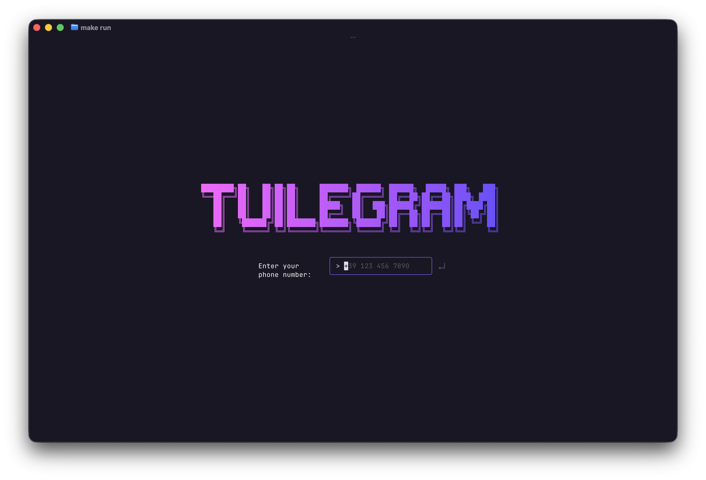
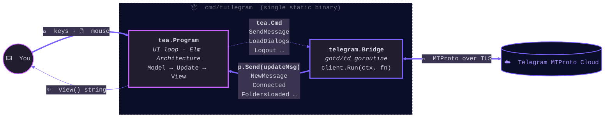

<p align="center">
  
  
  
  
</p>

<h1 align="center">tuilegram</h1>

<p align="center"><b>A real Telegram client in your terminal.</b><br>
Pure Go. No tdlib. No Electron. No CGo.</p>

<p align="center">
  
</p>

<p align="center">
  <a href="#features">Features</a> ·
  <a href="#install">Install</a> ·
  <a href="#first-run">First run</a> ·
  <a href="#keys">Keys</a> ·
  <a href="#security">Security</a> ·
  <a href="#architecture">Architecture</a> ·
  <a href="#faq">FAQ</a>
</p>

---

## What it is

A keyboard-driven Telegram **user** client (not a bot) that runs in any terminal with truecolor support. Built on:

- **[gotd/td](https://github.com/gotd/td)** — pure-Go MTProto implementation. No tdlib, no CGo, single static binary.
- **[Charmbracelet](https://charm.sh)** — bubbletea (Elm-style runtime), lipgloss (styling), bubbles (widgets), huh (forms).

Authenticates as a regular user account → access to full chat history, groups, channels, media. Same RPCs as the official desktop client.

## Status

Active development. Implementation follows a [34-step incremental pipeline](docs/design/development-pipeline.md). Steps 1–33 done, Step 34 (style revamp) in review. All steps end with a runnable build.

**Use it.** Don't trust it with your only Telegram account yet — test with a secondary number first.

## Features

**Messaging**
- Send / reply / edit / delete (single + batch) / forward
- Cursor-based message selection, multi-select with `Space`
- Inline reactions display
- Reply quote rendering
- Pinned message bar
- Link detection + open in browser (`gx` chord)
- Forward picker with destination chooser
- Service messages (joins, pins, etc.) styled separately

**Navigation**
- Vim-style: `j/k`, `g/G`, `Ctrl+D/U`, `gg`, `gu` (jump unread), `zz` (center), `gi` (chat info)
- Mouse: scroll wheel, click chat, click SEND
- Tab bar for Telegram cloud folders (`1`-`9` to switch)
- Folder sidebar (`F` toggle) — uses server-side `DialogFilter`s
- Compact / Wide layout — auto-switches at 100 columns

**Search**
- Global search (`/`) — fuzzy, debounced, jump-to-message
- In-chat search (`Ctrl+F`) — highlight + next/prev navigation

**Overlays** (Crush-style — modal composited on background, base view never blanks)
- Command palette (`Ctrl+P`) with logout entry
- Keybindings help (`?`)
- Which-key hints for chord prefixes

**Theming**
- TOML themes with hot-reload (atomic swap on file change)
- 8-color sender palette per group chat (deterministic by sender ID)
- Default theme = Crush-inspired (magenta + violet + dark surface)
- Legacy theme preserved for rollback

**Connection**
- Health monitor with live status indicator
- Reconnect detection
- Typing indicators (per peer)
- Real-time updates via gotd `UpdateDispatcher`

**Auth**
- Phone + verification code + 2FA password
- Session persisted to `session.json` (auth key, never committed)
- Logout from command palette → revokes server-side + removes local session

## Install

### From source

```bash
git clone https://github.com/strawberry-code/tuilegram.git
cd tuilegram
make build
./tuilegram
```

### Requirements

- Go 1.21+
- Terminal with truecolor (most modern terminals: iTerm2, Alacritty, kitty, WezTerm, recent gnome-terminal)
- A Telegram account

## First run

You need an `app_id` and `app_hash` from Telegram. Get them at https://my.telegram.org/apps (takes 1 minute).

Two options:

**Option 1 — env vars (recommended for development)**
```bash
export TELEGRAM_APP_ID=12345
export TELEGRAM_APP_HASH=abcdef0123456789
make run
```

**Option 2 — embedded constants**
Edit `internal/telegram/config.go` and set the constants directly. Useful for personal builds.

On first launch you'll be asked for your phone number, then the verification code Telegram sends, then your 2FA password if enabled. After that, `session.json` is written and subsequent runs skip auth.

## Keys

| Key | Action |
|-----|--------|
| `j` / `k` | Move cursor down/up |
| `g` `g` / `G` | Top / bottom |
| `Ctrl+D` / `Ctrl+U` | Half-page scroll |
| `Enter` | Open chat / send message |
| `i` / `Tab` | Focus message input |
| `Esc` | Cancel / close overlay |
| `r` | Reply to selected message |
| `e` | Edit selected message |
| `D` | Delete (single or selected batch) |
| `f` | Forward |
| `Space` | Toggle multi-select |
| `/` | Global search |
| `Ctrl+F` | Search in current chat |
| `Ctrl+P` | Command palette |
| `?` | Keybindings help |
| `F` | Toggle folder sidebar |
| `1`–`9` | Switch folder tab |
| `g` `u` | Jump to next unread chat |
| `g` `i` | Chat info |
| `z` `z` | Center current message |
| `g` `x` | Open first link in selected message |
| `Ctrl+Q` | Quit |

`?` opens the full keybindings reference inside the app.

## Security

The session file (`session.json`) contains the **256-byte MTProto auth key** = full account impersonation. Treat it like an SSH private key.

- `.gitignore` excludes `*.session`, `session.json`, `*.session.json`
- The auth key is never logged, printed, or sent anywhere except to Telegram's servers
- Logout from command palette calls `auth.LogOut` server-side AND removes the local file

If your terminal scrollback is shared, persisted, or piped — be aware that messages are rendered there too.

## Architecture



Two concurrent loops, message-passing only. No shared state, no mutexes.

- **bubbletea** — `Model → Update → View` cycle. Sub-models composed by embedding.
- **gotd/td** — `client.Run(ctx, fn)` blocks; `UpdateDispatcher` fires typed callbacks on incoming events; events are forwarded to the TUI via `tea.Program.Send()`.
- **Bridge** — single struct that owns the `tg.Client`, exposes domain methods (`SendMessage`, `LoadMessages`, `Logout`, ...).

The design was modeled formally **before** any code:

| Document | Content |
|----------|---------|
| [TUI Design](docs/design/tui-design.md) | UX decisions, ASCII mockups, color spec |
| [Statechart](docs/design/phase-2-behavioral/ui-statechart.md) | Hierarchical state machine for the entire UI |
| [TLA+ spec](docs/design/phase-4-concurrency/tuilegram.tla) | Concurrency model with safety/liveness invariants |
| [ADRs](docs/design/phase-6-decisions/) | Architecture Decision Records |

## Tech stack

| Layer | Library | Role |
|-------|---------|------|
| Telegram | [gotd/td](https://github.com/gotd/td) | MTProto, auth, dispatcher |
| TUI runtime | [bubbletea](https://github.com/charmbracelet/bubbletea) | Elm Architecture event loop |
| TUI widgets | [bubbles](https://github.com/charmbracelet/bubbles) | viewport, textarea, textinput, spinner |
| TUI styling | [lipgloss](https://github.com/charmbracelet/lipgloss) | colors, layout, borders |
| TUI forms | [huh](https://github.com/charmbracelet/huh) | auth flow forms |
| ANSI ops | [x/ansi](https://github.com/charmbracelet/x) | width, wrap, cut (used for modal overlay compositing) |

## Development

```bash
make build         # build binary → ./tuilegram
make run           # go run ./cmd/tuilegram
make rerun         # remove session + run (forces fresh login)
make test          # go test ./...
make lint          # golangci-lint (auto-falls-back to go vet)
make lint-install  # install golangci-lint v1.62.2
make vet           # go vet ./...
make tidy          # go mod tidy
make loc-check     # audit 120 LOC/file rule
```

Codebase rules:
- **120 LOC per file** — enforced by `make loc-check`
- **SOLID per file** — single responsibility, short functions
- **Design-first** — formal models in `docs/design/phase-*/` before implementation
- **Pipeline-driven** — 34 atomic steps, each runnable, each reviewed before merge

## FAQ

**Does it support media uploads?**
Receive yes, send no (yet). Photos/voice/files render as `[type] filename (size)` placeholders.

**Voice waveforms? Stickers?**
Stickers render as their first emoji. Waveforms not yet.

**Bot accounts?**
Designed for user accounts. A bot would technically work but the UX assumes user-account features (folders, drafts, reactions).

**Will this get me banned?**
Same RPCs as the official client. The included middlewares handle flood-wait correctly. Don't spam, don't hammer the API in custom scripts on top of it. No reports of bans during development.

**Wayland / Linux / macOS / Windows?**
Pure Go terminal app. Runs anywhere Go runs. Tested on macOS + Linux. Windows should work in WSL or modern terminals (Windows Terminal).

**Why another Telegram TUI?**
Most existing TUI Telegram clients wrap `telegram-cli` (deprecated) or `tdlib` (C++ dependency, requires CGo). tuilegram has no CGo and no external runtime — `go build` produces a single static binary that you can scp around.

## Contributing

Contributions welcome. PRs, issues, feature requests, bug reports — all open.

Before opening a PR:
- Run `make build && make vet && make test && make loc-check` — must pass clean
- Respect codebase rules: 120 LOC per file, SOLID, design-first
- Follow Conventional Commits (Italian or English): `feat(area): description`
- Open a draft PR early if the change is non-trivial — easier to align on direction

For larger features, the project follows a [step-pipeline](docs/design/development-pipeline.md) with formal models (statecharts, TLA+, ADRs) before code. Discuss in an issue first if you want to add a new step.

Good first contributions:
- Media upload (photos, files, voice)
- Sticker rendering improvements
- New themes (TOML files in `internal/theme/`)
- Tests (especially `internal/ui/views/`)
- Docs / wiki / examples

## Credits

- [Charm](https://charm.sh) — terminal UI ecosystem
- [gotd](https://github.com/gotd/td) — pure-Go MTProto
- Telegram team for the open API

## License

MIT — see [LICENSE](LICENSE).
