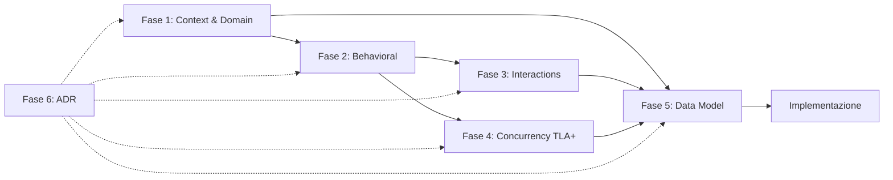

# tuilegram — Model Based Design

Processo di progettazione formale per tuilegram, un client Telegram TUI in Go.

## Principi

- **Design-first**: ogni componente è modellato prima di essere implementato
- **Statecharts**: macchine a stati gerarchiche (Harel) per behavior modeling
- **TLA+**: specifica formale e model checking per il modello di concorrenza
- **Mermaid**: notazione diagrammatica versionabile per statecharts, sequence, component diagrams

## Fasi e Deliverable

| Fase | Deliverable | Stato |
|------|-------------|-------|
| **1. System Context & Domain** | [system-context.md](phase-1-context/system-context.md), [domain-model.md](phase-1-context/domain-model.md), [message-taxonomy.md](phase-1-context/message-taxonomy.md) | `DONE` |
| **2. Behavioral Models** | [ui-statechart.md](phase-2-behavioral/ui-statechart.md), [telegram-statechart.md](phase-2-behavioral/telegram-statechart.md), [auth-flow.md](phase-2-behavioral/auth-flow.md), [message-lifecycle.md](phase-2-behavioral/message-lifecycle.md), [forward-picker.md](phase-2-behavioral/forward-picker.md), [multi-select.md](phase-2-behavioral/multi-select.md), [typing-indicator.md](phase-2-behavioral/typing-indicator.md), [media-rendering.md](phase-2-behavioral/media-rendering.md), [search-overlay.md](phase-2-behavioral/search-overlay.md), [search-in-chat.md](phase-2-behavioral/search-in-chat.md), [command-palette-help-whichkey.md](phase-2-behavioral/command-palette-help-whichkey.md), [folder-sidebar.md](phase-2-behavioral/folder-sidebar.md), [chat-info.md](phase-2-behavioral/chat-info.md) | `DONE` |
| **3. Interaction Models** | [scenarios.md](phase-3-interactions/scenarios.md), [msg-cmd-mapping.md](phase-3-interactions/msg-cmd-mapping.md), [forward-flow.md](phase-3-interactions/forward-flow.md), [multi-select-flow.md](phase-3-interactions/multi-select-flow.md), [typing-flow.md](phase-3-interactions/typing-flow.md), [media-flow.md](phase-3-interactions/media-flow.md), [search-flow.md](phase-3-interactions/search-flow.md), [search-in-chat-flow.md](phase-3-interactions/search-in-chat-flow.md), [whichkey-timing-flow.md](phase-3-interactions/whichkey-timing-flow.md), [folder-and-info-flow.md](phase-3-interactions/folder-and-info-flow.md) | `DONE` |
| **4. Concurrency Model** | [tuilegram.tla](phase-4-concurrency/tuilegram.tla), [forward_picker.tla](phase-4-concurrency/forward_picker.tla), [multi_select.tla](phase-4-concurrency/multi_select.tla), [typing.tla](phase-4-concurrency/typing.tla), [media_waveform.tla](phase-4-concurrency/media_waveform.tla), [search.tla](phase-4-concurrency/search.tla), [search_in_chat.tla](phase-4-concurrency/search_in_chat.tla), [whichkey.tla](phase-4-concurrency/whichkey.tla), [folders_chatinfo.tla](phase-4-concurrency/folders_chatinfo.tla), [README.md](phase-4-concurrency/README.md) | `DONE` |
| **5. Data Model** | [domain-types.md](phase-5-data/domain-types.md), [model-structure.md](phase-5-data/model-structure.md), [entity-mapping.md](phase-5-data/entity-mapping.md) | `DONE` |
| **6. Architecture Decisions** | [17 ADR](phase-6-decisions/README.md) | `DONE` |

## Dipendenze tra fasi

Fase 6 (ADR) è trasversale: ogni decisione architetturale viene documentata nel momento in cui emerge.

## Notazioni

- **Statecharts**: Mermaid `stateDiagram-v2` con stati compositi e concorrenti
- **Sequence**: Mermaid `sequenceDiagram`
- **Concorrenza**: TLA+ con model checking via TLC
- **Domain**: Mermaid `classDiagram` per entity relationships
