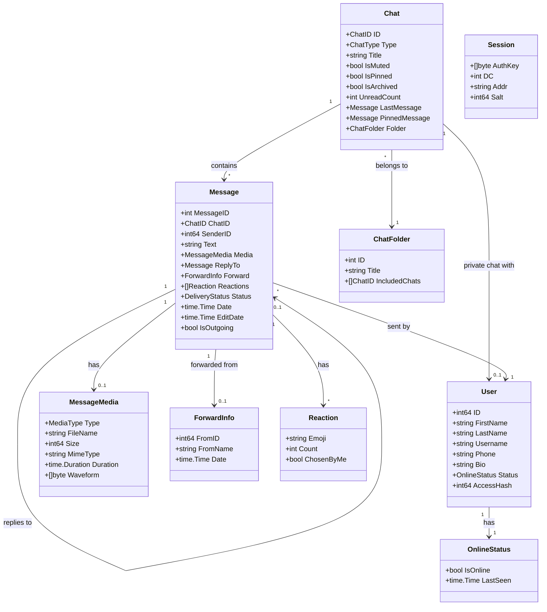
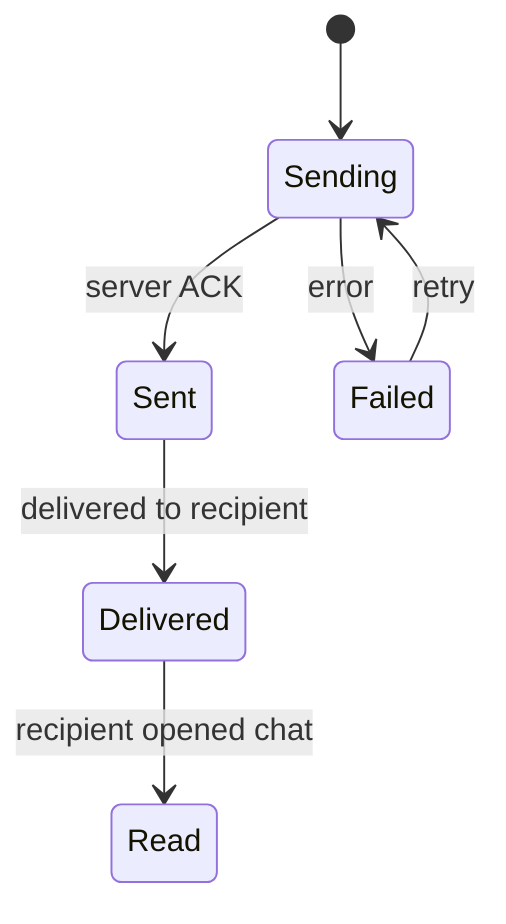

# Domain Model

## Entities



## Enumerazioni

### ChatType

| Valore | Descrizione |
|--------|-------------|
| `Private` | Chat 1:1 con un utente |
| `Group` | Gruppo (basic group o supergroup) |
| `Channel` | Canale broadcast |
| `Bot` | Chat con un bot |
| `SavedMessages` | "Saved Messages" (self-chat) |

### MediaType

| Valore | Descrizione |
|--------|-------------|
| `Photo` | Immagine |
| `Video` | Video |
| `Audio` | File audio / musica |
| `Voice` | Messaggio vocale |
| `Document` | Documento / file generico |
| `Sticker` | Sticker (emoji + pack) |
| `Location` | Posizione / venue |
| `Contact` | Contatto condiviso |
| `Poll` | Sondaggio |

### DeliveryStatus



| Valore | Simbolo UI | Descrizione |
|--------|------------|-------------|
| `Sending` | (nessuno) | In fase di invio |
| `Sent` | `✓` | Ricevuto dal server |
| `Delivered` | `✓✓` | Consegnato al destinatario |
| `Read` | `✓✓` (blu) | Letto dal destinatario |
| `Failed` | `✕` | Invio fallito |

### ChatID

Tipo composito che identifica univocamente una chat:

```
ChatID = { PeerType (user|chat|channel), ID int64 }
```

Necessario perché Telegram usa namespace separati per user ID, chat ID e channel ID.

## Invarianti di dominio

| Invariante | Descrizione |
|------------|-------------|
| **Unicità ChatID** | Ogni chat ha un ChatID univoco nel dominio locale |
| **Ordinamento messaggi** | I messaggi in una chat sono ordinati per MessageID crescente |
| **Ownership edit/delete** | Solo i messaggi con `IsOutgoing = true` possono essere editati/cancellati |
| **Session singleton** | Esiste al massimo una session attiva per istanza |
| **Unread count >= 0** | Il contatore unread non può essere negativo |
| **Reply chain** | Un messaggio può avere al massimo un `ReplyTo`. Le catene sono flat (il reply punta all'originale, non al reply intermedio) |
| **Access hash required** | Ogni operazione su un peer richiede il corretto `AccessHash` — senza, il server rifiuta la richiesta |

## Aggregati

| Aggregato | Root | Componenti |
|-----------|------|------------|
| **ChatAggregate** | Chat | Messages[], PinnedMessage, LastMessage, UnreadCount |
| **UserProfile** | User | OnlineStatus, Bio, Phone |
| **SessionState** | Session | AuthKey, DC, Salt |

L'aggregato principale per il TUI è **ChatAggregate**: il componente ChatList renderizza una lista di Chat (con LastMessage per sorting), mentre il componente Conversation renderizza i Message[] di una singola Chat.

## Boundary Objects

Oggetti che vivono al confine tra il dominio interno e i sistemi esterni:

| Boundary Object | Da | A | Scopo |
|----------------|----|----|-------|
| `tg.User` → `User` | gotd/td | dominio | Mapping da tipo generato a tipo di dominio |
| `tg.Message` → `Message` | gotd/td | dominio | Parsing media, forward, reply, reactions |
| `tg.UpdateNewMessage` → `NewMessageEvent` | gotd/td | bubbletea | Evento per il TUI loop |
| `tea.KeyMsg` → azione | bubbletea | dominio | Traduzione input utente in operazione |
