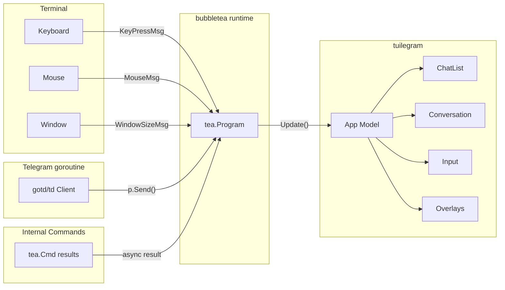
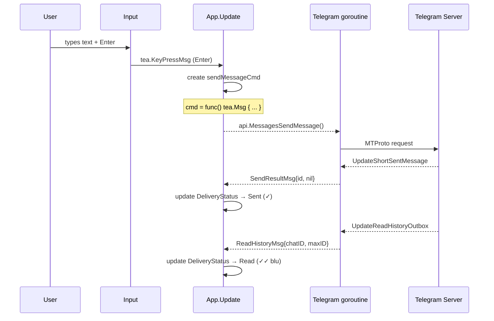
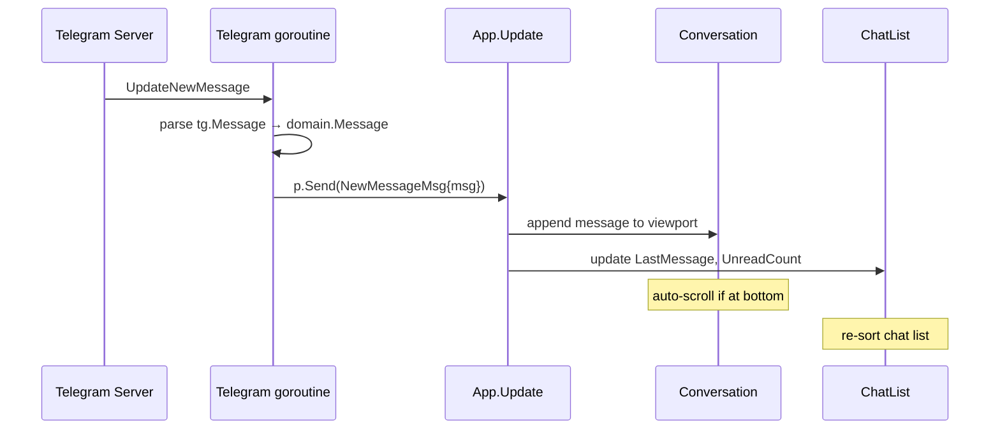

# Message Taxonomy

Tassonomia completa dei `tea.Msg` che fluiscono nel sistema. Ogni messaggio è categorizzato per origine e direzione.

## Diagramma flusso messaggi

## Categorie di messaggi

### 1. Terminal Events (da bubbletea)

Messaggi generati dal runtime bubbletea in risposta a eventi del terminale.

| Msg | Origine | Payload | Handling |
|-----|---------|---------|----------|
| `tea.KeyPressMsg` | Keyboard | Key code, modifiers, text | Route a pannello focused |
| `tea.MouseMsg` | Mouse (bubbletea v1.3.10 — alias per `MouseEvent`) | `{X, Y int, Action MouseAction, Button MouseButton, Shift, Alt, Ctrl bool}` con `Action ∈ {Press, Release, Motion}` e `Button ∈ {None, Left, Middle, Right, WheelUp, WheelDown, WheelLeft, WheelRight, Backward, Forward, ...}` + helper `IsWheel() bool` | **Step 32**: routato dal central dispatcher `MainModel.handleMouseMsg` (ADR-020 §D1). Hit-test su `bboxes` cache (ADR-020 §D2); wheel by cursor position (D3); click sinistro su widget → azione semantica (chat row → `ChatSelectedMsg`; SEND button → submit; textarea → focus shift; folder row → `FolderSelectMsg`; outside dismissable overlay → `*CloseMsg`; outside modal overlay → no-op). Eventi con `Action ∈ {Motion, Release}` o `Button ∉ {Left, WheelUp, WheelDown}` sono scartati (D7 NO_PHANTOM_DRAG; right/middle out-of-scope). **Bubbletea v1.3.10 espone un singolo tipo** `tea.MouseMsg`: non esistono `MouseClickMsg` / `MouseWheelMsg` separati — il discriminante è `Action + Button + IsWheel()` |
| `tea.WindowSizeMsg` | Terminal | Width, Height | Ricalcolo layout responsive. **Step 30**: trigger primario di `layoutMode` flip; se `f(width) != layoutMode` → applica side-effect cross-threshold (ADR-018 §D4) e fanout `LayoutModeChangedMsg`. Idempotente nello stesso half-plane. **Step 32**: trigger di bbox invalidation (ADR-020 §D2) — `MainModel.recomputeBboxes()` come ultimo step di `handleWindowSize` |

### 2. Telegram Events (da goroutine Telegram → p.Send)

Messaggi iniettati nel TUI loop dal client Telegram via `program.Send()`. Sono thread-safe.

| Msg | Trigger | Payload | Handling |
|-----|---------|---------|----------|
| `ConnectedMsg` | Client connesso | — | Transizione da Loading a MainView |
| `DisconnectedMsg` | Connessione persa | error | Aggiorna connection indicator, mostra errore |
| `ReconnectingMsg` | Tentativo reconnect | attempt int | Aggiorna connection indicator |
| `AuthRequiredMsg` | Session non valida | — | Transizione a Auth flow |
| `AuthSuccessMsg` | Login completato | User (self) | Transizione a Loading → MainView |
| `DialogsLoadedMsg` | Dialogs ricevuti | []Chat | Popola ChatList |
| `MessagesLoadedMsg` | History caricata | ChatID, []Message | Popola conversation viewport |
| `NewMessageMsg` | Nuovo messaggio | Message | Append a conversation, aggiorna ChatList. **Side-effect Step 27**: se `searchInChat.active` su `activeChatID == m.ChatID` → re-index incrementale (append a `index` se `!IsService && Text!=""`; append a `matches` se la query corrente matcha); `currentIdx` invariato (identità preservata, ADR-014) |
| `MessageEditedMsg` | Messaggio editato | ChatID, MessageID, newText | Aggiorna messaggio nel viewport |
| `MessageDeletedMsg` | Messaggio eliminato | ChatID, MessageID | Rimuovi dal viewport |
| `UserStatusMsg` | Cambio status online | UserID, OnlineStatus | Aggiorna dot nella ChatList e header conv |
| `UpdateUserTypingMsg` | Peer sta scrivendo (private chat) — Step 23 | ChatID, UserID | Set `typing[peer].lastTypingAt = now`; schedule `tea.Tick(5s)` → `TypingTimeoutMsg` |
| `ReadHistoryMsg` | Messaggi letti | ChatID, maxID | Aggiorna receipts e unread count |
| `ReactionsUpdatedMsg` | Reazione aggiunta/rimossa (Telegram `UpdateMessageReactions`) — Step 25 | `chatID ChatID, messageID int, reactions []Reaction` | Localizza msg in viewport, sostituisce `m.Reactions` (snapshot replace), re-render bubble + reactions row. No-op render se `m.IsService = TRUE` (sanity, vedi `SYSTEM_NO_REACT` in `reactions.tla`) |
| `PinnedMessageMsg` | Messaggio pinnato | ChatID, Message | Mostra/aggiorna pinned bar |
| `ChatUpdateMsg` | Metadata chat cambiata | Chat (aggiornata) | Aggiorna ChatList item |

### 3. Command Results (da tea.Cmd → async)

Messaggi restituiti da `tea.Cmd` dopo operazioni asincrone.

| Msg | Cmd origine | Payload | Handling |
|-----|------------|---------|----------|
| `SendResultMsg` | sendMessageCmd | MessageID, error | Aggiorna delivery status (✓) o mostra errore |
| `EditResultMsg` | editMessageCmd | error | Chiudi overlay edit, mostra errore se fallito |
| `DeleteResultMsg` | deleteMessageCmd | error | Rimuovi messaggio, mostra errore se fallito |
| `ForwardResultMsg` | forwardMessageCmd | error | Conferma forward, mostra errore se fallito |
| `SearchResultMsg` | searchCmd | `queryID uint64, []SearchHit, error` | Popola overlay search se `queryID == latestQueryID` (Step 26: drop di stale results) |
| `LoadMoreMsg` | loadHistoryCmd | []Message | Prepend messaggi al viewport. **Side-effect Step 27**: se `searchInChat.active` → prepend filtered a `index`; scan vs query → prepend a `matches`; `currentIdx += len(newMatches)` per preservare identità del match corrente (ADR-014) |
| `MarkReadResultMsg` | markReadCmd | error | Aggiorna unread count |
| `MuteResultMsg` | muteCmd | error | Aggiorna chat item |
| `PinResultMsg` | pinCmd | error | Aggiorna chat item |
| `ArchiveResultMsg` | archiveCmd | error | Rimuovi da chat list |
| `TypingTimeoutMsg` | `tea.Tick(5s)` schedulato da `UpdateUserTypingMsg` (Step 23) | ChatID, scheduledAt time.Time | Se `now - typing[peer].lastTypingAt >= 5s` → clear typing[peer]; altrimenti no-op (stale tick benigno, ADR-010) |

### 4. Internal UI Messages

Messaggi generati internamente dal TUI per comunicazione tra componenti.

| Msg | Origine | Payload | Handling |
|-----|---------|---------|----------|
| `ChatSelectedMsg` | ChatList | ChatID | Apri conversazione, carica messaggi |
| `FocusChangedMsg` | Tab/navigation | PanelID | Cambia pannello focused |
| `OverlayOpenMsg` | Keybinding | OverlayType, data | Apri overlay (search, cmd, info, edit, fwd) |
| `OverlayCloseMsg` | Esc / azione completata | — | Chiudi overlay attivo |
| `ReplyToMsg` | `r` su messaggio | Message | Attiva reply mode nell'input |
| `EditRequestMsg` | `e` su messaggio | Message | Apri edit overlay con testo |
| `ForwardRequestMsg` | `f` su messaggio | []Message (Step 21 = 1 elemento; Step 22 = N) | Apri forward picker |
| `ForwardPickerReadyMsg` | Cmd async (snapshot dialogs) | []Chat | Popola picker, state=Filtering (Step 21) |
| `ForwardFilterMsg` | Picker input change | query string | Re-rank lista in-memory (Step 21) |
| `ForwardSubmitMsg` | Picker Enter | targetChatID, []Message | Trigger forwardMessageCmd (Step 21) |
| `DeleteRequestMsg` | `D` su messaggio | []Message (Step 20 = 1 elemento; Step 22 = N) | Apri confirm dialog |
| `SelectToggleMsg` | `Space` su messaggio | MessageID | Toggle in selection set `S`; entra/esce MultiSelect (Step 22) |
| `SelectClearMsg` | `Esc` in MultiSelect | — | `S := ∅`, exit MultiSelect (Step 22) |
| `BatchActionDoneMsg` | App.Update post `ForwardResultMsg{ok}` o `DeleteResultMsg{ok}` con \|S\|>0 | — | `S := ∅`, exit MultiSelect (Step 22) |
| `FolderToggleMsg` | Keystroke `F` (App livello root, Step 29) | — | `folderSidebarVisible := !folderSidebarVisible`; se `TRUE` → focus su folders (`Visible.Browsing`); se `FALSE` → focus su chatList; `selectedFolderID` PRESERVATO (vedi [ADR-016 §D3](../phase-6-decisions/ADR-016-folder-source-and-filtering.md)) |
| `FolderCursorMsg` | `j`/`k` o `↑`/`↓` nella sidebar (Step 29) | `delta int` | `folderCursor := clamp(folderCursor + delta, 0, len(folders))` (range include sentinel "All Chats" all'index 0) |
| `FolderSelectMsg` | `Enter` o `l` su `folders[folderCursor]` (Step 29) | `folderID int` | `selectedFolderID := folderID`; trigger `ChatListModel` re-filter sincrono (no RPC); cursor della chat list reset se necessario; `activeChatID` invariato ([ADR-016 §D4](../phase-6-decisions/ADR-016-folder-source-and-filtering.md)) |
| `ChatInfoOpenMsg` | Keystroke `i` (App livello root, Step 29, guard: `activeOverlay == none && activeChatID != nil`) | — | `activeOverlay := chatInfo`; `chatInfoTarget := activeChatID`; `chatInfoCard := buildFromCache(activeChatID)`; opzionale spawn `fetchFullUserCmd` se bio `""` (best-effort lazy completion, [ADR-017 §D2](../phase-6-decisions/ADR-017-chat-info-data-source.md)) |
| `ChatInfoCloseMsg` | `Esc` o `i` durante chat info open (Step 29) | — | `activeOverlay := none`; `chatInfoTarget := nil`; pending completion sarà droppata al return-time via `chatInfoTarget` check |
| `ChatInfoCompletionMsg` | `fetchFullUserCmd` ritorna (Step 29) | `chatID ChatID, fields {bio, ...}` | Se `chatID == chatInfoTarget` → merge nei `chatInfoCard` + re-render; altrimenti no-op visibile (write-through alla cache permesso, benigno). Verificato in `folders_chatinfo.tla` invariante `STALE_COMPLETION_DROP` |
| `ThemeChangedMsg` | **ATTIVO Step 31** — fsnotify watcher goroutine post-merge (D9 INVERTED, [ADR-019 §D9](../phase-6-decisions/ADR-019-theming-and-config-loading.md)) | `Theme` (snapshot full, total, già merged default+user) | `App.Update`: `styles.SetActive(msg.Theme)` (atomic pointer write — invariante `NO_TORN_RELOAD`); ritorna `tea.WindowSizeMsg{prevW, prevH}` per forzare full re-render con i nuovi colori. Pipeline reload single-inflight, vedi [`theming.tla`](../phase-4-concurrency/theming.tla) action `AtomicSwap` |
| `ConfigWatcherErrMsg` | **NUOVO Step 31** — fsnotify watcher goroutine su read/parse/merge error ([ADR-019 §D9](../phase-6-decisions/ADR-019-theming-and-config-loading.md)) | `error` | `App.Update`: log su stderr (Step 31; futuro Step 33+ status bar). **Theme PRESERVATO** — nessuna mutazione, invariante `INVALID_PRESERVES_THEME` (`theming.tla`) |
| `ConfigLoadedMsg` | Sintetizzato da `App.Init()` (Step 31, [ADR-019 §D2..D6](../phase-6-decisions/ADR-019-theming-and-config-loading.md)) | `Config` snapshot | Documenta il caricamento del `config.toml` (XDG-aware path, fail-soft, defaults). Pure documentation msg: nessun side-effect runtime in Step 31 (config è immutabile post-boot). Sub-models possono leggere `config.Display.CompactThreshold` per sostituire la const ADR-018 D1 |
| `ThemeAppliedMsg` | Sintetizzato da `App.Init()` (Step 31, [ADR-019 §D3, §D7, §D8](../phase-6-decisions/ADR-019-theming-and-config-loading.md)) | `Theme` snapshot (già applicato via `styles.SetActive`) | Documenta l'applicazione del tema (default embedded + merge override-by-key di `theme.toml` utente). Pure documentation msg: il theme è già attivo via `styles.Active()` accessor pattern. No re-render trigger in Step 31 (boot-time only); pattern preservato per future hot-reload |
| `TickMsg` | Timer periodico | — | Aggiorna spinner, typing animation |
| `SearchOpenMsg` | Keystroke `/` (Step 26) | — | App apre overlay `OverlaySearch`, focus su textinput, query iniziale vuota |
| `SearchQueryChangedMsg` | Picker textinput change (Step 26) | `query string, queryID uint64, scheduledAt time.Time` | Bumping di `latestQueryID`, schedule `searchDebounceCmd` (= `tea.Tick(300ms)`) |
| `SearchDebounceFiredMsg` | `tea.Tick(300ms)` (Step 26) | `queryID uint64` | Se `queryID == latestQueryID` e query non-empty → spawn `searchCmd`; altrimenti no-op (stale debounce, ADR-013) |
| `SearchCursorMsg` | Picker `j/k` (Step 26) | `delta int` | Sposta cursore lista risultati (no RPC) |
| `SearchSubmitMsg` | Picker `Enter` su risultato (Step 26) | `SearchHit` | Chiude overlay, emette `JumpToMessageMsg` |
| `JumpToMessageMsg` | `SearchSubmitMsg` (Step 26), futuro pinned-bar (Step 30) | `chatID ChatID, messageID int` | App apre la chat target (se diversa) e centra il viewport sul messaggio |
| `SearchInChatOpenMsg` | Keystroke `Ctrl+F` (Step 27, con `activeChatID != nil`) | — | Apre la barra inline nella `ConversationModel`; build `index` filtrato (no service, no Text=""); `query := ""`, `matches := []`, `currentIdx := 0`. Sub-state, NON usa primitive `Modal` (ADR-014) |
| `SearchInChatNextMsg` | `Enter` o `n` nella barra (Step 27, con `len(matches) > 0`) | — | `currentIdx := (currentIdx + 1) mod len(matches)`; scroll viewport per centrare il match corrente |
| `SearchInChatPrevMsg` | `Shift+Tab` o `N` nella barra (Step 27) | — | `currentIdx := (currentIdx - 1 + len(matches)) mod len(matches)`; scroll viewport |
| `SearchInChatCloseMsg` | `Esc` nella barra (Step 27) | — | Discard `index`/`matches`/`query`; ripristina `returnTo` (BrowsingMessages o MultiSelect, `S` preservato); rimuove highlight dal viewport |
| `CmdPaletteOpenMsg` | Keystroke `Ctrl+P` (Step 28, guard: `activeOverlay == none`) | — | `activeOverlay := cmdPalette`; `query := ""`; `filtered := registry`; `cursor := 0` (palette mounting). Vedi [ADR-015](../phase-6-decisions/ADR-015-command-palette-whichkey-help.md) §D3 |
| `CmdPaletteQueryChangedMsg` | textinput change handler nella palette (Step 28) | `query string` | `filtered := fuzzyFilter(registry, query)` (subsequence sync, ADR-015 §D4); `cursor := 0` |
| `CmdPaletteCursorMsg` | `j`/`k` o `↑`/`↓` nella palette (Step 28) | `delta int` | `cursor := clamp(cursor + delta, 0, len(filtered)-1)` |
| `CmdPaletteSubmitMsg` | `Enter` su `filtered[cursor]` (Step 28, con `len(filtered) > 0`) | `cmdID string` | Atomic: `activeOverlay := none` PRIMA del dispatch; lookup `registry[cmdID].handler` → return `tea.Cmd` (può aprire altro overlay nel next cycle, ADR-015 §D3) |
| `CmdPaletteCloseMsg` | `Esc` nella palette (Step 28) | — | `activeOverlay := none`; reset state |
| `WhichKeyPrefixMsg` | Keystroke prefix (`g`, `z`, ...) registrata in `prefixKeys` (Step 28, guard: `activeOverlay == none && state == Idle`) | `prefix Key, prefixID uint64, scheduledAt time.Time` | Bump `latestPrefixID := prefixID`; `activePrefix := prefix`; `state := PrefixPending`; schedule `tea.Tick(300ms) → WhichKeyTimeoutMsg{prefix, prefixID}`. Vedi [ADR-015](../phase-6-decisions/ADR-015-command-palette-whichkey-help.md) §D5 |
| `WhichKeyTimeoutMsg` | `tea.Tick(300ms)` schedulato da `WhichKeyPrefixMsg` (Step 28) | `prefix Key, prefixID uint64` | Se `prefixID != latestPrefixID` o `state != PrefixPending` → no-op (stale tick benigno, invariante `STALE_TICK_BENIGN_WHICHKEY`); altrimenti `state := Visible`, `activeOverlay := whichKey` |
| `WhichKeyChordMsg` | Continuation key in `continuations[activePrefix]` durante `PrefixPending` o `Visible` (Step 28) | `prefix Key, cont Key` | Bump `latestPrefixID`; `activePrefix := none`; `state := Idle`; `activeOverlay := none`; lookup `continuations[prefix][cont].handler` → return `tea.Cmd`. Fast chord (durante `PrefixPending`) skip-pa l'overlay |
| `WhichKeyCancelMsg` | `Esc` o key non in `continuations[activePrefix]` durante `PrefixPending` o `Visible` (Step 28) | `prefix Key` | Bump `latestPrefixID`; `activePrefix := none`; `state := Idle`; `activeOverlay := none`. Se la key non era Esc, best-effort re-dispatch al root handler (ADR-015 §D6, advisory) |
| `HelpOpenMsg` | Keystroke `?` (Step 28, guard: `activeOverlay == none`) | — | `activeOverlay := help` (overlay full-screen con sezioni keybindings) |
| `HelpCloseMsg` | `Esc` o `?` nell'help (Step 28) | — | `activeOverlay := none` |
| `LayoutModeChangedMsg` | Sintetizzato in `App.Update` quando `WindowSizeMsg` attraversa la soglia 100 cols (Step 30, [ADR-018](../phase-6-decisions/ADR-018-responsive-layout-threshold-and-tab.md)) | `oldMode, newMode LayoutMode` | Documenta la transizione cross-threshold; consumato da panel models per resize sub-viewport. NON è il trigger primario (è `WindowSizeMsg` stesso); è un **fanout** per side-effect downstream. Side-effect side root: `folderSidebarVisible := FALSE` su collapse (ADR-016 §D5 + ADR-018 §D4); `compactVisible := derive(activePanel, activeChatID)` su collapse |
| `LayoutPanelSwitchMsg` | Keystroke `Tab` (root, Step 30, guard: `layoutMode == Compact AND activeOverlay == none`) | — | `compactVisible := if compactVisible == ChatList then Conversation else ChatList` (toggle bidirezionale); `layoutMode` PRESERVATO (invariante `TAB_PRESERVES_LAYOUT`). In Wide, `Tab` invece emette `FocusNextMsg` (semantica pre-esistente di focus cycle) |
| `PinnedMsgLoadedMsg` | **NUOVO Step 33** — `loadPinnedMessageCmd` ritorna ([ADR-021 §A1](../phase-6-decisions/ADR-021-step33-polish.md#a1--data-source-tgmessagesgetmessages-per-pinned-msg-id-fetch-su-chat-open)) | `chatID ChatID, msg *model.Message, err error` | `ConversationModel.Update`: se `chatID == activeChatID` → `pinnedMsg := msg` (o `nil` su err); `pinnedBarHeight := if msg != nil then 2 else 0`; trigger bbox invalidation (estende ADR-020 §D2). Se `chatID != activeChatID` → DROP no mutation (invariante `PINNED_STALE_DROP`, riusa pattern `STALE_COMPLETION_DROP` da ADR-017) |
| `OpenLinkMsg` | **NUOVO Step 33** — emesso da chord `gx` (continuation whichkey ADR-015 §D5) sul msg cursored ([ADR-021 §B4](../phase-6-decisions/ADR-021-step33-polish.md#db4--trigger-gx-chord-vim-style-apre-il-primo-link-nel-messaggio-selezionato)) | `URL string` | App.Update: spawn `openLinkCmd(URL)` (fire-and-forget, no result msg). Whitelist scheme: solo `http(s)://` (`LINK_OPEN_HTTP_ONLY`); altri scheme → `statusMsg := "scheme not supported"`, no spawn |

## Flusso di un messaggio in invio

## Flusso di un messaggio in ricezione

## Mapping tea.Cmd

| Azione utente | Cmd | API gotd/td | Result Msg |
|---------------|-----|-------------|------------|
| Enter (invia) | `sendMessageCmd` | `api.MessagesSendMessage` | `SendResultMsg` |
| `e` (edit) → Enter | `editMessageCmd` | `api.MessagesEditMessage` | `EditResultMsg` |
| `D` → Y (delete, single o batch) | `deleteMessageCmd` | `api.MessagesDeleteMessages` (id: `[]int`) | `DeleteResultMsg` |
| `f` → select chat (single o batch) | `forwardMessageCmd` | `api.MessagesForwardMessages` (id: `[]int`) | `ForwardResultMsg` |
| `/` → query (Step 26) | `searchCmd` | `api.MessagesSearchGlobal` | `SearchResultMsg` (carrying `queryID`) |
| `/` → query (debounce, Step 26) | `searchDebounceCmd` (= `tea.Tick(300ms)`) | — | `SearchDebounceFiredMsg` |
| `Ctrl+F` (Step 27) | (nessuna Cmd, immediato) | — | `SearchInChatOpenMsg` |
| char/backspace nella barra (Step 27) | (nessuna Cmd, sync compute — re-index sincrono nel loop) | — | query aggiornata in-place, re-render viewport |
| `Enter`/`n` o `Shift+Tab`/`N` (Step 27) | (nessuna Cmd, sync state mutation + viewport scroll) | — | `SearchInChatNextMsg` / `SearchInChatPrevMsg` |
| `Esc` nella barra (Step 27) | (nessuna Cmd, sync teardown) | — | `SearchInChatCloseMsg` |
| `Ctrl+P` (Step 28) | (nessuna Cmd, immediato) | — | `CmdPaletteOpenMsg` |
| char/backspace nella palette (Step 28) | (nessuna Cmd, sync compute fuzzy subsequence) | — | `CmdPaletteQueryChangedMsg` |
| `j`/`k`/`↓`/`↑` nella palette (Step 28) | (nessuna Cmd) | — | `CmdPaletteCursorMsg` |
| `Enter` su comando palette (Step 28) | (nessuna Cmd diretto; il comando può ritornare un suo `tea.Cmd`) | dispatch handler-dependent | `CmdPaletteSubmitMsg` |
| `Esc` nella palette (Step 28) | (nessuna Cmd) | — | `CmdPaletteCloseMsg` |
| Prefix key (`g`, `z`, ...) (Step 28) | `whichKeyTickCmd` (= `tea.Tick(300ms)`) | — | `WhichKeyPrefixMsg` (sync) + `WhichKeyTimeoutMsg` (deferred 300ms) |
| Continuation key dopo prefix (Step 28) | (nessuna Cmd diretto; chord-handler può ritornare un suo `tea.Cmd`) | dispatch handler-dependent | `WhichKeyChordMsg` |
| `Esc` durante prefix/visible (Step 28) | (nessuna Cmd) | — | `WhichKeyCancelMsg` |
| `?` (Step 28) | (nessuna Cmd, immediato) | — | `HelpOpenMsg` |
| `Esc` o `?` nell'help (Step 28) | (nessuna Cmd) | — | `HelpCloseMsg` |
| `F` (Step 29) | (nessuna Cmd, sync toggle) | — | `FolderToggleMsg` |
| `j`/`k`/`↓`/`↑` nella sidebar (Step 29) | (nessuna Cmd) | — | `FolderCursorMsg` |
| `Enter`/`l` su folder (Step 29) | (nessuna Cmd, sync re-filter chat list) | — | `FolderSelectMsg` |
| `i` (Step 29, con `activeChatID != nil`) | `fetchFullUserCmd` (best-effort, solo se bio non cached) | `api.UsersGetFullUser` (private) / `api.MessagesGetFullChat` (group) | `ChatInfoOpenMsg` (sync) + eventuale `ChatInfoCompletionMsg` (deferred) |
| `j`/`k`/`PgUp`/`PgDn` nell'overlay info (Step 29) | (nessuna Cmd, scroll viewport interno) | — | (no `tea.Msg` esposto) |
| `Esc` o `i` durante chat info open (Step 29) | (nessuna Cmd) | — | `ChatInfoCloseMsg` |
| Resize del terminale che attraversa la soglia 100 cols (Step 30) | (nessuna Cmd, sync flip + side-effect atomic) | — | `tea.WindowSizeMsg` (primary) + `LayoutModeChangedMsg` (fanout); side-effect: sidebar auto-close su collapse, derive `compactVisible`; Step 32: trigger di `recomputeBboxes()` (ADR-020 §D2) |
| Wheel scroll su widget (Step 32) | (nessuna Cmd, forward sync al sub-model `bubbles/viewport` o `chatList.handleMouse`) | — | `tea.MouseMsg{IsWheel}` routato da `MainModel.handleMouseMsg` per cursor position (ADR-020 §D3) |
| Click sinistro su chat row (Step 32) | (nessuna Cmd diretto; emette msg semantico) | — | `tea.MouseMsg{Press, Left}` → `ChatSelectedMsg{chatID}` (Step 11 path); focus shift atomic (ADR-020 §D6) |
| Click sinistro su SEND button (Step 32) | stesso path di Enter (`appendOptimistic` → `SendMessageCmd`) | `api.MessagesSendMessage` | `tea.MouseMsg{Press, Left}` → `SendResultMsg` (KEYBOARD_PARITY); guard: `sendBtn.Active == true` (ADR-020 §D10, SENDBUTTON_INACTIVE_NO_OP) |
| Click sinistro su textarea (Step 32) | (nessuna Cmd) | — | `tea.MouseMsg{Press, Left}` → `inputFocus := true`; in Compact e da non-Conversation: focus shift + eventuale `LayoutPanelSwitchMsg{Conversation}` (ADR-020 §D10) |
| Click sinistro su folder row (Step 32) | (nessuna Cmd, sync re-filter chat list) | — | `tea.MouseMsg{Press, Left}` → `FolderSelectMsg{folderID}` (Step 29 path) |
| Click sinistro outside dismissable overlay (Step 32, palette/help/whichKey/search/chatInfo/searchInChat) | (nessuna Cmd) | — | `tea.MouseMsg{Press, Left}` → `*CloseMsg` corrispondente (ADR-020 §D5, `DISMISSABLE_OUTSIDE_CLOSES`) |
| Click sinistro outside modal overlay (Step 32, forward/edit/confirm) | (nessuna Cmd) | — | scartato (no-op silenzioso, ADR-020 §D5; rispetta ADR-007/008/009) |
| Mouse Motion / Release / Right / Middle (Step 32) | (nessuna Cmd) | — | scartato dal router (ADR-020 §D7, `NO_PHANTOM_DRAG`); drag/text-select deferred |
| `Tab` in Compact con `activeOverlay = none` (Step 30) | (nessuna Cmd, sync toggle) | — | `LayoutPanelSwitchMsg` |
| `Tab` in Wide (Step 30) | (nessuna Cmd) | — | `FocusNextMsg` (semantica pre-esistente, no flip layoutMode) |
| `Esc`/`h` in `Compact.ShowingConversation` (Step 30) | (nessuna Cmd) | — | `LayoutPanelSwitchMsg{ChatList}` (back to chat list, `activeChatID` preservato) |
| `g,g` (scroll top) | `loadHistoryCmd` | `api.MessagesGetHistory` | `LoadMoreMsg` |
| `d` (mark read) | `markReadCmd` | `api.MessagesReadHistory` | `MarkReadResultMsg` |
| `m` (mute) | `muteCmd` | `api.AccountUpdateNotifySettings` | `MuteResultMsg` |
| `p` (pin chat) | `pinCmd` | `api.MessagesToggleDialogPin` | `PinResultMsg` |
| Apri chat | `loadChatCmd` | `api.MessagesGetHistory` | `MessagesLoadedMsg` |
| Apri chat con `chat.PinnedMsgID != 0` (Step 33) | `loadPinnedMessageCmd` (batched insieme a `loadChatCmd`) | `api.MessagesGetMessages` / `api.ChannelsGetMessages` con `[]InputMessageID{pinnedMsgID}` | `PinnedMsgLoadedMsg` |
| `g,x` chord su msg con link http(s) (Step 33) | `openLinkCmd` (fire-and-forget) | — (process spawn: `open` darwin / `xdg-open` linux / `start` windows via `exec.Command`) | (nessun result msg; errore loggato a stderr) |
| Startup | `loadDialogsCmd` | `query.GetDialogs` iterator | `DialogsLoadedMsg` |
