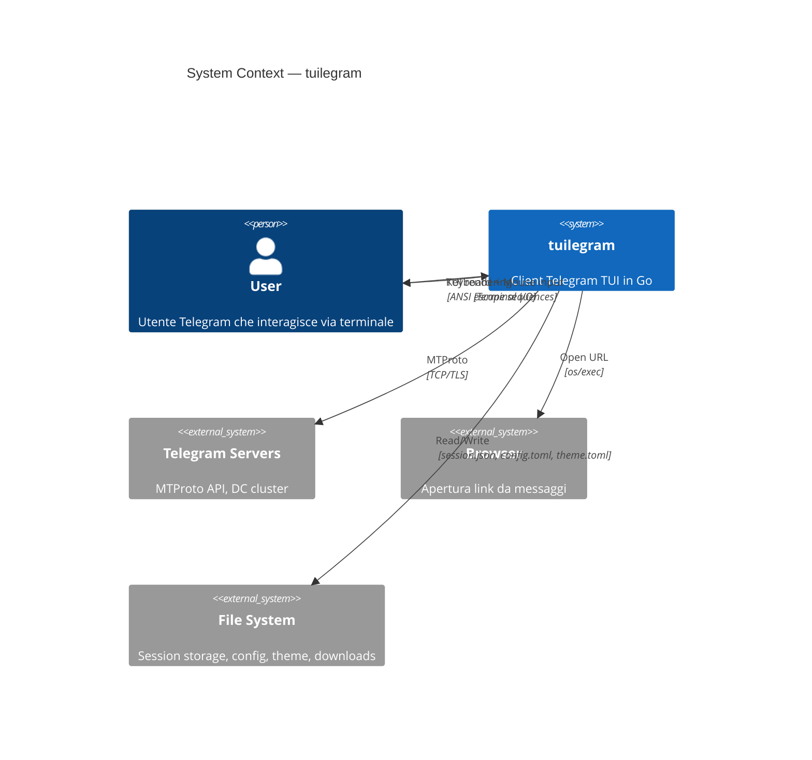

# System Context

## System Boundary

tuilegram è un client Telegram TUI che gira nel terminale dell'utente. Comunica con i server Telegram via MTProto e presenta l'interfaccia all'utente via terminale.



## Attori

| Attore | Tipo | Interazione |
|--------|------|-------------|
| **User** | Primario | Input keyboard/mouse, legge output TUI |
| **Telegram Servers** | Sistema esterno | MTProto: auth, messaggi, updates, media |
| **File System** | Risorsa | Persistenza: session, config, theme, file scaricati |
| **Browser** | Sistema esterno | Apertura link (delegata al browser di default OS) |

## Interfacce esterne

### Telegram MTProto API (via gotd/td)

| Interfaccia | Direzione | Dati |
|-------------|-----------|------|
| Auth | tuilegram → Telegram | phone, code, password, session key |
| Dialogs | tuilegram → Telegram | Lista chat, peer resolution |
| Messages | bidirezionale | Invio/ricezione messaggi, history, edit, delete |
| Updates | Telegram → tuilegram | Nuovi messaggi, typing, online status, reactions |
| Media | bidirezionale | Upload/download file, foto, voice |
| Peers | tuilegram → Telegram | Risoluzione utenti, gruppi, canali |

### Terminal I/O (via bubbletea)

| Interfaccia | Direzione | Dati |
|-------------|-----------|------|
| Keyboard | User → tuilegram | Tasti, shortcut, testo input |
| Mouse | User → tuilegram | Click, scroll wheel |
| Display | tuilegram → User | ANSI rendering, colori, box-drawing |
| Window | Terminal → tuilegram | Resize events (WindowSizeMsg) |

### File System

| File | Percorso | Contenuto | Sicurezza |
|------|----------|-----------|-----------|
| Session | `./session.json` | Auth key MTProto (256 byte) | `0600`, mai committato |
| Config | `~/.config/tuilegram/config.toml` | Preferenze utente | Leggibile |
| Theme | `~/.config/tuilegram/theme.toml` | Palette colori custom | Leggibile |
| Downloads | `~/Downloads/` o configurato | File scaricati | Leggibile |

## Vincoli di sistema

| Vincolo | Descrizione |
|---------|-------------|
| **Terminale** | Richiede terminale con supporto 256 colori (ideale truecolor). Dimensione minima: 80x24 |
| **Network** | Connessione Internet per comunicare con Telegram. Supporta reconnection automatica |
| **Single session** | Un'istanza di tuilegram per account. Sessioni multiple causano conflitti con Telegram |
| **Rate limiting** | Telegram impone rate limit su API calls. Flood wait gestito via gotd/contrib |
| **Auth key** | La session key è il segreto più critico. Permette impersonazione completa dell'account |

## Deployment

```
┌─────────────────────────────────────────┐
│  User's Machine                         │
│  ┌───────────────────────────────────┐  │
│  │  Terminal Emulator                │  │
│  │  ┌─────────────────────────────┐  │  │
│  │  │  tuilegram process          │  │  │
│  │  │  ┌───────┐  ┌────────────┐  │  │  │
│  │  │  │ TUI   │  │ Telegram   │  │  │  │
│  │  │  │ Loop  │◄►│ Client     │  │  │  │
│  │  │  │(bbtea)│  │ (gotd/td)  │  │  │  │
│  │  │  └───────┘  └─────┬──────┘  │  │  │
│  │  └────────────────────┼─────────┘  │  │
│  └───────────────────────┼────────────┘  │
│              ┌───────────┘               │
│  ~/.config/  │  session.json             │
└──────────────┼───────────────────────────┘
               │
               ▼ TCP/TLS
┌──────────────────────────┐
│  Telegram DC Cluster     │
│  (MTProto servers)       │
└──────────────────────────┘
```
