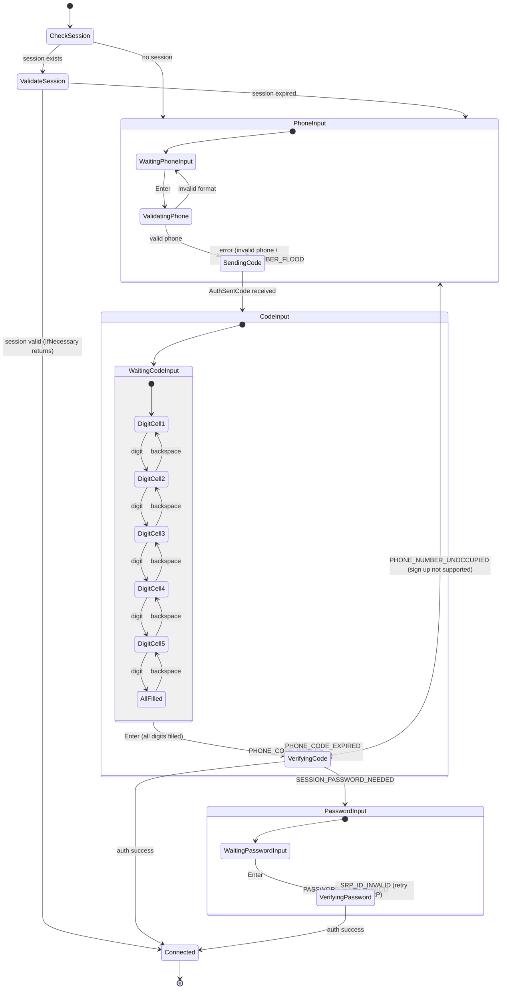
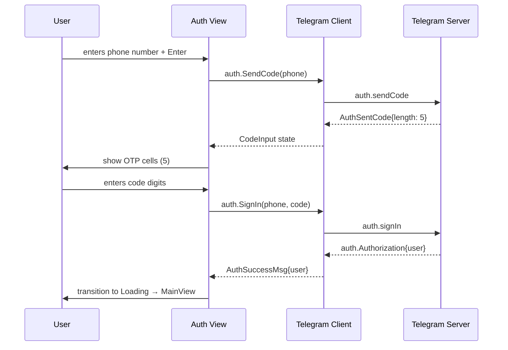
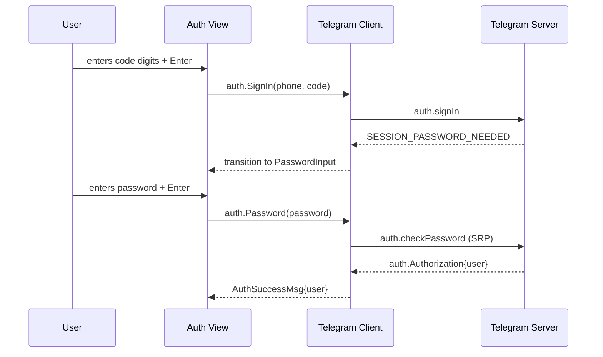

# Authentication Flow

Dettaglio del flusso di autenticazione Telegram con tutti gli edge case.

## State Machine Completa



## Validazioni

### Phone Number
- Deve iniziare con `+`
- Solo cifre dopo il `+` (spazi e trattini rimossi automaticamente)
- Lunghezza: 7-15 cifre (standard ITU-T E.164)
- Validazione locale prima dell'invio al server

### 2FA Code
- Esattamente N cifre (N definito da `AuthSentCode.type.length`)
- Tipicamente 5 o 6 cifre
- Solo cifre 0-9
- Auto-submit possibile quando tutte le celle sono piene

### Password
- Qualsiasi stringa non vuota
- SRP (Secure Remote Password) negotiation con il server
- La password non viene mai inviata in chiaro

## Error Handling

| Errore Telegram | UI Response | Recovery |
|----------------|-------------|----------|
| `PHONE_NUMBER_INVALID` | Toast: "Invalid phone number" | Torna a PhoneInput |
| `PHONE_NUMBER_BANNED` | Toast: "Phone number banned" | Torna a PhoneInput |
| `PHONE_NUMBER_FLOOD` | Toast: "Too many attempts. Wait." | Torna a PhoneInput, timer |
| `PHONE_CODE_INVALID` | Toast: "Wrong code" | Svuota CodeInput, refocus |
| `PHONE_CODE_EXPIRED` | Toast: "Code expired. Resending..." | Re-invia codice |
| `SESSION_PASSWORD_NEEDED` | Transizione a PasswordInput | — |
| `PASSWORD_HASH_INVALID` | Toast: "Wrong password" | Svuota PasswordInput |
| `PHONE_NUMBER_UNOCCUPIED` | Toast: "Account not found" | Torna a PhoneInput |
| Network error | Toast: "Connection failed" | Retry con backoff |

## Sequence Diagram — Happy Path



## Sequence Diagram — 2FA Path



## OTP Component — Behavior Detail

```
State: [1] [2] [_] [_] [_]    cursor on cell 3
                 ↑

Input '7':  [1] [2] [7] [_] [_]    auto-advance to cell 4
                      ↑

Backspace:  [1] [2] [_] [_] [_]    back to cell 3, clear
                 ↑

All filled: [1] [2] [7] [9] [8]    ready for Enter
                              ↑
```

| Input | Azione |
|-------|--------|
| Digit 0-9 | Scrivi nella cella corrente, advance |
| Backspace | Cancella cella corrente, retreat |
| Enter | Submit se tutte le celle sono piene |
| Esc | Torna allo step precedente |
| Left/Right | Naviga tra le celle manualmente |
