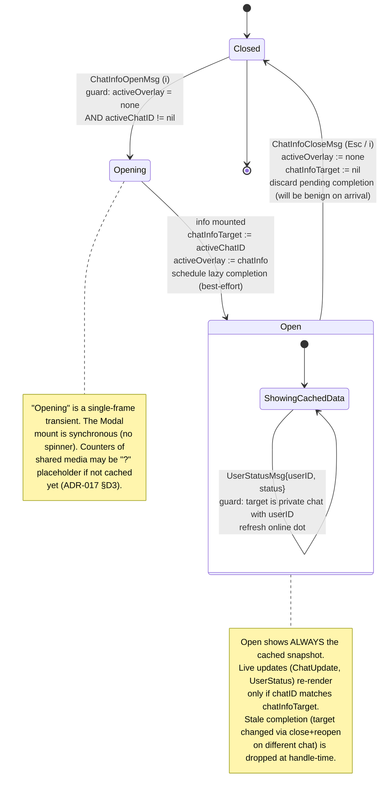

# Chat Info Overlay — Statechart (Step 29)

Modello comportamentale dell'**overlay chat info** introdotto nello
Step 29. `i` (con una chat aperta) apre un overlay floating a destra
sovrapposto alla conversazione, che mostra metadata della peer:
nome, `@username`, online status, telefono (se visibile), bio,
contatori shared media. `Esc` o `i` chiude.

**Scope Step 29 (chat info)**:

- Overlay full-screen-equivalent (riusa primitive **`Modal`**
  Crush-style — vedi [ADR-017](../phase-6-decisions/ADR-017-chat-info-data-source.md)).
- Posizionamento ancorato a destra (lipgloss `Place` right-aligned);
  flag `compact: true` come which-key (Step 28) per layout sub-screen.
- Body è una scheda statica con sezioni: identità (nome/@username/status),
  contact (phone se accessibile), profile (bio), counters (Shared Media,
  Shared Files).
- **Read-only**: nessuna azione editabile in Step 29 (no edit nome,
  no save photo, no leave chat). I controlli sono navigation-only
  (scroll del body se overflow, Esc per chiudere).
- Data source: **cache locale** dei tipi di dominio (`User`, `Chat`,
  `OnlineStatus`) già materializzati da Telegram in `DialogsLoadedMsg`
  e dalle update real-time. Se un campo è mancante (es. bio non
  ancora fetched), mostra placeholder `—` e schedula un `tea.Cmd`
  best-effort di completamento (vedi §"Data sourcing"). Vedi
  [ADR-017 §D2](../phase-6-decisions/ADR-017-chat-info-data-source.md).
- Counters di shared media: in Step 29 mostrati come **stub `?`** o
  contatori cached se disponibili; il fetch reale via
  `messages.search(filter=PhotoVideo|...)` è demandato a uno step
  futuro (out-of-scope Step 29). Decisione in [ADR-017 §D3](../phase-6-decisions/ADR-017-chat-info-data-source.md).

**Fuori scope Step 29**:

- Scroll/paginazione delle shared media list (Step 29 mostra solo
  contatori).
- Editing del nome chat / titolo gruppo / descrizione canale.
- Membership management (kick/ban/promote in gruppi).
- Leave chat / Block user / Report.
- Avatar rendering (Telegram fornisce avatar come photo; rendering
  in TUI è non-banale, demandato a un possibile step "media in
  panel" futuro).
- Fetch full profile (`users.getFullUser`) on-open: vedi
  [ADR-017 §D2](../phase-6-decisions/ADR-017-chat-info-data-source.md)
  (cache-first, lazy completion best-effort).

## Contesto nello statechart globale

L'overlay è un figlio di `Overlay.ChatInfoPanel` (vedi
[`ui-statechart.md`](ui-statechart.md) §"Overlay State Machine").
**Partecipa al lock `activeOverlay`** introdotto da
[ADR-015 §D3](../phase-6-decisions/ADR-015-command-palette-whichkey-help.md):
mutex con palette / which-key / help / search / edit / forward /
confirm. Aprire `i` quando `activeOverlay != none` è no-op silenzioso.

> **Differenza chiave con la folder sidebar (Step 29 stesso step)**:
> la sidebar è un pannello inline, NON un overlay; la chat info È un
> overlay (Modal). I due possono coesistere: sidebar visible AND
> chat info open è uno stato valido.

### Pre-condizione

`i` apre la chat info **solo** se `activeChatID != nil` (cioè se una
conversazione è aperta nel pannello destro). Se `activeChatID == nil`
(stato "Select a chat") `i` è no-op silenzioso. Documentato come
guard nello statechart §A.

## A. Statechart — Chat Info Overlay



### Stati — Chat Info

| Stato | Descrizione | Input accettati | Componenti attivi |
|-------|-------------|-----------------|-------------------|
| `Closed` | Overlay non montato | `i` (con `activeChatID != nil`) | — |
| `Opening` | Frame singolo di mount | — | (transient) |
| `Open.ShowingCachedData` | Overlay visibile, body scrollabile | `j`/`k`/`PgUp`/`PgDn`, `Esc`, `i` | overlay (Modal compact-right), viewport |

## B. Body layout — sezioni

Il body dell'overlay è una scheda verticale con sezioni in ordine
fisso:

```
╭── Info ────────────────────╮
│                            │
│ John Doe                   │   ← Section 1: Identity
│ @johndoe                   │
│ ● Online                   │
│                            │
├────────────────────────────┤
│                            │
│ Phone: +1 555-0123         │   ← Section 2: Contact
│                            │
├────────────────────────────┤
│                            │
│ Bio:                       │   ← Section 3: Profile
│ Software developer.        │
│ Coffee enthusiast.         │
│                            │
├────────────────────────────┤
│                            │
│ Shared Media   [24]        │   ← Section 4: Counters
│ Shared Files   [8]         │
│ Shared Links   [?]         │
│                            │
╰────────────────────────────╯
        esc close
```

| Sezione | Sorgente | Behaviour quando mancante |
|---------|----------|---------------------------|
| Identity (name, @username, status dot) | `Chat.Title`, `User.Username` (private), `User.Status` | name sempre presente; `@username` omesso se vuoto; status dot solo per private chat |
| Contact (phone) | `User.Phone` | omesso se Telegram privacy nasconde il telefono (`Phone == ""`) |
| Profile (bio) | `User.Bio` | placeholder `—` se non ancora fetched; lazy completion via `users.getFullUser` (ADR-017 §D2) |
| Counters (shared media) | `Chat.SharedCounts` (cached) | `[?]` se non cached; fetch reale fuori scope Step 29 (ADR-017 §D3) |

### Variazioni per `ChatType`

| Type | Section 1 | Section 2 | Section 3 | Section 4 |
|------|-----------|-----------|-----------|-----------|
| `Private` | name + @user + dot online | phone (if visible) | bio | counters |
| `Group` | title + member count | (omitted) | description | counters |
| `Channel` | title + subscribers | (omitted) | description + link | counters |
| `Bot` | name + @user | (omitted) | bot description | counters |
| `SavedMessages` | "Saved Messages" | (omitted) | (omitted) | counters |

Decisione di omettere section vs. mostrarla con placeholder: vedi
[ADR-017 §D4](../phase-6-decisions/ADR-017-chat-info-data-source.md).

## C. Data sourcing — cache-first + lazy completion

### Cache hit (path felice)

Per la maggioranza dei chat aperti, i dati di base (name, username,
phone, status) sono già in memoria perché materializzati da
`DialogsLoadedMsg` o da update real-time (`UserStatusMsg`,
`ChatUpdateMsg`). L'open dell'overlay è quindi **immediato**:

```
on ChatInfoOpenMsg:
    if activeOverlay != none:           return         // mutex
    if activeChatID == nil:              return         // guard
    chatInfoTarget := activeChatID
    activeOverlay := chatInfo
    // schedule lazy completion BEST-EFFORT (only if data is stale)
    if needsBioFetch(activeChatID):
        return fetchFullUserCmd(activeChatID)            // tea.Cmd
    return                                               // no cmd needed
```

### Cache miss / staleness — lazy completion

Bio (`User.Bio`) è il campo che più probabilmente non è cached:
arriva da `users.getFullUser`, una RPC separata da
`messages.getDialogs`. Per Step 29:

- Schedula `fetchFullUserCmd(chatID)` solo per chat **private**.
- Risultato: `ChatInfoCompletionMsg{chatID, fields}` quando la RPC
  ritorna.
- **Drop-stale**: se `chatID != chatInfoTarget` al momento del
  `ChatInfoCompletionMsg` (l'utente ha chiuso e riaperto su un'altra
  chat), il messaggio è no-op. Pattern documentato in
  [ADR-017 §D2](../phase-6-decisions/ADR-017-chat-info-data-source.md);
  formalizzato come invariante `STALE_COMPLETION_DROP` in
  [`folders_chatinfo.tla`](../phase-4-concurrency/folders_chatinfo.tla).

### Live updates mentre l'overlay è Open

Tre eventi possono arrivare e re-renderizzare l'overlay (gate by
`chatID == chatInfoTarget`):

| Evento | Trigger | Effetto sull'overlay |
|--------|---------|----------------------|
| `UserStatusMsg{userID, status}` | Telegram update | Refresh dot Online/Offline (private chat) |
| `ChatUpdateMsg{chat}` | Telegram update | Refresh title, member count, last message non visibile (counters basici) |
| `ChatInfoCompletionMsg{chatID, fields}` | tea.Cmd result | Merge fields (bio, photo metadata futuro) |

## D. Eventi / Messaggi (tipizzati `tea.Msg`)

Estendono [`../phase-1-context/message-taxonomy.md`](../phase-1-context/message-taxonomy.md).

| Msg | Origine | Payload | Effetto |
|-----|---------|---------|---------|
| `ChatInfoOpenMsg` | Keystroke `i` (App livello root) | — | Guard: `activeOverlay == none` AND `activeChatID != nil`; `chatInfoTarget := activeChatID`; `activeOverlay := chatInfo`; opzionale `tea.Cmd` di completion (best-effort) |
| `ChatInfoCloseMsg` | `Esc` o `i` durante Open | — | `activeOverlay := none`; `chatInfoTarget := nil`; pending completion sarà droppato al return-time (drop-stale via `chatInfoTarget` check) |
| `ChatInfoCompletionMsg` | `fetchFullUserCmd` ritorna | `chatID ChatID, fields {bio, ...}` | Se `chatID == chatInfoTarget` → merge nei dati cached + re-render; altrimenti no-op (stale, ADR-017 §D2) |

`UserStatusMsg` e `ChatUpdateMsg` sono già nel taxonomy (Step 14/17);
in Step 29 acquistano un branch addizionale "se overlay chat info
open su quel chat → re-render" (puro side-effect di rendering, no
nuovo `tea.Msg` necessario).

## E. Keybindings — Chat Info Overlay

### Globale (con `activeChatID != nil`, `activeOverlay = none`)

| Tasto | Azione |
|-------|--------|
| `i` | `ChatInfoOpenMsg` |

### Overlay aperto (`Open.ShowingCachedData`)

| Tasto | Azione |
|-------|--------|
| `j` / `↓` | Scroll viewport interno (no `tea.Msg` esposto) |
| `k` / `↑` | Scroll viewport interno |
| `PgUp` / `PgDn` | Scroll page |
| `Esc` | `ChatInfoCloseMsg` |
| `i` | `ChatInfoCloseMsg` (toggle off, simmetria con apertura) |
| `Ctrl+P` / `?` / `/` | **Ignorati** (mutex `activeOverlay`, ADR-015 §D3) |
| `F` | **Ignorato** (mutex non strict — ma per coerenza UX, l'overlay consuma. Decisione in ADR-017 §D5.) |

> **Nota su `F` durante chat info open**: la sidebar NON è un overlay
> e tecnicamente non viola il mutex `activeOverlay`. Tuttavia, per
> evitare confusione UX (mostrare/nascondere un terzo pannello mentre
> l'overlay è aperto può destabilizzare il layout percepito), l'overlay
> consuma `F`. Decisione in
> [ADR-017 §D5](../phase-6-decisions/ADR-017-chat-info-data-source.md).

## F. Modello dati associato

```
App ::= {
    ...
    activeOverlay     : OverlayKind        // shared con altri overlay (ADR-015)
    activeChatID      : ChatID | nil       // chat aperta nel pannello destro
    chatInfoTarget    : ChatID | nil       // == activeChatID al momento dell'open
    chatInfoCard      : ChatInfoCard       // dati renderizzati (cache snapshot + completion merge)
}

ChatInfoCard ::= {
    name             : string
    username         : string              // "" se mancante
    onlineStatus     : OnlineStatus | nil  // nil per group/channel/bot
    phone            : string              // "" se mancante / privacy hidden
    bio              : string              // "" o "—" se non ancora fetched
    sharedMediaCount : int                 // -1 se "?"
    sharedFilesCount : int                 // -1 se "?"
    sharedLinksCount : int                 // -1 se "?"
}
```

`chatInfoCard` è ricostruito ad ogni `Open` dalla cache; live updates
mutano singoli campi.

## G. Invarianti comportamentali

1. **Single target**: `chatInfoTarget != nil ⟺ activeOverlay = chatInfo`.
   La variabile è popolata SOLO quando l'overlay è aperto.
2. **Open requires open chat**:
   `ChatInfoOpenMsg ⟹ activeChatID != nil`. Senza chat aperta, `i` è
   no-op (guard nello statechart).
3. **Mutex with other overlays**: `activeOverlay = chatInfo` ⟹
   tutti gli altri overlay sono `none` (palette/whichKey/help/search/
   edit/forward/confirm). Verifica TLA+: `MUTEX_OVERLAYS` (esteso
   con `chatInfo` in `folders_chatinfo.tla`).
4. **Stale completion drop**: `ChatInfoCompletionMsg{chatID}` con
   `chatID != chatInfoTarget` è no-op. Verifica TLA+:
   `STALE_COMPLETION_DROP`.
5. **Cache-first**: l'overlay si apre **sincronamente** dalla cache;
   nessun spinner, nessun blocking. La `tea.Cmd` di completion è
   sempre best-effort.
6. **Active chat invariance under folder filter**: aprire la chat info
   funziona anche se `activeChatID` è in una chat fuori dalla
   `selectedFolderID` (perché `i` legge da `activeChatID`, non dalla
   chat list filtrata). Verifica TLA+: `INFO_INDEPENDENT_OF_FOLDER`.
7. **Read-only**: nessun `tea.Msg` da overlay chat info muta lo stato
   server-side (no `editChatCmd`, `leaveCmd`, ecc. in Step 29).

## H. Loading / Empty / Error states — render

| Stato | Render |
|-------|--------|
| `Open`, cache hit completo | Card piena con tutti i campi popolati |
| `Open`, cache parziale (es. bio mancante) | Card con campi noti + placeholder `—` per i mancanti; spinner inline accanto al campo se completion in volo (es. `Bio: ⠧ loading...`) |
| `Open`, completion failure | Placeholder permanente `—`; status-bar message dim "Could not load full profile (offline?)"; non rompe l'overlay |
| `Open`, target è SavedMessages | Card minimale (solo "Saved Messages" + counters) |
| `Open`, target è bot | Card senza phone, con bot description in section Profile |

Errori di completion: la RPC fail è **silent** (no overlay che mostra
errori, perché degraderebbe UX); status-bar message è la fonte di
notifica. ADR-017 §D2 documenta il fail-mode.

## I. Modal primitive — riuso

L'overlay chat info usa la **primitive `Modal` Crush-style** introdotta
in `internal/ui/components/modal.go` allo Step 26 e estesa con flag
`compact` allo Step 28 ([ADR-015 §D1](../phase-6-decisions/ADR-015-command-palette-whichkey-help.md)).

| Parametro Modal | Valore per Chat Info |
|-----------------|----------------------|
| `title` | "Info" |
| `body` | viewport scrollable con sezioni Identity / Contact / Profile / Counters |
| `hint` | `↑↓ scroll · esc close` |
| `compact` | `true` (anchored right, sub-screen) |
| `placement` | right (lipgloss `Place`, horizontal=Right, vertical=Center) |

**Decisione di reuse**: vedi
[ADR-017 §D1](../phase-6-decisions/ADR-017-chat-info-data-source.md).
Coerente con `feedback_modal_charm.md` (memoria utente: gli overlay
riusano la primitive `Modal` unificata, no one-off).

Il flag `compact` è già stato introdotto da Step 28 per which-key
(anchored bottom-right). Step 29 estende l'uso del flag con un nuovo
`placement: right`. Se Modal non supporta ancora `placement`,
[ADR-017](../phase-6-decisions/ADR-017-chat-info-data-source.md)
prescrive l'estensione minima dell'API (proprietà di posizionamento,
NON un nuovo componente).

## Cross-links

- Pipeline step: [`development-pipeline.md` §Step 29](../development-pipeline.md)
- Statechart globale: [`ui-statechart.md`](ui-statechart.md) §"Overlay State Machine" (esteso con `chatInfo`)
- Sidebar parallela: [`folder-sidebar.md`](folder-sidebar.md)
- Sequence diagrams: [`../phase-3-interactions/folder-and-info-flow.md`](../phase-3-interactions/folder-and-info-flow.md)
- Concurrency invariants: [`../phase-4-concurrency/folders_chatinfo.tla`](../phase-4-concurrency/folders_chatinfo.tla)
- Decisioni (data source cache-first, Modal reuse + compact-right placement, shared-counters stub, F-during-info, omit-vs-placeholder per type): [ADR-017](../phase-6-decisions/ADR-017-chat-info-data-source.md)
- Mutex pattern: [ADR-015 §D3](../phase-6-decisions/ADR-015-command-palette-whichkey-help.md) (esteso con `chatInfo`)
- Modal primitive: Step 26 (introduzione), Step 28 (`compact` flag, [ADR-015 §D1](../phase-6-decisions/ADR-015-command-palette-whichkey-help.md))
- Domain types: [`../phase-1-context/domain-model.md`](../phase-1-context/domain-model.md) §`User`, `Chat`, `OnlineStatus`
- Tui design canonical: [`../tui-design.md`](../tui-design.md) §6 Overlays "Chat Info (`i`)"
- Memoria utente: `feedback_modal_charm.md` (overlays riusano Modal primitive)
