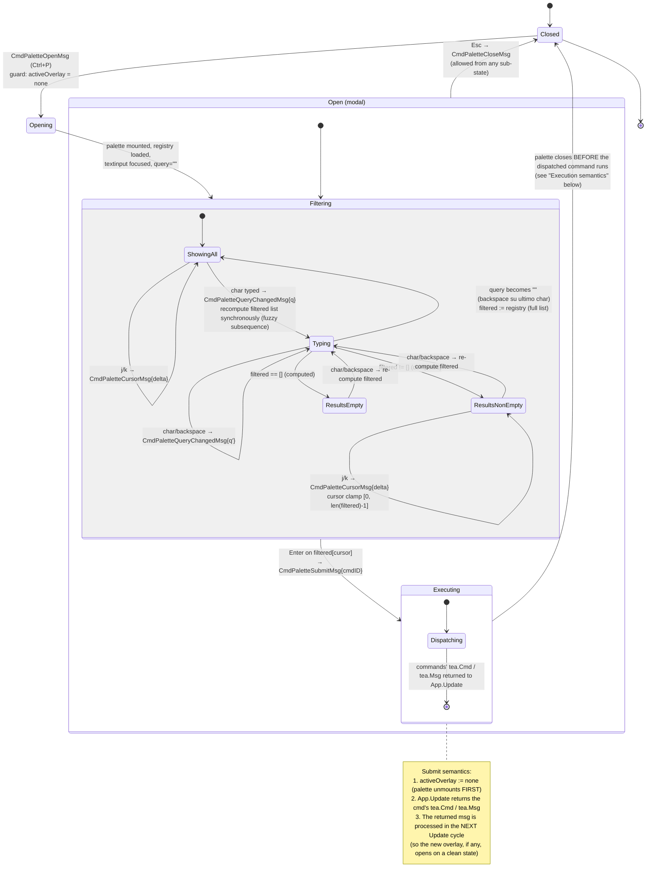
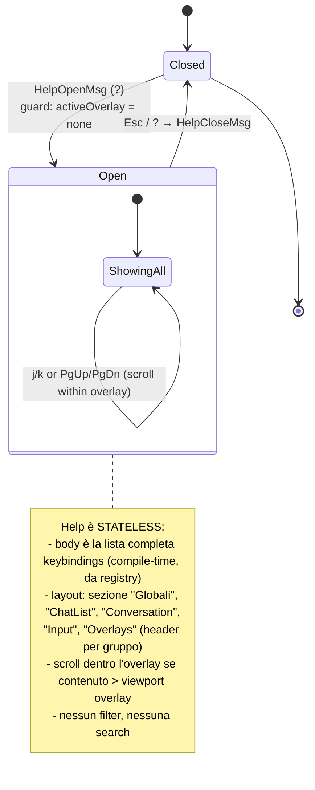
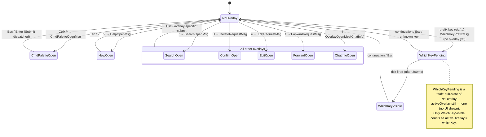

# Command Palette + Which-Key + Help — Statechart (Step 28)

Modello comportamentale dei **tre nuovi overlay UI-only** introdotti nello
Step 28: command palette (`Ctrl+P`), which-key prefix-disambiguation
overlay (`g`/`z` + 300ms timeout), help overlay (`?`). Tutti e tre sono
**puramente UI** (no Telegram API), rendono client-side, e usano la
**primitive `Modal` Crush-style** introdotta nello Step 26 (vedi
`feedback_modal_charm.md`).

**Scope Step 28**:

- **Command palette** (`Ctrl+P`): overlay full-screen con textinput +
  lista comandi filtrabile via fuzzy match (subsequence). `Enter` esegue
  il comando focused (può essere un toggle, una navigation, o l'apertura
  di un altro overlay).
- **Which-key** (`g`/`z` + 300ms): dopo la pressione di un prefix-key
  registrato, parte un timer di **300ms**; se entro il timer arriva la
  seconda key del chord → esegue l'azione e il timer è **cancellato**;
  se il timer scade → appare un overlay che lista le continuations
  disponibili; l'utente può poi premere la seconda key per eseguire,
  oppure `Esc` per annullare.
- **Help** (`?`): overlay full-screen che lista TUTTI i keybinding
  globali e per-pannello, organizzati per sezione. Stateless (nessun
  filter, nessuna selection). `Esc` o `?` chiude.

**Fuori scope Step 28**:

- Nessuna RPC Telegram (UI only).
- Nessuna persistence dei comandi recently-used (palette parte sempre
  dall'ordine canonico — vedi [ADR-015 §D2](../phase-6-decisions/ADR-015-command-palette-whichkey-help.md)).
- Nessuna registrazione runtime di nuovi comandi/chord (registry statico
  compile-time — [ADR-015 §D2](../phase-6-decisions/ADR-015-command-palette-whichkey-help.md)).
- Nessun contestualizzazione del help per pannello attivo (Step 28
  mostra l'intero help; il filtro per pannello è una potenziale
  evoluzione futura).
- Which-key con chord >2 (es. `g`,`g`,`x`) — Step 28 supporta solo
  chord di lunghezza 2 (`prefix` + `continuation`).

## Contesto nello statechart globale

I tre overlay sono figli di `Overlay.*` (vedi
[`ui-statechart.md`](ui-statechart.md) §"Overlay State Machine"). Sono
raggiungibili da `MainView` qualunque sia il pannello focused (le tre
keystroke `Ctrl+P`, `?`, prefix-keys come `g`/`z` sono **globali** —
vedi tabella "Regole di focus" in `ui-statechart.md`).

**Mutua esclusione fra overlay** (decisione [ADR-015 §D3](../phase-6-decisions/ADR-015-command-palette-whichkey-help.md)):
gli overlay introdotti dallo Step 28 sono **mutuamente esclusivi** fra
loro e con gli overlay esistenti (search globale, edit, forward,
confirm, chat info). Il root model mantiene una variabile
`activeOverlay : OverlayKind | none`. Tentare di aprirne uno mentre un
altro è già aperto → no-op silenzioso (la keystroke è consumata
dall'overlay attivo). Razionale completo in
[ADR-015 §D3](../phase-6-decisions/ADR-015-command-palette-whichkey-help.md).

> **Eccezione documentata**: la barra inline `SearchInChat` (Step 27)
> NON è un overlay (è un sub-state della `ConversationModel`, vedi
> [ADR-014](../phase-6-decisions/ADR-014-inline-search-bar-vs-modal.md))
> e quindi NON partecipa al lock `activeOverlay`. Quando la barra è
> aperta, le scorciatoie globali `Ctrl+P` / `?` continuano a passare al
> root e possono aprire palette/help (decisione D3 di ADR-014).

## A. Statechart — Command Palette



### Stati — Command Palette

| Stato | Descrizione | Input accettati | Componenti attivi |
|-------|-------------|-----------------|-------------------|
| `Closed` | Palette non montato | `Ctrl+P` | — |
| `Opening` | Palette appena triggrato (frame singolo) | — | textinput montaggio |
| `Open.Filtering.ShowingAll` | Query vuota; lista mostra TUTTI i comandi nell'ordine canonico (registry) | char, j/k, Enter, Esc | textinput, lista comandi |
| `Open.Filtering.Typing` | Stato transiente intra-frame durante recompute | (rendered as next state) | (skipped) |
| `Open.Filtering.ResultsNonEmpty` | Query non vuota, `len(filtered) > 0`, cursor valido | char, backspace, j/k, Enter, Esc | textinput, lista filtered, cursor |
| `Open.Filtering.ResultsEmpty` | Query non vuota, `len(filtered) == 0` | char, backspace, Esc | textinput, placeholder "No commands match" |
| `Executing.Dispatching` | Palette unmounts; comando dispatched (può essere sync o async) | — | — |

### Execution semantics — palette → command → next overlay (se applicabile)

`CmdPaletteSubmitMsg{cmdID}` viene gestito in `App.Update` con questa
sequenza atomica:

```
1. activeOverlay := none                      // palette si chiude PRIMA
2. cmd := registry[cmdID].handler             // lookup
3. return cmd                                  // tea.Cmd o batch di tea.Msg
```

Se il comando apre un altro overlay (es. "Mute chat" → confirm dialog;
"Forward selected" → forward picker), l'apertura avviene nel **next**
`Update` cycle, su un `activeOverlay = none`, quindi **non viola la
mutua esclusione** definita in
[ADR-015 §D3](../phase-6-decisions/ADR-015-command-palette-whichkey-help.md).

## B. Statechart — Which-Key (timed prefix disambiguation)

```mermaid
stateDiagram-v2
    [*] --> Idle

    Idle --> PrefixPending : prefix key pressed (g, z, ...)<br/>→ WhichKeyPrefixMsg{prefix, prefixID++, scheduledAt}<br/>schedule tea.Tick(300ms) → WhichKeyTimeoutMsg{prefix, prefixID}<br/>guard: activeOverlay = none

    state PrefixPending {
        [*] --> Waiting
        Waiting --> ChordResolved_immediate : continuation key pressed (g/G/u/...)<br/>before tick fires<br/>→ WhichKeyChordMsg{prefix, cont}<br/>cancel-by-stale (tick will be benign on fire)
        Waiting --> Cancelled_immediate : Esc / unknown key / focus loss<br/>→ WhichKeyCancelMsg{prefix, prefixID}<br/>tick will be benign on fire
        Waiting --> WhichKeyVisible : tea.Tick(300ms) fires AND<br/>tick.prefixID == latestPrefixID<br/>→ WhichKeyTimeoutMsg
    }

    ChordResolved_immediate --> Idle : execute action(prefix, cont) → tea.Cmd
    Cancelled_immediate --> Idle : (no action; prefix discarded)

    state WhichKeyVisible {
        [*] --> ShowingMenu
        ShowingMenu --> ChordResolved_visible : continuation key pressed → WhichKeyChordMsg{prefix, cont}
        ShowingMenu --> Cancelled_visible : Esc → WhichKeyCancelMsg
        ShowingMenu --> Cancelled_visible : unknown key (not in continuations[prefix]) → WhichKeyCancelMsg
    }

    ChordResolved_visible --> Idle : execute action → tea.Cmd
    Cancelled_visible --> Idle

    note right of PrefixPending
      Race: stale tick fire after chord resolved or cancelled.
      Drop-stale via prefixID monotonic counter (see TLA+).
      Pattern: latestPrefixID bumped on prefix press AND on
      chord/cancel resolution. Tick check at fire-time:
      tick.prefixID == latestPrefixID AND state == Waiting.
    end note

    note left of WhichKeyVisible
      Continuation registry per prefix (compile-time):
        g → {g: top, G: bottom, u: unread, ...}
        z → {z: center, t: top, b: bottom, ...}
      Unknown continuation in WhichKeyVisible → cancel
      (closes overlay without executing).
    end note
```



### Stati — Which-Key

| Stato | Descrizione | Input accettati | Componenti attivi |
|-------|-------------|-----------------|-------------------|
| `Idle` | Nessun prefix in attesa | tutte le keystroke (incluse prefix-keys) | — |
| `PrefixPending.Waiting` | Prefix premuto, timer 300ms attivo, overlay NON visibile | continuation key, Esc, qualunque altra key | — (no overlay yet) |
| `WhichKeyVisible.ShowingMenu` | Timer scaduto, overlay con lista continuations visibile | continuation key, Esc | overlay menu |
| `ChordResolved_*` (transient) | Chord completato, dispatching action | — | — |
| `Cancelled_*` (transient) | Chord annullato (Esc o unknown) | — | — |

### Freshness scheme — `latestPrefixID` (counter monotono)

Pattern derivato da [ADR-013](../phase-6-decisions/ADR-013-search-debounce-and-stale-results.md)
("monotonic counter + drop-stale", a sua volta da
[ADR-010](../phase-6-decisions/ADR-010-typing-ttl-strategy.md)):

```
on WhichKeyPrefixMsg{prefix}:
    latestPrefixID++
    state = PrefixPending.Waiting
    activePrefix = prefix
    schedule tea.Tick(300ms) → WhichKeyTimeoutMsg{prefix, latestPrefixID}

on key press during PrefixPending.Waiting:
    if key == Esc:
        latestPrefixID++           // invalidate pending tick
        state = Idle
        activePrefix = none
        return                       // WhichKeyCancelMsg
    if key in continuations[activePrefix]:
        latestPrefixID++           // invalidate pending tick
        state = Idle
        cmd := continuations[activePrefix][key].handler
        activePrefix = none
        return cmd                   // WhichKeyChordMsg → action
    else:
        // unknown key during PrefixPending.Waiting:
        // cancel and re-route the key to the normal keybinding handler
        latestPrefixID++
        state = Idle
        activePrefix = none
        re-dispatch key to root (best-effort)

on WhichKeyTimeoutMsg{prefix, prefixID}:
    if prefixID != latestPrefixID:  return    // stale tick, no-op
    if state != PrefixPending.Waiting: return  // already resolved
    state = WhichKeyVisible.ShowingMenu
    activeOverlay = WhichKey

on key press during WhichKeyVisible:
    if key == Esc:
        latestPrefixID++
        state = Idle
        activeOverlay = none
        return
    if key in continuations[activePrefix]:
        latestPrefixID++
        state = Idle
        cmd := continuations[activePrefix][key].handler
        activeOverlay = none
        return cmd
    else:
        // unknown continuation: cancel
        latestPrefixID++
        state = Idle
        activeOverlay = none
```

### Continuations registry (compile-time, examples)

Il registry è statico (compile-time, vedi
[ADR-015 §D2](../phase-6-decisions/ADR-015-command-palette-whichkey-help.md)):

| Prefix | Continuations | Effetto |
|--------|---------------|---------|
| `g` | `g` → top of viewport / chat list | `ScrollTopMsg` |
| `g` | `G` → bottom of viewport / chat list | `ScrollBottomMsg` |
| `g` | `u` → next unread chat | `JumpUnreadMsg` |
| `g` | `i` → chat info (alias di `i`) | `OverlayOpenMsg{ChatInfo}` |
| `z` | `z` → center current message in viewport | `ScrollCenterMsg` |
| `z` | `t` → scroll current to top | `ScrollToTopMsg` |
| `z` | `b` → scroll current to bottom | `ScrollToBottomMsg` |

`G` è anche disponibile come standalone (no prefix needed) per
compat vim. Quando l'utente preme `g` da solo e poi non preme nulla,
dopo 300ms vede il menu con `g`/`G`/`u`/`i`. Quando preme `gg`
rapidamente, l'azione è eseguita immediatamente senza vedere il menu.

## C. Statechart — Help Overlay



### Stati — Help

| Stato | Descrizione | Input accettati | Componenti attivi |
|-------|-------------|-----------------|-------------------|
| `Closed` | Help non montato | `?` | — |
| `Open.ShowingAll` | Help visibile, scroll abilitato | j/k, PgUp/PgDn, Esc, `?` | overlay con keybinding list (sezioni) |

## D. Root-model integration — overlay mutual exclusion

Il root model (`App`) mantiene:

```
type OverlayKind = none
                | search            // Step 26
                | cmdPalette        // Step 28
                | whichKey          // Step 28
                | help              // Step 28
                | confirmDialog     // Step 20
                | edit              // Step 19
                | forward           // Step 21
                | chatInfo          // Step 29

App.activeOverlay : OverlayKind  // single value, no stack
App.latestPrefixID : uint64      // for which-key freshness
App.activePrefix   : Key | none  // for which-key
```

Statechart di livello root (estratto):



**Invariante root**: `activeOverlay != none` ⟹ qualunque keystroke che
NON è dell'overlay attivo è **consumata e ignorata** (no-op). Le
keystroke globali `Ctrl+P` / `?` / `/` sono ignorate quando
`activeOverlay != none` (eccetto inline-bar `SearchInChat` di Step 27,
che non è un overlay — vedi nota in §"Contesto nello statechart globale").

## Eventi / Messaggi (tipizzati `tea.Msg`)

Estendono [`message-taxonomy.md`](../phase-1-context/message-taxonomy.md).

### Command palette

| Msg | Origine | Payload | Effetto |
|-----|---------|---------|---------|
| `CmdPaletteOpenMsg` | Keystroke `Ctrl+P` (App livello root) | — | Guard: `activeOverlay == none`; `activeOverlay := cmdPalette`; `query := ""`; `filtered := registry`; `cursor := 0` |
| `CmdPaletteQueryChangedMsg` | textinput change handler | `query string` | `filtered := fuzzyFilter(registry, query)` (subsequence match, sync); `cursor := 0` |
| `CmdPaletteCursorMsg` | `j`/`k` o `↑`/`↓` | `delta int` | `cursor := clamp(cursor + delta, 0, len(filtered)-1)` |
| `CmdPaletteSubmitMsg` | `Enter` su `filtered[cursor]` (con `len(filtered) > 0`) | `cmdID string` | `activeOverlay := none`; lookup `registry[cmdID].handler` → return `tea.Cmd` (può aprire altro overlay nel next cycle) |
| `CmdPaletteCloseMsg` | `Esc` | — | `activeOverlay := none`; reset state |

### Which-key

| Msg | Origine | Payload | Effetto |
|-----|---------|---------|---------|
| `WhichKeyPrefixMsg` | Keystroke prefix (`g`, `z`, ...) registrata in `prefixKeys` | `prefix Key, prefixID uint64, scheduledAt time.Time` | Guard: `activeOverlay == none && state == Idle`; bump `latestPrefixID := prefixID`; `activePrefix := prefix`; schedule `tea.Tick(300ms) → WhichKeyTimeoutMsg{prefix, prefixID}` |
| `WhichKeyTimeoutMsg` | `tea.Tick(300ms)` schedulato da `WhichKeyPrefixMsg` | `prefix Key, prefixID uint64` | Se `prefixID != latestPrefixID` → no-op (stale tick); altrimenti `activeOverlay := whichKey` (overlay diventa visibile) |
| `WhichKeyChordMsg` | Continuation key (in `continuations[activePrefix]`) | `prefix Key, cont Key` | Bump `latestPrefixID`; lookup `continuations[prefix][cont].handler`; `activeOverlay := none`; `activePrefix := none`; return `tea.Cmd` |
| `WhichKeyCancelMsg` | `Esc` o key non in `continuations[activePrefix]` | `prefix Key` | Bump `latestPrefixID`; `activeOverlay := none` (se era `whichKey`); `activePrefix := none`; (se la key non era Esc, opzionale re-dispatch al root handler — comportamento documentato come best-effort, vedi ADR-015 §D4) |

### Help

| Msg | Origine | Payload | Effetto |
|-----|---------|---------|---------|
| `HelpOpenMsg` | Keystroke `?` | — | Guard: `activeOverlay == none`; `activeOverlay := help` |
| `HelpCloseMsg` | `Esc` o `?` | — | `activeOverlay := none` |

(Lo scroll dentro l'help overlay è gestito internamente dal componente
viewport e non emette `tea.Msg` di tipo Help — è un sub-state del
componente.)

## Keybindings per overlay

### Command palette (Open)

| Tasto | Azione |
|-------|--------|
| char printable | Append a query → `CmdPaletteQueryChangedMsg` |
| `Backspace` | Rimuove ultimo char → `CmdPaletteQueryChangedMsg` |
| `j` / `↓` | Cursore lista ++ → `CmdPaletteCursorMsg{+1}` |
| `k` / `↑` | Cursore lista -- → `CmdPaletteCursorMsg{-1}` |
| `Enter` | `CmdPaletteSubmitMsg{filtered[cursor].id}` (no-op se `len(filtered) == 0`) |
| `Esc` | `CmdPaletteCloseMsg` |
| `Ctrl+P`, `?`, `/` | **Ignorati** (overlay attivo, mutua esclusione) |

### Which-key (PrefixPending.Waiting AND WhichKeyVisible)

| Tasto | Azione |
|-------|--------|
| Continuation registrata in `continuations[activePrefix]` | `WhichKeyChordMsg{prefix, cont}` → execute |
| `Esc` | `WhichKeyCancelMsg` |
| Altra key (non in continuations) | `WhichKeyCancelMsg` (best-effort re-dispatch) |

### Help (Open)

| Tasto | Azione |
|-------|--------|
| `j` / `k` / `↓` / `↑` | Scroll viewport interno (no `tea.Msg` esposto) |
| `PgUp` / `PgDn` | Scroll page (no `tea.Msg` esposto) |
| `Esc` o `?` | `HelpCloseMsg` |
| Tutto il resto | Ignorato |

## Modello dati associato

```
CommandRegistry ::= map[CmdID]CommandEntry

CommandEntry ::= {
    id       : string                // stable ID, e.g. "chat.mute"
    title    : string                // human-readable, e.g. "Mute current chat"
    keys     : []string              // keybinding hint, e.g. ["m"]
    section  : string                // grouping for help, e.g. "Chat"
    handler  : func() tea.Cmd        // execution callback
}

CmdPaletteState ::= {
    query     : string
    filtered  : []CmdID              // subsequence-matched, score-ordered
    cursor    : int                  // 0..len(filtered)-1
}

WhichKeyState ::= {
    activePrefix    : Key | none
    latestPrefixID  : uint64         // monotonic, process-wide
    visible         : bool           // true after 300ms tick fired
    continuations   : map[Key]map[Key]CommandEntry  // compile-time
}

HelpState ::= {
    open      : bool
    scrollPos : int                  // internal to viewport
}

App ::= {
    ...
    activeOverlay  : OverlayKind     // single-value (no stack)
    cmdPalette     : CmdPaletteState
    whichKey       : WhichKeyState
    help           : HelpState
    cmdRegistry    : CommandRegistry  // compile-time, immutable
}
```

## Algoritmo fuzzy match (subsequence)

Per la palette, il filtering è un **subsequence match
case-insensitive** sul `title` del comando. Razionale in
[ADR-015 §D4](../phase-6-decisions/ADR-015-command-palette-whichkey-help.md):

```
fuzzyMatch(title string, query string) (score int, matched bool):
    if query == "":  return 0, true
    qLC := strings.ToLower(query)
    tLC := strings.ToLower(title)
    qi := 0
    score := 0
    streak := 0
    lastMatchPos := -1
    for ti, ch := range tLC:
        if qi >= len(qLC):  break
        if ch == qLC[qi]:
            qi++
            // bonus per match consecutivo
            if lastMatchPos == ti - 1:
                streak++
                score += 5 + streak  // crescente
            else:
                streak = 0
                score += 1
            // bonus per match a inizio parola
            if ti == 0 || tLC[ti-1] == ' ':
                score += 10
            lastMatchPos = ti
    matched := qi == len(qLC)
    if !matched:  return 0, false
    // penalità per length disparity
    score -= (len(tLC) - len(qLC)) / 4
    return score, true

fuzzyFilter(registry, query):
    out := []
    for cmd in registry:
        score, ok := fuzzyMatch(cmd.title, query)
        if ok:  out.append({cmd, score})
    sort out by score DESC, then by title ASC
    return out
```

**Esempio**: query `"mute"`:

- "Mute current chat"  → score alto (match a inizio parola, consecutivo)
- "Toggle mute"         → score medio (match a metà, consecutivo)
- "Mark unread"         → no match (manca 'e' dopo 'u')

Complessità: `O(|registry| * |title|)` per keystroke. Per `|registry| <= 50`
e `|title| <= 30`, ~1500 char-comparisons → <0.1ms. Trascurabile.

## Invarianti comportamentali

1. **Overlay mutual exclusion**: `activeOverlay` ha un solo valore alla
   volta (no stack). Verifica TLA+: `MUTEX_OVERLAYS`.
2. **Prefix never lost**: per ogni `WhichKeyPrefixMsg`, esiste un
   percorso temporale finito che termina in (a) `WhichKeyChordMsg`
   (immediate o post-overlay), (b) `WhichKeyCancelMsg`, o (c)
   `WhichKeyTimeoutMsg → WhichKeyVisible`. Nessun prefix resta in
   `Waiting` indefinitamente. Verifica TLA+: `EVENTUAL_RESOLUTION`.
3. **Stale tick benign**: un `WhichKeyTimeoutMsg` con
   `prefixID < latestPrefixID` è no-op (non muta stato visibile).
   Verifica TLA+: `STALE_TICK_BENIGN_WHICHKEY`.
4. **Monotonic prefixID**: `latestPrefixID` è strettamente non-decrescente
   nell'arco di vita del processo (mai decremento, mai reset).
5. **Fast chord skips overlay**: se un `WhichKeyChordMsg` arriva PRIMA
   del `WhichKeyTimeoutMsg`, l'overlay NON viene mai mostrato (`visible
   = false` in tutto il path). Verifica TLA+: `FAST_CHORD_NO_OVERLAY`.
6. **Help is stateless**: `HelpState` non ha campi che persistono tra
   open/close (lo scroll è interno al viewport e si resetta su close).
7. **Palette dispatch atomicity**: `CmdPaletteSubmitMsg` setta
   `activeOverlay := none` PRIMA di ritornare il `tea.Cmd` del comando;
   un eventuale overlay aperto dal comando vede `activeOverlay = none`
   nel suo guard.
8. **Empty query → full list**: nella palette, `query == ""` ⟹
   `filtered = registry` (lista completa, nell'ordine canonico).
9. **No registry mutation**: `cmdRegistry` e `continuations` sono
   immutabili compile-time. Nessuna keystroke / tea.Msg può aggiungere
   o rimuovere comandi/chord.

## Loading / Empty / Error states — render

| Overlay | Stato | Render |
|---------|-------|--------|
| Palette | `query == ""` | header "Commands"; lista completa registry; cursor su [0]; hint `↵ run · ↑↓ navigate · esc close` |
| Palette | `query != "" && len(filtered) > 0` | header "Commands · <query>"; lista filtered; cursor su [0]; hint invariato |
| Palette | `query != "" && len(filtered) == 0` | header "Commands · <query>"; placeholder dim "No commands match" |
| Which-key | `Waiting` (300ms timer) | NESSUN OVERLAY visibile (transizione invisibile all'utente) |
| Which-key | `Visible` | overlay piccolo (in basso a destra, lipgloss `Place`) con tabella prefix → continuations; hint `esc cancel` |
| Help | `Open` | overlay full-screen con sezioni: Globali, ChatList, Conversation, Input, Overlays; ogni sezione: lista `key → action`; scroll se overflow; hint `↑↓ scroll · esc close` |

Errori: nessuno (UI only, no I/O, no possibili failure).

## Modal primitive — riuso

Tutti e tre gli overlay usano la **primitive `Modal` Crush-style**
introdotta in `internal/ui/components/modal.go` allo Step 26. L'API
attesa per ciascuno:

| Overlay | title | body | hint |
|---------|-------|------|------|
| Palette | "Commands" | textinput + lista filtered | `↵ run · ↑↓ navigate · esc close` |
| Which-key | (no title, layout compatto) | tabella `key → action` | `esc cancel` |
| Help | "Keybindings" | viewport scrollable con sezioni | `↑↓ scroll · esc close` |

Layout positioning (lipgloss `Place`):

- **Palette + Help**: full-screen centrato (riusa pattern di Step 26 search).
- **Which-key**: ancorato in basso a destra, dimensione compatta
  (~40 cols × ~10 rows). Differente da palette/help che sono
  full-screen, ma ancora `Modal` primitive (con flag `compact: true`).

Decisione di riuso: [ADR-015 §D1](../phase-6-decisions/ADR-015-command-palette-whichkey-help.md).

## Cross-links

- Pipeline step: [`development-pipeline.md` §Step 28](../development-pipeline.md)
- Statechart globale: [`ui-statechart.md`](ui-statechart.md) §"Overlay State Machine" (esteso con palette/whichkey/help)
- Sequence diagrams (which-key timing path): [`../phase-3-interactions/whichkey-timing-flow.md`](../phase-3-interactions/whichkey-timing-flow.md)
- Concurrency invariants: [`../phase-4-concurrency/whichkey.tla`](../phase-4-concurrency/whichkey.tla)
- Decisioni (debounce 300ms, registry statico, mutua esclusione, fuzzy subsequence): [ADR-015](../phase-6-decisions/ADR-015-command-palette-whichkey-help.md)
- Pattern correlato (monotonic counter + drop-stale): [ADR-013](../phase-6-decisions/ADR-013-search-debounce-and-stale-results.md)
- Pattern correlato (timestamp + re-arm): [ADR-010](../phase-6-decisions/ADR-010-typing-ttl-strategy.md)
- Modal primitive (memory utente): `feedback_modal_charm.md` — qui usata
- Inline bar exception (non partecipa al lock): [ADR-014](../phase-6-decisions/ADR-014-inline-search-bar-vs-modal.md)
