# Folder Sidebar — Statechart (Step 29)

Modello comportamentale della **folder sidebar** introdotta nello Step 29.
`F` (toggle key globale) mostra/nasconde un terzo pannello a sinistra
(prima della chat list) che elenca le **cartelle Telegram** dell'utente
("All Chats", "Personal", "Work", ...). Selezionare una cartella
**filtra la chat list** ai soli dialog inclusi in quella cartella; "All
Chats" è la pseudo-folder che mostra tutti i dialog (no filter).

**Scope Step 29 (folder sidebar)**:

- Sidebar a tre stati visivi: `Hidden` (default), `Visible.Browsing`
  (focus sulla sidebar, navigazione `j`/`k`), `Visible.Background`
  (sidebar visibile ma focus su chat list / conversation — il focus
  segue la `Tab navigation` smart).
- Selezione di una cartella applica il filtro alla `ChatListModel` in
  modo **sincrono** (no RPC: la lista delle cartelle e i loro `IncludedChats`
  arrivano già con `DialogsLoadedMsg` e sono cached).
- Toggle `F` da qualunque pannello: apre la sidebar e dà focus alla
  sidebar; secondo `F` chiude la sidebar (selezione corrente preservata
  in `App.selectedFolderID`, vedi §"Modello dati").
- Pseudo-folder "All Chats" è sempre presente in cima alla lista
  (sentinel `FolderID = 0`, mai filtrato).
- "Default" come selezione iniziale: `selectedFolderID = 0` ("All Chats").

**Fuori scope Step 29**:

- Editing delle cartelle (creare/rinominare/eliminare folder
  Telegram): out-of-scope, è un'azione amministrativa che richiede
  `messages.updateDialogFilter` RPC; ADR futura.
- Drag-and-drop / riordino delle cartelle: out-of-scope.
- Folder con regole dinamiche (`include_unread`, `include_muted`,
  `include_bots`, ...): in Telegram le `DialogFilter` hanno predicati
  ricchi; per Step 29 assumiamo lista di `IncludedChats` esplicita
  (vedi [ADR-016](../phase-6-decisions/ADR-016-folder-source-and-filtering.md)).
- Cartelle locally-defined (non sincronizzate con Telegram): out-of-scope
  in Step 29, vedi ADR-016 §"Alternative considerate".
- Persistence della `selectedFolderID` tra sessioni: out-of-scope,
  reset a `0` ("All Chats") ad ogni avvio (decisione documentata in
  ADR-016 §D3).

## Contesto nello statechart globale

La sidebar è un **pannello di livello root** (sibling di
`ChatListPanel` e `ConversationPanel`), NON un overlay. NON usa la
primitive `Modal` Crush-style. NON partecipa al lock
`activeOverlay` introdotto da [ADR-015](../phase-6-decisions/ADR-015-command-palette-whichkey-help.md).

| Attributo | Sidebar | Overlay (Modal) |
|-----------|---------|-----------------|
| Posizione | inline, occupa colonne | floating, lipgloss `Place` |
| Layout impact | restringe `chatlist_w` + `conv_w` | nessuno (full-screen overlay) |
| Mutex `activeOverlay` | no (sidebar coesiste con qualunque overlay) | sì |
| Esc semantica | torna al pannello precedente, sidebar resta visible | chiude overlay |
| Persistence | toggle stato + selezione | sempre `Closed` quando non attivo |

La sidebar è quindi modellata come **sub-state ortogonale** a
`MainView`, simile alla `SearchInChat` bar di Step 27 ([ADR-014](../phase-6-decisions/ADR-014-inline-search-bar-vs-modal.md)).
La differenza chiave con SearchInChat è che la sidebar è **persistente**
(toggle on/off, non auto-dismiss su Esc) e **layout-impactful**
(modifica le larghezze degli altri pannelli).

> **Decisione di non-overlay**: vedi [ADR-016 §D2](../phase-6-decisions/ADR-016-folder-source-and-filtering.md).

## A. Statechart — Folder Sidebar

```mermaid
stateDiagram-v2
    [*] --> Hidden

    Hidden --> Visible : FolderToggleMsg (F)<br/>folderSidebarVisible := TRUE<br/>focus := folders<br/>(load cached folders if first time)

    state Visible {
        [*] --> Browsing

        Browsing --> Browsing : j/k → FolderCursorMsg{delta}<br/>cursor clamp [0, len(folders)-1]
        Browsing --> Browsing : Enter / l → FolderSelectMsg{folderID}<br/>selectedFolderID := folderID<br/>chatList re-filter (sync)
        Browsing --> Background : Tab / h / Esc<br/>focus := chatList (sidebar resta visible)

        Background --> Browsing : Shift+Tab (focus back to folders)<br/>OR F again (only if Hidden→Visible toggling; see note)

        state Browsing {
            [*] --> ShowingList
            ShowingList --> ShowingList : navigation only (no async ops)
        }

        state Background {
            [*] --> SidebarOnNoFocus
        }
    }

    Visible --> Hidden : FolderToggleMsg (F)<br/>folderSidebarVisible := FALSE<br/>selectedFolderID PRESERVED<br/>filter still applied to chatList
    Hidden --> [*]

    note right of Visible
      "Visible" significa che la sidebar è renderizzata
      (occupa colonne). Il focus può essere sulla sidebar
      (Browsing) o su un altro pannello (Background).
      F toggla la VISIBILITY, non il focus.
    end note

    note right of Hidden
      Quando Hidden:
      - selectedFolderID è PRESERVATO (filtro chatList ancora attivo)
      - selectedFolderID = 0 ("All Chats") -> nessun filtro effettivo
      - re-aprire la sidebar mostra la stessa selezione
    end note
```



### Stati — Folder Sidebar

| Stato | Descrizione | Input accettati | Componenti attivi |
|-------|-------------|-----------------|-------------------|
| `Hidden` | Sidebar non renderizzata; `selectedFolderID` può essere != 0 (filtro applicato) | `F` (toggle on) | — |
| `Visible.Browsing.ShowingList` | Sidebar visibile, focus sulla sidebar, navigazione abilitata | `j`/`k`/`↑`/`↓`, `Enter`/`l`, `Tab`/`h`/`Esc`, `F` | sidebar list, cursor |
| `Visible.Background.SidebarOnNoFocus` | Sidebar visibile ma focus altrove (chat list / conversation / input) | `Shift+Tab` (focus back), `F` (toggle off), tutti i tasti del pannello focused | sidebar list (no cursor highlight) |

### Transizione `Visible.Background → Visible.Browsing`

`Shift+Tab` da chat list (con sidebar visible) porta il focus alla sidebar.
È l'estensione naturale della **Tab navigation smart** già documentata
in [`ui-statechart.md`](ui-statechart.md) §"Focus Navigation":

```
Folders <─Shift+Tab─ ChatList ─Tab─> Messages ─Tab─> Input
   │                                                   │
   └────────────────────────Tab──────────────────────  ┘
                  (Folders is a NEW node in the cycle when Visible)
```

Quando la sidebar è `Hidden`, il ciclo Tab è invariato (skip-pa folders).

## B. Folder list contents

Il body della sidebar è una lista verticale ordinata:

```
┌─ Folders ──┐
│            │
│ All Chats  │  ← sentinel folderID=0 (cursor)
│ Personal   │  ← folderID=1
│ Work       │  ← folderID=2
│ Channels   │  ← folderID=3
│ Groups     │  ← folderID=4
│ Bots       │  ← folderID=5
│            │
└────────────┘
```

| Slot | Sorgente | Note |
|------|----------|------|
| `[0] All Chats` | sentinel (UI-only, non serializzato) | sempre primo, mai filtrabile, `IncludedChats` virtuale = TUTTI i dialog |
| `[1..N] folders` | `[]model.ChatFolder` da `DialogsLoadedMsg` (ADR-016 §D1) | ordine come ricevuto da Telegram (`messages.dialogFilters` server-ordered) |

**Rendering item**: testo singolo, padding 1 char, cursor highlight
con `lipgloss.Reverse()` o background color (coerente con
[`tui-design.md`](../tui-design.md) §7 Folder Sidebar).

## C. Filtraggio della chat list

Quando `selectedFolderID` cambia (via `FolderSelectMsg`), la
`ChatListModel` ricompone la sua **lista visibile** filtrando i
dialog cached in base all'inclusion criterion:

```
isVisible(chat, selectedFolderID, folders) ::=
    if selectedFolderID == 0:                      // "All Chats" sentinel
        return TRUE
    folder := folders[selectedFolderID]
    return chat.ID ∈ folder.IncludedChats
```

**Sincronicità**: il re-filter è **sincrono** dentro `Update`
(no RPC, no debounce — i dati sono già in memoria). Costa
`O(|allDialogs|)` per scan; per `|dialogs| ≤ 1000` (utente medio)
è << 1ms, trascurabile.

**Side-effect su cursor della chat list**: dopo il re-filter:

- Se la chat sotto cursore è ancora visibile → cursor invariato.
- Se la chat sotto cursore è filtered out → cursor `:= 0` (top
  della lista filtrata).
- Se la chat aperta (`activeChatID`) è filtered out → la conversazione
  resta aperta (NON viene chiusa, decisione documentata in ADR-016 §D4),
  ma la chat list scroll-a per nascondere la riga.

**Conseguenza per `i` (chat info)**: `i` opera su `activeChatID`,
quindi funziona anche se la chat aperta non è nella folder corrente.
Vedi anche [`chat-info.md`](chat-info.md) §"Pre-condizione".

## D. Eventi / Messaggi (tipizzati `tea.Msg`)

Estendono [`../phase-1-context/message-taxonomy.md`](../phase-1-context/message-taxonomy.md).

| Msg | Origine | Payload | Effetto |
|-----|---------|---------|---------|
| `FolderToggleMsg` | Keystroke `F` (App livello root) | — | `folderSidebarVisible := !folderSidebarVisible`; se diventa `TRUE` → focus sulla sidebar (`Visible.Browsing`); se `FALSE` → focus torna a chatList; `selectedFolderID` PRESERVATO sempre |
| `FolderCursorMsg` | `j`/`k` o `↑`/`↓` nella sidebar | `delta int` | `folderCursor := clamp(folderCursor + delta, 0, len(folders))` (range include sentinel "All Chats") |
| `FolderSelectMsg` | `Enter` o `l` su `folders[folderCursor]` | `folderID int` | `selectedFolderID := folderID`; trigger `ChatListModel` re-filter (sync); cursor della chat list reset se necessario |

**Nessun `FolderOpenMsg` / `FolderCloseMsg` separati**: il toggle
`F` è bidirezionale via lo stesso `FolderToggleMsg` (semantica
"flip"), riducendo la superficie del taxonomy. Stessa scelta di
`SearchInChatOpenMsg`/`CloseMsg` di Step 27 (lì erano due perché
l'open ha side-effect di build index e il close ha side-effect di
discard index).

## E. Keybindings — Folder Sidebar

### Globale (qualunque pannello focused, sidebar Hidden o Visible)

| Tasto | Azione |
|-------|--------|
| `F` | `FolderToggleMsg` |

### Sidebar focused (`Visible.Browsing`)

| Tasto | Azione |
|-------|--------|
| `j` / `↓` | `FolderCursorMsg{+1}` |
| `k` / `↑` | `FolderCursorMsg{-1}` |
| `Enter` / `l` | `FolderSelectMsg{folders[cursor].id}` |
| `Tab` / `h` / `Esc` | Focus → ChatList (sidebar resta `Visible`) |
| `F` | `FolderToggleMsg` (chiude sidebar, focus → ChatList) |
| `Ctrl+P` / `?` / `/` | Globali, gestiti dal root (no-op se overlay già attivo per ADR-015 §D3) |

### ChatList focused (con sidebar `Visible.Background`)

| Tasto | Azione |
|-------|--------|
| `Shift+Tab` | Focus → Folders (`Visible.Browsing`) |
| `F` | `FolderToggleMsg` (chiude sidebar; il focus resta su ChatList) |
| (tutti gli altri) | come da specifica chat list (j/k/Enter/...) |

## F. Modello dati associato

```
type FolderID = int      // 0 = "All Chats" sentinel; 1..N = real folders

App ::= {
    ...
    folderSidebarVisible : bool         // §A statechart
    selectedFolderID     : FolderID     // 0 default; PRESERVED across toggle
    folderCursor         : int          // 0..len(folders) (incl. sentinel)
    folders              : []ChatFolder // cached from DialogsLoadedMsg (ADR-016)
}

ChatFolder ::= {
    ID            : int
    Title         : string
    IncludedChats : []ChatID            // explicit list (Step 29 scope)
}
```

`folders` cresce/aggiorna su:

- `DialogsLoadedMsg` (initial load): `folders := dialogs.folders`.
- (futuro Step) eventi di update folder Telegram (`UpdateDialogFilter`)
  → fuori scope Step 29.

## G. Invarianti comportamentali

1. **Toggle preserves selection**:
   `FolderToggleMsg ⟹ selectedFolderID' = selectedFolderID`. Toggling
   off-then-on torna alla stessa folder selezionata.
2. **Sentinel always present**: `folders[0] = "All Chats"` con
   `FolderID = 0`. Mai rimosso, mai rinominato.
3. **Filter sync**: il re-filter della chat list avviene nello **stesso
   `Update` cycle** del `FolderSelectMsg`. Nessun frame intermedio
   con UI inconsistente.
4. **No RPC**: `FolderToggleMsg` / `FolderCursorMsg` / `FolderSelectMsg`
   non spawnano mai `tea.Cmd` con I/O Telegram.
5. **Active chat survives filter**: `activeChatID` invariato dopo
   `FolderSelectMsg`, anche se la chat è fuori dalla folder selezionata.
6. **Sidebar coesiste con overlay**: `folderSidebarVisible = TRUE` AND
   `activeOverlay != none` è uno stato VALIDO (la sidebar non è un
   overlay; vedi §"Contesto nello statechart globale").
7. **Cursor scope**: `folderCursor ∈ [0, len(folders)]` (incluso
   "All Chats" come index 0).

## H. Loading / Empty / Error states — render

| Stato | Render |
|-------|--------|
| `Hidden` | Sidebar non renderizzata; layout 2-pannelli standard (chatlist + conv) |
| `Visible.Browsing` con `folders` non ancora caricati | header "Folders" + spinner inline + "Loading…" |
| `Visible.Browsing` con `folders` solo sentinel ("All Chats") | header "Folders" + lista con solo "All Chats" (utente senza folder configurate) |
| `Visible.Browsing` con `folders` popolati | header "Folders" + lista (sentinel in cima + folders) + cursor highlight |
| `Visible.Background` | come `Visible.Browsing` ma senza cursor highlight (dim) |

Errori: nessuno (UI-only, no I/O). La folder list arriva come parte di
`DialogsLoadedMsg`; un fail di quella RPC è già gestito dalla pipeline
chat-list (vedi [`telegram-statechart.md`](telegram-statechart.md)).

## I. Layout impact (cross-ref `tui-design.md` §7)

Quando `folderSidebarVisible = TRUE`:

| Width terminal | Folders width | ChatList width | Conv width |
|----------------|---------------|----------------|------------|
| ≥ 100 cols | ~12 cols (fixed) | ~25% del rest | ~75% del rest |
| < 100 cols | sidebar in **compact mode** non si apre — ADR-016 §D5 documenta lo skip; `F` mostra status-bar warning "Folders not available in compact mode" |

Il calcolo esatto è demandato a Step 30 (responsive layout); Step 29
implementa il caso `≥ 100 cols`.

## Cross-links

- Pipeline step: [`development-pipeline.md` §Step 29](../development-pipeline.md)
- Statechart globale: [`ui-statechart.md`](ui-statechart.md) §"Folder Sidebar (Step 29)" (in aggiornamento)
- Sequence diagrams: [`../phase-3-interactions/folder-and-info-flow.md`](../phase-3-interactions/folder-and-info-flow.md)
- Concurrency invariants: [`../phase-4-concurrency/folders_chatinfo.tla`](../phase-4-concurrency/folders_chatinfo.tla)
- Decisioni (folder source, sidebar non-overlay, persistence, active-chat survives filter, compact-mode skip): [ADR-016](../phase-6-decisions/ADR-016-folder-source-and-filtering.md)
- Sub-state ortogonale similar: `SearchInChat` (Step 27, [ADR-014](../phase-6-decisions/ADR-014-inline-search-bar-vs-modal.md))
- Domain model: [`../phase-1-context/domain-model.md`](../phase-1-context/domain-model.md) §`ChatFolder`
- Tui design canonical: [`../tui-design.md`](../tui-design.md) §7 Folder Sidebar
