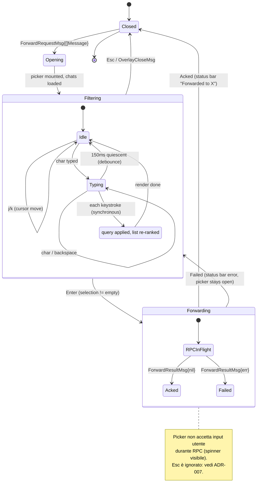

# Forward Picker — Statechart (Step 21)

Modello comportamentale del **forward picker overlay** introdotto nello Step 21
della pipeline. Apre un overlay con fuzzy search sulla lista delle chat; la
selezione inoltra il messaggio via API `messages.forwardMessages`.

**Scope Step 21**: singolo messaggio (il messaggio sotto il cursore).
**Step 22**: batch forward riusa questo stesso overlay con `len(source) > 1`;
header dinamico mostra "Forward N messages to…". Vedi
[`multi-select.md`](multi-select.md) e
[ADR-008](../phase-6-decisions/ADR-008-batch-forward-semantics.md).

## Contesto nello statechart globale

L'overlay è un figlio di `Overlay.ForwardPicker` (vedi
[`ui-statechart.md`](ui-statechart.md), sezione "Overlay State Machine"). È
raggiungibile da:

- `ConversationFocused.BrowsingMessages` — tasto `f` con cursore su un msg
- `MultiSelect` — tasto `f` (Step 22)

## Statechart dell'overlay

## Stati — descrizione

| Stato | Descrizione | Input accettati | Componenti attivi |
|-------|-------------|-----------------|-------------------|
| `Closed` | Overlay non montato | — | — |
| `Opening` | Overlay montato, chat list in caricamento dalla cache locale | — | spinner |
| `Filtering.Idle` | Overlay pronto, nessuna digitazione in corso | `j/k`, char, `Enter`, `Esc` | textinput + lista filtrata |
| `Filtering.Typing` | L'utente sta digitando; lista si re-ranka ad ogni char | char, backspace, `Esc` | textinput + lista filtrata |
| `Forwarding.RPCInFlight` | Richiesta `messages.forwardMessages` in volo | **nessuno** (input bloccato) | spinner "Forwarding..." |
| `Forwarding.Acked` | ACK ricevuto, transitorio prima del close | — | — |
| `Forwarding.Failed` | Errore RPC, torna a Filtering | `j/k`, char, `Enter`, `Esc` | toast + lista |

## Eventi / Messaggi (tipizzati `tea.Msg`)

Estendono la [`message-taxonomy.md`](../phase-1-context/message-taxonomy.md).

| Msg | Origine | Payload | Effetto |
|-----|---------|---------|---------|
| `ForwardRequestMsg` | Conversation (`f` keystroke) | `[]Message` (Step 21 = 1 elemento) | `Closed → Opening` |
| `ForwardPickerReadyMsg` | Cmd (load dialogs from cache) | `[]Chat` | `Opening → Filtering.Idle` |
| `ForwardFilterMsg` | Picker input change | `query string` | Re-rank lista (synchronous, in-memory) |
| `ForwardSubmitMsg` | Picker (`Enter`) | `targetChatID, []Message` | `Filtering → Forwarding.RPCInFlight` |
| `ForwardResultMsg` | Cmd (API result) | `targetChatID, error` | `Forwarding → Closed` or `→ Filtering` |
| `OverlayCloseMsg` | Picker (`Esc`) | — | `Filtering → Closed` (solo se non in Forwarding, vedi ADR-007) |

## Keybindings (Filtering state)

| Tasto | Azione |
|-------|--------|
| char printabile | Append a query → re-rank |
| `Backspace` | Rimuove ultimo char della query → re-rank |
| `j` / `↓` | Cursore lista ++ |
| `k` / `↑` | Cursore lista -- |
| `Enter` | Submit forward alla chat sotto cursore |
| `Esc` | Chiude picker senza forwardare |
| `Tab` | **Ignorato** (overlay modale, no focus rotation) |

## Regole di ranking

Vedi [ADR-006](../phase-6-decisions/ADR-006-forward-fuzzy-algorithm.md) per la
scelta dell'algoritmo. Riassunto comportamentale:

1. Query vuota → lista ordinata come in ChatList (pinned first, recency).
2. Query non vuota → match **case-insensitive** su `Chat.Title` (display name);
   per gruppi/canali include anche `@username` se presente.
3. Score per: *prefix match* (peso alto), *contiguous substring* (medio),
   *subsequence match* (basso). Chat senza match → escluse.
4. Tie-break: recency (più recente prima).
5. Cursore lista torna a **indice 0** ad ogni cambio query.

## Invarianti comportamentali

1. **Modal**: in `Filtering` / `Forwarding`, input non raggiunge mai pannelli
   sottostanti (ChatList/Conversation/Input).
2. **No partial close**: `Esc` durante `Forwarding.RPCInFlight` viene
   **ignorato** (ADR-007). L'utente può annullare la richiesta solo dopo ACK.
3. **Cursor reset on filter**: ogni `ForwardFilterMsg` resetta il cursore a 0.
4. **Empty list safe**: se la query non matcha alcuna chat, `Enter` è no-op
   (rimane in `Filtering.Idle`, no RPC emesso).
5. **Source = snapshot**: il `[]Message` da forwardare è catturato all'apertura
   (`ForwardRequestMsg`). Se nel frattempo arriva un `MessageDeletedMsg` per
   quell'ID, la RPC fallirà lato server → `Failed` → toast, picker resta
   aperto per permettere di riprovare su altra chat.

## Cross-links

- Pipeline step: [`development-pipeline.md` §Step 21](../development-pipeline.md)
- Prior overlays (pattern reuse): edit overlay (Step 19), delete confirm (Step 20)
- Sequence diagram: [`../phase-3-interactions/forward-flow.md`](../phase-3-interactions/forward-flow.md)
- Concurrency: [`../phase-4-concurrency/README.md`](../phase-4-concurrency/README.md) §Forward RPC
- Decisioni: [ADR-006](../phase-6-decisions/ADR-006-forward-fuzzy-algorithm.md),
  [ADR-007](../phase-6-decisions/ADR-007-overlay-in-flight-rpc.md)
