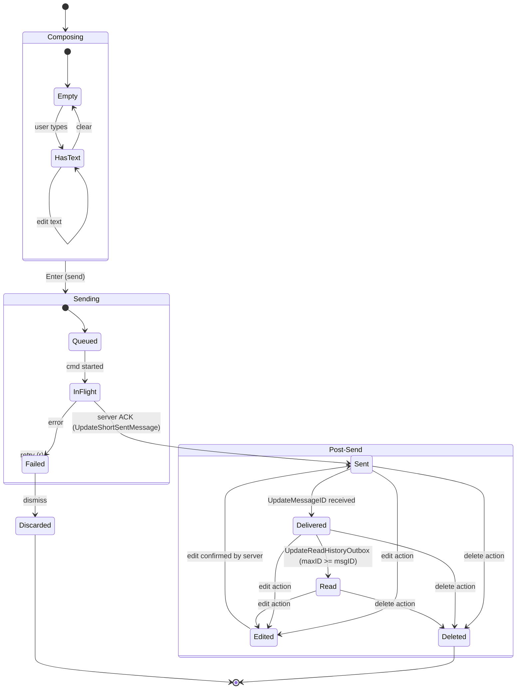
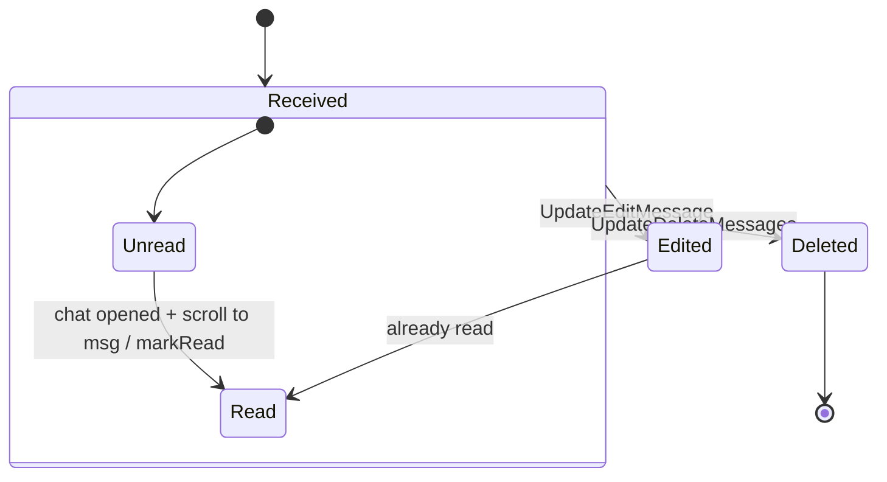
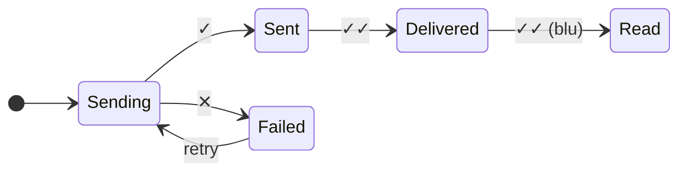
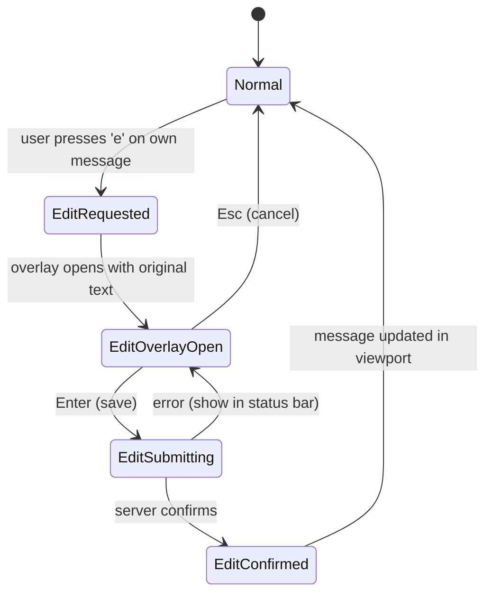
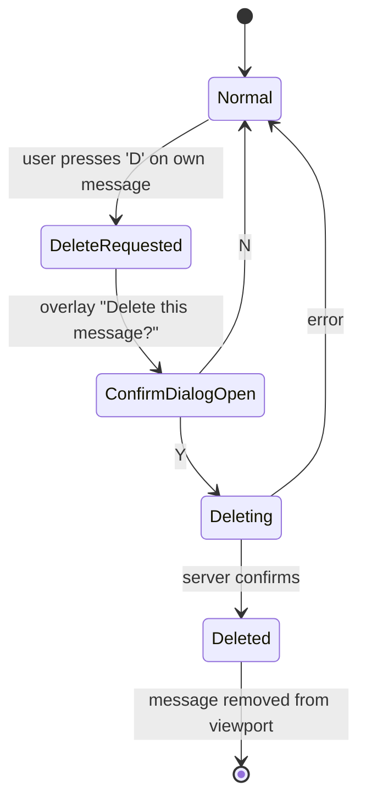
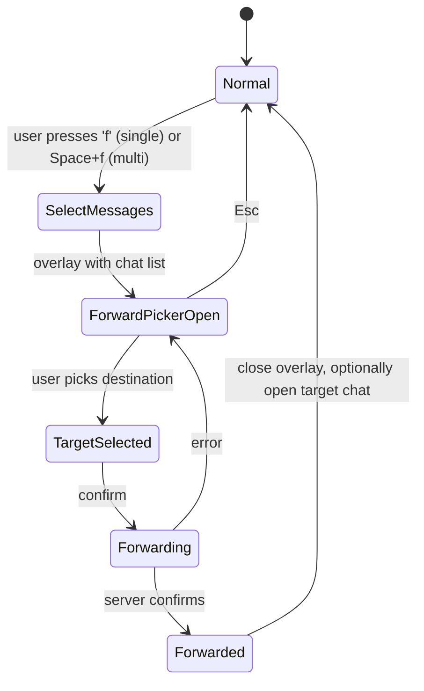
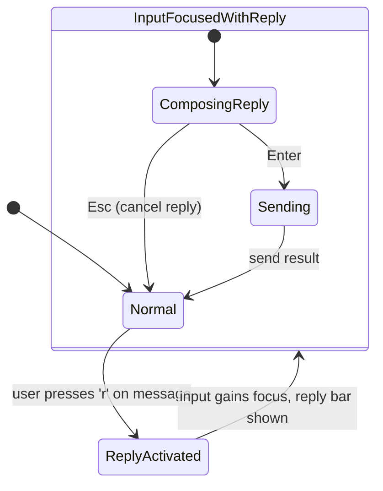
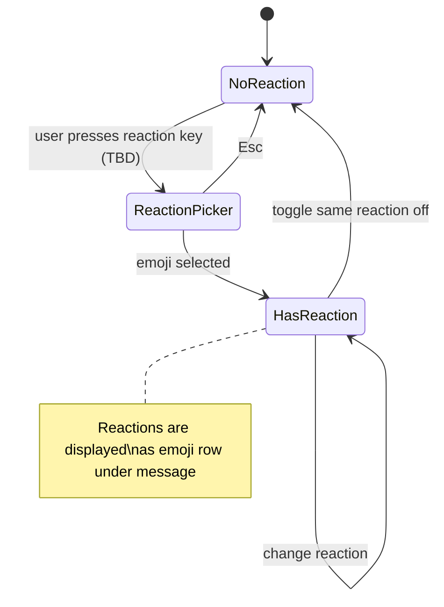

# Message Lifecycle

State machine del ciclo di vita di un messaggio, dalla composizione alla consegna.

## Outgoing Message Lifecycle

## Incoming Message Lifecycle

## Delivery Status Transitions

| Transizione | Trigger | Telegram Update |
|-------------|---------|-----------------|
| → Sending | User presses Enter | (local) |
| Sending → Sent | Server conferma | `UpdateShortSentMessage` o `UpdateNewMessage` (own) |
| Sent → Delivered | Consegnato al peer | `UpdateMessageID` (in alcuni casi) |
| Delivered → Read | Peer apre la chat | `UpdateReadHistoryOutbox{maxID}` |
| Sending → Failed | Errore di rete o API | error da `MessagesSendMessage` |

**Nota**: Telegram non ha un concetto esplicito di "Delivered" per tutti i tipi di chat. Per le chat private, `Sent` e `Delivered` sono spesso lo stesso evento. La distinzione è più rilevante per i gruppi. Nella UI, semplifichiamo: `✓` = server ha ricevuto, `✓✓` = consegnato/letto.

## Message Edit Flow

Vincoli edit:
- Solo messaggi con `IsOutgoing = true`
- Solo messaggi di meno di 48 ore (limitazione Telegram)
- Solo messaggi di testo (non media)
- Il messaggio editato mostra "(edited)" o un indicatore

## Message Delete Flow

Vincoli delete:
- Messaggi propri: sempre cancellabili
- Messaggi altrui: cancellabili solo in chat dove l'utente è admin
- Delete "for everyone" vs "for me" — nella v1 usiamo "for everyone" di default per i propri messaggi

## Message Forward Flow

## Reply Flow

## Reactions Flow

**Nota**: Il meccanismo per aggiungere reazioni (keybinding, picker emoji) è da definire nella v1. La visualizzazione delle reazioni ricevute è già specificata.
