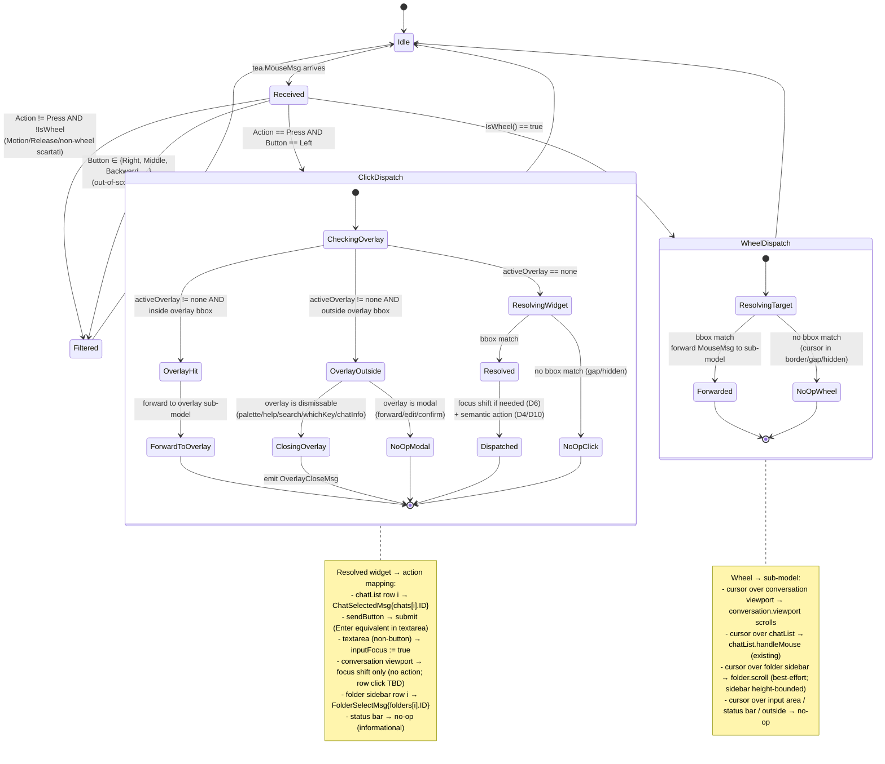

# Mouse Routing — Statechart (Step 32)

Modello comportamentale del **mouse routing** introdotto nello Step 32.
Il root model (`MainModel`) acquisisce un dispatcher centrale
`handleMouseMsg(tea.MouseMsg)` che mappa `(X, Y)` su una **bbox cache**
ricalcolata su eventi di layout, dispatcha al sub-model target, e
applica le invarianti `KEYBOARD_PARITY`, `OVERLAY_FIRST`,
`COMPACT_ONE_PANEL`, `WHEEL_BY_POSITION`.

> **Decisione canonical**: vedi
> [ADR-020](../phase-6-decisions/ADR-020-mouse-support.md) per
> hit-test centrale (D1), bbox cache (D2), wheel-by-cursor (D3),
> click+open atomico (D4), tassonomia overlay dismiss-vs-modal (D5),
> click focus-shift+action (D6), drag deferred (D7), keyboard parity
> (D8), compact no-hidden-click (D9), composer click semantics (D10).

**Scope Step 32 (mouse support)**:

- Wheel events (Button ∈ {WheelUp, WheelDown}): scroll viewport
  (conversation messages) e chat list, by cursor position.
- Click sinistro (Action = Press, Button = Left): chat item → select +
  open; SEND button → submit; textarea → focus shift; pannello
  non-focused → focus + action atomic.
- Click outside dismissable overlay → close (`OverlayCloseMsg`
  equivalente a `Esc`).
- Click outside modal overlay → no-op.
- Eventi non gestiti (Right, Middle, Motion, Release, scroll
  laterale): scartati dal router.

**Fuori scope Step 32**:

- Drag / text selection custom (D7 — deferred).
- Right click / middle click / context menu (out-of-scope D-scope).
- Place cursor interno al textarea (delegato a `bubbles/textarea`,
  no-op in v1.0.0).
- Hover/tooltip (richiede Motion — D7).
- Click su link (Step 33 dedicato).
- Click su SEND con animazione visiva di "press" (out-of-scope; il
  bottone già renderizza in stile `Active`/`disabled` Step 15).

## Contesto nello statechart globale

Il mouse routing non introduce **nuove dimensioni di stato** nel root
model. Tutto si appoggia su stato pre-esistente:

| Dimensione consumata | Range | Source-of-truth | Step intro |
|----------------------|-------|-----------------|------------|
| `width`, `height` | int | `WindowSizeMsg` | Step 1 |
| `layoutMode` | `{Wide, Compact}` | ADR-018 | Step 30 |
| `compactVisible` | `{ChatList, Conversation}` | ADR-018 | Step 30 |
| `activeOverlay` | `{none, palette, info, search, edit, forward, confirm, help, whichKey}` | ADR-015 | Step 26+ |
| `folderSidebarVisible` | `{TRUE, FALSE}` | ADR-016 | Step 29 |
| `activePanel` (focus) | `{ChatList, Conversation, Folders}` | focus cycle | Step 6+ |
| `activeChatID` | `ChatID \| nil` | chatList.selected open | Step 11+ |
| `inputFocus` | bool | conversation.inputFocus | Step 15 |
| `sendBtn.Active` | bool | textarea non-empty | Step 15 |

**Stato nuovo aggiunto dal Step 32**:

| Dimensione | Range | Source-of-truth | Note |
|------------|-------|-----------------|------|
| `bboxes` | `Map[WidgetID, Rect \| nil]` | derivato da `SetSize`/layout events | Privato a `MainModel`; non esposto ai sub-model |

`bboxes` è **derivato** (cache) — non è stato indipendente. Cambia
deterministicamente in funzione dei trigger di invalidazione
elencati in [ADR-020 §D2](../phase-6-decisions/ADR-020-mouse-support.md).

## A. Statechart — Bbox lifecycle

```mermaid
stateDiagram-v2
    [*] --> BboxStale

    BboxStale --> BboxComputed : recomputeBboxes()<br/>(triggered by layout event)
    BboxComputed --> BboxStale : layout event<br/>(WindowSize/LayoutModeChanged/<br/>LayoutPanelSwitch/FolderToggle)

    state BboxComputed {
        [*] --> Ready
        Ready : bboxes map is consistent with current layout<br/>hit-test resolves deterministically
    }

    state BboxStale {
        [*] --> Initial
        Initial : bboxes map nil or invalid<br/>any incoming MouseMsg dropped<br/>(robustness; pre-Update bbox)
    }

    note right of BboxComputed
      Trigger di invalidazione (ADR-020 §D2):
      - tea.WindowSizeMsg
      - LayoutModeChangedMsg
      - LayoutPanelSwitchMsg
      - FolderToggleMsg
      Pattern: ogni handler chiama recomputeBboxes()
      come ultimo step (idempotente).
    end note
```

**Pratica implementativa** (livello modello, non codice): la prima
`tea.WindowSizeMsg` post-mount transita `BboxStale → BboxComputed`.
Tutti i `MouseMsg` ricevuti in `BboxStale` (improbabile in pratica,
perché il primo MouseMsg arriva post-render = post-WindowSizeMsg) sono
no-op. Modellato come invariante `BBOXES_VALID_BEFORE_DISPATCH`.

## B. Statechart — Mouse event dispatch



### Stati — Dispatch

| Stato | Descrizione | Input accettati | Esito |
|-------|-------------|-----------------|-------|
| `Idle` | Nessun MouseMsg in flight (sync model) | `tea.MouseMsg` | → `Received` |
| `Received` | Triage del MouseMsg per Action/Button | — | → `WheelDispatch` / `ClickDispatch` / `Filtered` |
| `WheelDispatch.ResolvingTarget` | Risoluzione bbox per wheel | `bboxes` cache | → `Forwarded` o `NoOpWheel` |
| `WheelDispatch.Forwarded` | MouseMsg forwardato al sub-model owner | — | sub-model scrolla (chatList/viewport/etc.) |
| `ClickDispatch.CheckingOverlay` | Verifica priorità overlay | `activeOverlay`, overlay bbox | → `OverlayHit` / `OverlayOutside` / `ResolvingWidget` |
| `ClickDispatch.OverlayHit` | Click dentro overlay attivo | — | → `ForwardToOverlay` |
| `ClickDispatch.OverlayOutside` | Click fuori da overlay attivo | — | → `ClosingOverlay` (dismissable) o `NoOpModal` |
| `ClickDispatch.ClosingOverlay` | Emette `OverlayCloseMsg` | — | overlay chiusa |
| `ClickDispatch.NoOpModal` | Click ignorato (modal) | — | nessun cambio |
| `ClickDispatch.ResolvingWidget` | Hit-test widget map (no overlay) | `bboxes` | → `Resolved` o `NoOpClick` |
| `ClickDispatch.Resolved` | Widget identificato | — | → `Dispatched` |
| `ClickDispatch.Dispatched` | Focus shift + azione applicata | — | sub-model riceve azione semantica |
| `Filtered` | Evento out-of-scope | — | scartato (no-op) |

### Hit-test resolution algorithm (informal pseudocode)

```
fn resolveClick(x, y, bboxes, activeOverlay):
    // 1. Overlay-first (D5, OVERLAY_FIRST invariant)
    if activeOverlay != none:
        if (x, y) ∈ overlayBbox(activeOverlay):
            return OverlayHit(activeOverlay)
        else:
            if isDismissable(activeOverlay):
                return CloseOverlay(activeOverlay)
            else:
                return NoOpModal

    // 2. Widget hit-test (z-order: conversation sub-widgets first,
    //    then base panels). bboxes are non-overlapping in the base
    //    layer; sendButton ⊂ inputArea ⊂ conversation, hit innermost.
    for widget in [sendButton, inputArea, conversationViewport,
                   conversationHeader, chatList, folderSidebar,
                   statusBar]:
        if bboxes[widget] != nil and (x, y) ∈ bboxes[widget]:
            return Resolved(widget)
    return NoOpClick

fn resolveWheel(x, y, bboxes):
    // Same widget order as click but only wheel-aware widgets
    // matter (conversationViewport, chatList, folderSidebar).
    for widget in [conversationViewport, chatList, folderSidebar]:
        if bboxes[widget] != nil and (x, y) ∈ bboxes[widget]:
            return ForwardWheel(widget)
    return NoOpWheel
```

Half-open intervals: `(x0 ≤ x < x1) ∧ (y0 ≤ y < y1)`. Border between
adjacent panels appartiene al panel a sinistra/sopra (D3 edge case).

## C. Eventi / Messaggi (tipizzati `tea.Msg`)

Estendono [`../phase-1-context/message-taxonomy.md`](../phase-1-context/message-taxonomy.md).

| Msg | Origine | Payload | Effetto |
|-----|---------|---------|---------|
| `tea.MouseMsg` | bubbletea runtime (terminal) | `{X, Y, Action, Button, Shift, Alt, Ctrl}` | Routato da `MainModel.handleMouseMsg`; vedi §B per dispatch tree |

**Nessun nuovo `tea.Msg` interno introdotto da Step 32**. Il dispatcher
del router *riusa* messaggi semantici già esistenti:

| Trigger mouse | Msg interno emesso (già esistente) | Step intro |
|---------------|-------------------------------------|------------|
| Click su chat item (Wide/Compact ShowingChatList) | `ChatSelectedMsg{chatID}` | Step 11 |
| Click su SEND con textarea non-vuota | (path interno `m.appendOptimistic(text)` come Enter; no msg distinto) | Step 15 |
| Click su SEND in edit mode | (path interno `submitEdit()` come Enter) | Step 19 |
| Click su textarea (focus shift) | (path interno `inputFocus := true`; eventuale `LayoutPanelSwitchMsg{Conversation}` in Compact) | Step 15 / Step 30 |
| Click su folder row | `FolderSelectMsg{folderID}` | Step 29 |
| Click outside dismissable overlay | `OverlayCloseMsg` (o variante specifica come `CmdPaletteCloseMsg`/`HelpCloseMsg`/`SearchInChatCloseMsg`/`ChatInfoCloseMsg` — il dispatcher emette quella corretta in base ad `activeOverlay`) | Step 26-29 |
| Wheel up/down su conversation viewport | (path interno `m.viewport.Update(MouseMsg)` di bubbles/viewport) | Step 11 |
| Wheel up/down su chat list | (path interno `chatList.handleMouse` esistente) | pre-Step 32 |
| Wheel up/down su folder sidebar | (path interno `folder.scroll`) | Step 29 |

Razionale "no new msg type": il mouse è un input device, non un event
domain. Tipizzare `MouseClickMsg` distinto da `tea.MouseMsg` aggiungerebbe
indirezione senza valore; il routing semantico è la responsabilità del
router, non del nome del messaggio.

## D. Bindings — Mouse (Step 32)

### Globali (tutti i pannelli, dispatcher centrale)

| Gesto | Mode | Azione | Equivalente keyboard |
|-------|------|--------|----------------------|
| Wheel up | any (cursor over viewport/chatList/folder) | scroll up del widget sotto cursore | `k` / `Ctrl+U` (panel-aware) |
| Wheel down | any (cursor over viewport/chatList/folder) | scroll down del widget sotto cursore | `j` / `Ctrl+D` (panel-aware) |
| Left click | any (cursor over chat item) | `chatList.selected := i; emit ChatSelectedMsg` | `j/k` + `Enter` |
| Left click | any (cursor over SEND, textarea non-empty) | submit (`Enter` equivalent) | `Enter` in textarea |
| Left click | any (cursor over textarea bbox, not SEND) | `inputFocus := true`; in Compact eventualmente switch a Conversation | `i` (input mode) |
| Left click | Wide (cursor over conversation viewport, not in row) | `activePanel := Conversation`; no action | `Tab` to focus |
| Left click | any (cursor over folder row) | `selectedFolderID := folderID; emit FolderSelectMsg` | `j/k` in sidebar + `Enter` |
| Left click | any (cursor outside any widget bbox) | no-op | — |
| Left click | any (overlay attivo, cursor inside overlay bbox) | forward al sub-model overlay | (vari) |
| Left click | any (overlay attivo dismissable, cursor outside) | emit `OverlayCloseMsg` corretto | `Esc` |
| Left click | any (overlay attivo modal: forward/edit/confirm, cursor outside) | no-op | — |
| Right/Middle click | any | scartato | — (no equivalent) |
| Motion/Release | any | scartato | — (D7) |

### Compact mode — interazioni specifiche

| Gesto | `compactVisible` | Effetto |
|-------|------------------|---------|
| Wheel sopra pannello visibile | `ChatList` | `chatList` scrolla |
| Wheel sopra pannello visibile | `Conversation` | viewport conversation scrolla |
| Wheel "sopra" pannello hidden | (any) | bbox `nil` ⇒ no-op |
| Click su chat row | `ChatList` | open chat + `compactVisible := Conversation` (atomic, ADR-018 §D4 / scenario 5 di `responsive-layout.md`) |
| Click su SEND | `Conversation` | submit |
| Click su textarea | `Conversation` | `inputFocus := true` |
| Click in regione "non visibile" (corrisponde a pannello hidden) | (any) | no-op (D9 NO_HIDDEN_CLICK) |

## E. Modello dati associato

```
type Rect = (x0, y0, x1, y1 int)   // half-open: x0 ≤ x < x1

type WidgetID = ChatList | ConversationViewport | ConversationHeader |
                InputArea | SendButton |
                FolderSidebar | StatusBar |
                OverlayForeground

type Bboxes = Map[WidgetID, Rect | nil]

MainModel ::= {
    ...                                // pre-existing fields
    bboxes : Bboxes                    // private cache (ADR-020 §D2)
}

// Trigger handlers all ultimately call:
func recomputeBboxes(m *MainModel):
    if m.layoutMode == LayoutCompact:
        recomputeBboxesCompact(m)
    else:
        recomputeBboxesWide(m)
    // overlay bbox derived from activeOverlay (Modal primitive provides)

func recomputeBboxesWide(m *MainModel):
    // Mirror of setWideSize; populates bboxes for visible widgets:
    // folderSidebar (if visible), chatList, conversationViewport,
    // conversationHeader, inputArea (with sendButton sub-rect),
    // statusBar. Hidden widgets get nil.
    ...

func recomputeBboxesCompact(m *MainModel):
    // Mirror of applyCompactSizes; populates bboxes only for the
    // single visible panel (compactVisible) + statusBar. The hidden
    // panel's bbox is set to nil (NO_HIDDEN_CLICK invariant).
    ...

func resolveClick(m *MainModel, x, y int) ClickTarget:
    if m.activeOverlay != none:
        if inside(m.bboxes[OverlayForeground], x, y):
            return OverlayHit{m.activeOverlay}
        else:
            if isDismissable(m.activeOverlay):
                return CloseOverlay{m.activeOverlay}
            return NoOpModal
    for w in [SendButton, InputArea, ConversationViewport,
              ConversationHeader, ChatList, FolderSidebar, StatusBar]:
        if m.bboxes[w] != nil && inside(m.bboxes[w], x, y):
            return Resolved{w}
    return NoOpClick

func dismissable(o Overlay) bool:
    return o ∈ {palette, help, whichKey, search, chatInfo, searchInChat}
    // forward, edit, confirm are MODAL → not dismissable (ADR-020 §D5)
```

## F. Invarianti comportamentali

1. **`KEYBOARD_PARITY`**: per ogni gesto mouse `g` definito in §D
   esiste un keystroke `k` tale che `effect(g) ⊆ effect(k)`. Step 32
   non aggiunge feature mouse-only.
2. **`BBOX_TOTAL`**: per ogni `MouseMsg` con `Action = Press`, la
   funzione `resolveClick(m, x, y)` ritorna **esattamente uno** tra:
   `OverlayHit`, `CloseOverlay`, `NoOpModal`, `Resolved{w}`, `NoOpClick`.
   Mai due widget assieme (bbox della base layer non si overlappano;
   `sendButton ⊂ inputArea` risolto con z-order: il sub-rect viene
   testato prima).
3. **`NO_HIDDEN_CLICK`**: in `layoutMode = Compact`, per ogni widget
   `w` non in `compactVisible`, `bboxes[w] = nil`. Conseguenza:
   `resolveClick` mai produce `Resolved{w}` per `w` hidden.
4. **`OVERLAY_FIRST`**: se `activeOverlay != none`, il click
   resolution **non** raggiunge mai i widget della base layer; la
   risoluzione si conclude in `OverlayHit` / `CloseOverlay` /
   `NoOpModal`.
5. **`WHEEL_BY_POSITION`**: `resolveWheel(x, y)` non consulta mai
   `activePanel`; il routing dipende solo dalla bbox cache e da
   `(x, y)`.
6. **`CLICK_FOCUS_SHIFT`**: ogni `Resolved{w}` con `w` appartenente
   a un panel diverso da `activePanel` aggiorna `activePanel`
   **prima** di applicare l'azione semantica (D6). Single transaction
   nello stesso `Update` cycle.
7. **`NO_PHANTOM_DRAG`**: per ogni `MouseMsg` con `Action ∈ {Motion,
   Release}`, lo stato del modello dopo `handleMouseMsg` è uguale a
   prima (no mutazione). Modellato come pure no-op.
8. **`BBOXES_VALID_BEFORE_DISPATCH`**: ogni `MouseMsg` consumato dal
   router **dopo** la prima `tea.WindowSizeMsg` post-mount trova
   `bboxes` consistenti con il render corrente. (Pre-mount o pre-resize:
   `bboxes` può essere "stale" → router cade in NoOpClick/NoOpWheel
   silenziosamente.)
9. **`DISMISSABLE_OUTSIDE_CLOSES`**: per ogni `Overlay o` ∈ `{palette,
   help, whichKey, search, chatInfo, searchInChat}`, click outside
   con `activeOverlay = o` emette il `*CloseMsg` corretto. Modal
   overlays (forward, edit, confirm): no-op.
10. **`SENDBUTTON_INACTIVE_NO_OP`**: click su `sendButton` con
    `sendBtn.Active = false` (textarea vuota) è no-op (coerente con
    il visual disabled state).
11. **`MOUSE_NEVER_FLIPS_LAYOUTMODE`**: nessun `MouseMsg` muta
    `layoutMode`. L'unico trigger di flip Wide↔Compact resta
    `WindowSizeMsg` (eredita ADR-018 §D2 `THRESHOLD_DETERMINISTIC`).
12. **`MOUSE_NEVER_OPENS_OVERLAY`**: nessun `MouseMsg` apre un
    overlay nuovo (Step 32 non aggiunge bottoni "open palette" /
    "open help" cliccabili). Gli overlay si aprono solo via
    keystroke (Step 26-29) — il mouse li chiude (D5) o ci interagisce
    dentro (forward al sub-model).

**Note**: `KEYBOARD_PARITY`, `BBOX_TOTAL`, `OVERLAY_FIRST`,
`NO_PHANTOM_DRAG`, `MOUSE_NEVER_FLIPS_LAYOUTMODE` sono **structurally
true** (garantite dalla shape del dispatcher); non richiedono spec
TLA+ per essere verificate (ADR-020 §"Note su TLA+").

## G. Loading / Empty / Error states — render & mouse

Mouse routing non altera il render dei pannelli; consume eventi senza
emettere visual feedback proprio (no hover, no press animation in Step
32 — D7). Il visual feedback deriva dalle azioni semantiche emesse:

| Stato pre-click | Click target | Visual change |
|-----------------|--------------|---------------|
| Chat list con cursor su chat A | chat row B | cursor moves to B + chat B opens (= keyboard `j..jEnter`) |
| Conversation aperta, focus = ChatList | SEND button | focus shift to Conversation + textarea focus + (no submit if empty) |
| Conversation aperta, focus = ChatList | textarea | focus shift + textarea Focus (visual: caret appears) |
| Wheel down su conversation viewport | — | viewport scrolls (`bubbles/viewport` re-render) |
| Wheel up su chatList | — | `chatList.selected -= 1` + scroll if needed |
| activeOverlay = palette | click outside palette | overlay closes (palette disappears) |
| activeOverlay = forwardPicker | click outside picker | nessun visual change (modal) |

Errori: nessuno (mouse handling è fail-soft: ogni MouseMsg che non
matcha è no-op silenzioso).

## H. Interazione con altri sub-state ortogonali

### Layout responsive (Step 30, ADR-018)

| `layoutMode` | Mouse behavior |
|--------------|----------------|
| Wide | Tutti i widget visibili hanno bbox; click qualsiasi panel = focus shift + action |
| Compact | Solo `compactVisible` panel ha bbox; altri = `nil` (NO_HIDDEN_CLICK) |
| Cross-threshold (Wide ↔ Compact) | Recompute bbox come parte di `applyCrossThreshold`; nessun MouseMsg pending — bubbletea serializza |

### Overlay mutex (Step 28, ADR-015)

| `activeOverlay` | Click outside | Click inside |
|-----------------|---------------|--------------|
| `none` | normale hit-test base layer | (n/a) |
| `cmdPalette`, `help`, `whichKey`, `search`, `chatInfo`, `searchInChat` | emit corresponding `*CloseMsg` | forward al sub-model (in Step 32 quasi tutti no-op interno; vedi tabella sotto) |
| `forward`, `edit`, `confirm` | no-op (modal) | forward al sub-model (nessuna mouse handling interna in Step 32) |

**Forward al sub-model**: lo Step 32 non aggiunge mouse handling
**dentro** ai sub-model degli overlay (es. click su un'opzione del
forward picker, click su una row del help). La maggior parte sarà
**no-op internamente** in Step 32 (keyboard è la sorgente). Future
step possono aggiungere mouse interno con extension.

### Folder sidebar (Step 29, ADR-016)

- Wide: `folderSidebar` ha bbox quando `folderSidebarVisible = TRUE`.
- Compact: `folderSidebar` non visibile → bbox `nil` (coerente con
  ADR-016 §D5).
- Click su folder row: emette `FolderSelectMsg{folderID}`,
  equivalente di Enter su `folders[folderCursor]`.

### Multi-select (Step 22)

`S ≠ ∅` (selection set) è ortogonale al mouse routing. In Step 32 non
si introducono click-toggle su messaggi singoli (che sarebbe
equivalente a `Space` keyboard); il viewport conversation è
scroll-only via mouse, no row-click in Step 32. **Future step** può
aggiungere click su row per toggle (richiede ADR e statechart
extension).

### In-flight RPC (Step 24, ADR-007)

Click outside `forwardPicker` durante RPC in volo = **no-op** (modal,
D5). Coerente con ADR-007 che richiede gesture esplicita (Esc) per
cancel. Click inside picker durante in-flight: forward al picker,
che già gestisce in modo defensive (Step 32 non aggiunge mouse
interno al picker — keyboard-only).

### Search in chat (Step 27, ADR-014, inline bar)

`searchInChat.active = TRUE`: la barra inline non è un overlay
(`activeOverlay` resta a quel che era). Click outside la barra
inline (es. su un messaggio sopra) = focus shift al pannello
conversation viewport (D6) ma **non** chiude la barra inline (la
barra è sub-state, non overlay). Esc keyboard chiude la barra
(`SearchInChatCloseMsg`). Decisione: coerente con ADR-014 (la barra
inline ha lifecycle indipendente dagli overlay).

### Hot-reload theme (Step 31, ADR-019)

`ThemeChangedMsg` non muta `bboxes` (i colori cambiano, le dimensioni
no). Re-render forzato via fanout `WindowSizeMsg{prevW, prevH}` (Step
31): questo **trigger di per sé invalida le bbox** (D2), che vengono
ricalcolate identiche. Idempotente.

## I. Layout impact (cross-ref `tui-design.md`)

Mouse routing è **invisibile** nel render (Step 32 non aggiunge
elementi visivi; nessun cursor highlight, nessun hover). I pannelli
appaiono identici a Step 31. La feature è puramente input-side.

```
┌─ folders ─┬─ chatlist ────────┬─ conversation ───────────────────┐
│           │ ╭───────────────╮ │ ╭──────────────────────╮         │
│           │ │ ●● John Doe   │ │ │ messages...          │         │
│           │ ╰───────────────╯ │ ╰──────────────────────╯         │
│           │  ↑ click → opens  │  ↑ wheel → scrolls               │
│           │                   ├──────────────────────────────────┤
│           │                   │ message█           ╭────╮         │
│           │                   │ ↑ click → focus    │SEND│ ← click │
│           │                   │                    ╰────╯  → send │
└───────────┴───────────────────┴──────────────────────────────────┘
 j/k nav │ Tab focus │ ? help                                       
```

(Annotazioni `↑` sono solo per documentazione — non renderizzate.)

## Cross-links

- Pipeline step: [`../development-pipeline.md` §Step 32](../development-pipeline.md)
- Sequence diagrams: [`../phase-3-interactions/mouse-routing-flow.md`](../phase-3-interactions/mouse-routing-flow.md)
- Decisione (hit-test, bbox, wheel, click, overlay, drag, parity, compact, composer): [ADR-020](../phase-6-decisions/ADR-020-mouse-support.md)
- Ereditato da: [ADR-015 §D3](../phase-6-decisions/ADR-015-command-palette-whichkey-help.md) (overlay mutex), [ADR-016 §D5](../phase-6-decisions/ADR-016-folder-source-and-filtering.md) (sidebar in compact), [ADR-018 §D2/§D4](../phase-6-decisions/ADR-018-responsive-layout-threshold-and-tab.md) (`COMPACT_ONE_PANEL`, cross-threshold trigger), [ADR-007](../phase-6-decisions/ADR-007-overlay-in-flight-rpc.md) (forwardPicker modal)
- Domain types: nessun nuovo dominio (Step 32 è UI-only); `WidgetID`, `Rect`, `Bboxes` sono UI-internal helper types
- TLA+ skip giustificato: [ADR-020 §"Note su TLA+"](../phase-6-decisions/ADR-020-mouse-support.md)
- Tui design canonical: [`../tui-design.md`](../tui-design.md) §"Mouse Support"
- Statechart globale: [`ui-statechart.md`](ui-statechart.md) (esteso implicitamente — il mouse routing non aggiunge stati top-level, riusa `activeOverlay`/`activePanel`/`layoutMode`)
