# Multi-Select Mode — Statechart (Step 22)

Modello comportamentale della **modalità multi-selezione** introdotta nello
Step 22 della pipeline. Estende `ConversationFocused` con un set di selezione
ortogonale al cursore, abilitando azioni batch (forward, delete) che riusano
gli overlay già esistenti (Step 20, Step 21).

## Scope

- Cursore visibile sempre attivo in `ConversationFocused` (già introdotto a
  Step 18 per reply, Step 19 per edit, Step 20 per delete, Step 21 per
  forward).
- **Set di selezione `S`** (insieme di `MessageID`), inizialmente vuoto.
- Modalità:
  - `BrowsingMessages`: cursore presente, `S = ∅`.
  - `MultiSelect`: cursore presente, `S ≠ ∅`. Header info bar visibile.
- Azioni batch: `f` (forward dei selezionati), `D` (delete dei selezionati).
- Cancellazione: `Esc` clear di `S`, ritorno a `BrowsingMessages` (se in
  `MultiSelect`); altrimenti delega al focus state machine.

**Fuori scope Step 22**:
- Range select (`v` visual mode, `V` block) — eventuale step futuro.
- Mixed selection cross-chat — la selezione è confinata alla conversazione
  attiva e si reset all'apertura di un'altra chat.

## Contesto nello statechart globale

Vedi [`ui-statechart.md`](ui-statechart.md), sezione "Multi-Select Mode".
Questa specifica raffina e formalizza quel diagramma.

## Statechart di `ConversationFocused`

```mermaid
stateDiagram-v2
    [*] --> BrowsingMessages

    state BrowsingMessages {
        [*] --> CursorOnly
        CursorOnly --> CursorOnly : j / k (cursor move)
        CursorOnly --> CursorOnly : r (reply, single msg)
        CursorOnly --> CursorOnly : e (edit, single own msg)
    }

    BrowsingMessages --> MultiSelect : Space (S := {cursor.id})

    state MultiSelect {
        [*] --> Selecting
        Selecting --> Selecting : j / k (cursor move; S unchanged)
        Selecting --> Selecting : Space (toggle S ⊕ cursor.id, |S| > 0)
        Selecting --> ForwardPicker : f (open picker with S)
        Selecting --> ConfirmDelete : D (open confirm with |S|)
        Selecting --> Selecting : r / e (no-op; status bar hint)

        state ForwardPicker {
            [*] --> Filtering
            Filtering --> RPCInFlight : Enter (target chosen)
            RPCInFlight --> Done : ForwardResultMsg{ok}
            RPCInFlight --> Filtering : ForwardResultMsg{err}
            Filtering --> Cancelled : Esc
        }

        state ConfirmDelete {
            [*] --> AwaitingY_N
            AwaitingY_N --> RPCDelete : Y
            AwaitingY_N --> Cancelled : N / Esc
            RPCDelete --> Done : DeleteResultMsg{ok}
            RPCDelete --> AwaitingY_N : DeleteResultMsg{err}
        }

        ForwardPicker --> Selecting : Cancelled (S preserved)
        ForwardPicker --> [*] : Done (S := ∅)
        ConfirmDelete --> Selecting : Cancelled (S preserved)
        ConfirmDelete --> [*] : Done (S := ∅)
    }

    MultiSelect --> BrowsingMessages : Esc (S := ∅)
    MultiSelect --> BrowsingMessages : completed batch action

    note right of MultiSelect
      Space toggle:
      - cursor.id ∈ S  → S := S \ {cursor.id}
      - cursor.id ∉ S  → S := S ∪ {cursor.id}
      Se dopo toggle |S|=0 → torna a BrowsingMessages.
    end note
```



## Stati — descrizione

| Stato | Descrizione | `S` | Header info bar |
|-------|-------------|-----|-----------------|
| `BrowsingMessages.CursorOnly` | Cursore presente, nessuna selezione | `∅` | nascosta |
| `MultiSelect.Selecting` | Cursore presente, selezione non vuota, in attesa di ulteriore input | `≠ ∅` | `N selected | f forward | D delete | Esc cancel` |
| `MultiSelect.ForwardPicker.*` | Picker aperto in modalità batch (riusa Step 21) | snapshot di `S` al momento dell'apertura | nascosta dietro picker |
| `MultiSelect.ConfirmDelete.*` | Confirm dialog aperto (riusa Step 20) | snapshot di `S` al momento dell'apertura | dietro overlay |

## Transizioni — semantica esatta

| Tasto | In `BrowsingMessages` | In `MultiSelect.Selecting` |
|-------|------------------------|-----------------------------|
| `j` / `↓` | cursor++ | cursor++ (S invariato) |
| `k` / `↑` | cursor-- | cursor-- (S invariato) |
| `Space` | `S := {cursor.id}` → MultiSelect | toggle `cursor.id` in `S`; se `|S|=0` → BrowsingMessages |
| `r` | reply mode (Step 18) | **no-op** + status hint "reply not allowed in multi-select" |
| `e` | edit overlay (Step 19, solo su msg propri) | **no-op** + status hint |
| `f` | forward picker su `{cursor.id}` (Step 21 fallback) | forward picker su `S` (batch) |
| `D` | confirm dialog su `{cursor.id}` (Step 20 fallback) | confirm dialog su `S` (batch, "Delete N messages?") |
| `Esc` | delega a focus state machine (`h`/`Esc` → ChatList) | `S := ∅` → BrowsingMessages |
| `y` | yank (riservato, fuori scope Step 22) | yank di `S` (riservato) |

### Fallback su cursore (f / D senza selezione)

Quando l'utente preme `f` o `D` in `BrowsingMessages` (selezione vuota),
l'azione opera sul **messaggio sotto il cursore**, mantenendo la UX dei
single-msg flow di Step 20/21. Questo evita un branching dell'esperienza
utente: i tasti hanno sempre lo stesso significato semantico ("agisci su
quello che è 'attivo': la selezione, oppure il cursore se selezione vuota").

Vedi [ADR-008](../phase-6-decisions/ADR-008-batch-forward-semantics.md) per
la motivazione formale del riuso del picker single-target.

## Eventi / Messaggi (tipizzati `tea.Msg`)

Estendono [`message-taxonomy.md`](../phase-1-context/message-taxonomy.md).

| Msg | Origine | Payload | Effetto |
|-----|---------|---------|---------|
| `SelectToggleMsg` | Conversation (`Space`) | `MessageID` | Toggle in `S`; se `S` passa da `∅` a `≠∅` → enter MultiSelect |
| `SelectClearMsg` | Conversation (`Esc` in MultiSelect) | — | `S := ∅` → exit MultiSelect |
| `ForwardRequestMsg` | Conversation (`f`) | `[]Message` (= `S`, oppure `{cursor}` se `S=∅`) | Apre forward picker (Step 21) con N messaggi |
| `DeleteRequestMsg` | Conversation (`D`) | `[]Message` (= `S`, oppure `{cursor}` se `S=∅`) | Apre confirm dialog (Step 20) con N messaggi |
| `BatchActionDoneMsg` | App.Update (post `ForwardResultMsg{ok}` / `DeleteResultMsg{ok}`) | — | `S := ∅`, exit MultiSelect |

`ForwardRequestMsg` e `DeleteRequestMsg` esistono già dallo Step 20/21 con
payload `[]Message`; il Step 22 non aggiunge nuovi tipi, solo nuove origini
(da MultiSelect oltre che da BrowsingMessages).

`SelectToggleMsg` è già in taxonomy. `SelectClearMsg` e `BatchActionDoneMsg`
sono nuovi.

## Invarianti comportamentali

1. **Selection scope**: `S` è confinato alla **conversazione corrente**.
   Un `ChatSelectedMsg` (apertura di altra chat) → `S := ∅`.
2. **Selection consistency**: dopo `Space`, `cursor.id ∈ S` se prima non lo
   era, oppure `cursor.id ∉ S` se prima lo era. Mai entrambi.
3. **Mode coherence**: `MultiSelect` ⇔ `S ≠ ∅`. Le due condizioni sono
   sempre equivalenti; non esiste stato di MultiSelect con `S = ∅`.
4. **Source snapshot at action**: quando `f` o `D` apre l'overlay, una
   **copia immutabile di `S`** è passata al picker / confirm. Eventuali
   `MessageDeletedMsg` arrivati durante l'overlay non mutano lo snapshot;
   l'RPC fallirà parzialmente lato server e mostrerà il messaggio
   d'errore (vedi `multi_select.tla` invariante `SOURCE_SNAPSHOT`).
5. **Single-action exclusivity**: non si possono avere due overlay batch
   simultaneamente. `f` o `D` mentre un overlay è già aperto → tasto
   intercettato dall'overlay (modalità modale, vedi
   [forward-picker.md](forward-picker.md) §Invarianti).
6. **No reply/edit in MultiSelect**: `r` e `e` sono no-op con status hint;
   non possono essere applicati a un set (semantica intrinsecamente
   single-message). L'utente deve premere `Esc` per uscire da MultiSelect
   prima di usarli.
7. **Esc semantics**: `Esc` in `MultiSelect` clear della selezione (mai
   chiude la conversazione). `Esc` in `BrowsingMessages` (S=∅) delega al
   focus state machine (vai a ChatList).
8. **Cursor preservation across batch**: dopo `BatchActionDoneMsg`, il
   cursore resta sull'ultimo msg evidenziato (o sul primo successivo se
   il msg sotto il cursore è stato cancellato). Coerenza con la UX del
   single-msg delete (Step 20).

## Keybindings — riepilogo

```
BrowsingMessages (S=∅):
  j k          cursore
  Space        seleziona (entra in MultiSelect)
  r            reply (single)
  e            edit (single, msg propri)
  f            forward picker (single, sotto cursore)
  D            delete confirm (single, sotto cursore)
  Esc / h      torna a ChatList

MultiSelect (S≠∅):
  j k          cursore (selezione invariata)
  Space        toggle msg sotto cursore
  f            forward picker (batch S)
  D            delete confirm (batch S)
  r e          no-op + hint
  Esc          clear selezione → BrowsingMessages
```

## UI components attivi

| Componente | BrowsingMessages | MultiSelect |
|-----------|:---:|:---:|
| Cursore (highlight bg riga) | si | si |
| Checkbox `[ ]` / `[✓]` accanto alla bubble | no | si (per ogni msg, `[✓]` se ∈ S) |
| Info bar header (sopra viewport o sotto status bar) | nascosta | visibile: `N selected | f forward | D delete | Esc cancel` |
| Status bar shortcuts | shortcut full | shortcut limitati a multi-select |

Layout dettagli in [`tui-design.md` §Conversation panel](../tui-design.md).

## Cross-links

- Pipeline step: [`development-pipeline.md` §Step 22](../development-pipeline.md)
- Forward picker (riuso): [`forward-picker.md`](forward-picker.md)
- Delete confirm (riuso): pattern Step 20 (overlay confirm Y/N)
- Edit overlay (escluso da MultiSelect): pattern Step 19
- Sequence diagrams: [`../phase-3-interactions/multi-select-flow.md`](../phase-3-interactions/multi-select-flow.md)
- Concurrency invariants: [`../phase-4-concurrency/multi_select.tla`](../phase-4-concurrency/multi_select.tla)
- Decisioni: [ADR-008](../phase-6-decisions/ADR-008-batch-forward-semantics.md),
  [ADR-009](../phase-6-decisions/ADR-009-batch-delete-confirm.md)
- Eredità ADR: [ADR-007](../phase-6-decisions/ADR-007-overlay-in-flight-rpc.md) (Esc bloccato durante RPC, eredita per batch)
