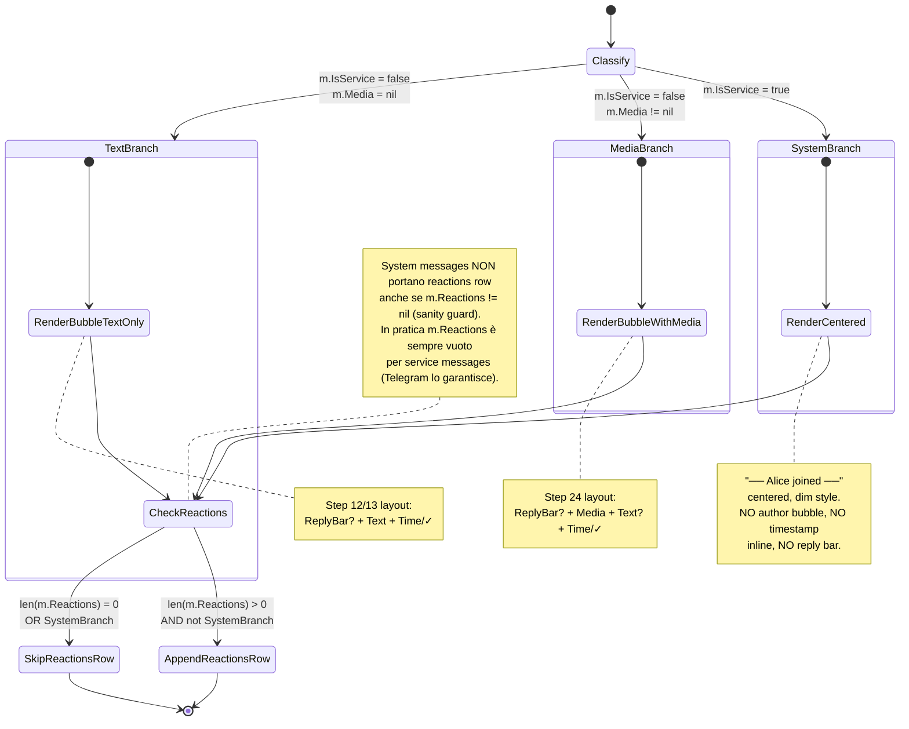
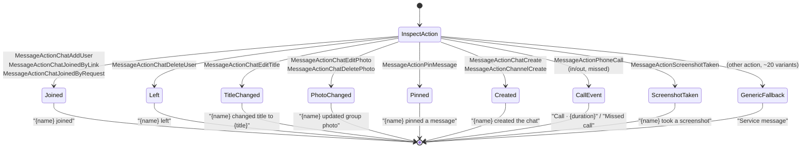

# Reactions & System Messages — Rendering Branch (Step 25)

Modello comportamentale del **rendering reazioni** e dei **system messages**
introdotti nello Step 25. Il messaggio di dominio acquisisce una
classificazione esplicita `MessageKind` (text | media | system) che
determina il **branch di rendering** nel viewport della conversazione, e
una nuova riga finale per le reazioni quando presenti.

**Scope Step 25**:
- Render reazioni sotto il bubble: `👍 3  ❤️ 2  😂 1`.
- Render system messages centrati e dimmati: `── Alice joined ──`.
- Gestione `UpdateMessageReactions` per refresh live dei contatori.
- Discriminazione totale `MessageKind` con dispatch esplicito a render.

**Fuori scope Step 25** (rimandati a step futuri):
- **Aggiunta / rimozione reazioni** via tastiera (no `+`, no `r2` — solo
  consumo passivo).
- Picker emoji per scegliere la reazione.
- Reazioni custom / animated emoji (`tg.ReactionCustomEmoji`).
- Lista nominativa di chi ha reagito (long-press style preview).
- System messages estesi: solo i kind più comuni sono mappati a
  `ServiceText`; varianti rare (call ended, gift, etc.) ottengono
  fallback testuale generico (vedi §System Message Classification).

## Posizione nello statechart globale

Lo Step 25 **non aggiunge stati UI**: il typing indicator (Step 23) e la
multi-select (Step 22) restano gli unici layer ortogonali. Reactions e
system messages sono **puramente di rendering**: derivano da dati di
dominio (`Message.Reactions`, `Message.IsService`) e non introducono
nuove macchine a stati interattive.

L'unica "macchina" che modelliamo qui è il **dispatch di rendering** del
bubble in funzione di `MessageKind`, analogo al decision tree del media
dispatch (Step 24, `media-rendering.md`).

## MessageKind — classifier

`MessageKind` è un'enumerazione **derivata** dai campi del `domain.Message`
(non un campo nuovo). La derivazione è totale e deterministica:

```
kind(m) =
    | "system"  if m.IsService                       (priorità 1)
    | "media"   else if m.Media != nil               (priorità 2)
    | "text"    altrimenti                           (priorità 3)
```

Razionale dell'ordine:

1. **System ha precedenza assoluta**: un `tg.MessageService` non porta mai
   media né testo libero — porta `MessageAction*`. Anche se in domain un
   service message avesse `Text` non vuoto (caso di `ServiceText`
   pre-formattato), resta system: il render centrato è l'unico
   appropriato.
2. **Media prima di text**: un messaggio con caption (text + media) è
   classificato `media`; il render Step 24 mostra già media + text
   nello stesso bubble. La classificazione non rimuove il testo: solo
   instrada al rendering compounded del Step 24.
3. **Text default**: ogni `tg.Message` ordinario senza media e non-service
   ricade qui.

## Statechart — rendering branch



## Stati — descrizione

| Stato | Render | Note |
|-------|--------|------|
| `SystemBranch.RenderCentered` | Linea singola centrata, dim/grigio, formato `── {ServiceText} ──` | Niente bubble, niente author, niente delivery receipt. La data del giorno è coperta dal date separator (Step 13) se cambia. |
| `MediaBranch.RenderBubbleWithMedia` | Bubble con media inline (Step 24) | Reactions row sotto se presenti |
| `TextBranch.RenderBubbleTextOnly` | Bubble standard (Step 12/13) | Reactions row sotto se presenti |
| `AppendReactionsRow` | Riga `👍 3  ❤️ 2  😂 1` sotto al bubble | Allineata al bubble (incoming sx / outgoing dx). Vedi §Render dettagli. |
| `SkipReactionsRow` | Nulla | Bubble termina come al solito |

## Transizioni — semantica esatta

| Trigger | Stato sorgente | Effetto |
|---------|----------------|---------|
| `NewMessageMsg{m}` con `m.IsService = true` | nessuno (bootstrap) | Append + render via `SystemBranch` |
| `NewMessageMsg{m}` con `m.Media != nil` | nessuno | Append + render via `MediaBranch` (Step 24 path) |
| `NewMessageMsg{m}` ordinario | nessuno | Append + render via `TextBranch` |
| `MessagesLoadedMsg{[]m}` | bootstrap chat | Per ogni `m`: classifica + render come sopra |
| `ReactionsUpdatedMsg{chatID, msgID, reactions}` | bubble esistente non-system | `m.Reactions := reactions`; re-render del bubble (preserva grouping/timestamp) |
| `ReactionsUpdatedMsg{...}` su system message | (per sanity) | **No-op** sul rendering: i system message non mostrano reactions row anche se per qualche motivo arriva un update (vedi `reactions.tla` invariante `SYSTEM_NO_REACT`) |
| `MessageEditedMsg{m}` | system message | **No-op**: i service message sono **immutabili** (vedi `reactions.tla` invariante `SYSTEM_IMMUTABLE`) |
| `MessageDeletedMsg{[ids]}` | qualunque | Rimozione standard (Step 20) — anche i system message possono essere cancellati |

## System Message Classification — sotto-tree

I `tg.MessageService` portano un campo `Action tg.MessageActionClass` con
~30 varianti MTProto. In Step 25 mappiamo a `ServiceText` testo
pre-formattato per i kind più comuni:



Razionale fallback generico: il kind delle azioni MTProto evolve nel
tempo (nuove varianti aggiunte da Telegram). Un fallback `Service
message` evita panic e mantiene la **totalità** della classificazione.

## Reactions — modello dati

Il dominio già definisce in
[`../phase-5-data/domain-types.md`](../phase-5-data/domain-types.md):

```go
type Reaction struct {
    Emoji      string
    Count      int
    ChosenByMe bool
}

// Message.Reactions []Reaction
```

**Decisione di shape** (slice vs map): adottiamo **slice ordinato per
count desc, emoji asc come tie-breaker**. Razionale formale e
alternative considerate in
[ADR-012](../phase-6-decisions/ADR-012-reactions-storage-and-system-detection.md).

In sintesi:

- Slice preserva l'ordinamento di rendering (Telegram desktop ordina per
  count decrescente).
- Slice è iterabile direttamente in `View()` senza step intermedio di
  sort.
- `ChosenByMe` è un flag per emoji, non un singolo campo a livello
  message: l'utente potrebbe in futuro reagire con più emoji distinti
  alla stessa nota.
- Map `[string]int` perderebbe l'ordering e richiederebbe un secondo
  campo per `chosenByMe` set.

## Render UI — dettagli

### Reactions row sotto al bubble (text / media)

```
Incoming (allineato a sinistra):

  ╭─ Alice ─────────────────────╮
  │ Hello world                  │
  │              12:34           │
  ╰──────────────────────────────╯
   👍 3  ❤️ 2  😂 1                ← reactions row (sotto bubble, dim)

Outgoing (allineato a destra):

                 ╭────────── You ─╮
                 │ Hi there!       │
                 │ 12:35       ✓✓ │
                 ╰─────────────────╯
                       👍 5  🔥 1   ← reactions row (sotto bubble, dim)
```

Spec:

- Sfondo dim (`AccentDim` token), foreground default text.
- Separatore tra entry: due spazi.
- Format singolo entry: `{emoji}{NBSP}{count}` (NBSP per evitare break tra
  emoji e count su rendering width-aware).
- Se `ChosenByMe = true` per un emoji → quel singolo entry rendered con
  underline o accent color (definito da `theme.toml`, default underline).
- Allineamento: left-padded nei messaggi incoming, right-padded negli
  outgoing — stesso allineamento del bubble parent.
- Se la riga supera la larghezza del bubble, **wrappa** alla riga
  successiva (le reazioni di gruppi popolari possono essere molte). Wrap
  point: tra entry, mai dentro un entry.

### System message centrato

```
Layout:
                  ── Alice joined ──

Spec:
- Centrato sull'asse orizzontale del viewport.
- Foreground dim.
- Padding em-dash `──` su entrambi i lati (3 caratteri, configurable in
  theme).
- Nessun bubble, nessun bordo, nessun timestamp inline (il timestamp è
  implicitamente coperto dal date-separator del giorno).
- Niente reply bar, niente avatar, niente author colorato.
- Una sola riga: se il `ServiceText` è troppo lungo per fittare nel
  viewport, è troncato con ellipsis `...` (caso raro per le azioni
  comuni mappate).
```

Esempi concreti:

```
── Alice joined ──
── Bob left the group ──
── Carol changed group title to "Project X" ──
── Dave pinned a message ──
── Call · 4:32 ──
── Missed call ──
── Service message ──        (fallback generico)
```

## Eventi / Messaggi (tipizzati `tea.Msg`)

Estende [`message-taxonomy.md`](../phase-1-context/message-taxonomy.md).

| Msg | Origine | Payload | Effetto |
|-----|---------|---------|---------|
| `ReactionsUpdatedMsg` | Telegram goroutine (dispatcher `OnUpdateMessageReactions`) → `program.Send()` | `chatID ChatID, messageID int, reactions []Reaction` | Trova msg in viewport, aggiorna `Reactions`, re-render bubble |
| `NewMessageMsg{m}` | (esistente Step 17) | — | Esteso: ora `m.IsService` e `m.Reactions` sono campi da popolare in convert |
| `MessagesLoadedMsg{[]m}` | (esistente Step 11) | — | Idem |

`ReactionsMsg` (placeholder generico già listato in
[`message-taxonomy.md`](../phase-1-context/message-taxonomy.md)) è
**rinominato in `ReactionsUpdatedMsg`** e tipizzato col payload sopra.

## Invarianti comportamentali

1. **Classification totality**: `kind(m)` è definito per ogni
   `domain.Message` non-nil. Nessun panic, nessun "default" silente.
2. **System immutability**: una volta che un message ha `IsService =
   true`, non può transitionare a `IsService = false` né viceversa
   (formale in `reactions.tla` `SYSTEM_IMMUTABLE`).
3. **Reactions monotonicity per snapshot**: Telegram invia **snapshot
   completi** (non delta) in `UpdateMessageReactions`. Il client
   sostituisce `m.Reactions` interamente. Invariante: dopo aver
   applicato lo snapshot, ogni `Count >= 0`. Per una stessa emoji il
   count può oscillare (utenti aggiungono/rimuovono); non è strettamente
   monotono crescente.
4. **No reactions on system**: un service message non mostra mai la
   reactions row (formale in `reactions.tla` `SYSTEM_NO_REACT`). Se
   per qualche motivo arrivasse un `ReactionsUpdatedMsg` per un msgID
   service, il render lo ignora.
5. **Edit non tocca reactions**: `MessageEditedMsg{newText}` aggiorna
   solo `Text`, lascia `Reactions` invariato. Le reazioni hanno la loro
   propria sorgente di verità (`UpdateMessageReactions`).
6. **Delete propaga**: `MessageDeletedMsg{ids}` rimuove sia il bubble
   che la sua reactions row. Le reazioni non sopravvivono al messaggio.
7. **Render coherence**: il rendering del bubble e della reactions row
   derivano dalla stessa istanza `Message` nel viewport. Non possono
   divergere.

## Keybindings

Lo Step 25 **non aggiunge keybindings**. Reactions e system messages
sono puramente di rendering. L'aggiunta/rimozione interattiva di
reactions è materiale per uno step futuro.

## Cross-links

- Pipeline step: [`development-pipeline.md` §Step 25](../development-pipeline.md)
- Sequence diagrams: [`../phase-3-interactions/reactions-flow.md`](../phase-3-interactions/reactions-flow.md)
- Concurrency invariants: [`../phase-4-concurrency/reactions.tla`](../phase-4-concurrency/reactions.tla)
- Decisione storage + detection: [ADR-012](../phase-6-decisions/ADR-012-reactions-storage-and-system-detection.md)
- Domain types: [`../phase-5-data/domain-types.md`](../phase-5-data/domain-types.md) §Message §Reaction
- Entity mapping: [`../phase-5-data/entity-mapping.md`](../phase-5-data/entity-mapping.md) §Reactions Mapping §System Message Mapping
- Message taxonomy: [`../phase-1-context/message-taxonomy.md`](../phase-1-context/message-taxonomy.md) §Telegram Events
