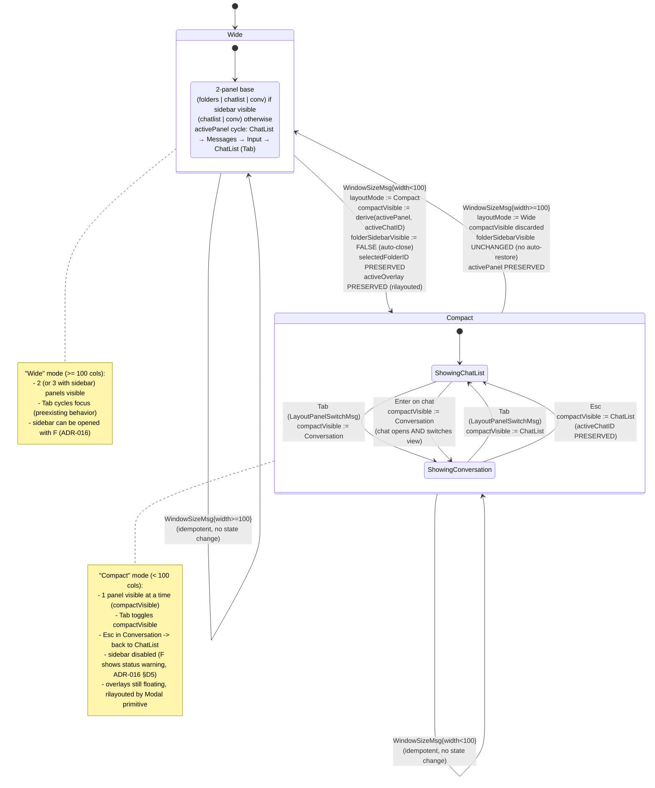

# Responsive Layout — Statechart (Step 30)

Modello comportamentale del **layout responsive** introdotto nello
Step 30. Il root model acquisisce una nuova dimensione di stato
`layoutMode ∈ {Wide, Compact}` calcolata deterministicamente da
`WindowSizeMsg.Width` (threshold = 100 colonne, vedi
[ADR-018 §D1](../phase-6-decisions/ADR-018-responsive-layout-threshold-and-tab.md)).
In `Compact`, un solo pannello è visibile per volta (`compactVisible ∈ {ChatList, Conversation}`),
con switch via `Tab` o `Esc`.

**Scope Step 30 (responsive layout)**:

- Calcolo `layoutMode` da `WindowSizeMsg` (sync, atomic, idempotente).
- Compact mode: rendering single-pane, switch via `Tab`.
- Cross-threshold side-effects minimali (sidebar auto-close,
  `compactVisible` derivation preserva la conversazione attiva,
  overlay invariati).
- Tab semantica context-aware: focus cycle in Wide, panel switch in
  Compact.

**Fuori scope Step 30**:

- Threshold parametrico via `config.toml` (Step 31 — Theming + config).
- Indicatore visivo del `layoutMode` in status bar (Step 33 — polish).
- Sidebar icon-only in compact mode (out-of-scope ADR-018, demandato
  a step futuri).
- Threshold per `Height` (altezza minima): out-of-scope; "terminal
  too small" è gestito altrove.
- Editing del threshold a runtime via comando: out-of-scope.

## Contesto nello statechart globale

`layoutMode` è una **dimensione ortogonale** del root model, sibling
delle dimensioni introdotte negli step precedenti:

| Dimensione | Range | Source-of-truth | Step intro |
|------------|-------|-----------------|------------|
| `sessionState` | `{Auth, Main}` | login flow | Step 5 |
| `activePanel` | `{ChatList, Messages, Input}` | focus cycle | Step 6+ |
| `activeOverlay` | `{none, palette, info, search, edit, forward, confirm, help, whichKey}` | overlay mutex (ADR-015) | Step 26+ |
| `folderSidebarVisible` | `{TRUE, FALSE}` | `F` toggle (ADR-016) | Step 29 |
| `selectedFolderID` | `FolderID` | folder filter (ADR-016) | Step 29 |
| `chatInfoTarget` | `ChatID \| nil` | `i` overlay (ADR-017) | Step 29 |
| **`layoutMode`** | **`{Wide, Compact}`** | **`WindowSizeMsg.Width`** | **Step 30** |
| **`compactVisible`** | **`{ChatList, Conversation}`** | **derived in Compact only** | **Step 30** |

Ortogonali significa che `layoutMode` co-esiste con tutti gli altri
stati. Esempio: `layoutMode = Compact` AND `activeOverlay = palette`
AND `selectedFolderID = 2` è un trippletto valido (la palette è
floating; la sidebar è auto-chiusa al collapse, ma `selectedFolderID`
è preservato come filtro applicato alla chat list).

> **Decisione canonical**: vedi
> [ADR-018](../phase-6-decisions/ADR-018-responsive-layout-threshold-and-tab.md)
> per threshold (D1), no-hysteresis (D2), Tab semantics (D3),
> side-effect rules (D4).

## A. Statechart — Layout mode (top-level)



### Stati — `layoutMode`

| Stato | Descrizione | Input accettati | Componenti renderizzati |
|-------|-------------|-----------------|-------------------------|
| `Wide` | width ≥ 100 cols; layout multi-pannello | tutti i keybinding pre-esistenti; `WindowSizeMsg` (può flippare a Compact) | folders (se `folderSidebarVisible`) + chatlist + conv + status bar |
| `Compact.ShowingChatList` | Single-pane, chat list visibile | `j`/`k`/Enter (chat list keybindings); `Tab`/`Esc` switch a Conversation; `WindowSizeMsg` (può flippare a Wide) | chatlist (full width) + status bar |
| `Compact.ShowingConversation` | Single-pane, conversation visibile | `j`/`k`/`r`/`e`/`f`/`D`/`y`/`Space`/Enter (conversation keybindings); `Tab`/`Esc`/`h` torna a ChatList; `WindowSizeMsg` | conv header + viewport + input + status bar |

### Derivation di `compactVisible` al collapse Wide → Compact

Funzione `derive(activePanel, activeChatID, prevCompactVisible)`:

```
derive(activePanel, activeChatID, prevCompactVisible) ::=
    if activeChatID != nil and activePanel ∈ {Messages, Input}:
        return Conversation     // preserva attenzione utente
    else:
        return ChatList         // default sicuro
```

Razionale completo in [ADR-018 §D4](../phase-6-decisions/ADR-018-responsive-layout-threshold-and-tab.md).

### Idempotenza

Ricevere `WindowSizeMsg{width=80}` due volte di fila in `Compact` è no-op
sul secondo (state già `Compact`, `compactVisible` invariato). Stesso
in `Wide`. Modellato in TLA+ come azione idempotente (`THRESHOLD_DETERMINISTIC`).

## B. Tab semantics — context-aware dispatch

`Tab` è un keybinding globale ma il suo significato dipende da
`layoutMode`:

| Mode | Stato corrente | `Tab` invia | Effetto |
|------|----------------|-------------|---------|
| Wide | `activePanel = ChatList` | `FocusNextMsg` | `activePanel := Messages` |
| Wide | `activePanel = Messages` | `FocusNextMsg` | `activePanel := Input` |
| Wide | `activePanel = Input` | `FocusNextMsg` | `activePanel := ChatList` |
| Wide | `folderSidebarVisible AND focus on folders` | `FocusNextMsg` | `activePanel := ChatList` (folder→chatlist→messages→input cycle) |
| Compact | `compactVisible = ChatList` | `LayoutPanelSwitchMsg` | `compactVisible := Conversation` |
| Compact | `compactVisible = Conversation` | `LayoutPanelSwitchMsg` | `compactVisible := ChatList` |
| any | `activeOverlay != none` | (consumato dall'overlay o no-op) | overlay decide |

**Decisione**: vedi [ADR-018 §D3](../phase-6-decisions/ADR-018-responsive-layout-threshold-and-tab.md).

**Invariante**: `Tab` non muta mai `layoutMode`. L'unico trigger di
flip è `WindowSizeMsg` (modellato in TLA+ come `TAB_PRESERVES_LAYOUT`).

## C. Eventi / Messaggi (tipizzati `tea.Msg`)

Estendono [`../phase-1-context/message-taxonomy.md`](../phase-1-context/message-taxonomy.md).

| Msg | Origine | Payload | Effetto |
|-----|---------|---------|---------|
| `LayoutModeChangedMsg` | Sintetizzato in `App.Update` quando `WindowSizeMsg` attraversa la soglia (Step 30) | `oldMode, newMode LayoutMode` | Documenta la transizione cross-threshold; consumato da panel models per resize sub-viewport. NON è il trigger primario (è l'`WindowSizeMsg` stesso); è un **fanout** per side-effect downstream |
| `LayoutPanelSwitchMsg` | Keystroke `Tab` (root, guard: `layoutMode = Compact AND activeOverlay = none`) | — | `compactVisible := if compactVisible == ChatList then Conversation else ChatList` (toggle bidirezionale) |

**Nessun `LayoutModeWideMsg` / `LayoutModeCompactMsg` separati**: la
transizione è atomica nell'`App.Update` cycle dello stesso `WindowSizeMsg`
(stessa scelta di `FolderToggleMsg` di Step 29: un msg che bidirezionalmente
flippa). `LayoutModeChangedMsg` ha payload `oldMode, newMode` per
distinguere il verso.

**Riuso di `WindowSizeMsg`**: il trigger primario è il `tea.WindowSizeMsg`
nativo di bubbletea — già consumato dal root per resize calculation.
Step 30 estende il `Update` handler per:

1. Ricalcolare dimensioni dei pannelli (logica pre-esistente).
2. Calcolare `newMode := if width < 100 then Compact else Wide`.
3. Se `newMode != layoutMode` → emettere `LayoutModeChangedMsg`,
   applicare side-effect D4 (sidebar close, derive `compactVisible`).
4. Forward del `WindowSizeMsg` ai sub-models per ricalcolare le loro
   dimensioni interne.

## D. Keybindings — Layout (Step 30)

### Globali (in tutti i pannelli)

| Tasto | Mode | Azione |
|-------|------|--------|
| (resize del terminale) | any | `WindowSizeMsg` → ricalcolo `layoutMode`, eventuale `LayoutModeChangedMsg` |
| `Tab` | Wide | `FocusNextMsg` (semantica pre-esistente) |
| `Tab` | Compact | `LayoutPanelSwitchMsg` |
| `Esc` | Compact (in `ShowingConversation`) | switch a `ShowingChatList` (compactVisible := ChatList; activeChatID preservato) |
| `Esc` | Compact (in `ShowingChatList`) | nessun effetto layout (consumato dal pannello chat list, es. clear cursor) |

### Compact mode — keybindings ereditati

In `Compact.ShowingChatList`: tutti i keybindings di chat list
(j/k/Enter/g,g/G/d/p/m/a/n/Ctrl+U/Ctrl+D) funzionano normalmente.
La selezione di una chat con `Enter` apre la conversazione **e**
switcha `compactVisible` a `Conversation` (atomicamente, in stesso
`Update` cycle).

In `Compact.ShowingConversation`: tutti i keybindings di conversation
(j/k/r/e/f/D/y/Space/g,g/G/h) funzionano normalmente. `h` da
`BrowsingMessages` ha la stessa semantica di `Esc` (torna a ChatList);
in Compact entrambe sono routed a `LayoutPanelSwitchMsg{ChatList}`.

## E. Modello dati associato

```
type LayoutMode = Wide | Compact

type CompactPanel = ChatList | Conversation

const compactThreshold = 100   // hard-coded Step 30 (ADR-018 D1);
                                // Step 31 può renderlo parametrico via config.toml

App ::= {
    ...
    layoutMode      : LayoutMode    // §A statechart; derived from WindowSizeMsg.Width
    compactVisible  : CompactPanel  // meaningful only when layoutMode = Compact
    width           : int           // last known width from WindowSizeMsg
    height          : int           // last known height
}

// Derivation function (atomic in Update cycle)
func computeLayoutMode(width int) LayoutMode {
    if width < compactThreshold {
        return Compact
    }
    return Wide
}

// Cross-threshold side-effect (atomic; ADR-018 D4)
func applyCrossThreshold(prev, next LayoutMode, st *App) {
    if prev == Wide && next == Compact {
        // collapse
        st.compactVisible = derive(st.activePanel, st.activeChatID)
        st.folderSidebarVisible = false  // auto-close
        // selectedFolderID, activeChatID, activeOverlay preserved
    }
    // expand: no destructive side-effect
}

func derive(active panelID, chatID *ChatID) CompactPanel {
    if chatID != nil && (active == Messages || active == Input) {
        return Conversation
    }
    return ChatList
}
```

## F. Invarianti comportamentali

1. **Threshold determinismo**: `layoutMode' = if width' < 100 then Compact else Wide`
   è funzione totale del width corrente. Non dipende dalla storia (no
   hysteresis; ADR-018 D2). Modellato come `THRESHOLD_DETERMINISTIC`.
2. **Compact ⇒ exactly one panel**: `layoutMode = Compact ⟹ |{p : panel p is rendered}| = 1`.
   Il pannello rendered è esattamente `compactVisible`. Modellato come
   `COMPACT_ONE_PANEL`.
3. **Wide ⇒ both panels**: `layoutMode = Wide ⟹ ChatList rendered AND Conversation rendered`
   (e folder sidebar se `folderSidebarVisible`). Modellato come
   `WIDE_TWO_PANELS`.
4. **Tab preserves layout**: `LayoutPanelSwitchMsg ⟹ layoutMode' = layoutMode`.
   `Tab` non flippa Wide↔Compact mai. Modellato come `TAB_PRESERVES_LAYOUT`.
5. **`compactVisible` meaningful only in Compact**: in Wide,
   `compactVisible` può avere qualsiasi valore (è ignorato dal renderer);
   il valore al ri-collapse viene ricalcolato via `derive(...)`.
   Modellato implicitamente (renderer condition).
6. **Auto-close sidebar al collapse**: `prev = Wide AND next = Compact ⟹ folderSidebarVisible' = FALSE`.
   `selectedFolderID'` invariato. Modellato come `SIDEBAR_AUTOCLOSE_ON_COLLAPSE`.
7. **`activeChatID` invariato cross-threshold**: nessuna transizione
   tra Wide e Compact muta `activeChatID`. Coerente con
   `ACTIVE_CHAT_INVARIANT` di Step 29 (ADR-016).
8. **`activeOverlay` invariato cross-threshold**: gli overlay sono
   floating; il flip layout li ridisegna via `Modal` primitive,
   non li chiude. Modellato come `OVERLAY_SURVIVES_RESIZE`.
9. **Idempotenza**: `WindowSizeMsg{w}` con `w` nello stesso half-plane
   del threshold corrente non muta nulla. Modellato implicitamente
   da `THRESHOLD_DETERMINISTIC`.
10. **Tab no-op se overlay attivo**: `activeOverlay != none ⟹ Tab non emette LayoutPanelSwitchMsg`
    (consumato dall'overlay o ignorato). Coerente con
    [ADR-015 §D3](../phase-6-decisions/ADR-015-command-palette-whichkey-help.md).

## G. Loading / Empty / Error states — render

| Stato | Render |
|-------|--------|
| `Wide` | Layout pre-esistente: `[folders] | chatlist | conv` (folders se `folderSidebarVisible`); status bar in basso |
| `Compact.ShowingChatList` | Chat list a tutta larghezza; status bar in basso (con hint "Tab → conv") |
| `Compact.ShowingConversation` | Conversation a tutta larghezza (header + viewport + input); status bar in basso (con hint "Tab → list") |
| Cross-threshold transition | Atomic in `Update` cycle: nessun frame intermedio. Il primo render dopo `LayoutModeChangedMsg` è già nel nuovo mode |

Errori: nessuno. `WindowSizeMsg` è eventi del terminale, sempre validi.
Edge case di `width = 0` (terminale degenerato) → trattato come Compact
(consistente: `0 < 100`); il rendering può comunque essere unusable
ma l'app non crash.

## H. Interazione con altri sub-state ortogonali

### Folder sidebar (Step 29, ADR-016)

| Mode | Azione `F` | Effetto |
|------|------------|---------|
| Wide | `F` | toggle bidirezionale `folderSidebarVisible` (semantica Step 29) |
| Compact | `F` | no-op + status bar warning "Folders not available in compact mode" (ADR-016 §D5) |
| Wide → Compact (cross-threshold) | (automatico) | `folderSidebarVisible := FALSE` (auto-close, ADR-018 §D4) |
| Compact → Wide (cross-threshold) | (automatico) | `folderSidebarVisible` invariato (resta `FALSE`; user riapre con `F`) |

### Search in chat (Step 27, ADR-014)

`searchInChat.active = TRUE` è ortogonale a `layoutMode`. La barra
inline è dentro la `ConversationModel`:

- In Wide: visibile insieme a chat list (entrambi i pannelli).
- In Compact (`ShowingConversation`): visibile (la conv è full-width).
- In Compact (`ShowingChatList`): non visibile (la conv è hidden).
  Tuttavia `searchInChat.active` resta `TRUE` (state preservato);
  `Tab` per tornare a Conversation mostra di nuovo la barra con
  `query`/`matches` invariati.

### Overlays (Step 26-29, ADR-013/015/017)

Tutti gli overlay (search, palette, whichKey, help, edit, forward,
confirm, chatInfo) sono floating e gestiti dalla primitive `Modal`.
La primitive ricalcola dimensioni e placement da `WindowSizeMsg`
(capability esistente).

| Overlay | Comportamento in cross-threshold |
|---------|----------------------------------|
| `palette` (full-screen) | rilayout automatico, full-screen scala |
| `help` (full-screen) | rilayout automatico |
| `whichKey` (compact, anchored bottom-right) | rilayout automatico |
| `chatInfo` (compact, `placement: right`) | in Compact, `placement: right` può non avere abbastanza spazio → fallback a `placement: full` (gestito da Modal primitive) |
| `search` (centered) | rilayout automatico |
| `edit` (centered) | rilayout automatico |
| `forward` (centered) | rilayout automatico |
| `confirm` (centered) | rilayout automatico |

Decisione: nessun overlay è auto-chiuso al cross-threshold (ADR-018 §D4).

### Multi-select (Step 22)

`S ≠ ∅` (multi-select attivo) è ortogonale a `layoutMode`. In Compact
con `compactVisible = ChatList`, l'utente non vede i checkmark `[✓]`
dei messaggi selezionati (perché la conv è hidden), ma `S` resta
in memoria. `Tab` torna a `ShowingConversation` con i checkmark
visibili. `f`/`D` con `|S|>0` funzionano in entrambi i compact panel
(actions globali, non panel-scoped).

## I. Layout impact (cross-ref `tui-design.md` §"Compact Mode")

### Wide mode (≥ 100 cols)

```
┌─ [Folders] ─┬─ ● CHATS ────────┬─ Conversation ──────────────┐
│             │                  │                              │
│  All Chats  │  ╭────────────╮  │  messages...                 │
│  Personal   │  │ ●● John    │  │                              │
│  Work       │  ╰────────────╯  │                              │
│             │                  │                              │
└─────────────┴──────────────────┴──────────────────────────────┘
 j/k nav │ Tab focus │ / search │ ? help                          
```

### Compact mode (< 100 cols) — ShowingChatList

```
┌─ ● CHATS ─────────────────────────────────────────────┐
│                                                        │
│   ╭──────────────────────────────────────────────╮     │
│   │ ●● John Doe                                  │     │
│   ╰──────────────────────────────────────────────╯     │
│   ╭──────────────────────────────────────────────╮     │
│   │ ●  Team Dev                                  │     │
│   ╰──────────────────────────────────────────────╯     │
│                                                        │
└────────────────────────────────────────────────────────┘
 j/k nav │ ⏎ open │ Tab → conv │ ? help                  
```

### Compact mode (< 100 cols) — ShowingConversation

```
┌─ John Doe  ● online ──────────────────────────────────┐
│                                                        │
│  Hey, how are you?                                     │
│  12:34                                                 │
│                                                        │
│                                Going well!             │
│                                12:35  ✓✓               │
│                                                        │
├────────────────────────────────────────────────────────┤
│ message█                                ╭────╮         │
│                                         │SEND│         │
│                                         ╰────╯         │
└────────────────────────────────────────────────────────┘
 i input │ r reply │ Tab → list │ Esc back │ ? help     
```

## Cross-links

- Pipeline step: [`../development-pipeline.md` §Step 30](../development-pipeline.md)
- Statechart globale: [`ui-statechart.md`](ui-statechart.md) §"Responsive Layout States" (esteso da Step 30)
- Sequence diagrams: [`../phase-3-interactions/responsive-layout-flow.md`](../phase-3-interactions/responsive-layout-flow.md)
- Concurrency invariants: [`../phase-4-concurrency/responsive_layout.tla`](../phase-4-concurrency/responsive_layout.tla)
- Decisione (threshold, hysteresis, Tab semantics, side-effects): [ADR-018](../phase-6-decisions/ADR-018-responsive-layout-threshold-and-tab.md)
- Ereditato da: [ADR-016 §D5](../phase-6-decisions/ADR-016-folder-source-and-filtering.md) (sidebar skip in compact mode)
- Domain types: nessun nuovo dominio (Step 30 è UI-only); `LayoutMode` e `CompactPanel` sono UI-internal enums
- Tui design canonical: [`../tui-design.md`](../tui-design.md) §"Compact Mode (<100 cols)", §10 Focus Navigation
