# Search In Chat — Statechart (Step 27)

Modello comportamentale della **ricerca locale nella conversazione attiva**
introdotta nello Step 27 della pipeline. `Ctrl+F` apre una **barra di
ricerca inline** (footer-bar tipo `bubbles/textinput`) dentro la
`ConversationModel`; la query è eseguita **client-side** sui messaggi già
in memoria; le occorrenze sono **highlight-ate** nel viewport; `Enter`/`n`
naviga al match successivo, `Shift+Tab`/`N` al precedente; `Esc` chiude.

**Scope Step 27**:

- Search **locale** alla conversazione attiva (no RPC).
- Match: substring `strings.Contains` **case-insensitive** sul campo
  `Message.Text`. Service messages (`IsService = TRUE`) e media-only
  (`Text == ""`) sono **esclusi** dall'indice.
- Highlight in-line del match nel viewport (sostituisce il rendering
  `Message.Text` con una versione con span lipgloss `bg=accent`).
- Navigazione: `Enter`/`n` → next, `Shift+Tab`/`N` → prev. Wrap-around al
  bordo della lista matches. Centraggio viewport sul match corrente.
- Re-index incrementale su `NewMessageMsg` mentre la barra è aperta
  (vedi §"Concorrenza con NewMessageMsg" e [ADR-014](../phase-6-decisions/ADR-014-inline-search-bar-vs-modal.md)).

**Fuori scope Step 27**:

- Regex / fuzzy / glob — solo substring case-insensitive in MVP.
- Ricerca su media captions, reactions, sender names — solo `Text`.
- Highlight persistente dopo `Esc` (chiusura clear-a anche gli highlight).
- Paging server-side per chat lunghe non interamente in memoria —
  Step 27 cerca SOLO i messaggi già caricati nel viewport's slice.
  L'utente può scrollare su (`g g` → trigger `loadHistoryCmd`) per
  caricarne di più, e il re-index via `LoadMoreMsg` aggiorna l'indice
  alla pari di `NewMessageMsg`.
- Cross-conversazione (è il dominio dello Step 26 — ricerca globale).

## Distinzione architetturale rispetto a Step 26

Step 27 NON usa la **primitive `Modal`** introdotta a Step 26
(full-screen overlay, vedi `feedback_modal_charm.md`). Usa invece una
**barra inline** tipo `textinput` agganciata al footer della
`ConversationModel`, sotto la `viewport` dei messaggi e sopra la status
bar. Razionale completo in [ADR-014](../phase-6-decisions/ADR-014-inline-search-bar-vs-modal.md).

| Aspetto | Step 26 — Search globale | Step 27 — Search in chat |
|---------|---------------------------|---------------------------|
| Primitive UI | `Modal` Crush-style (overlay full-screen) | `textinput` inline (footer-bar) |
| Trigger | `/` | `Ctrl+F` |
| Scope | tutte le chat | conversazione attiva |
| Sorgente dati | Telegram RPC `messages.searchGlobal` | slice in-memory `[]Message` |
| Debounce | 1s `tea.Tick` | nessuno (search sincrona client-side) |
| Stato lifecycle | overlay machine separata | sub-state di `ConversationFocused` |
| Modal | si (cattura tutto l'input) | no (background viewport visibile, scroll abilitato indirettamente) |
| Esc | chiude overlay (deroga ADR-007) | chiude barra, ritorna a `BrowsingMessages` |
| Highlight in viewport | no (lista risultati separata) | si (span `bg=accent` sui match) |

## Contesto nello statechart globale

Sub-state nuovo dentro `ConversationFocused` (vedi
[`ui-statechart.md`](ui-statechart.md) §"Top-Level States" → `MainView` →
`ChatOpen` → `ConversationFocused`). È **ortogonale** a `MultiSelect`:

- `Ctrl+F` è accettato sia da `BrowsingMessages` sia da `MultiSelect`.
- Mentre la barra è aperta, `j`/`k` cursore messaggi è **disabilitato**
  (l'utente naviga per match, non per riga). Multi-select toggle
  (`Space`) è anch'esso disabilitato (la barra cattura `Space` come
  carattere della query).
- `Esc` chiude la barra; lo stato di MultiSelect è preservato (se la
  barra è stata aperta da MultiSelect, `Esc` su barra → ritorno a
  `MultiSelect.Selecting` con `S` invariato).

## Statechart di `ConversationFocused` (esteso con SearchInChat)

```mermaid
stateDiagram-v2
    [*] --> BrowsingMessages

    state BrowsingMessages {
        [*] --> CursorOnly
        CursorOnly --> CursorOnly : j / k
    }

    BrowsingMessages --> MultiSelect : Space
    MultiSelect --> BrowsingMessages : Esc

    BrowsingMessages --> SearchInChat : Ctrl+F → SearchOpenMsg
    MultiSelect --> SearchInChat : Ctrl+F → SearchOpenMsg<br/>(S preservato; ritorno a MultiSelect su Esc)

    state SearchInChat {
        [*] --> Active

        state Active {
            [*] --> EmptyQuery
            EmptyQuery --> Typing : char typed → SearchQueryChangedMsg{q}
            Typing --> Typing : char/backspace → SearchQueryChangedMsg{q}<br/>recompute matches synchronously
            Typing --> EmptyQuery : query becomes "" (backspace su ultimo char)<br/>matches := []

            Typing --> ResultsNonEmpty : matches > 0 (computed)
            Typing --> ResultsEmpty    : matches == 0 (computed)

            ResultsNonEmpty --> ResultsNonEmpty : Enter / n / Shift+Tab / N → SearchNextMsg / SearchPrevMsg<br/>currentIdx ± 1 mod len(matches), scroll viewport to match
            ResultsNonEmpty --> Typing : char/backspace → re-compute matches
            ResultsEmpty --> Typing : char/backspace → re-compute matches

            ResultsNonEmpty --> ResultsNonEmpty : NewMessageMsg / LoadMoreMsg → re-index<br/>(see §"Concorrenza con NewMessageMsg")
            ResultsEmpty    --> ResultsNonEmpty : NewMessageMsg/LoadMoreMsg che match-a query
            ResultsNonEmpty --> ResultsEmpty    : MessageDeletedMsg che svuota matches
        }
    }

    SearchInChat --> BrowsingMessages : Esc → SearchCloseMsg<br/>(se aperta da BrowsingMessages)
    SearchInChat --> MultiSelect      : Esc → SearchCloseMsg<br/>(se aperta da MultiSelect; S preservato)

    note right of Active
      Ctrl+F è ignorato dentro SearchInChat.Active
      (la barra è gia aperta — la keystroke viene catturata
      dal textinput come carattere o tasto di controllo).
    end note
```



## Stati — descrizione

| Stato | Descrizione | Input accettati | Componenti attivi |
|-------|-------------|-----------------|-------------------|
| `BrowsingMessages.CursorOnly` | Default — no barra, no selection | j/k, Space, Ctrl+F, ... | viewport, cursore msg |
| `MultiSelect.Selecting` | Selection set non vuota | j/k, Space, f, D, Ctrl+F, Esc | viewport, cursore, info bar |
| `SearchInChat.Active.EmptyQuery` | Barra aperta, query vuota | char, Esc | viewport (stato pre-search), barra (textinput) |
| `SearchInChat.Active.Typing` | Utente sta digitando; matches re-calc ad ogni keystroke (sync) | char, backspace, Esc | viewport con highlight, barra |
| `SearchInChat.Active.ResultsNonEmpty` | Query non vuota, `len(matches) > 0`, currentIdx valido | char, backspace, Enter/n, Shift+Tab/N, Esc | viewport con highlight (current evidenziato `bg=accent.bold`, others `bg=accent`), barra con counter `idx+1/N` |
| `SearchInChat.Active.ResultsEmpty` | Query non vuota, `len(matches) == 0` | char, backspace, Esc | viewport invariato (no highlight), barra con `0/0` + hint `No matches` |

`Typing` è uno **stato transiente intra-frame**: a ogni
`SearchQueryChangedMsg` il main loop ricalcola `matches` SINCRONAMENTE e
passa a `ResultsNonEmpty` o `ResultsEmpty` nello stesso `Update`. Lo
schema lo mostra come stato esplicito per esplicitare la transizione,
ma in pratica il render salta `Typing` e va direttamente al risultato.

## Eventi / Messaggi (tipizzati `tea.Msg`)

Estendono [`message-taxonomy.md`](../phase-1-context/message-taxonomy.md).
**Nota di naming**: i nomi `SearchOpenMsg` / `SearchQueryChangedMsg` /
`SearchCursorMsg` esistono già per Step 26 (search globale). Step 27
introduce **nuovi tipi distinti** con prefisso `SearchInChat*` per
evitare collisione semantica e ambiguità di routing nell'`App.Update`.

| Msg | Origine | Payload | Effetto |
|-----|---------|---------|---------|
| `SearchInChatOpenMsg` | Keystroke `Ctrl+F` (con `activeChatID != nil`) | — | `BrowsingMessages|MultiSelect → SearchInChat.Active.EmptyQuery`; build `index` from current `messages[]` slice; `query := ""`, `matches := []`, `currentIdx := 0`; ricorda `returnTo` (lo stato precedente per Esc) |
| `SearchInChatQueryChangedMsg` | textinput change handler della barra | `query string` | `query := q`; ricalcola `matches` SINCRONO via scan di `index`; `currentIdx := 0`; transition a `ResultsNonEmpty` o `ResultsEmpty`; emette `SearchInChatResultsComputedMsg` per re-render highlight nel viewport |
| `SearchInChatResultsComputedMsg` | `App.Update` post-recompute (ack interno) | `matches []SearchMatch, currentIdx int` | Forza re-render del viewport con highlight aggiornato; nessun side-effect aggiuntivo (è informational) |
| `SearchInChatNextMsg` | `Enter` o `n` nella barra (con `len(matches) > 0`) | — | `currentIdx := (currentIdx + 1) mod len(matches)`; scroll viewport per centrare `matches[currentIdx]` |
| `SearchInChatPrevMsg` | `Shift+Tab` o `N` nella barra (con `len(matches) > 0`) | — | `currentIdx := (currentIdx - 1 + len(matches)) mod len(matches)`; scroll viewport per centrare `matches[currentIdx]` |
| `SearchInChatCloseMsg` | `Esc` nella barra | — | `SearchInChat → returnTo` (BrowsingMessages o MultiSelect); discard `index`, `matches`, `currentIdx`, `query`; remove highlight dal viewport |

### Re-index su mutazione lista messaggi (mentre barra aperta)

Mentre `SearchInChat.Active`, le seguenti mutazioni della lista
messaggi triggrano un **re-index incrementale** dell'indice locale:

| Trigger | Effetto su `index` / `matches` / `currentIdx` |
|---------|------------------------------------------------|
| `NewMessageMsg{m}` (m.ChatID == activeChatID, !m.IsService, m.Text != "") | append `m` a `index`; se `query != "" && containsCI(m.Text, query)` → append `(m.ID, spans)` a `matches` (in coda); `currentIdx` invariato (rimane sul match attualmente highlighted) |
| `NewMessageMsg{m}` con `m.IsService` o `m.Text == ""` | no-op su `index` (escluso dall'indice per design); rendering del system msg invariato |
| `LoadMoreMsg{msgs}` (history pre-pended) | prepend filtrati di `msgs` a `index`; ricerca della query su `msgs` → prepend dei nuovi match a `matches`; `currentIdx` shift-ato di `+len(newMatches)` per preservare l'identità del match corrente (vedi invariante §"Match identity preservation") |
| `MessageDeletedMsg{ids}` | rimuove `ids` da `index` e da `matches`; se il match corrente `matches[currentIdx]` è tra i deleted → `currentIdx := min(currentIdx, len(matches)-1)`; se `len(matches) == 0` → transition a `ResultsEmpty` |
| `MessageEditedMsg{id, newText}` | aggiorna `index[id].Text := newText`; ri-scan di solo quel messaggio per la query; aggiorna o rimuove l'eventuale entry in `matches`; `currentIdx` invariato se ancora valido, altrimenti clamp |
| `ReactionsUpdatedMsg` | no-op (Step 27 cerca solo su `Text`, non su reactions) |

Queste mutazioni **NON** triggrano nuovi eventi `tea.Msg` di tipo
`SearchInChat*` per evitare cascading. Il re-index è side-effect del
gestore `App.Update` per i suddetti msg quando `searchInChat.active ==
true`. Vedi [ADR-014 §D2](../phase-6-decisions/ADR-014-inline-search-bar-vs-modal.md).

## Keybindings (SearchInChat.Active)

| Tasto | Azione |
|-------|--------|
| char printable | Append a query → `SearchInChatQueryChangedMsg{q}` |
| `Backspace` | Rimuove ultimo char → `SearchInChatQueryChangedMsg{q'}` |
| `Enter` o `n` | `SearchInChatNextMsg` (no-op se `len(matches) == 0`) |
| `Shift+Tab` o `N` | `SearchInChatPrevMsg` (no-op se `len(matches) == 0`) |
| `Esc` | `SearchInChatCloseMsg` |
| `Ctrl+F` | **Ignorato** (barra gia aperta) |
| `Tab` | **Ignorato** (no focus traversal mentre barra aperta) |
| `j`/`k`, `Space`, `r`/`e`/`f`/`D` | **Catturati come char** dal textinput (sono printable) |
| `Ctrl+P`, `?`, `/` | **Globali** (passano al root model anche con barra aperta — vedi `ui-statechart.md` §"Regole di focus") |

**Razionale**: `Ctrl+F` è una scorciatoia "modale soft" — la barra
cattura solo i tasti rilevanti per la search; le scorciatoie globali
(command palette, help, search globale) restano accessibili. L'utente
può aprire la search globale dall'inline search senza passare prima per
`Esc` (UX accettabile: search globale aperta → l'inline search è
preservata in background, riemerge alla chiusura del Modal globale).
Decisione formale in [ADR-014 §D3](../phase-6-decisions/ADR-014-inline-search-bar-vs-modal.md).

## Modello dati associato

Lo stato è tenuto nella `ConversationModel` (NON nel root App, perché è
local per-chat e si reset all'apertura di un'altra chat):

```
SearchInChatState ::= {
    active        : bool                  // true se barra aperta
    query         : string                // contenuto del textinput
    index         : []IndexedMessage      // snapshot filtrato dei messaggi searchabili
    matches       : []SearchMatch         // hit della query corrente (in ordine cronologico)
    currentIdx    : int                   // indice in matches del match focused
    returnTo      : ConvSubstate          // {browsingMessages, multiSelect} — dove tornare su Esc
}

IndexedMessage ::= {
    msgID    : int
    textLC   : string  // pre-lowercased per match O(1) per char
    pos      : int     // posizione nella slice messages[] originale
}

SearchMatch ::= {
    msgID  : int
    spans  : []TextSpan  // posizioni inizio/fine del match nel render del messaggio
}

TextSpan ::= { start : int, end : int }
```

`textLC` è pre-calcolato a build-time dell'index per evitare
`strings.ToLower(...)` ad ogni keystroke (la query è anch'essa
lowercased una volta sola al `SearchInChatQueryChangedMsg`).

## Algoritmo di matching

```
on SearchInChatOpenMsg:
    state.index := []
    for m in conv.messages:
        if !m.IsService && m.Text != "":
            state.index.append({msgID: m.ID, textLC: strings.ToLower(m.Text), pos: ...})
    state.query := ""
    state.matches := []
    state.currentIdx := 0
    state.active := true

on SearchInChatQueryChangedMsg{q}:
    state.query := q
    if q == "":
        state.matches := []
        return
    qLC := strings.ToLower(q)
    state.matches := []
    for im in state.index:
        spans := allSubstringPositions(im.textLC, qLC)  // scan O(n) per messaggio
        if len(spans) > 0:
            state.matches.append({msgID: im.msgID, spans: spans})
    state.currentIdx := 0
    return SearchInChatResultsComputedMsg{matches, currentIdx}

on SearchInChatNextMsg:
    if len(state.matches) == 0: return
    state.currentIdx := (state.currentIdx + 1) mod len(state.matches)
    return scrollViewportTo(state.matches[state.currentIdx].msgID)

on SearchInChatPrevMsg:
    if len(state.matches) == 0: return
    state.currentIdx := (state.currentIdx - 1 + len(state.matches)) mod len(state.matches)
    return scrollViewportTo(state.matches[state.currentIdx].msgID)

on SearchInChatCloseMsg:
    state := zero  // active=false, tutto vuoto
    return removeViewportHighlights()
```

**Complessità**: per `len(messages) = N` e `len(query) = q`, ogni
keystroke costa `O(N * |textLC|)` con `strings.Index` (ottimizzato in
Go runtime). Per le chat tipiche (`N <= 1000`) questo è
trascurabile (<1ms su CPU moderna). Se in futuro emergessero chat con
`N > 10⁴`, valutare un trie o un index inverso (out-of-scope Step 27).

## Concorrenza con NewMessageMsg

**Scenario**: la barra è aperta, l'utente sta digitando, e Telegram
push-a un `NewMessageMsg` via `p.Send()` perché qualcuno ha scritto
nella chat attiva. Quattro decisioni vanno prese:

1. **Re-index?** Si — il nuovo messaggio entra nell'indice se
   `!IsService && Text != ""` (vedi tabella sopra).
2. **Re-search della query corrente sul nuovo messaggio?** Si —
   incrementale, solo sul nuovo messaggio (non scan dell'intero
   index).
3. **`currentIdx` shift?** No, per `NewMessageMsg` (append in coda):
   `currentIdx` rimane sul match originale. L'utente non vede "saltare"
   il highlight corrente.
4. **Auto-jump al nuovo match?** No — l'utente sta navigando
   manualmente, un auto-jump sarebbe disorientante. Il counter `idx+1/N`
   nella barra si aggiorna a `idx+1/(N+1)` per indicare il nuovo
   match disponibile.

Per `LoadMoreMsg` (pre-pend di history all'inizio della slice), la
situazione è simmetrica: i nuovi match si inseriscono **prima** di
quelli esistenti, e `currentIdx` viene shift-ato di `+len(newMatches)`
per preservare l'**identità** (msgID) del match corrente. Questo è il
match-identity-preservation principle (vedi invarianti §3-4 sotto).

Decisione formale e razionale in [ADR-014 §D2](../phase-6-decisions/ADR-014-inline-search-bar-vs-modal.md).

## Invarianti comportamentali

1. **Local-only**: nessuna RPC viene mai emessa da `SearchInChat.*`.
   `searchCmd` (Step 26) **non viene mai chiamato** da questo
   sub-state. Verifica statica: `App.Update` per `SearchInChat*Msg` non
   ritorna mai un `tea.Cmd` che colpisce `internal/telegram`.
2. **Confined to active chat**: aprire un'altra chat
   (`ChatSelectedMsg{otherChatID}`) mentre la barra è aperta →
   `SearchInChatCloseMsg` automatico (state reset prima del
   `loadChatCmd` per la nuova chat). Equivalente UX al multi-select
   reset cross-chat (vedi `multi-select.md` invariante 1).
3. **Match identity preservation on prepend**: per ogni
   `LoadMoreMsg{newMsgs}` ricevuto mentre `active == true`, se
   `currentIdx` era valido prima, allora dopo l'update il match
   `matches[currentIdx]` ha lo stesso `msgID` di prima. (Verificato in
   `search_in_chat.tla` invariante `MATCH_IDENTITY_PRESERVED`.)
4. **No phantom matches**: per ogni `m \in matches`, esiste `i \in index`
   con `i.msgID == m.msgID` e `containsCI(messages[i].Text, query)`.
   (Garantito dal re-compute completo a ogni `SearchInChatQueryChangedMsg`
   e dal re-index incrementale su mutazione.)
5. **Cursor bounds**: `0 <= currentIdx < len(matches)` quando
   `len(matches) > 0`; `currentIdx == 0` quando `len(matches) == 0`.
6. **Esc preserves outer state**: `SearchInChatCloseMsg` ripristina
   `returnTo` (BrowsingMessages o MultiSelect), mai cambia il
   sub-state a un terzo. Multi-select `S` non viene toccato dalla
   search.
7. **System messages excluded**: `m.IsService == TRUE → m.ID \notin index`.
   (Coerenza con `SYSTEM_NO_REACT` di `reactions.tla` — i system msg
   sono semanticamente non-content e non devono essere matched dalla
   ricerca testuale.)
8. **Empty-query no-op highlight**: `query == "" → matches == [] →`
   nessun span renderizzato nel viewport (rendering identico a
   `SearchInChat == false`).

## Loading / Empty / Error states — render

| Stato | Render barra | Render viewport |
|-------|--------------|------------------|
| `EmptyQuery` | `[Search: _]` con cursor blink, hint `Esc to close` | invariato (no highlight) |
| `Typing` (transiente) | `[Search: <q>]` | (re-render imminente) |
| `ResultsNonEmpty` | `[Search: <q>]  1/N  (Enter next, Shift+Tab prev, Esc close)` | viewport scroll-ed sul current match; tutti i match con `bg=accent`, current con `bg=accent.bold` |
| `ResultsEmpty` | `[Search: <q>]  0/0  No matches  (Esc close)` | invariato |

Errori: nessuno. La search locale è side-effect-free e non può fallire
(no allocation > qualche KB, no RPC, no I/O).

## Cross-links

- Pipeline step: [`development-pipeline.md` §Step 27](../development-pipeline.md)
- Statechart globale (esteso): [`ui-statechart.md`](ui-statechart.md)
- Sequence diagrams: [`../phase-3-interactions/search-in-chat-flow.md`](../phase-3-interactions/search-in-chat-flow.md)
- Concurrency invariants: [`../phase-4-concurrency/search_in_chat.tla`](../phase-4-concurrency/search_in_chat.tla)
- Decisione inline-bar vs Modal + re-index: [ADR-014](../phase-6-decisions/ADR-014-inline-search-bar-vs-modal.md)
- Pattern correlato (search globale, primitive Modal): [`search-overlay.md`](search-overlay.md)
- Pattern correlato (sub-state ortogonale a MultiSelect): [`multi-select.md`](multi-select.md)
- ADR-013 (search debounce / stale): NON applicabile a Step 27 (no RPC, no debounce)
