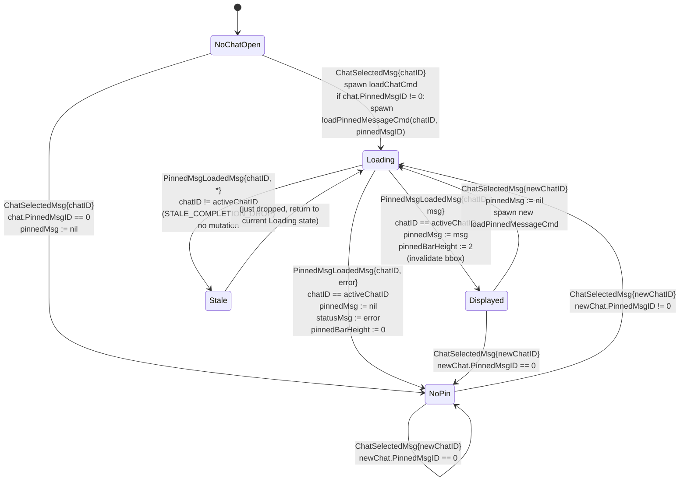
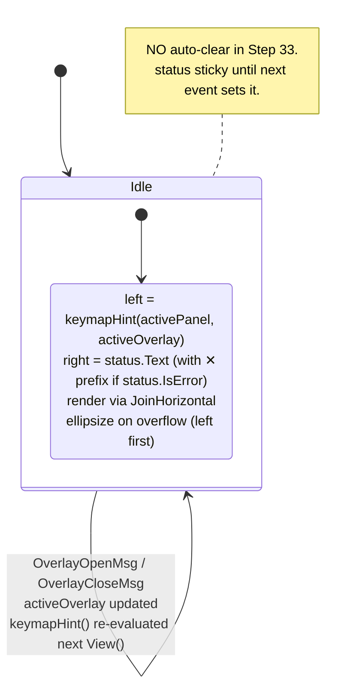

# Step 33 Polish — Statechart (multi-feature)

Modello comportamentale delle 5 feature di polish dello Step 33:
**pinned message bar (A)**, **link rendering + open (B)**,
**forward display (C)**, **status bar polish (D)**, **sender name
color in groups (E)**.

> **Decisione canonical**: vedi
> [ADR-021](../phase-6-decisions/ADR-021-step33-polish.md) — un singolo
> ADR multi-feature copre tutte le decisioni A1..A6, B1..B6, C1..C5,
> D1..D5, E1..E4, più F (TLA+ skip giustificato).

**Scope Step 33**:

- A. Pinned bar: snapshot a chat-open, single most-recent pin, no jump.
- B. Link: detection da `MessageEntities`, render underline+OSC 8,
  open via `gx` chord (first link only, http(s) only).
- C. Forward: prefix `┃` per-line, header "From <X>", fallback chain.
- D. Status bar: dual-slot (left hints / right error/info), focus-aware.
- E. Sender color: hash modulo palette[8], group chat only, name-only.

**Fuori scope Step 33**:

- Multi-pinned navigation (carosello). Real-time pin updates.
- Multi-link picker; sub-cursor su link; mention/hashtag rendering.
- Compose forward (già Step 21).
- Auto-clear errori; status bar 3-slot; status bar pinata.
- Sender color in private/channel; body color.

## Contesto nello statechart globale

Step 33 **NON** introduce nuove dimensioni di stato top-level del
root model. Tutto si appoggia su stato pre-esistente o aggiunge stato
**locale** ai sub-model:

| Dimensione | Range | Source-of-truth | Scope | Step intro |
|------------|-------|-----------------|-------|------------|
| `pinnedMsg` | `*model.Message \| nil` | `PinnedMsgLoadedMsg` | `ConversationModel` | **Step 33** |
| `pinnedBarHeight` | `{0, 2}` | derive da `pinnedMsg != nil` | `ConversationModel` (View-derived) | **Step 33** |
| `status` | `{Text string, IsError bool}` | `*ResultMsg`, app events | `MainModel` (extends `statusMsg`) | Step 5+ (extended Step 33) |
| `chat.PinnedMsgID` | `int` (0 = no pin) | `tg.Dialog.PinnedMsgID` | `model.Chat` | **Step 33** (campo nuovo) |
| `msg.IsForwarded` | bool | `tg.Message.FwdFrom != nil` | `model.Message` | **Step 33** (campo nuovo) |
| `msg.ForwardedFrom` | string | DC1 fallback chain | `model.Message` | **Step 33** (campo nuovo) |
| `msg.Links` | `[]MessageLink` | `tg.Message.Entities` (filtered) | `model.Message` | **Step 33** (campo nuovo) |
| `msg.SenderID` | int64 | `tg.Message.FromID` | `model.Message` (ESISTENTE? verifica) | (riusato) |

Nessuna nuova dimensione condivisa con altri sub-model. Niente
overlay nuovo (nessun `activeOverlay := pinned`). Niente nuovo focus.

## A. Statechart — Pinned message bar (lifecycle)



**Note**:
- `Stale` non è veramente uno stato osservabile: è il branch di no-op
  quando `chatID != activeChatID`. Modellato per chiarezza
  dell'invariante `PINNED_STALE_DROP`.
- `Loading` può co-esistere con `Displayed` di un'altra chat (utente
  apre Chat B mentre A stava ancora caricando il pin). Il drop su
  `chatID != activeChatID` lo gestisce.
- `pinnedBarHeight ∈ {0, 2}` è derivato; non è uno stato indipendente.
  Il rendering della conversation lo legge in `View()`.

**Invarianti**:
- `PINNED_OFFSET_RESERVED`: `viewport.Height = totalHeight - headerH -
  inputH - pinnedBarHeight`. Sempre valido.
- `PINNED_STALE_DROP`: `PinnedMsgLoadedMsg{chatID}` con `chatID !=
  activeChatID` non muta `pinnedMsg`.
- `PINNED_SINGLE_PER_CHAT`: ogni `ChatSelectedMsg` resetta `pinnedMsg`
  prima di caricare il nuovo (no leftover).

## B. Statechart — Link cursor + open

```mermaid
stateDiagram-v2
    [*] --> Idle

    Idle --> PrefixG : KeyPress 'g'<br/>(activeOverlay == none, msg cursor on a message)<br/>state := PrefixPending<br/>spawn whichKeyTickCmd(300ms)

    PrefixG --> OpeningLink : KeyPress 'x'<br/>selectedMsg.Links not empty<br/>emit OpenLinkMsg{URL: links[0].URL}
    PrefixG --> NoLinkHint : KeyPress 'x'<br/>selectedMsg.Links empty<br/>statusMsg := "no links in selected message"<br/>state := Idle
    PrefixG --> ScrollTop : KeyPress 'g'<br/>(double-g, existing Step 28 chord)<br/>scroll viewport to top<br/>state := Idle
    PrefixG --> Idle : KeyPress Esc OR other key<br/>(WhichKeyCancelMsg)
    PrefixG --> Idle : WhichKeyTimeoutMsg{prefixID matches}<br/>(after 300ms)<br/>state := Visible (whichkey overlay)<br/>(then Esc → Idle, or chord continuation)

    OpeningLink --> Idle : OpenLinkMsg processed<br/>spawn openLinkCmd(URL)<br/>(fire-and-forget; result ignored)

    NoLinkHint --> Idle : (immediately, no overlay)
```



**Note**:
- `gx` è una **continuation** del whichkey registry (ADR-015 §D5).
  Coesiste con `gg` (scroll-top), `gz` (futuro), ecc. Niente
  conflitto: il whichkey dispatcher disambigua sulla seconda key.
- `OpenLinkMsg` è emitted **solo** dopo whitelist scheme (DB6):
  `http://` / `https://`. Per altri scheme, statusMsg + no spawn.
- `openLinkCmd` è fire-and-forget: nessun `OpenLinkResultMsg`.
  Errori di `exec.Command` loggati a stderr, NOT in status bar
  (l'utente vede il browser aperto o no).

**Invarianti**:
- `LINK_OPEN_KEYBOARD_PARITY`: `gx` è il canonical app-mediated path.
  OSC 8 mouse click è terminal-mediated (out-of-app, non emette
  `OpenLinkMsg`).
- `LINK_DETECTION_AUTHORITATIVE`: `selectedMsg.Links` deriva
  esclusivamente da `tg.Message.Entities` (no client regex).
- `LINK_OPEN_HTTP_ONLY`: `openLinkCmd` whitelista `http(s)://`.

## C. Data flow — Forward display

```mermaid
graph LR
    SRV[Telegram Server] -->|UpdateNewMessage<br/>tg.Message{FwdFrom}| TG[gotd/td goroutine]
    TG -->|tg.Message| CONV[convert.Message]
    CONV -->|FwdFrom != nil| FWDH[forward.go: ConvertFwdHeader]
    FWDH -->|peer lookup<br/>fallback chain DC3| LBL[ForwardedFrom string]
    LBL --> MSG[model.Message{<br/>  IsForwarded: true,<br/>  ForwardedFrom: label,<br/>  ...<br/>}]
    MSG -->|NewMessageMsg / MessagesLoadedMsg| APP[App.Update]
    APP --> CV[ConversationModel]
    CV -->|View| RENDER[renderMessages]
    RENDER -->|IsForwarded == true| FWBLOCK[render block prefix:<br/>┃ From @source<br/>┃ body line 1<br/>┃ body line 2]
    RENDER -->|IsForwarded == false| NORMBLOCK[render normal bubble]
```

**Note**:
- Il convert layer è il **single point of transformation**.
  `ConversationModel.View()` non vede mai `tg.MessageFwdHeader`.
- `ForwardedFrom` è già la stringa **finale** displayable (es.
  `"@alice"`, `"Channel News"`, `"Hidden"`). Niente lookup runtime nel
  render path.

**Invarianti**:
- `FORWARD_PREFIX_PER_LINE`: ogni linea del body di un msg con
  `IsForwarded = true` ha prefix `┃ ` (incluso multi-line).
- `FORWARD_LABEL_FALLBACK_CHAIN`: la gerarchia DC3 garantisce
  `ForwardedFrom != ""` quando `IsForwarded = true`.

## D. Statechart — Status bar slots



**Note**:
- Status bar è **stateless beyond `m.status`**: ogni render è derivato
  puramente da `(activePanel, activeOverlay, multiSelect, status,
  width)`. Pure-View.
- `keymapHint(panel, overlay) string` è una function deterministica
  (non un Msg, non un Cmd).
- Errori sticky: l'utente vede l'errore finché un nuovo `*ResultMsg`
  o `statusMsg`-setter lo sostituisce. Auto-clear deferred.

**Invarianti**:
- `STATUSBAR_TWO_SLOT`: exactly 2 slot (left hint, right error/info).
- `STATUSBAR_ERROR_PRIORITY`: ellipsize left prima del right.
- `STATUSBAR_KEYMAP_DETERMINISTIC`: stessi `(panel, overlay,
  multiSelect)` → stessa stringa hint.

## E. Function — Sender color (deterministic)

```
function senderColor(senderID int64, palette []Color) Color:
    require len(palette) > 0
    idx := abs(senderID) % len(palette)
    return palette[idx]

function maybeColoredName(msg Message, chat Chat, palette []Color) Color:
    if chat.Type != ChatGroup:
        return defaultNameColor   // = ColorText
    if msg.IsOutgoing:
        return defaultNameColor   // outgoing rendered diversamente, no colored name
    return senderColor(msg.SenderID, palette)
```

**Note**:
- `abs(senderID)`: gestisce eventuali ID negativi (channel ID
  Telegram sono int64 con bit alti).
- Pure function: stessa input → stesso output. Nessuno stato.
- Trigger di re-render: cambio chat (palette potrebbe cambiare se
  utente custom-izza `theme.toml`), `ThemeChangedMsg` (Step 31
  hot-reload).

**Invarianti**:
- `SENDER_COLOR_DETERMINISTIC`: stesso `senderID` + stesso palette →
  stesso colore.
- `SENDER_COLOR_GROUP_ONLY`: applicato sse `chat.Type == ChatGroup`.

## Invarianti consolidati (cross-feature)

Riepilogo statico, già documentato in
[ADR-021 §Invarianti](../phase-6-decisions/ADR-021-step33-polish.md#invarianti-cross-feature):

| ID | Feature | Statement |
|----|---------|-----------|
| `PINNED_OFFSET_RESERVED` | A | `viewport.Height = chrome - headerH - inputH - pinnedBarHeight`, `pinnedBarHeight ∈ {0, 2}`. |
| `PINNED_STALE_DROP` | A | `PinnedMsgLoadedMsg{chatID}` con `chatID != activeChatID` no-op (riuso pattern `STALE_COMPLETION_DROP` da ADR-017). |
| `PINNED_SINGLE_PER_CHAT` | A | `pinnedMsg` singleton per chat, sostituito a ogni `ChatSelectedMsg`. |
| `LINK_OPEN_KEYBOARD_PARITY` | B | `gx` canonical app path; OSC 8 mouse out-of-app. (Estende ADR-020 §D8.) |
| `LINK_DETECTION_AUTHORITATIVE` | B | Da `tg.Message.Entities` solo, no regex. |
| `LINK_OPEN_HTTP_ONLY` | B | Solo `http(s)://` aperti; altri scheme → status hint. |
| `FORWARD_PREFIX_PER_LINE` | C | Ogni linea body con `IsForwarded = TRUE` ha prefix `┃ `. |
| `FORWARD_LABEL_FALLBACK_CHAIN` | C | `ForwardedFrom != ""` se `IsForwarded = TRUE`. |
| `STATUSBAR_TWO_SLOT` | D | Esattamente 2 slot in status bar. |
| `STATUSBAR_ERROR_PRIORITY` | D | Su overflow ellipsize left, mai right. |
| `STATUSBAR_KEYMAP_DETERMINISTIC` | D | `keymapHint()` pure. |
| `SENDER_COLOR_DETERMINISTIC` | E | Hash modulo palette stabile cross-session. |
| `SENDER_COLOR_GROUP_ONLY` | E | Group chats only. |
| `RENDER_NO_NEW_GOROUTINE` | F | Step 33 zero nuova goroutine. |

## Note su TLA+ (skip)

Nessuna nuova spec TLA+. Vedi
[ADR-021 §F](../phase-6-decisions/ADR-021-step33-polish.md#f---tla-skip-giustificato).
Reasoning: 5 sub-feature sincrone, zero nuova concorrenza, zero nuovo
canale custom. Pattern di skip allineato con ADR-017, ADR-018,
ADR-019, ADR-020.

## Cross-links

- [ADR-021](../phase-6-decisions/ADR-021-step33-polish.md) — decisioni canonical (A1..F)
- [`../phase-3-interactions/step33-polish-flow.md`](../phase-3-interactions/step33-polish-flow.md) — sequence diagrams
- [`../phase-1-context/message-taxonomy.md`](../phase-1-context/message-taxonomy.md) — `OpenLinkMsg`, `PinnedMsgLoadedMsg`
- [ADR-015 §D5](../phase-6-decisions/ADR-015-command-palette-whichkey-help.md) — whichkey registry (`gx` continuation)
- [ADR-017](../phase-6-decisions/ADR-017-chat-info-data-source.md) — pattern `STALE_COMPLETION_DROP` riusato
- [ADR-018 §D2](../phase-6-decisions/ADR-018-responsive-layout-threshold-and-tab.md) — Compact mode (DA5)
- [ADR-019 §D5, §D7](../phase-6-decisions/ADR-019-theming-and-config-loading.md) — theme schema (4 nuovi key + palette)
- [ADR-020 §D2, §D8](../phase-6-decisions/ADR-020-mouse-support.md) — bbox invalidation, KEYBOARD_PARITY
