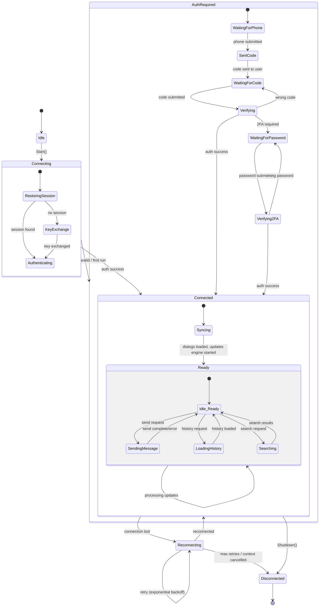
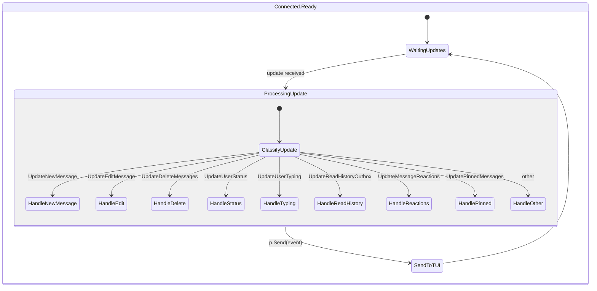
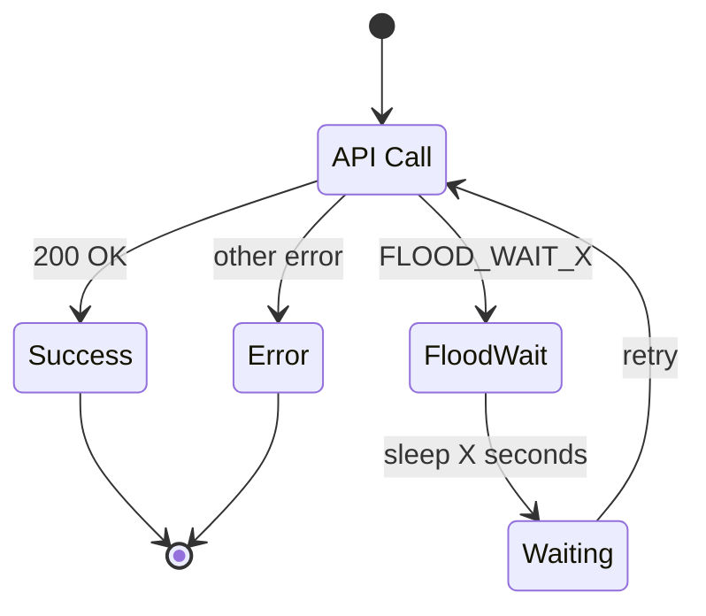
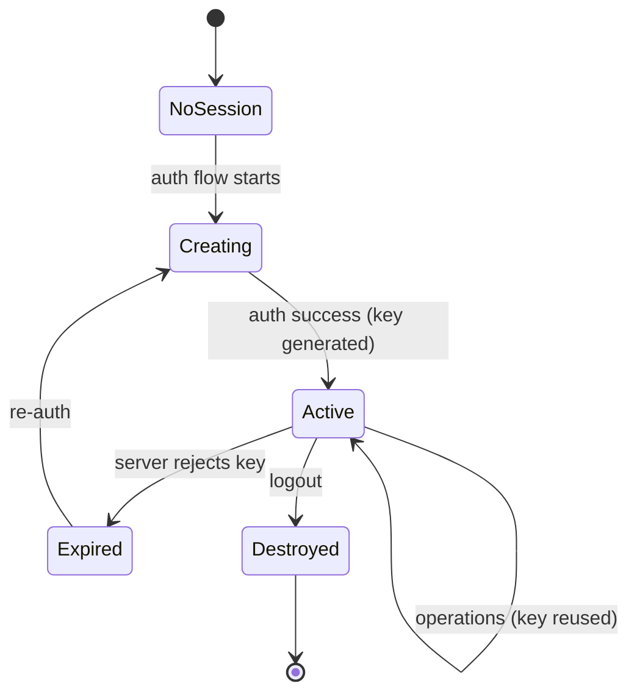

# Telegram Client Statechart

Macchina a stati del client Telegram (gotd/td) come visto dal TUI.

## Connection Lifecycle

## Connection Status → UI Mapping

| Client State | UI Connection Indicator | Header CHATS |
|-------------|------------------------|--------------|
| `Idle` | — | — |
| `Connecting` | ○ giallo | `○ CHATS` |
| `AuthRequired` | — | (Auth flow attivo) |
| `Connected.Syncing` | ○ giallo | `○ CHATS` |
| `Connected.Ready` | ● verde | `● CHATS` |
| `Reconnecting` | ○ giallo | `○ CHATS` |
| `Disconnected` | ✕ rosso | `✕ CHATS` |

## Update Processing

## Flood Wait Handling

Gestito automaticamente da `gotd/contrib/middleware/floodwait`. Il middleware:
1. Intercetta errori `FLOOD_WAIT_N`
2. Attende N secondi
3. Ritenta la richiesta
4. Opzionalmente notifica il TUI via `p.Send(FloodWaitMsg{duration})`

## Session Lifecycle

| Stato | File system | Implicazioni |
|-------|------------|--------------|
| `NoSession` | Nessun file | Auth flow obbligatorio |
| `Creating` | File in scrittura | Auth in corso |
| `Active` | `session.json` presente (0600) | Operazioni normali |
| `Expired` | File presente ma non valido | Re-auth necessario |
| `Destroyed` | File eliminato | Logout completato |
