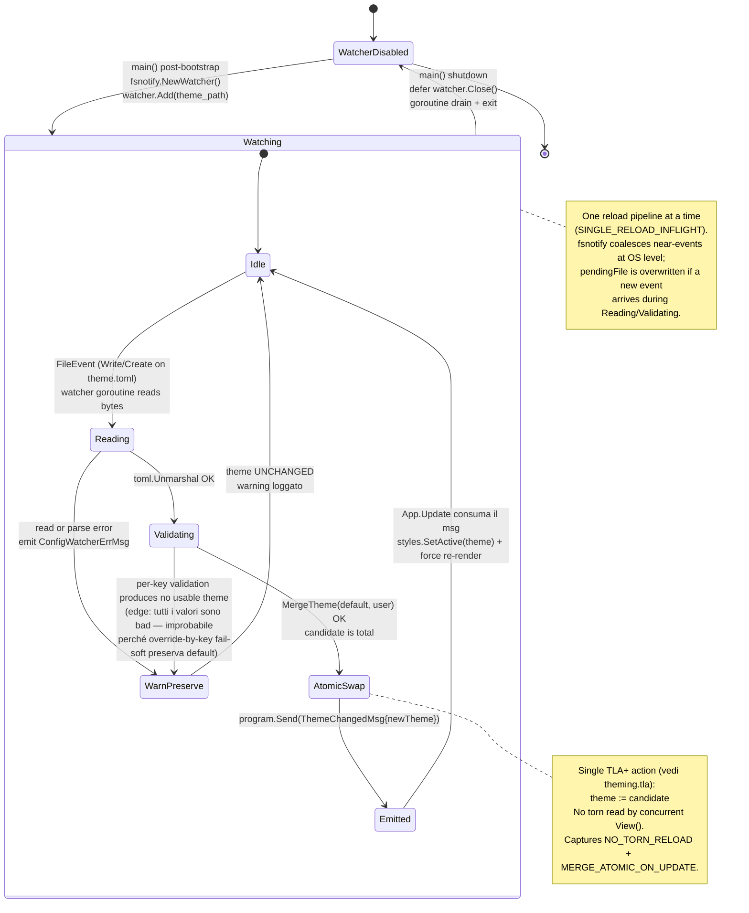

# Theming + Config Loading — Statechart (Step 31)

Modello comportamentale del **caricamento di `config.toml` e
`theme.toml`** introdotto nello Step 31. Il **bootstrap** è
boot-time sincrono (in `main` prima di `tea.NewProgram(...).Run()`);
post-bootstrap, una **goroutine watcher fsnotify** osserva
`theme.toml` e propaga modifiche live tramite `ThemeChangedMsg`
(post-revisione 2026-05-09, ADR-019 D9 INVERTED).

> **Aggiornamento (2026-05-09)**: D9 invertita — hot-reload del
> theme.toml è **in scope per Step 31**. Vedi §J per il sub-statechart
> di hot-reload e l'ADR-019 §D9 per il razionale. La spec TLA+
> [`theming.tla`](../phase-4-concurrency/theming.tla) modella
> formalmente le invarianti di concurrency.

**Scope Step 31 (theming + config)**:

- Ricerca path config/theme con priorità XDG + env override (ADR-019 D2).
- Default theme **embedded via `embed.FS`** (ADR-019 D3).
- Merge **override-by-key** del tema utente sopra il default
  (ADR-019 D3).
- Fail-soft per file mancante / TOML invalido / chiave sconosciuta /
  valore non parsabile (ADR-019 D4, D5, D10).
- Esposizione di `compact_threshold` come prima behavior key
  in `config.toml` (ADR-019 D6).
- Refactor delle vars `internal/ui/styles/colors.go` ad accessor
  pattern (`styles.ColorPrimary()`); 18 color keys + 2 gradient
  (ADR-019 D7, D8).

**Fuori scope Step 31**:

- Hot-reload di `config.toml` (behavior switches restano boot-time;
  solo `theme.toml` è hot-reloadable, ADR-019 §D9 inverted).
- Custom keybindings via config (Step >> 33).
- Theme presets selezionabili (light/dark; future ADR).
- Editor di tema in-app, comando `--init-config`, comando
  `--print-default-theme`.
- Localizzazione / i18n.

## Contesto nello statechart globale

Il theming + config è una **sotto-fase di bootstrap** che precede
qualsiasi sub-modello UI documentato in altri statechart. Si inserisce
prima di `[*] --> Auth` o `[*] --> Main` di
[`ui-statechart.md`](ui-statechart.md):

```
main()
  ├── 1. theming-and-config bootstrap  ← QUESTO STATECHART
  │     produces: Theme, Config (entrambi total e validati)
  ├── 2. styles.SetActive(theme)
  ├── 3. tea.NewProgram(NewApp(config)).Run()
  │     └── ui-statechart (Auth → Main → ...)
  └── exit
```

> **Decisione canonical**: vedi
> [ADR-019](../phase-6-decisions/ADR-019-theming-and-config-loading.md)
> per formato (D1), path search (D2), embed + merge strategy (D3),
> missing-file (D4), invalid-input (D5), config scope (D6), schema
> theme (D7), refactor pattern (D8), no hot-reload (D9), validation
> (D10).

## A. Statechart — Bootstrap del theming + config

```mermaid
stateDiagram-v2
    [*] --> Bootstrap

    state Bootstrap {
        [*] --> ResolvingPaths
        ResolvingPaths --> LoadingConfig : config_path resolved (or "none")
        ResolvingPaths : Compute config_path, theme_path<br/>via $TUILEGRAM_CONFIG_DIR ⟶ $XDG_CONFIG_HOME/tuilegram ⟶ $HOME/.config/tuilegram

        LoadingConfig --> ValidatingConfig : file present (read OK)
        LoadingConfig --> ApplyingDefaults : file absent or read error<br/>config := DefaultConfig()
        LoadingConfig : Read config.toml from disk

        ValidatingConfig --> ApplyingDefaults : TOML syntax error<br/>log_error; config := DefaultConfig()
        ValidatingConfig --> MergingConfig : TOML parsed OK<br/>(may contain unknown/bad keys)
        ValidatingConfig : Parse TOML, per-key validate

        MergingConfig --> ConfigReady : merge user_config over DefaultConfig<br/>per-key fail-soft (warn + default for bad keys)
        MergingConfig : Override-by-key merge

        ApplyingDefaults --> ConfigReady : config := DefaultConfig() (already total)

        ConfigReady --> LoadingTheme : config.paths.theme resolved or fallback
    }

    state ThemePhase {
        [*] --> LoadingTheme
        LoadingTheme --> ValidatingTheme : file present (read OK)
        LoadingTheme --> EmbeddedDefault : file absent or read error<br/>theme := EmbeddedDefaultTheme()

        ValidatingTheme --> EmbeddedDefault : TOML syntax error<br/>log_error; theme := EmbeddedDefaultTheme()
        ValidatingTheme --> MergingTheme : TOML parsed OK

        MergingTheme --> ThemeReady : merge user_theme over EmbeddedDefault<br/>per-key fail-soft (warn + default for bad/unknown keys)

        EmbeddedDefault --> ThemeReady : theme := EmbeddedDefault (already total)
    }

    Bootstrap --> ThemePhase
    ThemePhase --> Applied : styles.SetActive(theme)<br/>emit ConfigLoadedMsg{config}<br/>emit ThemeAppliedMsg{theme}

    Applied --> [*] : tea.NewProgram(NewApp(config, theme)).Run()

    note right of Bootstrap
      All transitions are synchronous, in-process,
      single-threaded. No goroutines, no channels.
      Total wall time at boot < 50ms typical.
    end note

    note right of Applied
      After this point, config and theme are
      IMMUTABLE for the lifetime of the process.
      No hot-reload (ADR-019 D9).
    end note
```



### Stati — bootstrap

| Stato | Descrizione | Output |
|-------|-------------|--------|
| `ResolvingPaths` | Calcolo `config_path` e `theme_path` con D2 priority | path resolution map |
| `LoadingConfig` | Tentativo di leggere `config.toml` da disco | bytes o "none" |
| `ValidatingConfig` | Parse TOML del config user | parsed table o syntax error |
| `MergingConfig` | Override-by-key user su `DefaultConfig()` | `Config` total + warnings list |
| `ApplyingDefaults` | Path "no user file" o "syntax error" | `Config` = `DefaultConfig()` |
| `ConfigReady` | `Config` validated e total | (passato a fase theme) |
| `LoadingTheme` | Tentativo di leggere `theme.toml` da disco | bytes o "none" |
| `ValidatingTheme` | Parse TOML del theme user | parsed table o syntax error |
| `MergingTheme` | Override-by-key user su `EmbeddedDefaultTheme()` | `Theme` total + warnings list |
| `EmbeddedDefault` | Path "no user file" o "syntax error" | `Theme` = `EmbeddedDefault` |
| `ThemeReady` | `Theme` validated e total | (passato a `styles.SetActive`) |
| `Applied` | `styles.SetActive(theme)` chiamato; `config` passato a `NewApp` | `ConfigLoadedMsg` + `ThemeAppliedMsg` (interni a `Init`) |

### Funzioni di derivazione (atomic, sincrone)

```text
ResolvePath(kind ∈ {"config", "theme"}) ::=
    if kind = "theme" and config.paths.theme != "":
        return config.paths.theme               // explicit override (theme only)
    for dir in [
        env("TUILEGRAM_CONFIG_DIR"),
        env("XDG_CONFIG_HOME") or "$HOME/.config",
        "$HOME/.config",
    ]:
        if dir is non-empty:
            candidate := join(dir, "tuilegram", kind + ".toml")
            if exists(candidate):
                return candidate
    return "" (no file found)


LoadConfig() ::=
    path := ResolvePath("config")
    if path = "":
        return DefaultConfig(), warnings={"no config file"}

    bytes, err := os.ReadFile(path)
    if err != nil:
        log_warning(err); return DefaultConfig(), warnings={...}

    parsed, err := toml.Parse(bytes)
    if err != nil:
        log_error(err); return DefaultConfig(), warnings={...}

    return MergeConfig(DefaultConfig(), parsed)


MergeConfig(default Config, user table) ::=
    out := default
    warnings := []
    for each (section, key, value) in user:
        if (section, key) ∉ KnownConfigKeys:
            warnings += ["unknown key " + section + "." + key]
            continue
        validated, ok := Validate(section, key, value)
        if not ok:
            warnings += ["bad value at " + section + "." + key]
            continue
        out[section][key] := validated
    return out, warnings


LoadTheme(config Config) ::=
    path := ResolvePath("theme")
    if path = "":
        return EmbeddedDefaultTheme(), warnings={"no theme file"}

    bytes, err := os.ReadFile(path)
    if err != nil:
        return EmbeddedDefaultTheme(), warnings={...}

    parsed, err := toml.Parse(bytes)
    if err != nil:
        log_error(err); return EmbeddedDefaultTheme(), warnings={...}

    return MergeTheme(EmbeddedDefaultTheme(), parsed)


MergeTheme(default Theme, user table) ::=
    out := default
    warnings := []
    for each key in user.colors:
        if key ∉ KnownColorKeys:
            warnings += ["unknown color " + key]
            continue
        if not is_hex(user.colors[key]):
            warnings += ["bad hex " + key + "=" + user.colors[key]]
            continue
        out.colors[key] := parse_hex(user.colors[key])
    for each key in user.gradient:
        ...analogous...
    return out, warnings
```

## B. Modello dati associato

```text
type Theme struct {
    // 18 color keys (ADR-019 D7)
    Primary, Incoming, Success, Warning, Error, Private,
    Text, TextDim, Surface, Border, SearchSecondary,
    SearchInlineBg, ButtonFg, ButtonBg, ButtonDisabledFg,
    Reaction, ReactionChosen, SystemMessage  : Color
    // 2 gradient keys
    GradientStart, GradientEnd  : ColorfulColor
    // metadata
    Name, Author, Version, Description  : string
}

type Config struct {
    Display struct {
        CompactThreshold  int    // default 100; range [40, 400]
    }
    Paths struct {
        Theme  string             // optional explicit theme path
    }
    Meta struct {
        Version  int               // schema version, default 1
    }
}

const (
    DefaultCompactThreshold = 100   // ADR-018 D1 baseline
    MinCompactThreshold     = 40
    MaxCompactThreshold     = 400
)

func DefaultConfig() Config {
    return Config{
        Display: { CompactThreshold: 100 },
        Paths:   { Theme: "" },
        Meta:    { Version: 1 },
    }
}

// Embedded via //go:embed default.toml
//
//go:embed themes/default.toml
var defaultThemeRaw []byte

func EmbeddedDefaultTheme() Theme {
    // parsed once at package init, panic on error
    // (CI test guarantees default.toml is valid)
    return parsedDefault
}
```

### Schema canonical `default.toml` (embed source)

Il file `internal/config/themes/default.toml` (embedded) contiene:

```toml
[meta]
name        = "tuilegram-default"
author      = "tuilegram"
version     = "1.0"
description = "Default dark theme — Charm-inspired palette"

[colors]
primary           = "#7D56F4"
incoming          = "#38BDF8"
success           = "#50FA7B"
warning           = "#FBBF24"
error             = "#FF5555"
private           = "#FF79C6"
text              = "#FAFAFA"
text_dim          = "#6B7280"
surface           = "#1E1E2E"
border            = "#374151"
search_secondary  = "#4A3F6B"
search_inline_bg  = "#2D2D40"
button_fg         = "#FAFAFA"
button_bg         = "#7D56F4"
button_disabled_fg = "#6B7280"
reaction          = "#6B7280"
reaction_chosen   = "#7D56F4"
system_message    = "#6B7280"

[gradient]
start = "#FF60FF"
end   = "#6B50FF"
```

### Schema canonical `config.toml` (Step 31 — minimum viable)

```toml
[meta]
version = 1

[display]
# Width threshold (in cols) for Wide vs Compact layout.
# See ADR-018 D1 (parametrized by ADR-019 D6).
# Default: 100. Valid range: [40, 400].
compact_threshold = 100

[paths]
# Optional override of the theme.toml path.
# If empty, uses XDG search (ADR-019 D2).
theme = ""
```

## C. Eventi / Messaggi (tipizzati `tea.Msg`)

Estendono [`../phase-1-context/message-taxonomy.md`](../phase-1-context/message-taxonomy.md).

| Msg | Origine | Payload | Effetto |
|-----|---------|---------|---------|
| `ConfigLoadedMsg` | Sintetizzato da `App.Init()` (Step 31) — non da goroutine | `Config` (snapshot completo) | Documenta che il config è stato caricato. Sub-models (folder sidebar, responsive layout) possono leggere `config.Display.CompactThreshold` per inizializzarsi. **No-op** in App.Update; usato solo per tracing/test |
| `ThemeAppliedMsg` | Sintetizzato da `App.Init()` (Step 31) — non da goroutine | `Theme` (snapshot completo, già applicato via `styles.SetActive`) | Documenta che il theme è stato applicato. Sub-models possono leggere il theme per pre-render style cache (opzionale). No-op in App.Update; usato per tracing/test |

**Nota cruciale**: questi messaggi NON triggerano logica di mutation
runtime. Sono **pure documentation msgs** — emettiti una volta da
`Init()`, consumati nessuno (o consumati da log/test). La motivazione
è preservare il pattern Elm Architecture (ogni cambiamento di stato
inizia da un msg) anche in caso futuro D9 → hot-reload, dove gli
stessi msg saranno emessi da una goroutine fs-watcher.

**`ThemeChangedMsg` ATTIVO** (post-revisione 2026-05-09, ADR-019 D9
INVERTED). Origine: goroutine fsnotify watcher (post-merge). Payload:
`Theme` (snapshot completo, già totale). Effetto in
`App.Update(ThemeChangedMsg)`:

1. `styles.SetActive(msg.Theme)` (atomic pointer write).
2. ritorna `tea.WindowSizeMsg{Width: prevW, Height: prevH}` per
   forzare full re-render con i nuovi colori (sub-models ricomputano
   gli stili lazy).

**`ConfigWatcherErrMsg` NUOVO** (post-revisione). Origine: goroutine
watcher quando read/parse/merge fallisce. Payload: `error`. Effetto:
log su stderr (Step 31) o status bar (Step 33+ futuro). **Theme
PRESERVATO** (invariante `INVALID_PRESERVES_THEME`).

`ThemeReloadMsg` resta name riservato per future expansion (es.
manual `:theme reload` da command palette).

## D. Keybindings — Theming + config (Step 31)

**Step 31 non introduce keybindings nuovi.** Il theming è
configurabile solo via file. Step futuri possono aggiungere:

- `:theme reload` (command palette) — quando D9 attiva.
- `:theme show` (command palette) — debug, mostra theme corrente.
- `--print-default-theme` (CLI flag) — scrive default su stdout.

## E. Invarianti comportamentali

1. **Theme totalità**: dopo il bootstrap, per ogni `key ∈ KnownColorKeys`,
   `Theme[key]` è definito e di tipo `Color` valido. NON esiste un
   path che produca un theme "parziale". Garantito strutturalmente
   da D3 (override-by-key sopra `EmbeddedDefault` total per costruzione).
2. **Config totalità**: stesso, per ogni `key ∈ KnownConfigKeys`.
3. **Default sempre raggiungibile**: per qualunque input utente
   (file mancante, TOML invalido, valori bad), il bootstrap raggiunge
   `Applied`. Nessun path conduce a `panic` o `os.Exit(1)` su input
   utente.
4. **Embedded default valido (CI-guarded)**: il file
   `internal/config/themes/default.toml` parse senza warning;
   garantito da unit test in CI (`TestEmbeddedDefaultTheme_Parses`).
5. **Boot-time only mutation**: dopo `Applied`, né `Theme` né `Config`
   mutano (no setter pubblici post-boot). Garantito da scope:
   `styles.SetActive` chiamato solo in `main`, mai da `Update`.
6. **`compact_threshold` rispetta range**: `40 <= CompactThreshold <= 400`.
   Validation D10 garantisce che valori out-of-range cadono a default.
7. **Path priority deterministica**: `ResolvePath` esegue D2 in
   ordine, prima match wins. No race (sincrono).
8. **Warnings non-fatali**: ogni warning è loggato ma non interrompe
   bootstrap. `len(warnings) > 0 ⟹ Applied` raggiungibile.
9. **No torn merge**: il merge `MergeConfig` / `MergeTheme` è atomico
   (sincrono, single-thread). Nessun consumer vede lo stato
   intermedio "merge in progress".
10. **`styles.Active()` è never-nil**: dopo init di `package styles`,
    `Active()` ritorna sempre un `*Theme` total (popolato da
    `EmbeddedDefault` al package init; sostituito da merged theme
    in `main`).
11. **Embed indipendenza da disco**: l'app **deve** poter partire con
    `chmod 000 ~/.config/tuilegram/` (permission denied su lettura) —
    fallback a default. Garantito da D4 + D5.
12. **No literal hex residui post-Step-31**: dopo il refactor, un
    audit `grep 'lipgloss\.Color("#'` in `internal/ui/` deve
    restituire **zero** match (escluso `internal/config/themes/default.toml`
    e `internal/ui/styles/`, che sono i source-of-truth). Verificato
    via `code-reviewer` agent al `/step-complete`.
13. **18 color keys + 2 gradient = 20 entries** nello schema
    `default.toml`. Drift detection: Go test confronta
    `len(KnownColorKeys) == 18` (sanity). Aggiunta key futura
    deve aggiornare tutte e tre le sedi (struct `Theme`,
    `KnownColorKeys`, `default.toml`).

## F. Loading / Empty / Error states — boot rendering

Il rendering della TUI durante il bootstrap è **assente**: il
caricamento avviene prima di `tea.NewProgram(...).Run()`. L'utente
vede al massimo:

| Scenario | Output utente |
|----------|---------------|
| Boot success (file utente presenti, validi) | nessun output stderr; TUI parte normalmente con theme custom |
| Boot success (no file utente) | nessun output stderr (silent default); TUI parte con default embedded |
| Boot success (file utente invalido) | warning su stderr (`tuilegram: theme.toml: bad hex 'primary'`), TUI parte con default per quella chiave + altre user-override |
| Boot success (file utente con TOML syntax error) | error su stderr (`tuilegram: theme.toml: parse error at line N`), TUI parte con full default theme |
| Boot success (no env, no `$XDG_CONFIG_HOME`, no `$HOME`) | edge case raro: tutte le path resolution falliscono → no file → default. App parte normalmente |
| `internal/config/themes/default.toml` non parsabile (BUG di build) | `panic` al package init (CI catch tramite test) — non raggiungibile in produzione |

Errori utente: tutti gli warning sono loggati a stderr **prima** del
`tea.NewProgram` (TUI init pulisce lo schermo, quindi i log sono
visibili solo se l'utente fa `2>` redirect, oppure se il TUI fallisce
prima di partire). Decisione D5: questo è accettabile per Step 31
(test plan: l'utente power-user fa `tuilegram 2>warnings.log` per
debug).

Future enhancement (out-of-scope Step 31): un overlay "config issues"
mostrato al primo render con `?` per dismiss. ADR successiva.

## G. Interazione con altri sub-state ortogonali

### Responsive layout (Step 30, ADR-018)

`config.Display.CompactThreshold` **sostituisce** la const
hard-coded `compactThreshold = 100`:

```text
// PRIMA Step 31 (ADR-018 baseline)
const compactThreshold = 100

// DOPO Step 31 (ADR-019 §D6)
threshold := app.config.Display.CompactThreshold

newMode := if width < threshold then Compact else Wide
```

Invariante `THRESHOLD_DETERMINISTIC` di
[`responsive_layout.tla`](../phase-4-concurrency/responsive_layout.tla)
resta valido: il threshold è un parametro `CONSTANT` nel TLA+ già,
quindi parametrizzarlo in Go non rompe nulla. La spec TLA+ non
necessita update.

### Folder sidebar skip in compact (Step 29, ADR-016 §D5)

Conseguenza transitiva: se l'utente abbassa `compact_threshold` a
`80`, allora il range "Wide" si estende a `[80, ∞)`; la sidebar è
disponibile fino a 80 cols (vs 100 cols in Step 30). Coerenza
preservata.

### Tutti gli altri sub-models (chat list, conversation, overlays)

Leggono colori via `styles.ColorPrimary()` (accessor pattern, D8).
Nessuna modifica al loro behavior; solo cambia la sintassi della
chiamata. Refactor meccanico.

### Status bar (Step 33 polish, ipotetico)

Step 33 potrebbe esporre `[display] show_layout_indicator = true`
in `config.toml`. Pattern: aggiungere chiave a `KnownConfigKeys`,
default false, validation `bool`. Estensione D6 senza ADR nuovo.

## H. Sequenza nel main()

```text
// internal/config/loader.go (NEW, Step 31)
//
// All operations are synchronous, single-thread, boot-time.

func Bootstrap() (Config, *styles.Theme, []Warning) {
    config, warnsCfg := LoadConfig()
    theme,  warnsThm := LoadTheme(config)
    return config, theme, append(warnsCfg, warnsThm...)
}

// cmd/tuilegram/main.go (REFACTORED, Step 31)
func main() {
    config, theme, warnings := config.Bootstrap()

    for _, w := range warnings {
        fmt.Fprintln(os.Stderr, "tuilegram:", w)
    }

    styles.SetActive(theme)             // mutate package-global, single-thread

    app := ui.NewApp(config)             // App now takes a Config dep
    if err := tea.NewProgram(app).Run(); err != nil {
        log.Fatal(err)
    }
}
```

> **Nota**: il codice qui è **descrittivo del refactor target**, non
> deliverable. La produzione del codice è scope di
> `tui-architect` / `telegram-dev` agents al passo
> implementazione.

## I. Scenari di test (per il pipeline /step-complete)

Test plan dello Step 31 (manuale, oltre a unit test):

1. **Boot vergine**: rimuovi `~/.config/tuilegram/` se presente.
   Avvia → vedi colori default; nessun warning su stderr.
2. **Theme custom**: crea `~/.config/tuilegram/theme.toml` con solo
   `[colors] primary = "#FF00FF"`. Avvia → vedi i bordi focused
   in magenta acceso (era viola); altri colori invariati.
3. **Theme broken**: edita `theme.toml` con `primary = "not hex"`.
   Avvia → warning su stderr; theme parte con default per `primary`,
   altre keys custom (se ce ne sono) applicate.
4. **Theme TOML syntax error**: edita `theme.toml` con `[colors\n`.
   Avvia → error su stderr; full default theme.
5. **Config compact threshold**: crea `config.toml` con
   `[display] compact_threshold = 60`. Avvia → ridimensiona
   terminale a 70 cols → resta in Wide (mentre con default 100
   sarebbe Compact). Conferma D6 + integrazione D in ADR-018.
6. **`$XDG_CONFIG_HOME` override**: setta
   `XDG_CONFIG_HOME=/tmp/cfg`, crea `/tmp/cfg/tuilegram/theme.toml`.
   Avvia → carica da quel path.
7. **`$TUILEGRAM_CONFIG_DIR` priority**: oltre a `XDG_CONFIG_HOME`,
   setta `TUILEGRAM_CONFIG_DIR=/tmp/over`, crea
   `/tmp/over/tuilegram/theme.toml`. Avvia → carica da `/tmp/over`
   (env wins).
8. **`config.paths.theme` explicit**: `config.toml` con
   `[paths] theme = "/some/abs/path/theme.toml"`. Avvia →
   carica theme da quel path (anche se `~/.config/tuilegram/theme.toml`
   esiste).
9. **Permission denied**: `chmod 000 ~/.config/tuilegram/theme.toml`.
   Avvia → fallback a default + warning.

Gli scenari 1, 2, 5 sono i tre test esplicitamente richiesti dalla
pipeline doc dello Step 31. Gli altri sono "exhaustive coverage"
delle decisioni D2/D5/D10.

**Test aggiuntivi hot-reload** (post-revisione D9):

10. **Hot-reload theme.toml valido**: app running, `vim ~/.config/tuilegram/theme.toml`,
    cambio `primary = "#FF00FF"`, save. Entro ~100ms i bordi focused
    diventano magenta acceso senza restart.
11. **Hot-reload theme.toml invalido**: durante app running, `theme.toml`
    rotto sintatticamente. Save → warning su stderr / status bar; theme
    corrente preservato (no flicker, no crash).
12. **Hot-reload race**: due save consecutivi rapidi (ms apart). L'app
    applica il LATEST. Pipeline single-inflight, no torn state.
13. **Watcher lifecycle**: avvia → SIGTERM → verifica goroutine watcher
    si chiude pulita (no fd leak, defer Close eseguito).

## J. Sub-statechart — Hot-reload del `theme.toml` (post-revisione D9)



### Stati — hot-reload

| Stato | Descrizione | Produce |
|-------|-------------|---------|
| `WatcherDisabled` | Pre-bootstrap o post-shutdown | — |
| `Watching.Idle` | Watcher attivo, no reload in flight | (waiting for fsnotify event) |
| `Watching.Reading` | Goroutine sta leggendo bytes da disco | bytes o read-error |
| `Watching.Validating` | toml.Unmarshal + MergeTheme | candidate (total) o validation error |
| `Watching.AtomicSwap` | Stage finale: pubblica candidate | `theme := candidate` |
| `Watching.Emitted` | `program.Send(ThemeChangedMsg)` chiamato | `tea.Msg` in queue |
| `Watching.WarnPreserve` | Errore parse/validation; theme UNCHANGED | `ConfigWatcherErrMsg` su stderr/status bar |

### Invarianti (formalizzate in `theming.tla`)

1. **`THEME_TOTAL` (atemporal)**: a ogni stato post-bootstrap,
   `styles.Active()` ritorna un `*Theme` total (mai parziale, mai
   nil). Garantito da D3 (merge override-by-key sopra `EmbeddedDefault`).
2. **`NO_TORN_RELOAD`**: nessun `View()` osserva un theme parziale.
   `AtomicSwap` è una singola TLA+ action; in Go è un singolo
   pointer write (atomico per ABI AMD64/ARM64; `atomic.Pointer[Theme]`
   se serve garantirlo strutturalmente).
3. **`MERGE_ATOMIC_ON_UPDATE`**: il merge `default + user` è
   completato in `Validating` PRIMA di `AtomicSwap`. Mai un publish
   parziale.
4. **`WATCHER_BOUND_TO_LIFECYCLE`**: il watcher è avviato da
   `main()` post-bootstrap (`Watching` ⟸ `WatcherDisabled`) e
   chiuso a shutdown (`WatcherDisabled` ⟸ `Watching` via
   `defer watcher.Close()`). Nessun `FileEvent` può arrivare prima
   di start o dopo stop.
5. **`SINGLE_RELOAD_INFLIGHT`**: la pipeline interna a `Watching`
   è seriale (`Idle` → `Reading` → `Validating` → `AtomicSwap` →
   `Emitted` → `Idle`). Un nuovo `FileEvent` durante reload
   sovrascrive `pendingFile` (coalescing).
6. **`INVALID_PRESERVES_THEME`**: la transizione a `WarnPreserve`
   non muta `theme`. UNCHANGED esplicito.
7. **`EVENTUALLY_APPLIED` (liveness)**: sotto fairness, un valid
   `FileEvent` eventualmente raggiunge `AtomicSwap`. Garantito dal
   non-blocking del watcher loop e dal consumer non-starving in
   `App.Update`.

### Goroutine lifecycle (Go pseudocode descrittivo)

```text
// main.go (descrittivo, NON deliverable)
func main() {
    config, theme, _ := config.Bootstrap()
    styles.SetActive(theme)

    watcher, _ := fsnotify.NewWatcher()
    watcher.Add(config.ThemePath())

    program := tea.NewProgram(ui.NewApp(config))

    go func() {
        defer watcher.Close()
        for {
            select {
            case ev := <-watcher.Events:
                if ev.Op & (Write|Create) != 0 {
                    if newTheme, err := loadAndMerge(ev.Name); err == nil {
                        program.Send(ThemeChangedMsg{Theme: newTheme})
                    } else {
                        program.Send(ConfigWatcherErrMsg{Err: err})
                    }
                }
            case <-program.Done():
                return
            }
        }
    }()

    program.Run()
}
```

> **Nota**: lo pseudocode è descrittivo. Il deliverable è scope di
> `tui-architect` / `telegram-dev`.

## Cross-links

- Pipeline step: [`../development-pipeline.md` §Step 31](../development-pipeline.md)
- Statechart globale: [`ui-statechart.md`](ui-statechart.md) §"Bootstrap" (top-level prepended by Step 31)
- Sequence diagrams: [`../phase-3-interactions/theming-config-flow.md`](../phase-3-interactions/theming-config-flow.md)
- Concurrency invariants: [`../phase-4-concurrency/theming.tla`](../phase-4-concurrency/theming.tla)
  (post-revisione 2026-05-09, hot-reload IN scope). Le invarianti
  bootstrap-time sono enunciate in §E; le invarianti hot-reload in §J.
- Decisione (formato, path, embed, merge, fail-soft, schema, refactor,
  no hot-reload): [ADR-019](../phase-6-decisions/ADR-019-theming-and-config-loading.md)
- Decisione originale theming high-level: [ADR-004](../phase-6-decisions/ADR-004-theming-system.md)
- Parametrizzazione di: [ADR-018 §D1](../phase-6-decisions/ADR-018-responsive-layout-threshold-and-tab.md)
  (`compact_threshold`)
- Conseguenza transitiva su: [ADR-016 §D5](../phase-6-decisions/ADR-016-folder-source-and-filtering.md)
  (sidebar skip threshold)
- Conseguenza visuale su: [ADR-017 §D2](../phase-6-decisions/ADR-017-chat-info-data-source.md)
  (border color del chat info overlay deriva da `primary`)
- Domain types: nessun nuovo dominio Telegram (Step 31 è UI-only +
  internal/config); `Theme` e `Config` sono UI-internal types
- Tui design canonical: [`../tui-design.md`](../tui-design.md)
  §"Color" (palette baseline)
- Message taxonomy: [`../phase-1-context/message-taxonomy.md`](../phase-1-context/message-taxonomy.md)
  §"Internal UI Messages" — `ConfigLoadedMsg`, `ThemeAppliedMsg`,
  `ThemeChangedMsg` (ATTIVO post-D9-inversion), `ConfigWatcherErrMsg`
