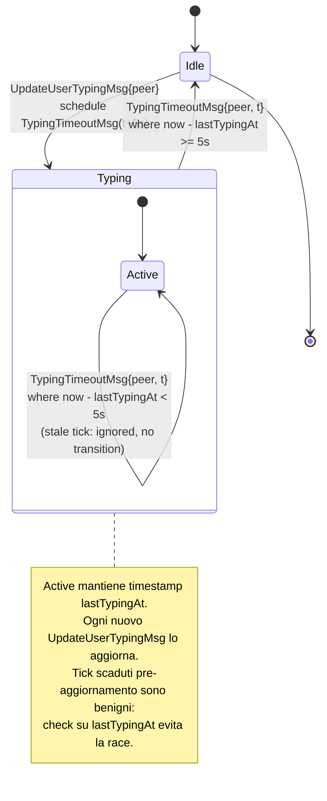

# Typing Indicator — Statechart (Step 23)

Modello comportamentale dell'**indicatore "typing..."** introdotto nello
Step 23 della pipeline. Riceve `UpdateUserTyping` dal goroutine Telegram e
mostra `typing...` in due punti UI:

- **Chat list row**: il nome del peer è temporaneamente sostituito da
  `typing...` (stesso slot della preview ultimo msg).
- **Conversation header**: `John Doe — typing...` quando la chat attiva è
  quella in cui il peer sta scrivendo.

Il segnale ha **TTL = 5s**: se non arrivano nuovi `UpdateUserTyping` entro
il TTL, lo stato torna a `Idle`.

**Scope Step 23**:
- `UpdateUserTyping` (private chat 1:1).

**Fuori scope Step 23**:
- `UpdateChatUserTyping` (typing in gruppi/canali, multi-utente).
- Invio del nostro typing al server (`messages.setTyping`).
- Persistenza del typing state attraverso restart.
- Distinzione tra azioni typing (`typing`, `recording_voice`, `uploading_photo`,
  ...). La specifica MTProto include diversi `SendMessageAction`; lo Step 23
  modella solo il caso generico "qualcuno sta scrivendo".

## Contesto nello statechart globale

Il typing state è **ortogonale** alle macchine a stati di focus / overlay:
non blocca input, non disabilita keybindings. È un puro layer di rendering
agganciato al modello dati `Chat` e `User`.

Concettualmente esiste una **sotto-macchina per-peer** che vive nel modello
applicativo (`map[ChatID]TypingState`). La UI legge lo stato corrente al
momento della `View()` e renderizza di conseguenza.

## Statechart per-peer



## Stati — descrizione

| Stato | Descrizione | Render Chat List | Render Conv Header |
|-------|-------------|------------------|---------------------|
| `Idle` | Nessun typing event recente per il peer | preview ultimo msg | `John Doe` (+ online status) |
| `Typing.Active` | Almeno un `UpdateUserTyping` ricevuto da meno di 5s | `typing...` (italic / accent) | `John Doe — typing...` |

## Transizioni — semantica esatta

| Trigger | Stato sorgente | Effetto |
|---------|----------------|---------|
| `UpdateUserTypingMsg{peer}` | `Idle` | `state[peer] := Typing(lastTypingAt=now)`; emette `tea.Tick(5s, TypingTimeoutMsg{peer, t=now})` |
| `UpdateUserTypingMsg{peer}` | `Typing.Active` | aggiorna `lastTypingAt := now`; **non** schedula nuovo Tick (vedi ADR-010) |
| `TypingTimeoutMsg{peer, t}` | `Typing.Active` con `now - lastTypingAt >= 5s` | `state[peer] := Idle` |
| `TypingTimeoutMsg{peer, t}` | `Typing.Active` con `now - lastTypingAt < 5s` | **no-op** (stale tick: un nuovo update è arrivato dopo `t`, il TTL si è esteso) |
| `TypingTimeoutMsg{peer, t}` | `Idle` | **no-op** (idempotenza: tick orfano, peer già rientrato) |
| `ChatSelectedMsg{peer}` | qualunque | nessun effetto sul typing state (è dato di dominio, non UI) |

## Eventi / Messaggi (tipizzati `tea.Msg`)

Estendono [`message-taxonomy.md`](../phase-1-context/message-taxonomy.md).

| Msg | Origine | Payload | Effetto |
|-----|---------|---------|---------|
| `UpdateUserTypingMsg` | Telegram goroutine (dispatcher `OnTyping`) → `program.Send()` | `peer ChatID, userID int64` | Idle→Typing oppure refresh lastTypingAt |
| `TypingTimeoutMsg` | `tea.Tick(5s)` | `peer ChatID, scheduledAt time.Time` | Typing→Idle se TTL scaduto, no-op altrimenti |

`TypingMsg` (placeholder generico già listato in
[`message-taxonomy.md`](../phase-1-context/message-taxonomy.md)) è
**rinominato in `UpdateUserTypingMsg`** e tipizzato col payload sopra.

## Modello dati associato

`internal/ui/views/main.go` (o equivalente) detiene una mappa:

```
typing : map[ChatID]TypingState

TypingState ::= {
    lastTypingAt : time.Time   // istante dell'ultimo UpdateUserTyping ricevuto
    userID       : int64       // chi sta scrivendo (preparatorio per gruppi, Step 23+)
}
```

Assenza dalla mappa ≡ stato `Idle`. Presenza con `now - lastTypingAt < 5s`
≡ stato `Typing.Active`. La `TypingTimeoutMsg` semplicemente verifica e
rimuove se TTL scaduto.

Questa rappresentazione è la **scelta "timestamp-based"** descritta in
[ADR-010](../phase-6-decisions/ADR-010-typing-ttl-strategy.md).

## Invarianti comportamentali

1. **TTL bound**: `state[peer] = Typing` ⟹ `now - lastTypingAt < 5s` (il
   TTL è l'invariante temporale principale; vedi `typing.tla`
   `TYPING_TTL_BOUND`).
2. **Stale-tick safety**: l'arrivo di un `TypingTimeoutMsg` con `t`
   antecedente all'ultimo update non clear-a lo stato (vedi
   `STALE_TICK_BENIGN`). Questa è la condizione che rende non-race il
   pattern timestamp+tick (ADR-010).
3. **Render coherence**: chat list row e conversation header derivano dalla
   stessa sorgente (`typing[peer]`). Non possono divergere.
4. **No leak su chat chiusura**: se l'utente chiude la chat (`Esc/h`), la
   mappa `typing` non viene resettata; i tick pendenti continuano a
   svuotarla con sicurezza grazie a `STALE_TICK_BENIGN`.
5. **Idempotenza tick orfano**: un `TypingTimeoutMsg` per un peer che è
   già `Idle` (perché l'utente è uscito dalla chat o un altro flusso ha
   ripulito) è un no-op innocuo.
6. **Outbound out-of-scope**: un nostro tasto premuto nell'input area
   **non** emette typing al server in Step 23. Nessun side-effect outbound.

## Render UI — dettagli

### Chat list row

```
┌─────────────────────────┐
│ ● John Doe       12:34  │   ← Idle
│   Hey, how are you?     │
└─────────────────────────┘

┌─────────────────────────┐
│ ● John Doe       12:34  │   ← Typing.Active
│   typing...             │   (italic / accent color)
└─────────────────────────┘
```

Il timestamp dell'ultimo messaggio resta visibile (è metadata della chat,
non legato al typing).

### Conversation header

```
Idle:           John Doe · last seen 5 minutes ago
Typing.Active:  John Doe — typing...
```

Quando typing è attivo, sostituisce **interamente** la riga di status
(online/last seen) con `— typing...`. Al rientro in `Idle`, la status line
torna allo stato precedente (cached `OnlineStatus`).

## Keybindings

Lo Step 23 **non aggiunge keybindings**. Il typing è puramente passivo lato
UI: render-only.

## Cross-links

- Pipeline step: [`development-pipeline.md` §Step 23](../development-pipeline.md)
- Sequence diagrams: [`../phase-3-interactions/typing-flow.md`](../phase-3-interactions/typing-flow.md)
- Concurrency invariants: [`../phase-4-concurrency/typing.tla`](../phase-4-concurrency/typing.tla)
- Decisione TTL strategy: [ADR-010](../phase-6-decisions/ADR-010-typing-ttl-strategy.md)
- Message taxonomy: [`../phase-1-context/message-taxonomy.md`](../phase-1-context/message-taxonomy.md) §Telegram Events
