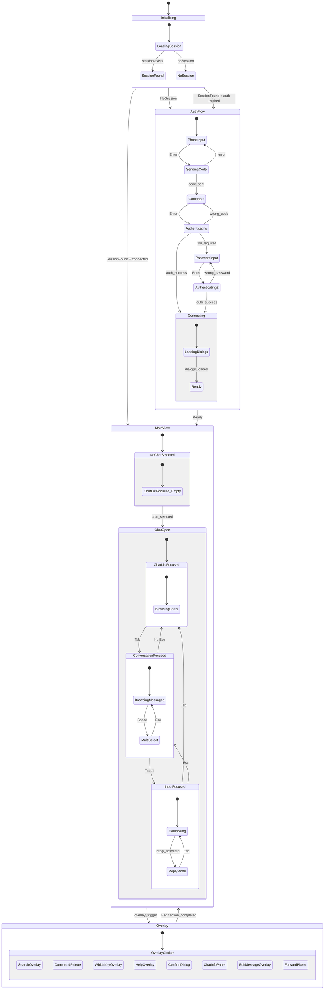
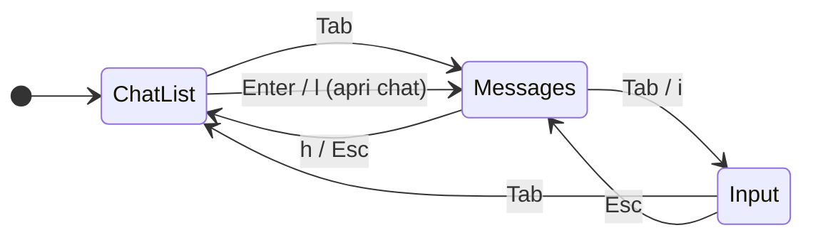
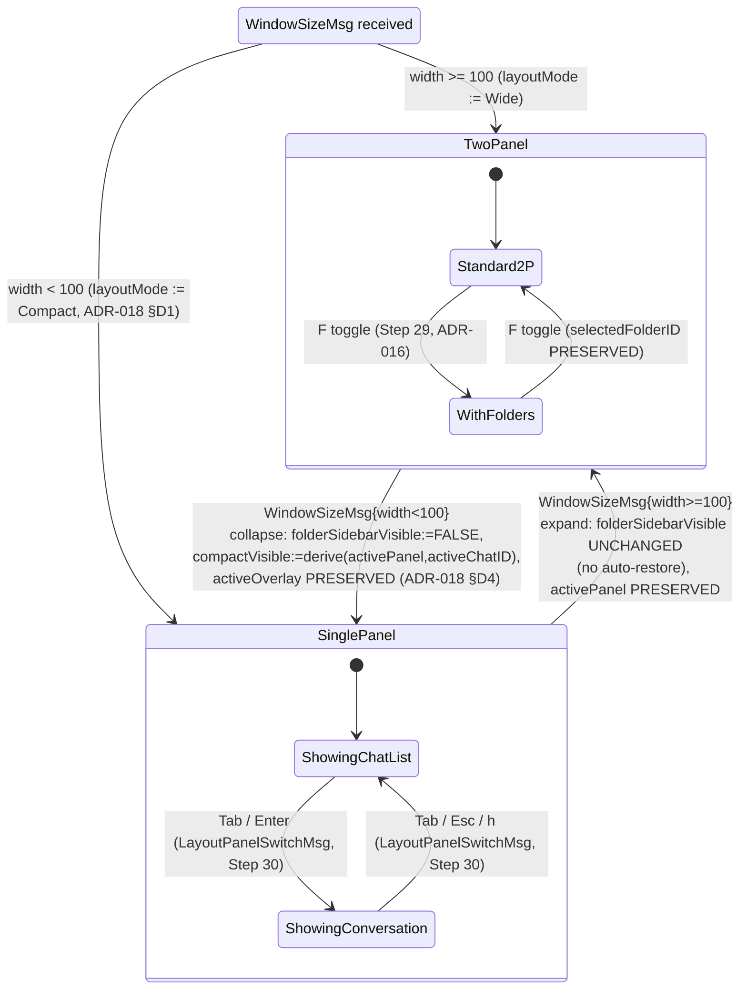
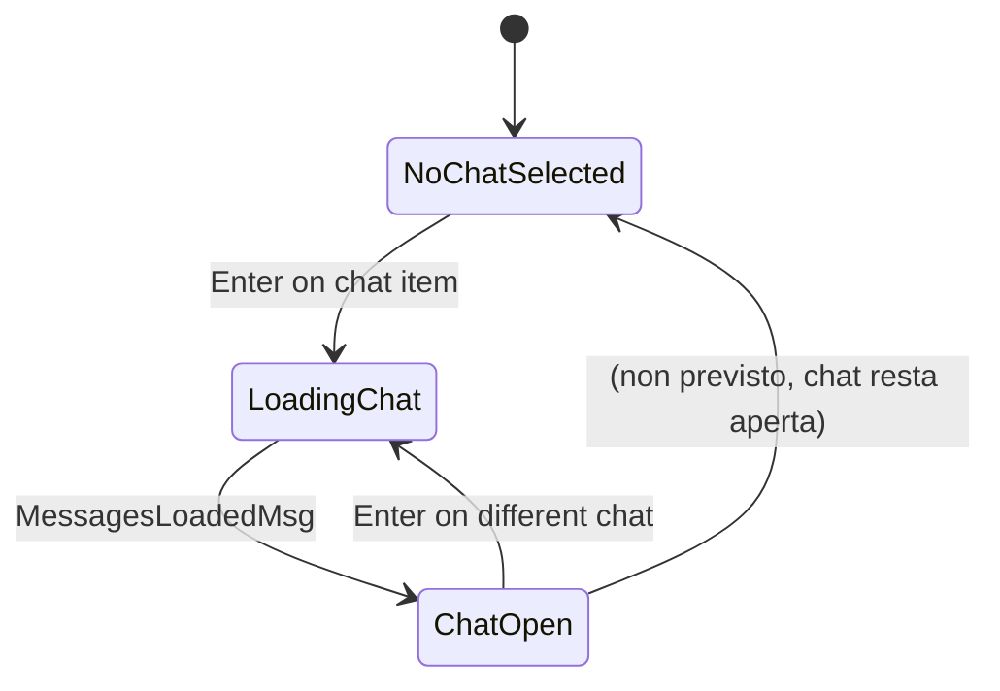

# UI Statechart

Statechart gerarchico (Harel) dell'intera interfaccia utente. Definisce tutti gli stati, sotto-stati e transizioni della UI.

## Top-Level States



## Focus State Machine



### Regole di focus

| Pannello focused | Riceve keyboard | Riceve mouse |
|-----------------|----------------|--------------|
| ChatList | j/k nav, Enter, g,g, G, azioni chat | click su items, scroll |
| Messages | j/k cursor msg, r/e/f/D/y, Space, scroll | scroll, click msg |
| Input | Testo, Enter (send), Shift+Enter | click, selezione testo |

**Tutti i pannelli** ricevono sempre: Tab, Esc, `/`, `Ctrl+P`, `?`, `Ctrl+Q`, `F`, `i`.

## Overlay State Machine

Gli overlay sono modali: quando attivi, catturano tutto l'input. Solo Esc o un'azione li chiude.

```mermaid
stateDiagram-v2
    state "MainView (any focus)" as MV

    MV --> SearchOverlay : /
    MV --> SearchInChat : Ctrl+F
    MV --> CommandPalette : Ctrl+P (Step 28, guard: activeOverlay=none)
    MV --> WhichKey : prefix key (g/z/...) + 300ms tick (Step 28, ADR-015)<br/>fast chord skips overlay (FAST_CHORD_NO_OVERLAY)
    MV --> Help : ? (Step 28, guard: activeOverlay=none)
    MV --> ConfirmDialog : D → confirm
    MV --> ChatInfo : i (Step 29, guard: activeOverlay=none AND activeChatID != nil; cache-first, lazy completion via fetchFullUserCmd, ADR-017)
    MV --> EditOverlay : e (on own msg)
    MV --> ForwardPicker : f (on msg)

    SearchOverlay --> MV : Esc (also during in-flight RPC, ADR-013)
    SearchOverlay --> MV : Enter (SearchSubmitMsg → JumpToMessageMsg)
    SearchInChat --> MV : Esc (NB: NON è un vero overlay — vedi nota sotto)
    CommandPalette --> MV : Esc / Enter (CmdPaletteSubmitMsg → atomic dispatch, Step 28, ADR-015)
    WhichKey --> MV : continuation key (WhichKeyChordMsg) / Esc (WhichKeyCancelMsg) / unknown key (Cancel + best-effort re-dispatch)
    Help --> MV : Esc / ? (HelpCloseMsg, Step 28)
    ConfirmDialog --> MV : Y / N
    ChatInfo --> MV : Esc
    EditOverlay --> MV : Enter (save) / Esc (cancel)
    ForwardPicker --> MV : Enter (forward) / Esc (cancel)
```

> **Nota Step 27**: `SearchInChat` è elencato qui per simmetria di
> trigger (`Ctrl+F` global keybinding), ma a differenza degli altri
> NON è un overlay che usa la primitive `Modal` Crush-style. È una
> **barra inline** dentro la `ConversationModel` (sub-state ortogonale
> a `BrowsingMessages`/`MultiSelect`). Razionale completo in
> [ADR-014](../phase-6-decisions/ADR-014-inline-search-bar-vs-modal.md);
> statechart dettagliato in [`search-in-chat.md`](search-in-chat.md).

## Responsive Layout States

Vedi specifica completa: [`responsive-layout.md`](responsive-layout.md) (Step 30).



**Invarianti chiave Step 30** (verifica TLA+ in
[`../phase-4-concurrency/responsive_layout.tla`](../phase-4-concurrency/responsive_layout.tla)):

- `THRESHOLD_DETERMINISTIC`: `layoutMode` è funzione pura di `width`
  (no hysteresis, ADR-018 §D2).
- `COMPACT_ONE_PANEL`: in Compact, esattamente uno fra
  `{ChatList, Conversation}` è renderizzato (= `compactVisible`).
- `WIDE_TWO_PANELS`: in Wide, entrambi i pannelli sono renderizzati
  (più sidebar opzionale).
- `TAB_PRESERVES_LAYOUT`: `Tab` non flippa `layoutMode` mai (ADR-018 §D3).
- `SIDEBAR_AUTOCLOSE_ON_COLLAPSE` + `SIDEBAR_NO_AUTORESTORE_ON_EXPAND`:
  asimmetria UX al cross-threshold (ADR-018 §D4).
- `OVERLAY_SURVIVES_RESIZE`: gli overlay non si chiudono al
  cross-threshold (rilayouted da `Modal` primitive).

## Chat Selection Flow



## Multi-Select Mode

Vedi specifica completa: [`multi-select.md`](multi-select.md) (Step 22).

```mermaid
stateDiagram-v2
    state "BrowsingMessages (S=∅)" as BM
    state "MultiSelect (S≠∅)" as MS

    [*] --> BM

    BM --> MS : Space (S := {cursor.id})
    MS --> MS : Space (toggle cursor.id in S)
    MS --> MS : j/k (cursore; S invariato)
    MS --> BM : Esc (S := ∅)
    MS --> BM : Space causa |S|=0
    MS --> ForwardPicker : f (su S)
    MS --> ConfirmDialog : D (su S)
    BM --> ForwardPicker : f (fallback su cursore)
    BM --> ConfirmDialog : D (fallback su cursore)
    ForwardPicker --> BM : forward ok (S := ∅)
    ForwardPicker --> MS : forward fail / Esc (S preservato)
    ConfirmDialog --> BM : delete ok (S := ∅)
    ConfirmDialog --> MS : N / Esc (S preservato)
```



**Invarianti chiave** (dettaglio in `multi-select.md`):
- `MultiSelect` ⇔ `S ≠ ∅` (mode coherence)
- `f` / `D` operano su `S` se `|S|>0`, altrimenti sul cursore (graceful fallback)
- `r` / `e` no-op in MultiSelect (single-msg only)

## Search Overlay (Step 26)

Vedi specifica completa: [`search-overlay.md`](search-overlay.md).

L'overlay search è raggiunto da `MainView` qualunque sia il pannello focused
(`/` è keybinding globale). A differenza degli altri overlay, **`Esc` è
accettato anche durante la RPC in volo** (deroga a [ADR-007](../phase-6-decisions/ADR-007-overlay-in-flight-rpc.md);
razionale in [ADR-013](../phase-6-decisions/ADR-013-search-debounce-and-stale-results.md)).
La submit (`Enter` su un hit) emette `JumpToMessageMsg` che attraversa
l'overlay machine e ritorna a `MainView` con la chat target aperta e il
viewport centrato sul `messageID`.

## Command Palette + Which-Key + Help (Step 28)

Vedi specifica completa: [`command-palette-help-whichkey.md`](command-palette-help-whichkey.md).

Step 28 introduce **tre overlay UI-only** (no Telegram API):

- **Command palette** (`Ctrl+P`): full-screen overlay con textinput +
  lista comandi filtrabile via fuzzy subsequence; `Enter` esegue il
  comando focused.
- **Which-key** (prefix `g`/`z`/... + 300ms): dopo prefix-key, parte
  un timer di 300ms; chord completato prima del timeout → esegue
  immediatamente, no overlay; chord non arrivato in 300ms → appare
  overlay piccolo (anchored bottom-right) con lista continuations.
- **Help** (`?`): full-screen overlay con tutti i keybinding, sezioni
  per pannello.

Tutti e tre usano la **primitive `Modal`** introdotta in Step 26
(palette/help: `compact: false` full-screen; which-key: `compact: true`
ancorato). Razionale completo in [ADR-015](../phase-6-decisions/ADR-015-command-palette-whichkey-help.md).

**Mutua esclusione fra overlay** (decisione [ADR-015 §D3](../phase-6-decisions/ADR-015-command-palette-whichkey-help.md)):
il root model mantiene `App.activeOverlay : OverlayKind` (single-value).
Aprire un overlay quando `activeOverlay != none` è no-op silenzioso.
**Eccezione**: la barra inline `SearchInChat` di Step 27
([ADR-014](../phase-6-decisions/ADR-014-inline-search-bar-vs-modal.md))
non è un overlay e non partecipa al lock — `Ctrl+P` / `?` continuano a
passare al root anche con la barra aperta.

**Timer 300ms which-key**: implementato via `tea.Tick(300ms)` con
freshness scheme `latestPrefixID` (monotonic counter + drop-stale,
pattern di [ADR-013](../phase-6-decisions/ADR-013-search-debounce-and-stale-results.md)).
Race tick-vs-chord verificate in
[`../phase-4-concurrency/whichkey.tla`](../phase-4-concurrency/whichkey.tla)
invarianti `STALE_TICK_BENIGN_WHICHKEY`, `FAST_CHORD_NO_OVERLAY`,
proprietà `RACE_CONVERGENCE`.

## Folder Sidebar + Chat Info (Step 29)

Vedi specifica completa: [`folder-sidebar.md`](folder-sidebar.md) e
[`chat-info.md`](chat-info.md).

Step 29 introduce **due nuovi componenti UI** con nature
architetturali differenti:

- **Folder sidebar** (`F`): un **pannello inline** (non-overlay) di
  livello root, sibling di chat list e conversation. Non usa la
  primitive `Modal`. Non partecipa al lock `activeOverlay`. Coesiste
  con qualunque overlay attivo. Toggle bidirezionale `F`. Selezione
  preservata across toggle (`selectedFolderID` survives Hidden →
  Visible → Hidden). La selezione filtra **solo** la chat list:
  `activeChatID` (chat aperta nel pannello destro) è invariato sotto
  filter — vedi invariante `ACTIVE_CHAT_INVARIANT` in
  [`../phase-4-concurrency/folders_chatinfo.tla`](../phase-4-concurrency/folders_chatinfo.tla).
  In compact mode (< 100 cols), la sidebar non si apre (warning in
  status bar). Razionale completo in
  [ADR-016](../phase-6-decisions/ADR-016-folder-source-and-filtering.md).

- **Chat info overlay** (`i`): un **overlay** full-fledged che riusa
  la primitive `Modal` Crush-style con `compact: true` e nuovo
  `placement: right` (estensione minima dell'API Modal). Partecipa al
  lock `activeOverlay` (mutex con palette/whichKey/help/search/
  edit/forward/confirm). Guard di apertura:
  `activeOverlay == none && activeChatID != nil`. Data source
  **cache-first**: l'overlay si apre istantaneamente dalla cache
  locale; campi mancanti (es. bio per chat appena aperte) sono
  fetched in background via `fetchFullUserCmd` con drop-stale by
  `chatInfoTarget` (pattern derivato da
  [ADR-013](../phase-6-decisions/ADR-013-search-debounce-and-stale-results.md) /
  [ADR-015](../phase-6-decisions/ADR-015-command-palette-whichkey-help.md),
  freshness key è ChatID). Read-only in Step 29 (nessun edit /
  leave / kick). `F` durante chat info open è UX-consumed dall'overlay
  (no-op silenzioso) per evitare layout shift confuso. Razionale
  completo in
  [ADR-017](../phase-6-decisions/ADR-017-chat-info-data-source.md).

**Invarianti chiave** (verifica TLA+ in
[`../phase-4-concurrency/folders_chatinfo.tla`](../phase-4-concurrency/folders_chatinfo.tla)):

- `MUTEX_OVERLAYS_EXTENDED`: estende il mutex di
  [ADR-015 §D3](../phase-6-decisions/ADR-015-command-palette-whichkey-help.md)
  con il valore `chatInfo`.
- `INFO_TARGET_COHERENCE`: `chatInfoTarget != nil ⟺ activeOverlay = chatInfo`.
- `STALE_COMPLETION_DROP`: completion per chat diversa da target è no-op.
- `SIDEBAR_OVERLAY_ORTHOGONAL`: sidebar visible AND overlay active è
  uno stato VALIDO (sono dimensioni indipendenti).
- `INFO_INDEPENDENT_OF_FOLDER`: `i` apre la chat info anche se
  `activeChatID` è fuori dalla folder selezionata.

## Search In Chat — inline bar (Step 27)

Vedi specifica completa: [`search-in-chat.md`](search-in-chat.md).

`Ctrl+F` apre una **barra inline** nella `ConversationModel` (NON un
overlay full-screen — vedi distinzione architetturale in
[ADR-014](../phase-6-decisions/ADR-014-inline-search-bar-vs-modal.md)).
È un **sub-state ortogonale** a `BrowsingMessages` e `MultiSelect` dentro
`ConversationFocused`: la barra cattura input testuale + Enter/Shift+Tab/Esc,
mentre le scorciatoie globali (`/`, `Ctrl+P`, `?`) restano accessibili.

La ricerca è **client-side** sui messaggi gia in memoria (no RPC, no
debounce). Le occorrenze sono **highlight-ate inline** nel viewport
con span lipgloss `bg=accent`. Mutazioni della lista messaggi
(`NewMessageMsg`, `LoadMoreMsg`, `MessageDeletedMsg`, `MessageEditedMsg`)
mentre la barra è aperta triggrano un **re-index incrementale** che
preserva l'identità (msgID) del match corrente — vedi invariante
`MATCH_IDENTITY_PRESERVED_*` in
[`../phase-4-concurrency/search_in_chat.tla`](../phase-4-concurrency/search_in_chat.tla).

## Responsive Layout — compact mode (Step 30)

Vedi specifica completa: [`responsive-layout.md`](responsive-layout.md).

Step 30 introduce **due nuove dimensioni di stato** nel root model:

- **`layoutMode ∈ {Wide, Compact}`**: funzione pura di
  `WindowSizeMsg.Width` con threshold = 100 colonne. **Idempotente**
  (stesso half-plane → no flip), **deterministica** (no hysteresis,
  no debounce, [ADR-018 §D1, §D2](../phase-6-decisions/ADR-018-responsive-layout-threshold-and-tab.md)).

- **`compactVisible ∈ {ChatList, Conversation}`**: meaningful solo
  in `Compact`. Determina quale dei due pannelli è renderizzato
  (single-pane). Switch via `Tab` / `Esc` / `h`. Al cross-threshold
  Wide → Compact, derivato da `(activePanel, activeChatID)` per
  preservare la conversazione attiva ([ADR-018 §D4](../phase-6-decisions/ADR-018-responsive-layout-threshold-and-tab.md)).

**`Tab` semantica context-aware** ([ADR-018 §D3](../phase-6-decisions/ADR-018-responsive-layout-threshold-and-tab.md)):

- In `Wide` → `FocusNextMsg` (focus cycle pre-esistente,
  ChatList → Messages → Input).
- In `Compact` → `LayoutPanelSwitchMsg` (toggle `compactVisible`).
- Con `activeOverlay != none` → consumato dall'overlay (no-op
  layout-side, coerente con [ADR-015 §D3](../phase-6-decisions/ADR-015-command-palette-whichkey-help.md)).

**Side-effect cross-threshold** ([ADR-018 §D4](../phase-6-decisions/ADR-018-responsive-layout-threshold-and-tab.md)):

| Transizione | Side-effect |
|-------------|-------------|
| Wide → Compact (collapse) | `folderSidebarVisible := FALSE` (auto-close, ADR-016 §D5); `compactVisible := derive(activePanel, activeChatID)`; `selectedFolderID`/`activeChatID`/`activeOverlay` PRESERVATI |
| Compact → Wide (expand) | `folderSidebarVisible` UNCHANGED (no auto-restore); `activePanel`/`activeChatID`/`activeOverlay` PRESERVATI |

**Invarianti chiave** (verifica TLA+ in
[`../phase-4-concurrency/responsive_layout.tla`](../phase-4-concurrency/responsive_layout.tla)):

- `THRESHOLD_DETERMINISTIC`: `layoutMode = ComputeMode(width)` (funzione pura).
- `COMPACT_ONE_PANEL`: `layoutMode = Compact ⟹ exactly one panel rendered`.
- `WIDE_TWO_PANELS`: `layoutMode = Wide ⟹ both panels rendered`.
- `TAB_PRESERVES_LAYOUT`: `LayoutPanelSwitchMsg` non muta `layoutMode`.
- `OVERLAY_SURVIVES_RESIZE`: `WindowSizeMsg` non chiude overlay.
- `ACTIVE_CHAT_INVARIANT_RESIZE`: `WindowSizeMsg` non muta `activeChatID`.
- `IDEMPOTENT_SAME_HALFPLANE`: resize nello stesso half-plane → no-op
  su `layoutMode`/`compactVisible`.

**Coesistenza con altri sub-state**: `layoutMode` è ortogonale a
`activeOverlay`, `searchInChat.active`, `S` (multi-select), `selectedFolderID`,
`chatInfoTarget`. Tutte le combinazioni sono valide; al cross-threshold
nessuna è violata (eccetto auto-close della sidebar, intentional).
