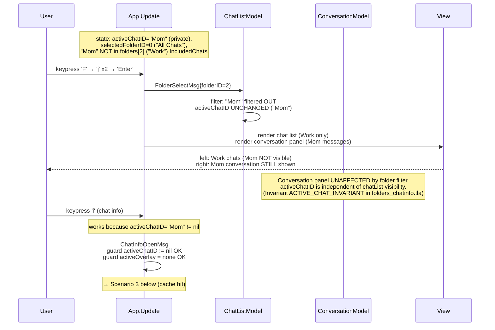
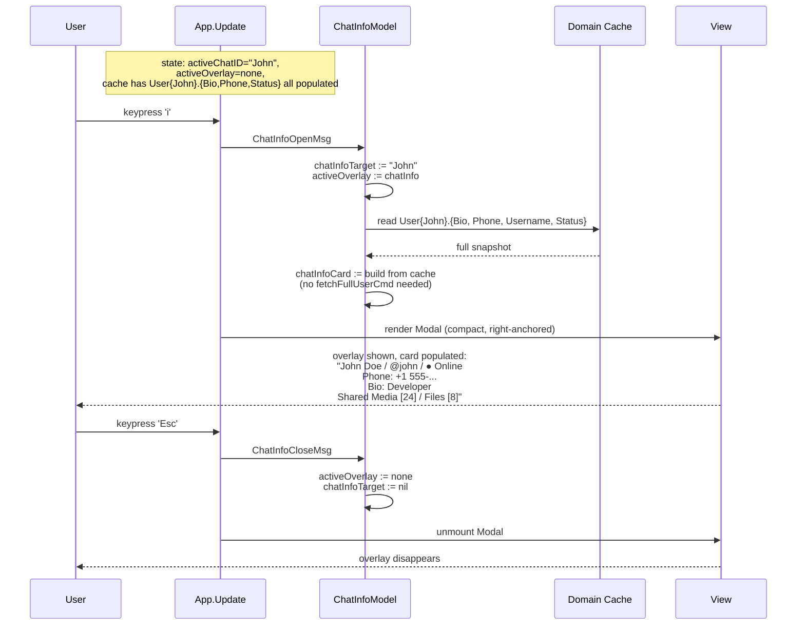
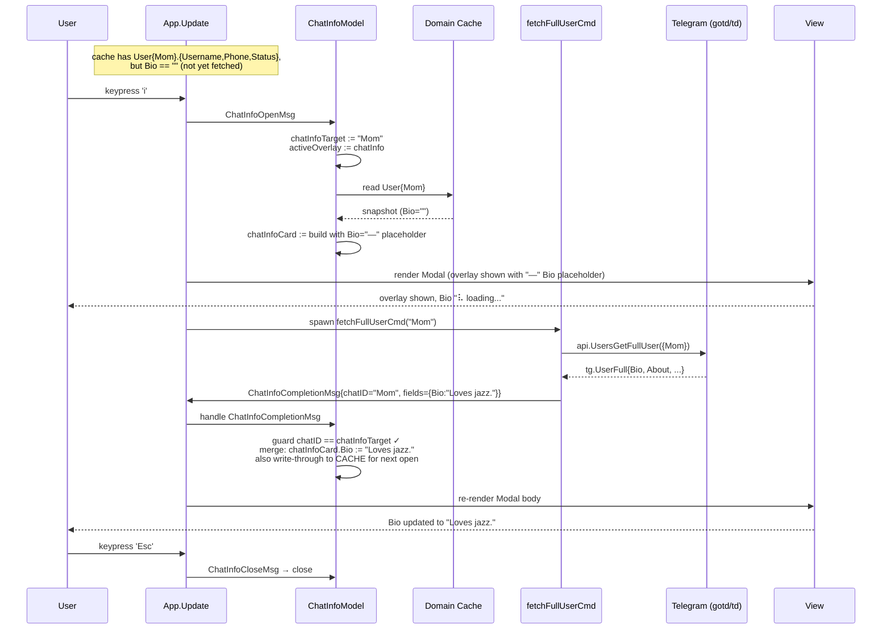
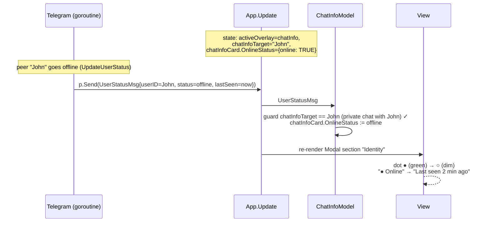
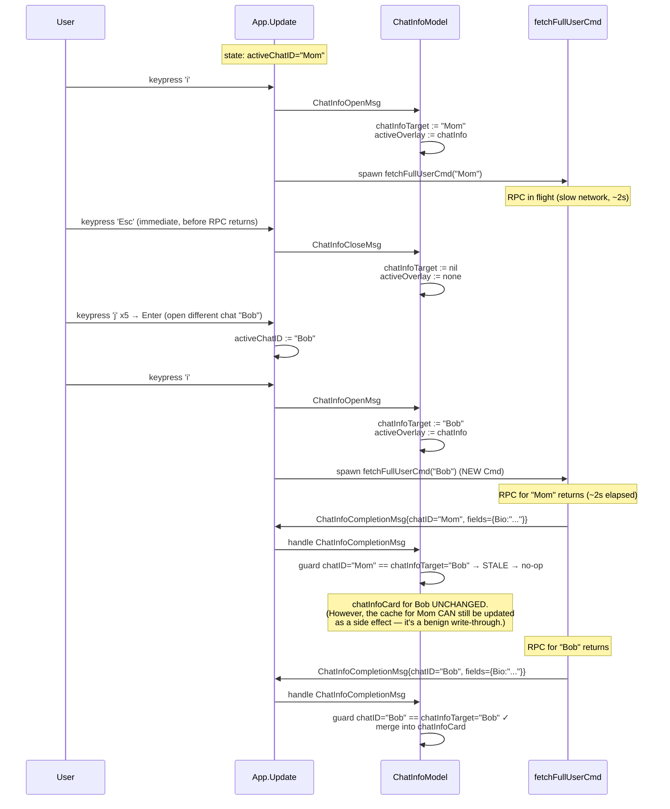
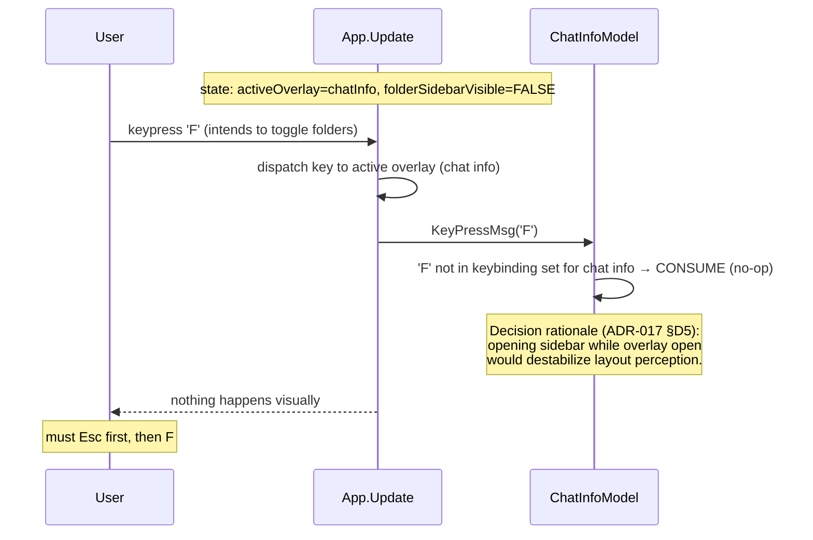

# Folder Sidebar + Chat Info — Sequence Diagrams (Step 29)

Flussi runtime della **folder sidebar** (`F`) e dell'**overlay chat
info** (`i`) introdotti nello Step 29. Complementare agli statechart
in [`../phase-2-behavioral/folder-sidebar.md`](../phase-2-behavioral/folder-sidebar.md)
e [`../phase-2-behavioral/chat-info.md`](../phase-2-behavioral/chat-info.md).

Sette scenari coprono i path interessanti:

1. **Folder toggle on → select folder → toggle off** — happy path
   sidebar.
2. **Folder filter preserva la chat aperta** — l'utente apre Work,
   ma la chat di "Mom" (private, non in Work) resta visibile sulla
   destra.
3. **Chat info open con cache hit completo** — `i` su una private
   chat con bio gia fetched.
4. **Chat info open con cache miss** — `i` triggera lazy completion
   `users.getFullUser`.
5. **Chat info live update** — `UserStatusMsg` durante info open
   refresha il dot.
6. **Stale completion** — l'utente chiude e riapre su una chat
   diversa; il completion della prima arriva e viene droppato.
7. **F durante chat info open** — `F` consumato dall'overlay (UX
   guard, ADR-017 §D5).

## 1. Folder toggle on → select "Work" → toggle off

```mermaid
sequenceDiagram
    participant U as User
    participant APP as App.Update
    participant FOLD as FolderModel
    participant CL as ChatListModel
    participant V as View (renderer)

    Note over APP: state: folderSidebarVisible=FALSE,<br/>selectedFolderID=0 ("All Chats"),<br/>folders=[All Chats, Personal, Work, Channels]

    U->>APP: keypress 'F' (focus on chat list)
    APP->>FOLD: FolderToggleMsg
    FOLD->>FOLD: folderSidebarVisible := TRUE<br/>folderCursor := index(selectedFolderID) = 0<br/>focus := folders (Visible.Browsing)
    APP->>V: re-layout: 3 panels (folders | chatlist | conv)
    V-->>U: sidebar appears at left,<br/>"All Chats" highlighted

    U->>APP: keypress 'j' (3 times)
    APP->>FOLD: FolderCursorMsg{+1} x3
    FOLD->>FOLD: folderCursor: 0 → 1 → 2
    V-->>U: cursor on "Work"

    U->>APP: keypress 'Enter'
    APP->>FOLD: FolderSelectMsg{folderID=2}
    FOLD->>FOLD: selectedFolderID := 2
    APP->>CL: re-filter chat list (sync, no RPC)<br/>filtered := dialogs.filter(c -> c.ID in folders[2].IncludedChats)
    CL->>CL: cursor reset to 0 if previous was filtered out
    APP->>V: re-render chat list panel
    V-->>U: chat list now shows only "Work" chats

    U->>APP: keypress 'F'
    APP->>FOLD: FolderToggleMsg
    FOLD->>FOLD: folderSidebarVisible := FALSE<br/>selectedFolderID PRESERVED (still 2)<br/>focus := chatList
    APP->>V: re-layout: 2 panels (chatlist | conv)
    V-->>U: sidebar disappears,<br/>chat list STILL filtered to Work

    Note over APP: filter persists; F again would reopen<br/>sidebar with cursor on "Work"
```

**Punto chiave**: `selectedFolderID` è **preservato** attraverso il
toggle off. Riaprire la sidebar mostra la stessa selezione. L'utente
deve esplicitamente selezionare "All Chats" per rimuovere il filtro.

## 2. Folder filter preserva la chat aperta



**Punto chiave**: il filtro folder agisce sulla **chat list** (left
panel), non sulla **conversazione attiva** (right panel). L'utente può
quindi continuare a leggere/scrivere alla chat aperta anche se non
appare nella lista filtrata, e può aprire la chat info via `i`.

## 3. Chat info open — cache hit completo



**Punto chiave**: nel path felice, l'overlay è istantaneo (no spinner,
no RPC). Tutti i campi vengono dal `Domain Cache` materializzato da
`DialogsLoadedMsg`.

## 4. Chat info open — cache miss (lazy completion)



**Punto chiave**: lazy completion è **best-effort**. L'overlay si apre
sempre subito; il bio si materializza in un secondo frame. Se la RPC
fallisce, status-bar mostra dim message (non blocca l'overlay).

## 5. Live update durante chat info open



Stesso pattern per `ChatUpdateMsg` (es. titolo gruppo cambiato,
member count incrementato).

## 6. Stale completion — utente chiude e riapre su chat diversa



**Punto chiave**: il completion stale è **droppato a render-time**
(non muta `chatInfoCard`), ma la cache per "Mom" può comunque essere
aggiornata (write-through benigno, accelera il prossimo open su Mom).
Pattern formalmente verificato in `folders_chatinfo.tla` invariante
`STALE_COMPLETION_DROP`.

## 7. F durante chat info open — overlay consuma



**Punto chiave**: la sidebar **non** è un overlay e tecnicamente non
viola il mutex `activeOverlay`. Tuttavia per coerenza UX, l'overlay
chat info **consuma** `F` (no-op). L'utente deve chiudere l'overlay
(`Esc`) prima di aprire la sidebar. Decisione in
[ADR-017 §D5](../phase-6-decisions/ADR-017-chat-info-data-source.md).

## Riepilogo invarianti runtime

| Invariante | Esempio scenario |
|------------|------------------|
| `selectedFolderID` preservato attraverso toggle | Scenario 1 |
| `activeChatID` indipendente dalla chat list filtrata | Scenario 2 |
| Open chat info è sincrono, completion best-effort | Scenari 3, 4 |
| Live updates re-render solo se `chatID == chatInfoTarget` | Scenario 5 |
| Stale completion droppato a return-time | Scenario 6 |
| Sidebar coesiste con chat info, ma `F` durante info è UX-consumed | Scenario 7 |

## Cross-links

- Statechart sidebar: [`../phase-2-behavioral/folder-sidebar.md`](../phase-2-behavioral/folder-sidebar.md)
- Statechart chat info: [`../phase-2-behavioral/chat-info.md`](../phase-2-behavioral/chat-info.md)
- TLA+: [`../phase-4-concurrency/folders_chatinfo.tla`](../phase-4-concurrency/folders_chatinfo.tla)
- ADR folder source: [ADR-016](../phase-6-decisions/ADR-016-folder-source-and-filtering.md)
- ADR chat info data source + Modal reuse: [ADR-017](../phase-6-decisions/ADR-017-chat-info-data-source.md)
- Mutex pattern: [ADR-015 §D3](../phase-6-decisions/ADR-015-command-palette-whichkey-help.md)
- Drop-stale pattern: [ADR-013](../phase-6-decisions/ADR-013-search-debounce-and-stale-results.md), [ADR-010](../phase-6-decisions/ADR-010-typing-ttl-strategy.md)
- Pipeline step: [`../development-pipeline.md` §Step 29](../development-pipeline.md)
