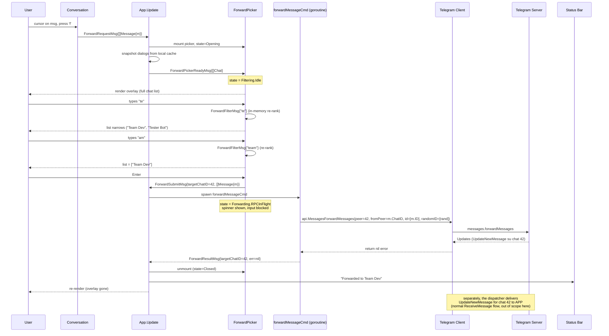
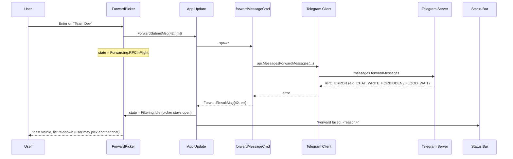
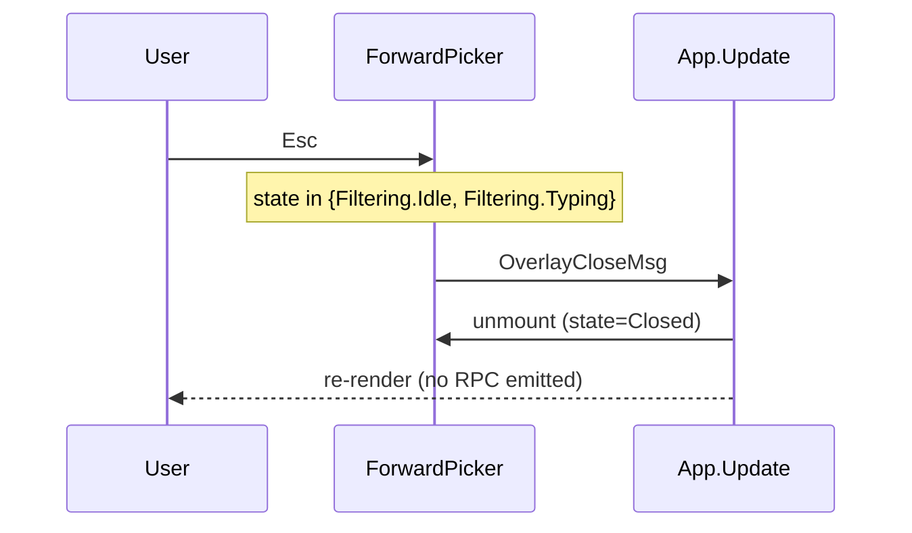
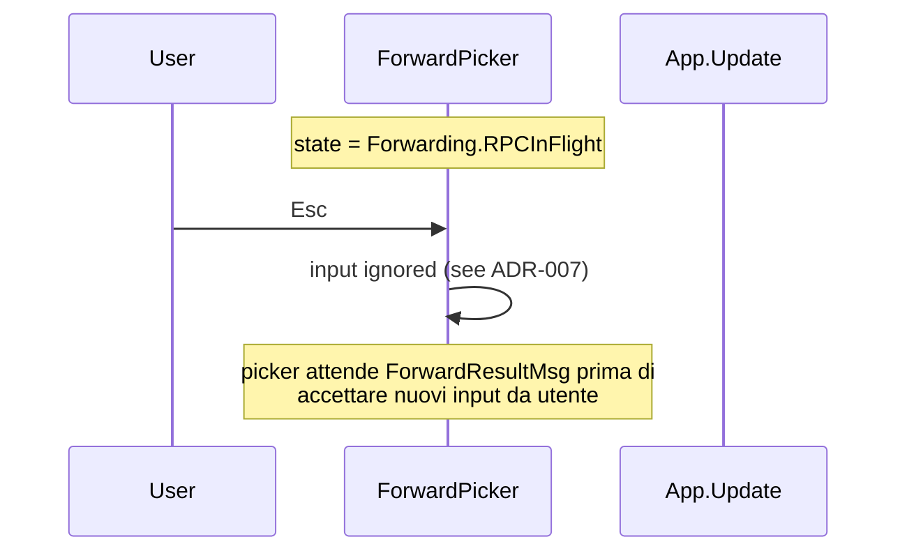
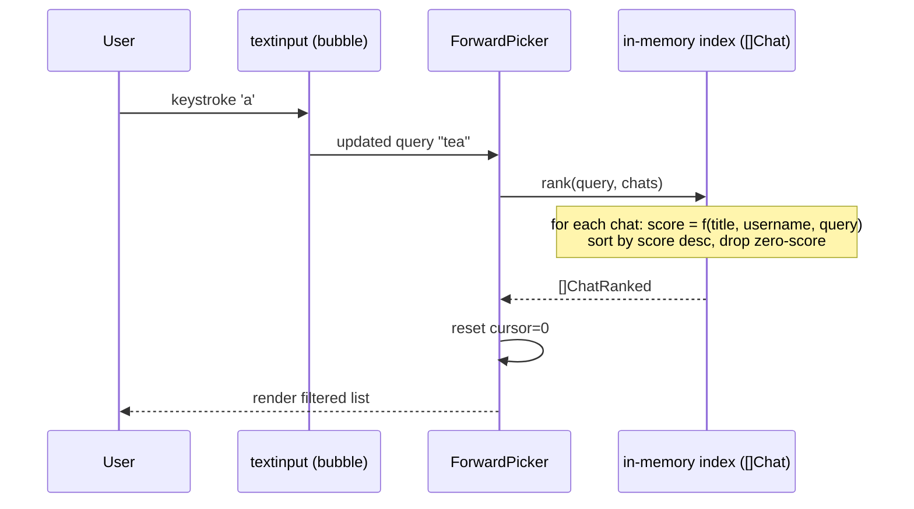

# Forward Flow — Sequence Diagrams (Step 21)

Flusso runtime del **forward** di un singolo messaggio. Complementare allo
statechart in [`../phase-2-behavioral/forward-picker.md`](../phase-2-behavioral/forward-picker.md).

Scenario 9 in [`scenarios.md`](scenarios.md) era già un abbozzo; questo
documento lo estende con il dettaglio del fuzzy filter, del concurrency model
e dei path di errore introdotti dallo Step 21.

## Happy path — single message forward

## Error path — RPC fallisce

## Cancel path — Esc prima di submit

## Cancel durante RPC — bloccato (ADR-007)

## Fuzzy filter — detail

Ranking è **sincrono e in-memory** (nessuna RPC). La lista sorgente è uno
snapshot dei dialogs già in cache al momento dell'apertura; eventuali update
concorrenti (nuovi dialogs, rename chat) non impattano l'overlay attivo — vedi
invariante "Source = snapshot" in `forward-picker.md`.

## Mapping tea.Cmd

Aggiornamento alla tabella "Mapping tea.Cmd" in
[`../phase-1-context/message-taxonomy.md`](../phase-1-context/message-taxonomy.md):

| Azione utente | Cmd | API gotd/td | Result Msg |
|---------------|-----|-------------|------------|
| `f` → select chat → Enter | `forwardMessageCmd` | `api.MessagesForwardMessages` | `ForwardResultMsg` |

## Cross-links

- Statechart: [`../phase-2-behavioral/forward-picker.md`](../phase-2-behavioral/forward-picker.md)
- Concurrency invariants: [`../phase-4-concurrency/README.md`](../phase-4-concurrency/README.md) §Forward RPC
- Pipeline: [`../development-pipeline.md` §Step 21](../development-pipeline.md)
- Decisioni: [ADR-006](../phase-6-decisions/ADR-006-forward-fuzzy-algorithm.md),
  [ADR-007](../phase-6-decisions/ADR-007-overlay-in-flight-rpc.md)
