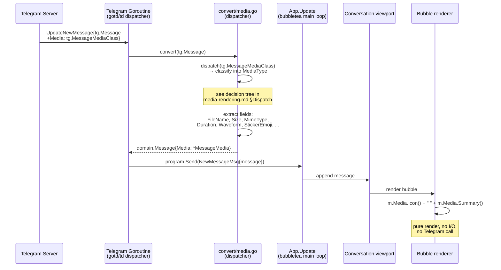
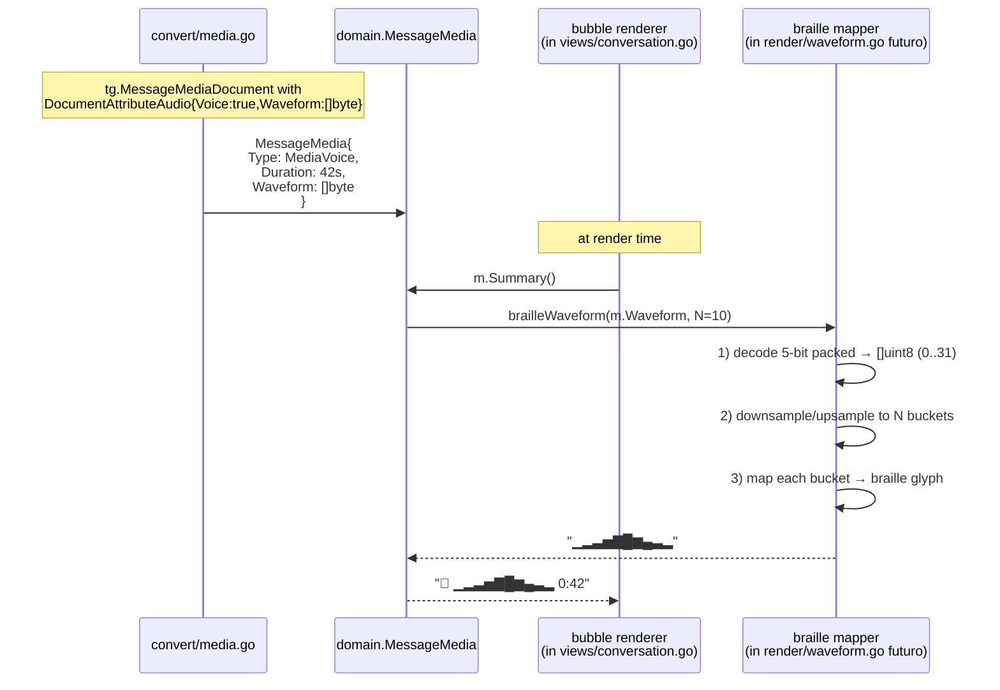
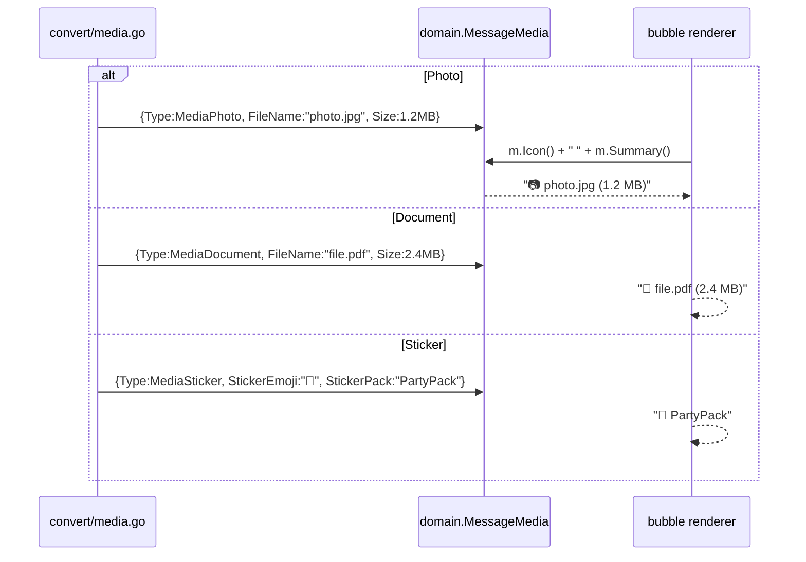

# Media Flow — Sequence Diagrams & Braille Mapping (Step 24)

Flusso runtime del rendering media. Complementare allo statechart e
decision tree in
[`../phase-2-behavioral/media-rendering.md`](../phase-2-behavioral/media-rendering.md).

## 1. Ingest — `tg.Message` con media → render in viewport



**Punti notevoli**:
- Tutto il classifying avviene **una volta** in `convert/media.go`, non a
  ogni render.
- `Icon()` e `Summary()` sono **pure**, nessun side-effect, nessuna
  chiamata a server. Step 24 è display-only.
- Nessun nuovo `tea.Msg` introdotto: il flusso è lo stesso di Step 17
  (real-time receive) e Step 11 (history load).

## 2. Caso voice — pipeline waveform



## 3. Caso photo / document / sticker (senza waveform)



## 4. Fallback rules — campi mancanti

```mermaid
sequenceDiagram
    participant CONV as convert/media.go
    participant DOM as domain.MessageMedia
    participant REND as bubble renderer

    Note over CONV: input variations from server

    alt FileName missing
        CONV->>DOM: {Type:MediaDocument, FileName:"", MimeType:"application/pdf", Size:1024}
        REND-->>REND: "📎 document.pdf (1.0 KB)"<br/>(synthetic name from mime)
    else Size = 0
        CONV->>DOM: {Type:MediaDocument, FileName:"x.bin", Size:0}
        REND-->>REND: "📎 x.bin"<br/>(no parens block)
    else Waveform empty (voice)
        CONV->>DOM: {Type:MediaVoice, Duration:42s, Waveform:nil}
        REND-->>REND: "🎤 ──────────── 0:42"<br/>(flat line, N dashes; see ADR-011)
    else Sticker no Alt
        CONV->>DOM: {Type:MediaSticker, StickerEmoji:"", StickerPack:"X"}
        REND-->>REND: "🖼️ X"
    else Sticker no pack
        CONV->>DOM: {Type:MediaSticker, StickerEmoji:"🎉", StickerPack:""}
        REND-->>REND: "🎉"
    end
```

I fallback sono **deterministici** e non producono mai stringa vuota: il
bubble è sempre visivamente identificabile come "media message".

## Braille Waveform — Mapping Specification

Il waveform Telegram è un `[]byte` con campioni a **5 bit packed**
little-endian (range `0..31`). Documentazione MTProto:
[`documentAttributeAudio.waveform`](https://core.telegram.org/api/files#audio-waveforms).

**Goal**: produrre una stringa di **N glifi braille verticali**
(`▁▂▃▄▅▆▇█`) che rappresenti l'inviluppo di ampiezza, allineata in larghezza
fissa per non rompere il layout monospace del bubble.

### Parametri

| Parametro | Valore Step 24 | Razionale |
|-----------|----------------|-----------|
| `N` (numero glifi) | **10** (fisso) | Larghezza compatta, allineamento bubble. Vedi [ADR-011](../phase-6-decisions/ADR-011-media-rendering-taxonomy.md) §Bar count. |
| Charset | `▁▂▃▄▅▆▇█` (8 livelli) | Block-element Unicode, monospace-safe, fontmap universale. |
| Sample-bit-depth | 5 bit (range 0..31) | Spec Telegram. |

### Pseudocodice (linguaggio-agnostico)

```text
function brailleWaveform(data: []byte, N: int) -> string:
    if len(data) == 0 or N <= 0:
        return repeat("─", N)            # fallback flat line

    # --- 1. Decode 5-bit packed amplitudes ---
    samples = []
    bitCursor = 0
    while bitCursor + 5 <= len(data) * 8:
        byteIdx = bitCursor / 8
        bitOff  = bitCursor % 8
        # read 5 bits straddling byte boundary
        v = (data[byteIdx] >> bitOff) & 0x1F
        if bitOff > 3:
            v |= (data[byteIdx+1] << (8 - bitOff)) & 0x1F
        samples.append(v)                # v in 0..31
        bitCursor += 5

    if len(samples) == 0:
        return repeat("─", N)

    # --- 2. Resample to exactly N buckets (mean over window) ---
    buckets = [0.0] * N
    counts  = [0] * N
    for i, s in enumerate(samples):
        b = (i * N) / len(samples)       # integer floor
        buckets[b] += s
        counts[b]  += 1
    for b in range(N):
        if counts[b] > 0:
            buckets[b] = buckets[b] / counts[b]
        else:
            buckets[b] = 0               # empty bucket (rare: N > len(samples))

    # --- 3. Map each bucket to one of 8 braille block glyphs ---
    glyphs = ["▁", "▂", "▃", "▄", "▅", "▆", "▇", "█"]
    out = ""
    for b in buckets:
        # b in 0..31; map linearly to 0..7 (8 buckets)
        idx = floor(b * 8 / 32)          # 0..7
        if idx > 7: idx = 7              # clamp (defensive; b<=31 ensures it but be safe)
        out += glyphs[idx]
    return out
```

### Proprietà formali (verificate in `media_waveform.tla`)

Riassunto delle proprietà; spec completa in
[`../phase-4-concurrency/media_waveform.tla`](../phase-4-concurrency/media_waveform.tla).

1. **Totalità**: `brailleWaveform(data, N)` è definito per **ogni**
   `[]byte` (incluso `nil`, `[]`, lunghezze non multiple di 5 bit) e per
   `N >= 0`. Mai panic, mai out-of-bounds.

2. **Determinismo**: stessa input `(data, N)` → stessa output. Nessun
   randomness, nessuna dipendenza da clock o ordering.

3. **Output length**: la stringa risultante ha **esattamente N glifi**
   (in termini di runes/code points; in byte può variare perché ogni
   glifo block-element è 3 byte UTF-8).

4. **Monotonicità della scala**: ampiezza più alta → glifo più "alto".
   Formalmente: se bucket `b1 <= b2` (su scala 0..31), allora
   `glyphIdx(b1) <= glyphIdx(b2)`. Questo è quanto conta visivamente:
   nessuna inversione percettiva.
   - 0 (silenzio) → `▁` (idx 0)
   - 31 (max) → `█` (idx 7)

5. **Edge cases coperti**:
   - `data == nil` → flat line `──────────` (N dashes).
   - `data == []` → flat line.
   - `len(samples) < N` → buckets vuoti = 0 = `▁` (visivamente "silenzio"
     nelle posizioni senza dati).
   - `len(samples) > N` → media aritmetica nel bucket (downsample).

6. **Robustezza al boundary 5-bit/8-bit**: il decoder gestisce sia
   campioni che cadono dentro un byte, sia campioni che straddle due
   byte. Non legge oltre `len(data)`.

### Tabella di mapping ampiezza → glifo

| Ampiezza (0..31) | Idx (0..7) | Glifo | Descrizione |
|------------------|------------|-------|-------------|
| 0..3 | 0 | `▁` | silenzio / quasi |
| 4..7 | 1 | `▂` | molto basso |
| 8..11 | 2 | `▃` | basso |
| 12..15 | 3 | `▄` | medio-basso |
| 16..19 | 4 | `▅` | medio |
| 20..23 | 5 | `▆` | medio-alto |
| 24..27 | 6 | `▇` | alto |
| 28..31 | 7 | `█` | massimo |

(Calcolato come `idx = floor(amp * 8 / 32) = amp >> 2`. Cap a 7 per
sicurezza anche se `amp <= 31` lo garantirebbe.)

### Nota sull'alternativa "braille pattern" (256 glifi)

Lo Unicode block U+2800..U+28FF contiene 256 glifi braille a 8 punti
(`⠁⠂⠃...⣿`). Permetterebbero di mostrare **2 sample per colonna** (più
densità). Scartato:

- I glifi braille sono **proportional** in molte font terminali → rompe
  l'allineamento monospace del bubble.
- La fontmap braille non è universalmente coperta dai temi terminale
  (alcune font dev mostrano box vuoti).
- Block-element (`▁..█`) è universale, monospace puro, già usato
  dalla maggior parte dei TUI (gotop, btop, gh chart).

Vedi [ADR-011](../phase-6-decisions/ADR-011-media-rendering-taxonomy.md)
§Charset choice per la decisione formale.

## Mapping tea.Cmd

Lo Step 24 **non aggiunge** nessuna nuova `tea.Cmd` né nuovo
`tea.Msg`. Il flusso end-to-end riusa:

| Evento | Cmd / Msg | Step di origine |
|--------|-----------|-----------------|
| Ricezione messaggio (con o senza media) | `NewMessageMsg` | Step 17 |
| Caricamento history | `MessagesLoadedMsg` | Step 11 |
| Render bubble | (puro `View()`, no Cmd) | Step 12 |

L'unica logica nuova è in `internal/telegram/convert/media.go` (mapping)
e in `internal/model/media.go` (metodi `Icon()`, `Summary()`) +
`internal/ui/render/waveform.go` (funzione braille).

## Cross-links

- Statechart + decision tree: [`../phase-2-behavioral/media-rendering.md`](../phase-2-behavioral/media-rendering.md)
- TLA+ formal spec del braille: [`../phase-4-concurrency/media_waveform.tla`](../phase-4-concurrency/media_waveform.tla)
- Decisione taxonomy + braille charset: [ADR-011](../phase-6-decisions/ADR-011-media-rendering-taxonomy.md)
- Pipeline: [`../development-pipeline.md` §Step 24](../development-pipeline.md)
- Entity mapping (gotd/td → domain): [`../phase-5-data/entity-mapping.md`](../phase-5-data/entity-mapping.md) §Media Mapping
- Domain types: [`../phase-5-data/domain-types.md`](../phase-5-data/domain-types.md) §MessageMedia
