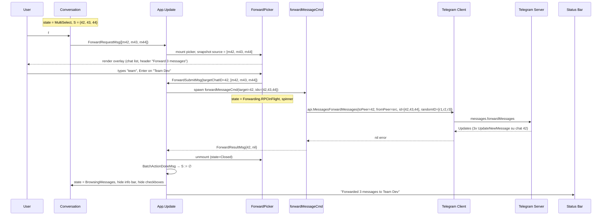
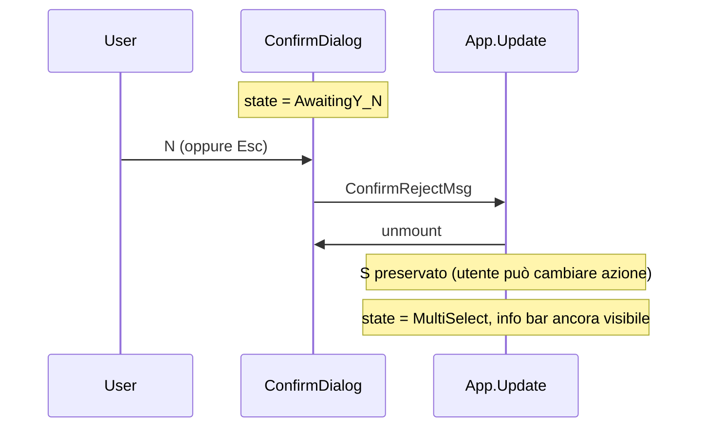
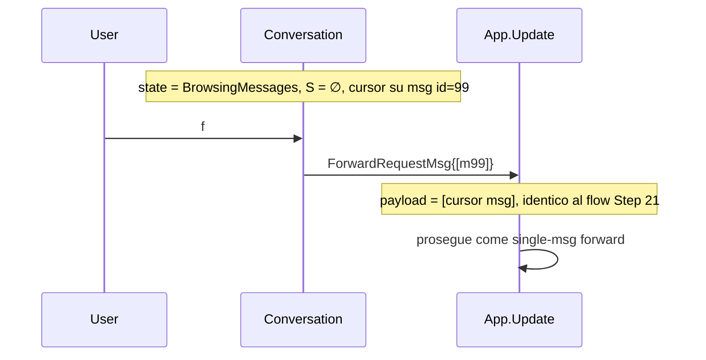

# Multi-Select Flow — Sequence Diagrams (Step 22)

Flusso runtime delle azioni batch (forward, delete) abilitate dalla
multi-selezione introdotta nello Step 22. Complementare allo statechart in
[`../phase-2-behavioral/multi-select.md`](../phase-2-behavioral/multi-select.md).

## 1. Toggle selection — entra e esce da MultiSelect

```mermaid
sequenceDiagram
    participant U as User
    participant CV as Conversation
    participant APP as App.Update
    participant SB as Status Bar / Info Bar

    Note over CV: state = BrowsingMessages, S = ∅
    U->>CV: Space (cursor su msg id=42)
    CV->>APP: SelectToggleMsg{42}
    APP->>APP: S := S ⊕ {42} = {42}
    APP->>CV: re-render: bubble #42 con [✓], info bar visibile
    APP->>SB: header info bar "1 selected | f forward | D delete | Esc cancel"
    Note over CV: state = MultiSelect, S = {42}

    U->>CV: j (cursor → msg id=43)
    CV->>APP: KeyMsg "j"
    APP->>CV: cursor++; S invariato
    CV-->>U: render (msg #43 highlighted, #42 ancora [✓])

    U->>CV: Space
    CV->>APP: SelectToggleMsg{43}
    APP->>APP: S := {42, 43}
    APP->>SB: "2 selected | f forward | D delete | Esc cancel"

    U->>CV: k (cursor → msg id=42)
    U->>CV: Space (toggle off)
    CV->>APP: SelectToggleMsg{42}
    APP->>APP: S := {43}
    APP->>SB: "1 selected | …"

    U->>CV: Esc
    CV->>APP: SelectClearMsg
    APP->>APP: S := ∅
    APP->>SB: hide info bar
    Note over CV: state = BrowsingMessages, S = ∅
```

## 2. Batch forward — happy path



**Nota**: `messages.forwardMessages` accetta nativamente `id: []int` —
una sola RPC per N messaggi. Vedi
[ADR-008](../phase-6-decisions/ADR-008-batch-forward-semantics.md) per la
scelta di non fare fan-out multi-target.

## 3. Batch forward — error path

```mermaid
sequenceDiagram
    participant U as User
    participant OVL as ForwardPicker
    participant APP as App.Update
    participant CMD as forwardMessageCmd
    participant TG as Telegram Client
    participant SRV as Telegram Server
    participant SB as Status Bar

    Note over OVL: state = Forwarding.RPCInFlight, S snapshot = {42,43,44}
    CMD->>TG: api.MessagesForwardMessages(...)
    TG->>SRV: forward
    SRV-->>TG: RPC_ERROR (FLOOD_WAIT_X / CHAT_WRITE_FORBIDDEN)
    TG-->>CMD: error
    CMD-->>APP: ForwardResultMsg{42, err}
    APP->>OVL: state = Filtering.Idle (picker stays open, snapshot S preservato)
    APP->>SB: "Forward failed: <reason>. Retry or pick another chat."
    Note over OVL: utente può scegliere altra chat e riprovare; S non perso
```

`S` rimane intatto durante il fail path: l'utente può immediatamente
ritentare scegliendo un'altra chat, o premere `Esc` per chiudere il picker
(la selezione rimane attiva per ulteriori azioni).

## 4. Batch delete — happy path con confirm

```mermaid
sequenceDiagram
    participant U as User
    participant CV as Conversation
    participant APP as App.Update
    participant DLG as ConfirmDialog
    participant CMD as deleteMessageCmd
    participant TG as Telegram Client
    participant SRV as Telegram Server
    participant SB as Status Bar

    Note over CV: state = MultiSelect, S = {42, 43, 44}
    U->>CV: D
    CV->>APP: DeleteRequestMsg{[m42, m43, m44]}
    APP->>DLG: mount confirm dialog, body = "Delete 3 messages? [Y] [N]"
    DLG-->>U: render overlay

    U->>DLG: Y
    DLG->>APP: ConfirmAcceptMsg
    APP->>CMD: spawn deleteMessageCmd(ids=[42,43,44], revoke=true)
    Note over DLG: state = RPCDelete, spinner

    CMD->>TG: api.MessagesDeleteMessages(id=[42,43,44], revoke=true)
    TG->>SRV: messages.deleteMessages
    SRV-->>TG: Updates (3x UpdateDeleteMessages)
    TG-->>CMD: nil error
    CMD-->>APP: DeleteResultMsg{nil}

    APP->>DLG: unmount
    APP->>APP: BatchActionDoneMsg → S := ∅
    APP->>CV: rimuovi msg 42, 43, 44 dal viewport; cursore al primo successivo o ultimo
    APP->>SB: "Deleted 3 messages"
```

**Nota**: `messages.deleteMessages` accetta `id: []int` → una sola RPC.
Vedi [ADR-009](../phase-6-decisions/ADR-009-batch-delete-confirm.md) per la
scelta del confirm singolo (anziché un confirm per messaggio).

## 5. Batch delete — N (cancel)



`S` non viene cleared dopo `N`: l'utente può decidere di forwardare invece
di cancellare, o aggiungere/rimuovere messaggi prima di riprovare.

## 6. Fallback single-msg (selezione vuota)



Stesso comportamento per `D`: selezione vuota → l'azione opera sul
messaggio sotto il cursore (`{m_cursor}`), preservando la UX dei flow
single-msg di Step 20/21. Vedi
[`../phase-2-behavioral/multi-select.md`](../phase-2-behavioral/multi-select.md)
§Fallback su cursore.

## 7. Concurrent updates durante l'azione batch

```mermaid
sequenceDiagram
    participant SRV as Telegram Server
    participant TG as Telegram Client
    participant APP as App.Update
    participant OVL as ForwardPicker

    Note over OVL: snapshot S = {42, 43, 44} catturato all'apertura
    SRV->>TG: UpdateDeleteMessages{ids=[43]} (msg 43 cancellato da altro client)
    TG-->>APP: MessageDeletedMsg{chatID, 43}
    APP->>APP: rimuovi 43 dal viewport / model
    Note over APP: snapshot dell'overlay NON è mutato (immutable copy)
    Note over OVL: picker procede con [42, 43, 44]; al submit, server risponderà<br/>con messaggio di errore parziale per 43, gli altri vengono inoltrati
```

Il payload è un **immutable snapshot** copiato all'apertura dell'overlay,
verificato dall'invariante `SOURCE_SNAPSHOT` in
[`../phase-4-concurrency/multi_select.tla`](../phase-4-concurrency/multi_select.tla).

## Mapping tea.Cmd

Aggiornamento alla tabella "Mapping tea.Cmd" in
[`../phase-1-context/message-taxonomy.md`](../phase-1-context/message-taxonomy.md):

| Azione utente | Cmd | API gotd/td | Result Msg |
|---------------|-----|-------------|------------|
| `f` su selezione N>1 → Enter | `forwardMessageCmd` | `api.MessagesForwardMessages` (id: `[]int`) | `ForwardResultMsg` |
| `D` su selezione N>1 → Y | `deleteMessageCmd` | `api.MessagesDeleteMessages` (id: `[]int`) | `DeleteResultMsg` |

**Nessun nuovo Cmd**: i `Cmd` esistenti accettano già `[]MessageID`. Il
Step 22 cambia solo l'origine del payload (selezione vs cursore).

## Cross-links

- Statechart: [`../phase-2-behavioral/multi-select.md`](../phase-2-behavioral/multi-select.md)
- Forward picker (riuso): [`../phase-2-behavioral/forward-picker.md`](../phase-2-behavioral/forward-picker.md)
- Concurrency invariants: [`../phase-4-concurrency/multi_select.tla`](../phase-4-concurrency/multi_select.tla)
- Pipeline: [`../development-pipeline.md` §Step 22](../development-pipeline.md)
- Decisioni: [ADR-008](../phase-6-decisions/ADR-008-batch-forward-semantics.md),
  [ADR-009](../phase-6-decisions/ADR-009-batch-delete-confirm.md)
