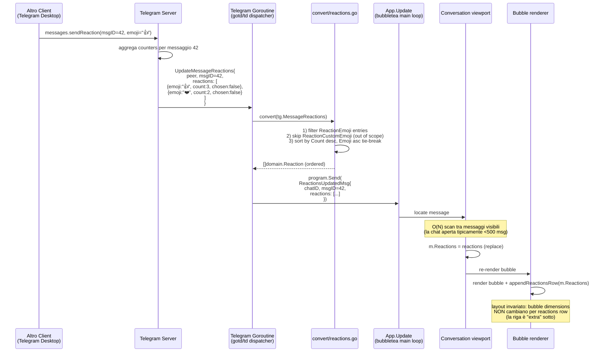
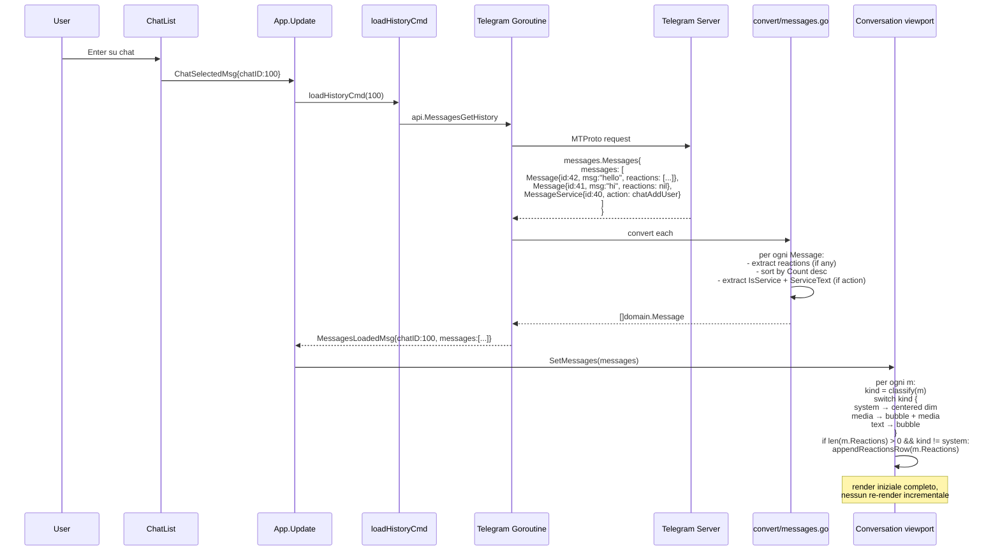
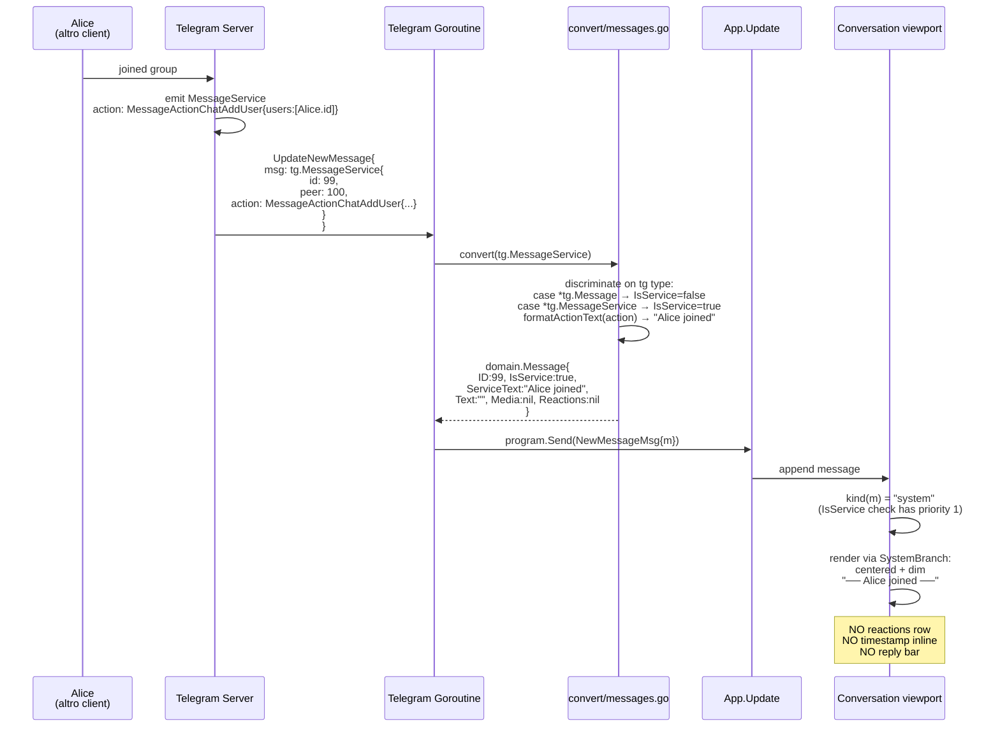
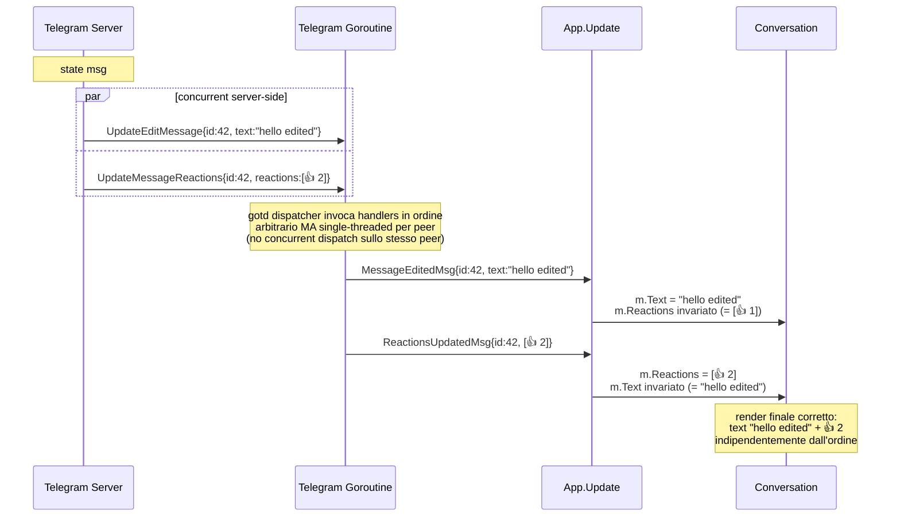
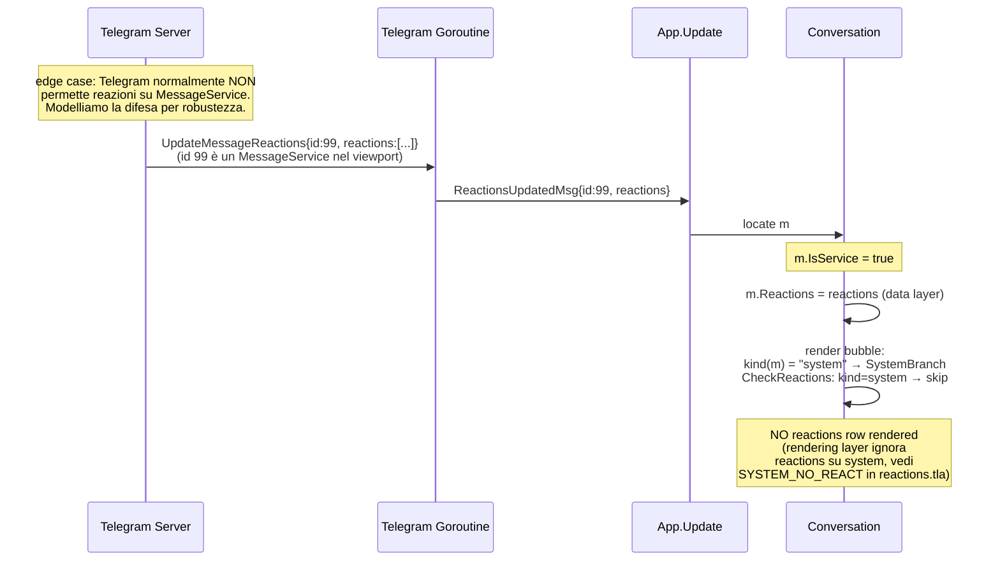
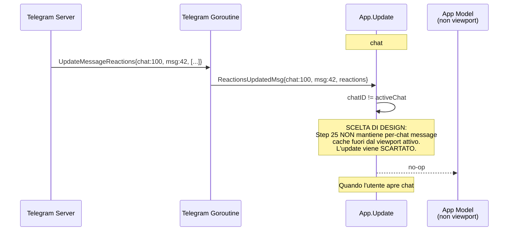

# Reactions & System Messages — Sequence Diagrams (Step 25)

Flusso runtime delle reazioni live e dei system messages.
Complementare allo statechart in
[`../phase-2-behavioral/reactions-and-system.md`](../phase-2-behavioral/reactions-and-system.md).

## 1. Live reaction update — happy path

Scenario di test n.3 dello Step 25 (verbatim italian):
*"Aggiungi una reazione da un altro client → appare in tempo reale".*



**Punti notevoli**:

- Lo **snapshot** di reactions è completo: `m.Reactions := newReactions`
  (replace, non merge). Il server è autoritativo.
- Nessuna RPC verso Telegram: lo Step 25 è puramente consumer di update.
- Il messaggio è già nel viewport (è una chat aperta). Se non è visibile
  (es. arrivato per chat chiusa), il `ReactionsUpdatedMsg` viene
  comunque applicato al modello dati: il prossimo `MessagesLoadedMsg`
  porterà già il nuovo state.

## 2. Initial render — chat open con reactions storiche

Scenario di test n.1 dello Step 25 (verbatim italian):
*"Messaggi con reazioni → riga emoji sotto".*



## 3. System message ingest — un utente entra nel gruppo

Scenario di test n.2 dello Step 25 (verbatim italian):
*"Un utente entra nel gruppo → system message centrato".*



## 4. Reactions update race — message edit + reactions concorrenti

Edge case: due update arrivano molto vicini (server può ordinare
arbitrariamente).



**Invariante chiave** (vedi
[`reactions.tla`](../phase-4-concurrency/reactions.tla) `INDEPENDENT_FIELDS`):
text e reactions sono campi indipendenti, ognuno aggiornato dal proprio
update type. L'ordine di arrivo dei due update non cambia lo stato
finale (commutatività).

## 5. Reactions su system message (sanity)



Lo stato dati può contenere reactions su un service message (per
robustezza), ma il render le ignora.

## 6. Chat chiusa — reactions update non visibile



**Razionale**: lo Step 25 mantiene il modello "viewport-scoped reactions
cache". Il server è autoritativo: una chat riaperta ricarica history,
con reazioni aggiornate. Niente complessità di cache cross-chat.

## Mapping tea.Cmd / tea.Msg

Aggiornamento alla tabella in
[`../phase-1-context/message-taxonomy.md`](../phase-1-context/message-taxonomy.md):

| Evento / azione | Cmd | Result Msg | Step di origine |
|------------------|-----|------------|-----------------|
| `UpdateMessageReactions` ricevuto | (nessuno: solo dispatch) | `ReactionsUpdatedMsg` | Step 25 |
| Ricezione messaggio service | (nessuno: convert layer) | `NewMessageMsg{IsService:true}` | Step 25 (esteso) |
| Caricamento history con service msg | (nessuno: convert layer) | `MessagesLoadedMsg` | Step 11 (esteso in Step 25) |

Nessuna nuova RPC verso Telegram in Step 25. Siamo solo consumer.

## Convert layer — dispatch

```
internal/telegram/convert/messages.go (esistente, esteso):
    convert(tg.MessageClass) → domain.Message
        case *tg.Message:        IsService=false, classify media (Step 24)
        case *tg.MessageService: IsService=true, ServiceText=formatAction(...)
        case *tg.MessageEmpty:   skip (don't produce domain msg)

internal/telegram/convert/reactions.go (NEW):
    convertReactions(tg.MessageReactions) → []domain.Reaction
        for each ReactionCount in Results:
            if Reaction is *ReactionEmoji:
                emit Reaction{Emoji: r.Emoticon, Count: rc.Count, Chosen: rc.Chosen}
            if Reaction is *ReactionCustomEmoji:
                skip (out of scope Step 25)
        sort by Count desc, Emoji asc

internal/telegram/convert/service.go (NEW):
    formatAction(tg.MessageActionClass, fromUserName) → string
        big switch over ~30 action variants (see reactions-and-system.md
        §System Message Classification). Returns "Service message" for
        unknown variants.
```

I tre file sono entry-point puri (nessuno stato, nessun side-effect),
testabili con unit-test deterministici.

## Cross-links

- Statechart + classification: [`../phase-2-behavioral/reactions-and-system.md`](../phase-2-behavioral/reactions-and-system.md)
- TLA+ formal spec: [`../phase-4-concurrency/reactions.tla`](../phase-4-concurrency/reactions.tla)
- Decisione storage + detection: [ADR-012](../phase-6-decisions/ADR-012-reactions-storage-and-system-detection.md)
- Pipeline: [`../development-pipeline.md` §Step 25](../development-pipeline.md)
- Domain types: [`../phase-5-data/domain-types.md`](../phase-5-data/domain-types.md) §Reaction §Message
- Entity mapping: [`../phase-5-data/entity-mapping.md`](../phase-5-data/entity-mapping.md) §Reactions §System Message
