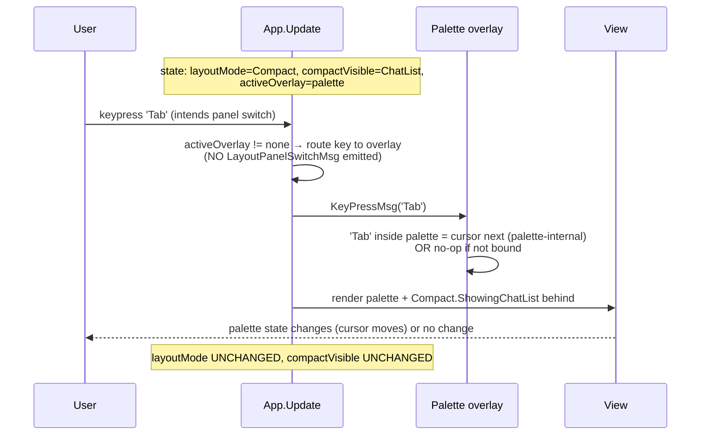

# Responsive Layout — Sequence Diagrams (Step 30)

Flussi runtime del **layout responsive** (`WindowSizeMsg` cross-threshold,
`Tab` panel switch in Compact) introdotto nello Step 30. Complementare
allo statechart in
[`../phase-2-behavioral/responsive-layout.md`](../phase-2-behavioral/responsive-layout.md).

Sei scenari coprono i path interessanti:

1. **Boot in Wide** — startup con terminale ≥ 100 cols, layout
   pre-esistente; nessun cambio.
2. **Boot in Compact** — startup con terminale < 100 cols, default
   `ShowingChatList`.
3. **Resize Wide → Compact** — collapse cross-threshold con
   conversation aperta (preserva attenzione).
4. **Resize Compact → Wide** — expand cross-threshold (no auto-restore
   sidebar).
5. **Tab in Compact** — switch tra `ShowingChatList` e
   `ShowingConversation`.
6. **Resize idempotente + cross-threshold con sidebar aperta** —
   doppio resize, sidebar auto-close, `selectedFolderID` preservato.

## 1. Boot in Wide (≥ 100 cols)

```mermaid
sequenceDiagram
    participant TEA as bubbletea runtime
    participant APP as App.Update
    participant CL as ChatListModel
    participant CONV as ConversationModel
    participant V as View (renderer)

    Note over APP: state at start: layoutMode=Wide (default),<br/>activePanel=ChatList, folderSidebarVisible=FALSE,<br/>compactVisible=ChatList (default, unused in Wide)

    TEA->>APP: WindowSizeMsg{width=140, height=40}
    APP->>APP: width := 140, height := 40<br/>newMode := if 140 < 100 then Compact else Wide = Wide<br/>newMode == layoutMode → no flip
    APP->>CL: forward WindowSizeMsg (recompute internal width)
    APP->>CONV: forward WindowSizeMsg (recompute internal width)
    APP->>V: render Wide layout: chatlist | conv | status bar
    V-->>TEA: rendered string
    Note over APP: layoutMode unchanged (idempotent);<br/>no LayoutModeChangedMsg emitted
```

**Punto chiave**: il primo `WindowSizeMsg` che porta `layoutMode = Wide`
e width già ≥ 100 è **idempotente** (default `layoutMode = Wide`). Nessun
side-effect cross-threshold.

## 2. Boot in Compact (< 100 cols)

```mermaid
sequenceDiagram
    participant TEA as bubbletea runtime
    participant APP as App.Update
    participant CL as ChatListModel
    participant CONV as ConversationModel
    participant V as View

    Note over APP: state at start: layoutMode=Wide (default),<br/>activePanel=ChatList, activeChatID=nil

    TEA->>APP: WindowSizeMsg{width=80, height=24}
    APP->>APP: width := 80<br/>newMode := if 80 < 100 then Compact else Wide = Compact<br/>newMode != layoutMode (Wide → Compact) → FLIP
    APP->>APP: applyCrossThreshold(Wide, Compact):<br/>compactVisible := derive(ChatList, nil) = ChatList<br/>folderSidebarVisible := FALSE (already FALSE)<br/>selectedFolderID PRESERVED (= 0, "All Chats")<br/>activeOverlay PRESERVED (= none)
    APP->>APP: emit LayoutModeChangedMsg{Wide → Compact}
    APP->>CL: forward WindowSizeMsg (full-width layout)
    APP->>CONV: forward WindowSizeMsg (will not render in this frame)
    APP->>V: render Compact.ShowingChatList layout: chatlist (full) | status bar
    V-->>TEA: rendered string
    Note over APP: layoutMode = Compact;<br/>compactVisible = ChatList (default for boot-in-compact)
```

**Punto chiave**: boot in Compact (terminale piccolo) lascia
l'utente in `Compact.ShowingChatList` perché `activeChatID == nil` al
boot (regola `derive`).

## 3. Resize Wide → Compact con conversation aperta

```mermaid
sequenceDiagram
    participant U as User
    participant TEA as bubbletea runtime
    participant APP as App.Update
    participant CL as ChatListModel
    participant CONV as ConversationModel
    participant FOLD as FolderModel
    participant V as View

    Note over APP: state: layoutMode=Wide, activePanel=Messages,<br/>activeChatID="John", folderSidebarVisible=TRUE,<br/>selectedFolderID=2 ("Work"), compactVisible=ChatList (unused)

    U->>TEA: drag terminal corner (resize down to 90 cols)
    TEA->>APP: WindowSizeMsg{width=90, height=24}
    APP->>APP: width := 90<br/>newMode := if 90 < 100 then Compact else Wide = Compact<br/>newMode != layoutMode (Wide → Compact) → FLIP
    APP->>APP: applyCrossThreshold(Wide, Compact):<br/>compactVisible := derive(Messages, "John") = Conversation<br/>(preserves attention; ADR-018 §D4)<br/>folderSidebarVisible := FALSE (auto-close, ADR-018 §D4)<br/>selectedFolderID PRESERVED (still 2 = "Work")<br/>activeOverlay PRESERVED
    APP->>APP: emit LayoutModeChangedMsg{Wide → Compact}
    APP->>FOLD: layoutMode change → sidebar hidden (no render)
    APP->>CL: forward WindowSizeMsg (computed but hidden in this frame)
    APP->>CONV: forward WindowSizeMsg (full-width recompute)
    APP->>V: render Compact.ShowingConversation: header + viewport + input | status bar
    V-->>U: terminal shows John's conversation full-width;<br/>chat list and folders are hidden;<br/>filter on chat list still active (selectedFolderID=2)
    Note over APP: User can press Tab to go back to ShowingChatList,<br/>which would be filtered to Work folder
```

**Punto chiave**: l'utente che era leggendo "John" e ridimensiona la
finestra **non perde la conversazione**. La conversation panel è
preservata; la sidebar è auto-chiusa per real estate; il filtro di
folder resta attivo (visibile quando si tornerà a chat list via Tab).

## 4. Resize Compact → Wide (expand)

```mermaid
sequenceDiagram
    participant U as User
    participant TEA as bubbletea runtime
    participant APP as App.Update
    participant CL as ChatListModel
    participant CONV as ConversationModel
    participant V as View

    Note over APP: state: layoutMode=Compact, compactVisible=Conversation,<br/>activePanel=Messages, activeChatID="John",<br/>folderSidebarVisible=FALSE (was auto-closed in scenario 3),<br/>selectedFolderID=2 (preserved)

    U->>TEA: drag terminal corner (resize up to 130 cols)
    TEA->>APP: WindowSizeMsg{width=130, height=40}
    APP->>APP: width := 130<br/>newMode := if 130 < 100 then Compact else Wide = Wide<br/>newMode != layoutMode (Compact → Wide) → FLIP
    APP->>APP: applyCrossThreshold(Compact, Wide):<br/>compactVisible discarded (no longer relevant)<br/>folderSidebarVisible UNCHANGED (still FALSE; no auto-restore, ADR-018 §D4)<br/>selectedFolderID PRESERVED (= 2)<br/>activePanel PRESERVED (= Messages)<br/>activeChatID PRESERVED (= "John")
    APP->>APP: emit LayoutModeChangedMsg{Compact → Wide}
    APP->>CL: forward WindowSizeMsg (recompute width with chat list filter still on Work)
    APP->>CONV: forward WindowSizeMsg (recompute width)
    APP->>V: render Wide layout: chatlist (Work-filtered) | conv (John) | status bar
    V-->>U: terminal shows 2 panels;<br/>chat list filtered to Work; "John" conversation visible
    Note over U: To reopen folder sidebar, user presses F manually (ADR-018 §D4)
```

**Punto chiave**: expand non ripristina la sidebar automaticamente.
L'utente decide se riaprirla (`F`). Il filtro folder resta applicato
(coerenza con scenario 3 — `selectedFolderID` survives entire
collapse-expand cycle).

## 5. Tab in Compact (panel switch)

```mermaid
sequenceDiagram
    participant U as User
    participant APP as App.Update
    participant CL as ChatListModel
    participant CONV as ConversationModel
    participant V as View

    Note over APP: state: layoutMode=Compact, compactVisible=Conversation,<br/>activeChatID="John", activeOverlay=none

    U->>APP: keypress 'Tab'
    APP->>APP: dispatch on layoutMode<br/>layoutMode == Compact → emit LayoutPanelSwitchMsg
    APP->>APP: handle LayoutPanelSwitchMsg<br/>compactVisible := if Conversation then ChatList else Conversation<br/>= ChatList<br/>layoutMode UNCHANGED (Tab does not flip mode; ADR-018 §D3, TAB_PRESERVES_LAYOUT)
    APP->>CL: render now (was hidden)
    APP->>CONV: skip render (now hidden)
    APP->>V: render Compact.ShowingChatList: chatlist (full) | status bar
    V-->>U: chat list visible full-width

    U->>APP: keypress 'Tab'
    APP->>APP: dispatch on layoutMode<br/>layoutMode == Compact → emit LayoutPanelSwitchMsg
    APP->>APP: handle LayoutPanelSwitchMsg<br/>compactVisible := Conversation<br/>layoutMode UNCHANGED
    APP->>V: render Compact.ShowingConversation: header + viewport + input | status bar
    V-->>U: conversation visible full-width again
```

**Punto chiave**: `Tab` in Compact è puramente UI-state (no Telegram
RPC, no async). `compactVisible` flippa atomically. `activeChatID`
resta invariato (la chat è sempre "aperta", just non sempre visibile).

### Tab in Compact con overlay attivo (no-op)



**Punto chiave**: `Tab` con overlay attivo non emette
`LayoutPanelSwitchMsg`. L'overlay decide cosa fare con `Tab` (palette
ha cursor next/prev; help/whichKey ignorano; edit usa per indentation
or focus button). Coerente con
[ADR-015 §D3](../phase-6-decisions/ADR-015-command-palette-whichkey-help.md)
"overlay consumes key first".

## 6. Resize idempotente + cross-threshold con sidebar

```mermaid
sequenceDiagram
    participant TEA as bubbletea runtime
    participant APP as App.Update
    participant FOLD as FolderModel
    participant V as View

    Note over APP: state: layoutMode=Wide, folderSidebarVisible=TRUE,<br/>selectedFolderID=2 ("Work"), activeChatID="Mom"<br/>("Mom" NOT in folders[2].IncludedChats — but visible because activeChatID=Mom)

    TEA->>APP: WindowSizeMsg{width=120}
    APP->>APP: width := 120<br/>newMode := Wide<br/>newMode == layoutMode → idempotent, no flip
    APP->>V: render (no state change to layoutMode)

    TEA->>APP: WindowSizeMsg{width=99}
    APP->>APP: width := 99<br/>newMode := if 99 < 100 then Compact = Compact<br/>FLIP Wide → Compact
    APP->>APP: applyCrossThreshold(Wide, Compact):<br/>compactVisible := derive(activePanel=ChatList, "Mom") = ChatList<br/>(activePanel was ChatList, not Messages/Input → default ChatList)<br/>folderSidebarVisible := FALSE (auto-close)<br/>selectedFolderID PRESERVED (= 2, "Work")<br/>activeChatID PRESERVED (= "Mom")
    APP->>APP: emit LayoutModeChangedMsg{Wide → Compact}
    APP->>FOLD: hidden (no render)
    APP->>V: render Compact.ShowingChatList (filtered to Work; "Mom" not in list)<br/>status bar

    TEA->>APP: WindowSizeMsg{width=98}
    APP->>APP: width := 98<br/>newMode := Compact<br/>newMode == layoutMode → idempotent, no flip
    APP->>V: render (recompute panel widths but layoutMode unchanged)

    TEA->>APP: WindowSizeMsg{width=110}
    APP->>APP: width := 110<br/>newMode := Wide<br/>FLIP Compact → Wide
    APP->>APP: applyCrossThreshold(Compact, Wide):<br/>compactVisible discarded<br/>folderSidebarVisible UNCHANGED (still FALSE; user must press F)<br/>selectedFolderID PRESERVED (= 2)<br/>activeChatID PRESERVED (= "Mom")
    APP->>APP: emit LayoutModeChangedMsg{Compact → Wide}
    APP->>V: render Wide: [no folders] | chatlist (Work-filtered) | conv (Mom)
    Note over APP: User can press F to reopen sidebar at Work selection
```

**Punto chiave**: il ciclo Wide → Compact → Compact (idempotente) →
Wide preserva `selectedFolderID = 2` per tutta la durata. La sidebar
visibility è **non-rapristinata** automaticamente (decisione UX di
ADR-018 §D4); il filtro è invece **persistente** come stato della
chat list.

## Riepilogo invarianti runtime

| Invariante | Esempio scenario |
|------------|------------------|
| Threshold determinismo (`f(width) = mode`) | Scenari 1, 2, 6 |
| `Compact ⇒ exactly one panel` | Scenari 2, 3, 5, 6 |
| `Wide ⇒ both panels` (più sidebar opzionale) | Scenari 1, 4 |
| `Tab` non flippa `layoutMode` | Scenario 5 |
| `compactVisible` derivation preserva conversation aperta | Scenario 3 |
| `folderSidebarVisible` auto-close al collapse | Scenari 3, 6 |
| `folderSidebarVisible` no auto-restore al expand | Scenari 4, 6 |
| `selectedFolderID` preservato cross-threshold | Scenari 3, 4, 6 |
| `activeChatID` invariato cross-threshold | Scenari 3, 4, 6 |
| Idempotenza `WindowSizeMsg` stesso half-plane | Scenari 1, 6 |
| Overlay invariato cross-threshold + `Tab` no-op se overlay attivo | Scenario 5 (sub) |

## Cross-links

- Statechart: [`../phase-2-behavioral/responsive-layout.md`](../phase-2-behavioral/responsive-layout.md)
- TLA+: [`../phase-4-concurrency/responsive_layout.tla`](../phase-4-concurrency/responsive_layout.tla)
- ADR threshold + hysteresis + Tab + side-effects: [ADR-018](../phase-6-decisions/ADR-018-responsive-layout-threshold-and-tab.md)
- ADR sidebar skip in compact (ereditato): [ADR-016 §D5](../phase-6-decisions/ADR-016-folder-source-and-filtering.md)
- ADR overlay mutex (Tab no-op se overlay): [ADR-015 §D3](../phase-6-decisions/ADR-015-command-palette-whichkey-help.md)
- Pipeline step: [`../development-pipeline.md` §Step 30](../development-pipeline.md)
- Tui design canonical: [`../tui-design.md`](../tui-design.md) §"Compact Mode (<100 cols)", §10 Focus Navigation
