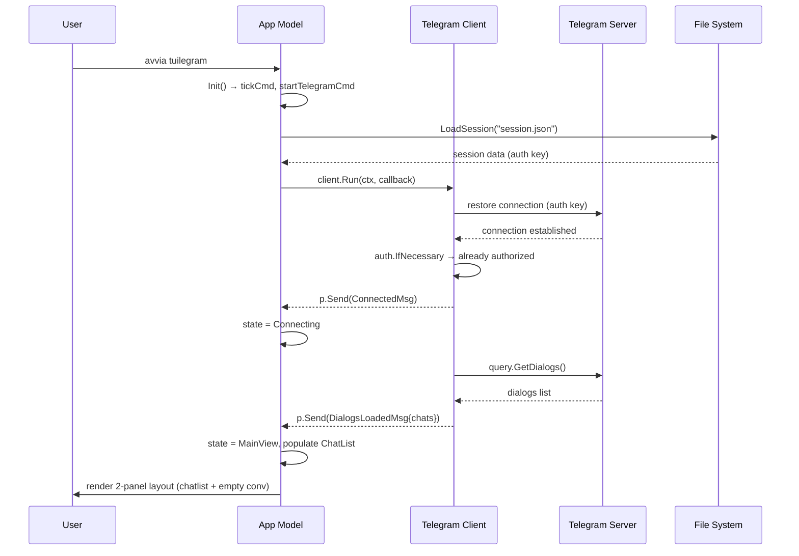
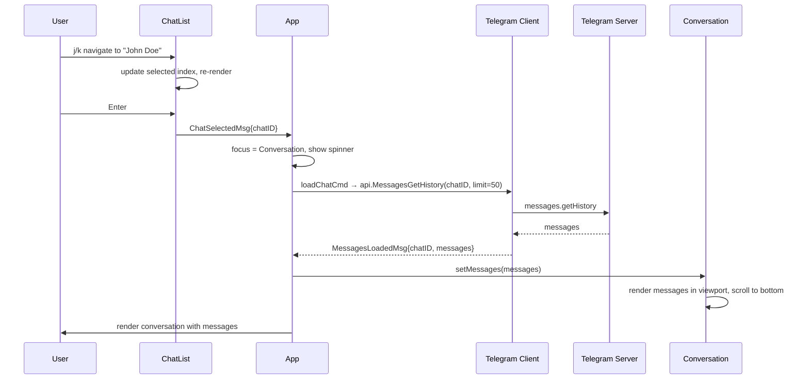
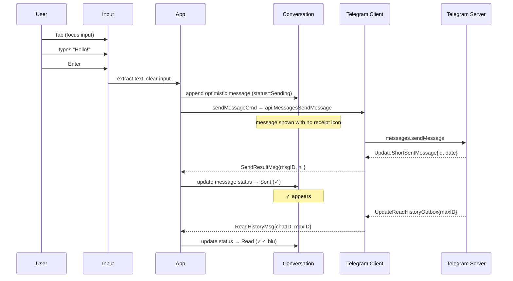
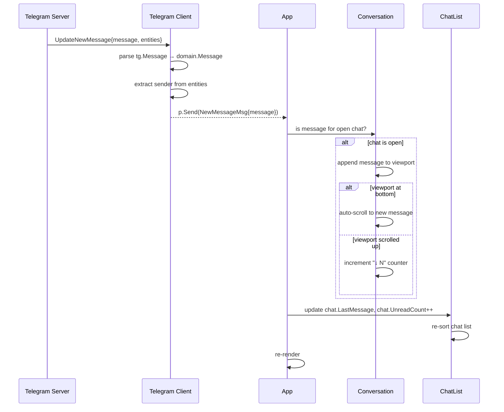
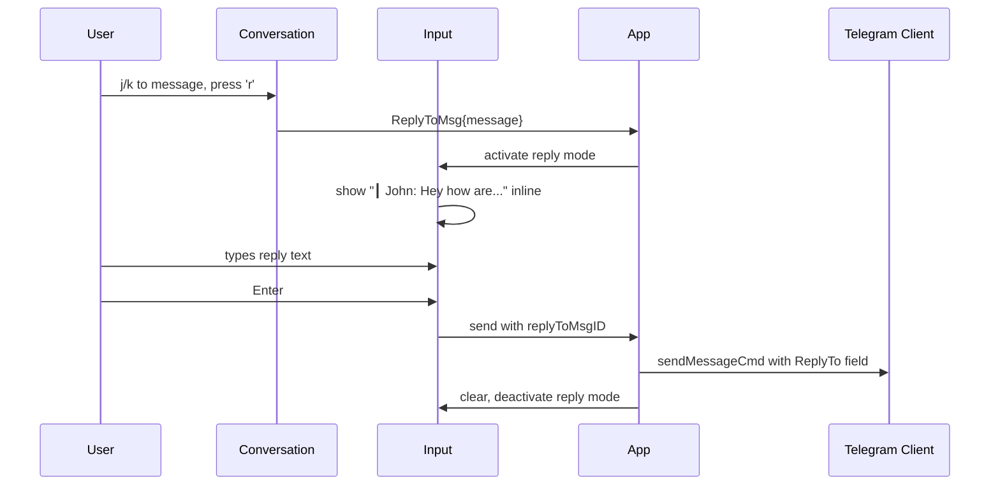
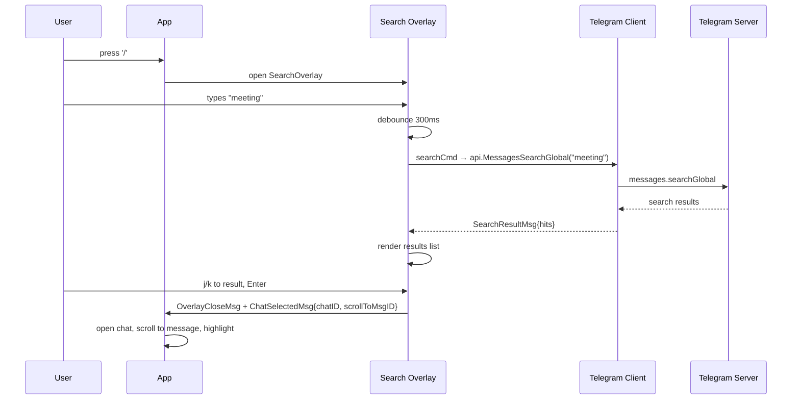
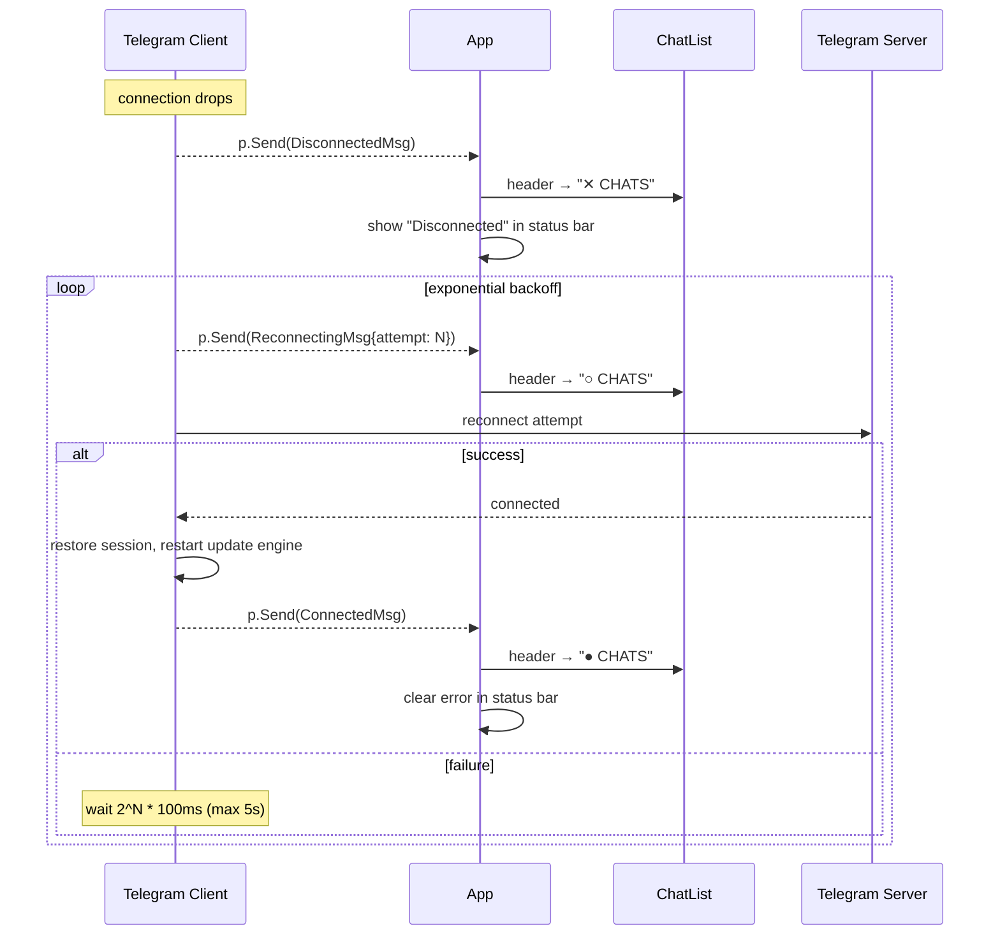
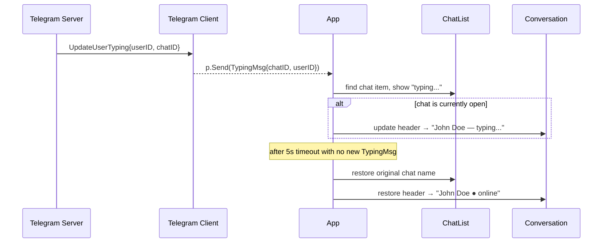
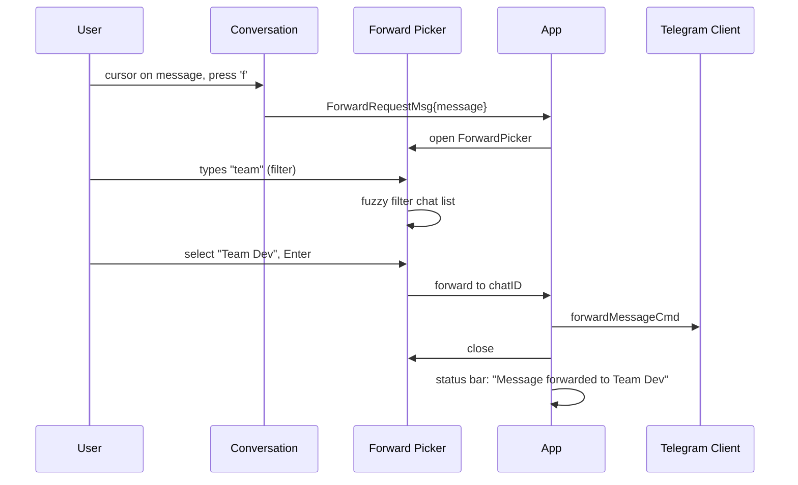
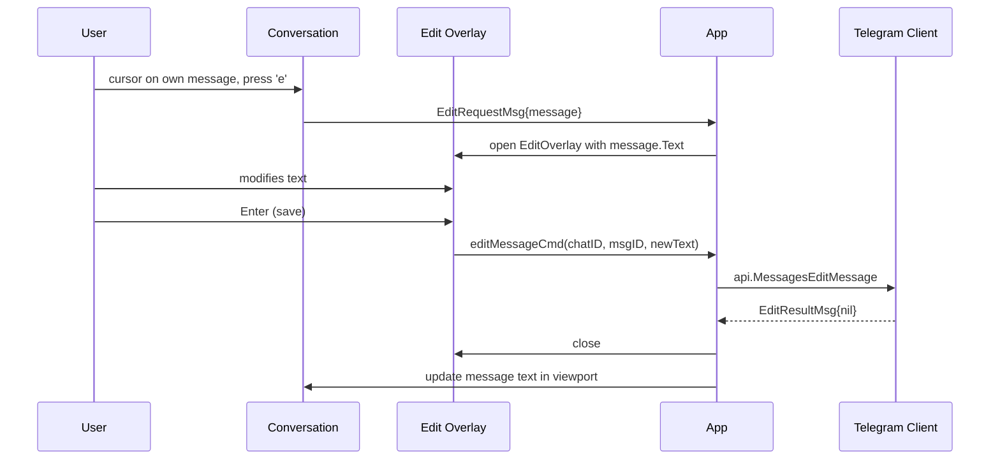

# Interaction Scenarios

Sequence diagrams per gli scenari chiave del sistema.

## Scenario 1 — Startup con session valida

## Scenario 2 — Aprire una conversazione

## Scenario 3 — Inviare un messaggio

## Scenario 4 — Ricevere un messaggio in tempo reale

## Scenario 5 — Reply a un messaggio

## Scenario 6 — Search globale

## Scenario 7 — Reconnection dopo disconnect

## Scenario 8 — Typing indicator

> **Step 22 update**: batch forward / batch delete (multi-selezione) sono
> documentati in [`multi-select-flow.md`](multi-select-flow.md). Lo Scenario 9
> qui sotto descrive il flow single-msg (Step 21).

## Scenario 9 — Forward messaggio

## Scenario 10 — Edit messaggio

