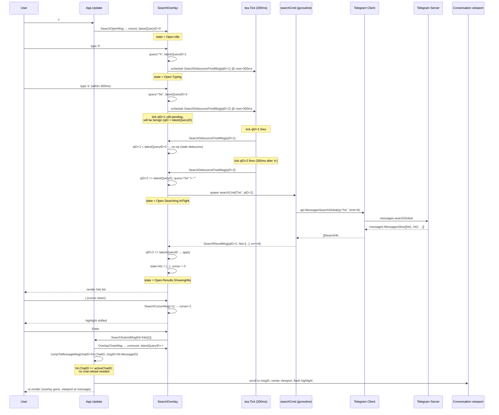
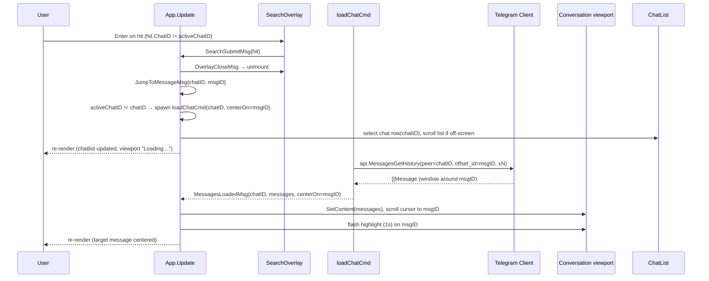
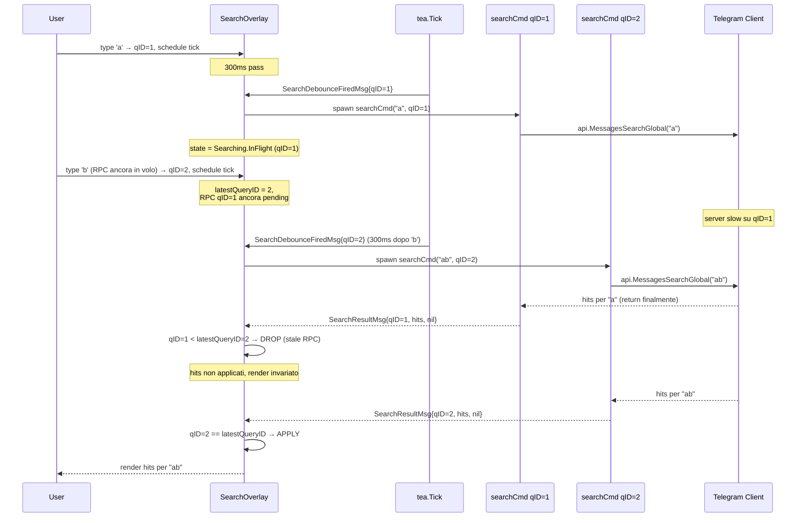
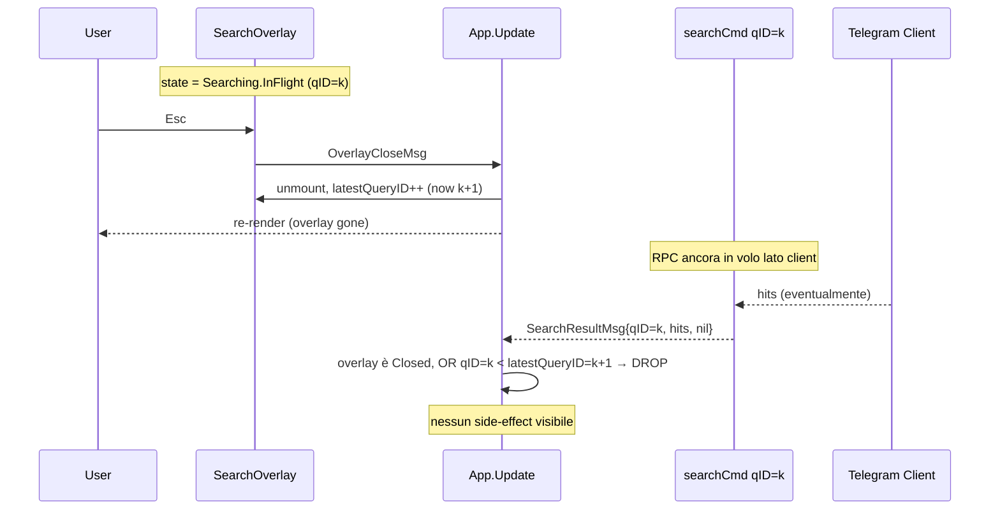
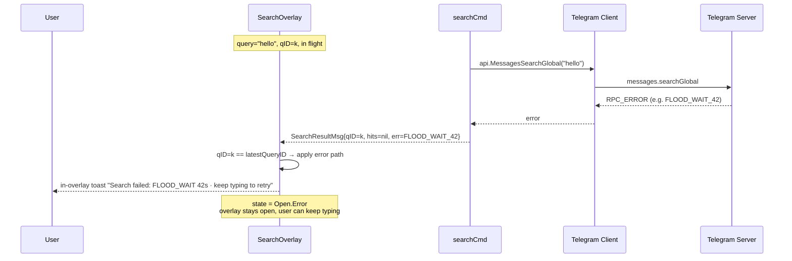

# Search Flow — Sequence Diagrams (Step 26)

Flusso runtime della **ricerca globale** introdotta nello Step 26.
Complementare allo statechart in
[`../phase-2-behavioral/search-overlay.md`](../phase-2-behavioral/search-overlay.md).

Tre scenari principali coprono i path interessanti:

1. Happy path con risultati e jump in-chat (stessa chat).
2. Happy path con jump cross-chat.
3. Race debounce + stale RPC drop.
4. Cancel via `Esc` durante RPC in volo (deroga ADR-007).
5. Errore RPC.

## 1. Happy path — typing → debounce → results → jump (stessa chat)

## 2. Happy path — jump cross-chat

`loadChatCmd` carries an extra `centerOn` field (or App stores a
`pendingJump` map) so that, when `MessagesLoadedMsg` arrives, the
viewport knows to center on `msgID` rather than scroll-to-bottom.
Out-of-scope of Step 26 design: the exact wire-up of `centerOn` —
behavioral expectation is enough; implementation chooses the cleanest
path.

## 3. Race — RPC stale dropped via queryID

Punto chiave: la RPC stale (`qID=1`) **non viene cancellata server-side**
(non c'è API per farlo dopo il send), ma il suo risultato è scartato
silenziosamente dal check `qID == latestQueryID` nel main loop. Il costo
è una RPC sprecata; il beneficio è che non serve cancellation primitive.

Vedi [ADR-013](../phase-6-decisions/ADR-013-search-debounce-and-stale-results.md)
per la giustificazione formale e il modello TLA+
[`../phase-4-concurrency/search.tla`](../phase-4-concurrency/search.tla)
per le invarianti `STALE_RESULT_DROP` e `MONOTONIC_QUERYID`.

## 4. Cancel via Esc durante RPC in volo (deroga ADR-007)

A differenza di forward picker (`ADR-007`: `Esc` ignorato durante RPC),
l'overlay search **accetta** `Esc`:

- La RPC è **read-only** (`messages.searchGlobal` non muta nulla
  server-side). Cancellare il context lato client è pulito; non lasciar
  attendere l'utente è UX-friendly.
- L'effetto del risultato pendente è già **annullato** dal pattern
  `latestQueryID` (incrementato in `OverlayCloseMsg`). Niente toast
  silenzioso, niente state inconsistente.
- Modellato in `search.tla` invariante `CLOSE_INVALIDATES_INFLIGHT`.

Decisione formale: [ADR-013](../phase-6-decisions/ADR-013-search-debounce-and-stale-results.md).

## 5. Errore RPC

L'utente può continuare a digitare; ogni nuova keystroke schedula un
nuovo debounce, eventualmente un nuovo `searchCmd`. Non c'è retry
automatico (lo Step 26 evita complessità: l'utente decide).

## Mapping tea.Cmd

Aggiornamento alla tabella "Mapping tea.Cmd" in
[`../phase-1-context/message-taxonomy.md`](../phase-1-context/message-taxonomy.md):

| Azione utente / evento | Cmd | API gotd/td | Result Msg |
|------------------------|-----|-------------|------------|
| `/` | (no Cmd, immediato) | — | `SearchOpenMsg` |
| char/backspace nell'overlay | `searchDebounceCmd(qID)` (= `tea.Tick(300ms)`) | — | `SearchDebounceFiredMsg{qID}` |
| `SearchDebounceFiredMsg` con qID fresh + non-empty query | `searchCmd(query, qID)` | `api.MessagesSearchGlobal` | `SearchResultMsg{qID, hits, err}` |
| `Enter` su hit | `tea.Batch(OverlayCloseMsg, JumpToMessageMsg)` | — | (synchronous chain) |
| `JumpToMessageMsg` con chat diversa | `loadChatCmd(chatID, centerOn=msgID)` | `api.MessagesGetHistory` | `MessagesLoadedMsg` |

## Cross-links

- Statechart: [`../phase-2-behavioral/search-overlay.md`](../phase-2-behavioral/search-overlay.md)
- Concurrency invariants: [`../phase-4-concurrency/search.tla`](../phase-4-concurrency/search.tla)
- Pipeline: [`../development-pipeline.md` §Step 26](../development-pipeline.md)
- Decisione debounce + stale: [ADR-013](../phase-6-decisions/ADR-013-search-debounce-and-stale-results.md)
- Pattern ascendente (overlay RPC): [`forward-flow.md`](forward-flow.md)
- Pattern ascendente (TTL + tick): [`typing-flow.md`](typing-flow.md)
