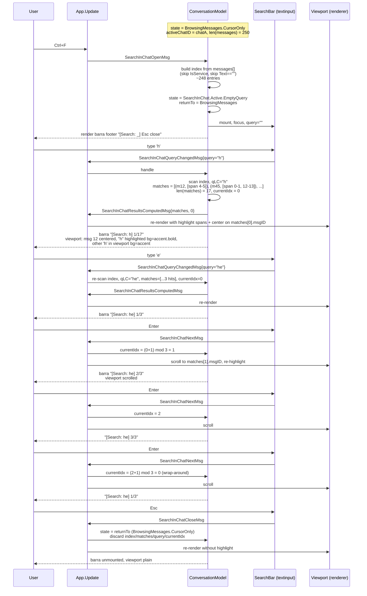
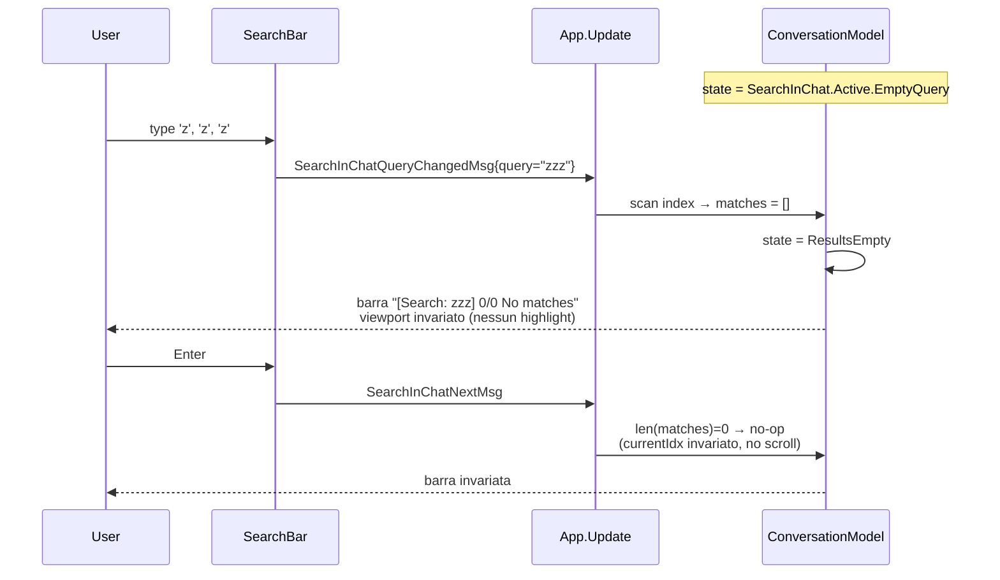
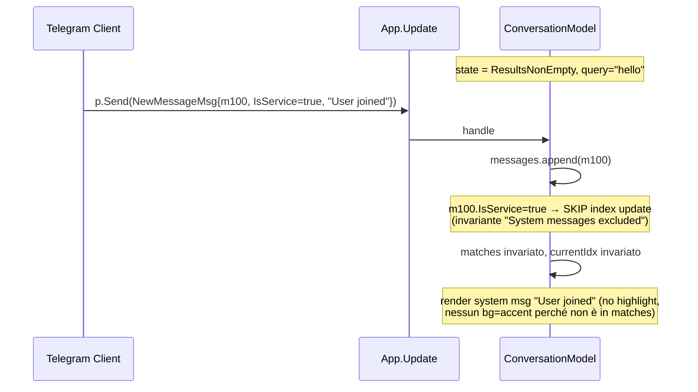
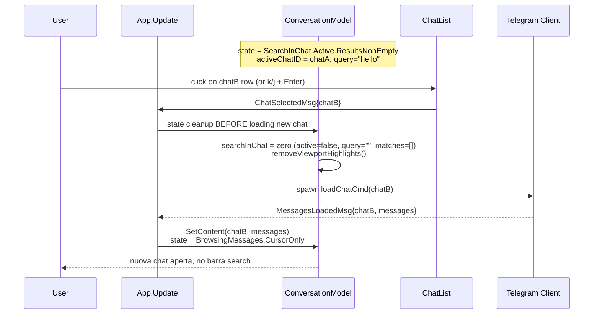

# Search In Chat Flow — Sequence Diagrams (Step 27)

Flusso runtime della **ricerca locale nella conversazione attiva**
introdotta nello Step 27. Complementare allo statechart in
[`../phase-2-behavioral/search-in-chat.md`](../phase-2-behavioral/search-in-chat.md).

Cinque scenari coprono i path interessanti:

1. Happy path — open → typing → matches → next → close.
2. Empty results.
3. Concorrenza con `NewMessageMsg` (push Telegram durante search).
4. Concorrenza con `LoadMoreMsg` (history pre-pend → match identity).
5. Cross-chat reset (apertura altra chat mentre barra aperta).

## 1. Happy path — open, type, navigate, close



## 2. Empty results



## 3. Concorrenza — NewMessageMsg push during search

```mermaid
sequenceDiagram
    participant U as User
    participant SRV as Telegram Server
    participant TG as Telegram Client (goroutine)
    participant APP as App.Update
    participant CONV as ConversationModel
    participant VP as Viewport

    Note over CONV: state = SearchInChat.Active.ResultsNonEmpty<br/>query="hello", matches=[(m12,_),(m34,_),(m56,_)]<br/>currentIdx=1 (sul m34)

    SRV-->>TG: UpdateNewMessage{chatA, m99, "hello world"}
    TG->>APP: p.Send(NewMessageMsg{m99})

    APP->>CONV: handle NewMessageMsg
    CONV->>CONV: messages.append(m99)
    Note over CONV: searchInChat.active == true → re-index incrementale
    CONV->>CONV: m99.IsService=false, Text="hello world" → append a index
    CONV->>CONV: query="hello" non vuota → scan m99.textLC<br/>match trovato (span 0-5) → matches.append((m99,_))<br/>matches = [(m12),(m34),(m56),(m99)], len=4
    CONV->>CONV: currentIdx invariato = 1 (m34, identità preservata)
    APP->>VP: re-render viewport (nuovo msg in coda con highlight bg=accent)<br/>scroll position INVARIATA (no auto-jump)
    CONV-->>U: barra "[Search: hello]  2/4"<br/>(counter aggiornato 3→4; current resta su m34)
    Note over U: highlight su m34 stabile,<br/>m99 visibile in coda con highlight non-current
```

**Punto chiave**: l'arrivo di `NewMessageMsg` mentre l'utente sta
navigando per match NON sposta il highlight corrente. Il counter `1/N`
aggiorna `N` per indicare nuovi match disponibili, ma `currentIdx`
resta sul match già selezionato (identità preservata via `msgID`).
Decisione formale in [ADR-014 §D2](../phase-6-decisions/ADR-014-inline-search-bar-vs-modal.md).

### 3b. Variante — system message arrival (no re-index)



### 3c. Variante — message edited mentre cercato

```mermaid
sequenceDiagram
    participant TG as Telegram Client
    participant APP as App.Update
    participant CONV as ConversationModel

    Note over CONV: query="hello", matches contiene (m34, [span 0-5]) on text "hello world"
    TG->>APP: p.Send(MessageEditedMsg{m34, "world only"})
    APP->>CONV: handle
    CONV->>CONV: messages[34].Text := "world only"
    CONV->>CONV: index[m34].textLC := "world only"
    CONV->>CONV: re-scan only m34 vs query="hello" → no match
    CONV->>CONV: matches.remove((m34,_))<br/>se currentIdx pointed to m34 → currentIdx = clamp(currentIdx, len(matches)-1)
    CONV-->>APP: SearchInChatResultsComputedMsg
    Note over CONV: counter aggiornato; se len(matches) diventa 0 → state = ResultsEmpty
```

## 4. Concorrenza — LoadMoreMsg (history pre-pend)

```mermaid
sequenceDiagram
    participant U as User
    participant APP as App.Update
    participant CONV as ConversationModel
    participant TG as Telegram Client
    participant VP as Viewport

    Note over CONV: state = ResultsNonEmpty, query="hello"<br/>matches = [(m500,_),(m520,_)], currentIdx=1 (m520)

    Note over U,VP: l'utente ha aperto la search, naviga, e poi<br/>scrolla in alto fino al top → triggers loadHistoryCmd<br/>(BrowsingMessages flow, ortogonale alla search)

    TG->>APP: LoadMoreMsg{messages=[m100..m499]}
    APP->>CONV: handle
    CONV->>CONV: messages = prepend(m100..m499) + messages
    Note over CONV: re-index incrementale per la finestra prepended
    CONV->>CONV: index = prepend(filtered(m100..m499)) + index
    CONV->>CONV: scan query="hello" su m100..m499 → 7 nuovi match<br/>(es. m152, m210, m266, m301, m355, m412, m478)
    CONV->>CONV: matches = [m152, m210, m266, m301, m355, m412, m478, m500, m520]<br/>(prepend dei nuovi, in ordine cronologico)
    CONV->>CONV: currentIdx era 1 (m520) → diventa 1 + 7 = 8 (ancora m520)<br/>identità preservata via msgID
    APP->>VP: re-render viewport (nuovi msg in alto con highlight)<br/>scroll position invariata (l'utente vede ancora m520 evidenziato)
    CONV-->>U: barra "[Search: hello]  9/9"<br/>(prima era "2/2"; ora 7 nuovi match prima del current)
```

**Invariante visualizzata**: `MATCH_IDENTITY_PRESERVED` —
`matches[currentIdx_before].msgID == matches[currentIdx_after].msgID`
indipendentemente da prepend di N elementi. Verificata in
[`../phase-4-concurrency/search_in_chat.tla`](../phase-4-concurrency/search_in_chat.tla).

## 5. Cross-chat reset



`Esc` esplicito non è richiesto — il `ChatSelectedMsg` triggra
implicitamente la chiusura della barra come parte del cleanup
pre-load. Coerente con multi-select reset cross-chat (vedi
`multi-select-flow.md` §"Cross-chat reset").

## Mapping tea.Cmd

Aggiornamento alla tabella "Mapping tea.Cmd" in
[`../phase-1-context/message-taxonomy.md`](../phase-1-context/message-taxonomy.md):

| Azione utente / evento | Cmd | API gotd/td | Result Msg |
|------------------------|-----|-------------|------------|
| `Ctrl+F` | (no Cmd, immediato) | — | `SearchInChatOpenMsg` |
| char/backspace nella barra | (no Cmd, sync compute) | — | `SearchInChatQueryChangedMsg` → `SearchInChatResultsComputedMsg` |
| `Enter`/`n` nella barra | (no Cmd, sync state mutation + viewport scroll) | — | `SearchInChatNextMsg` |
| `Shift+Tab`/`N` nella barra | (no Cmd, sync) | — | `SearchInChatPrevMsg` |
| `Esc` nella barra | (no Cmd, sync teardown) | — | `SearchInChatCloseMsg` |

**Caratteristica chiave**: NESSUN `tea.Cmd` async è generato dalla
search in chat. Tutti gli effetti sono sincroni nel main loop. Questa
è la differenza fondamentale rispetto al search globale (Step 26),
che spawna `searchCmd` (RPC). Vedi
[ADR-014](../phase-6-decisions/ADR-014-inline-search-bar-vs-modal.md) §D1.

## Cross-links

- Statechart: [`../phase-2-behavioral/search-in-chat.md`](../phase-2-behavioral/search-in-chat.md)
- Concurrency invariants: [`../phase-4-concurrency/search_in_chat.tla`](../phase-4-concurrency/search_in_chat.tla)
- Pipeline: [`../development-pipeline.md` §Step 27](../development-pipeline.md)
- Decisione inline-bar + re-index: [ADR-014](../phase-6-decisions/ADR-014-inline-search-bar-vs-modal.md)
- Search globale (overlay Modal, RPC): [`search-flow.md`](search-flow.md)
- Multi-select cross-chat reset (pattern simile): [`multi-select-flow.md`](multi-select-flow.md)
