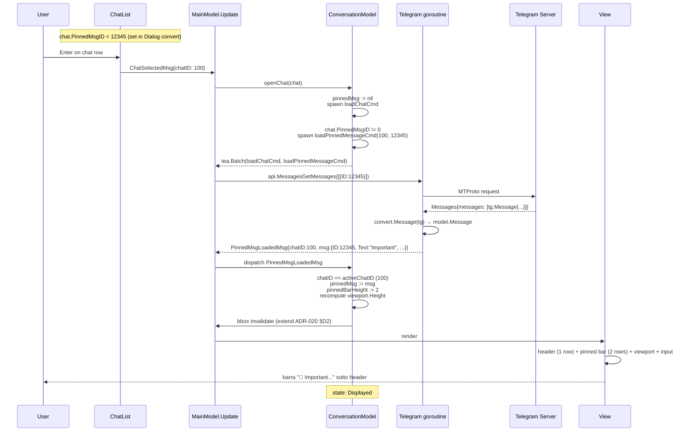
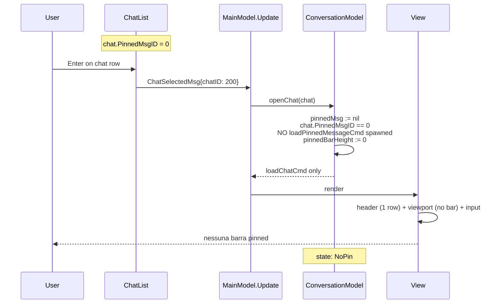
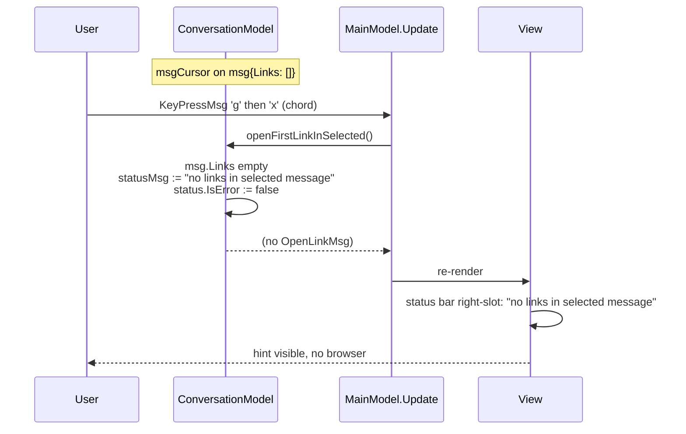
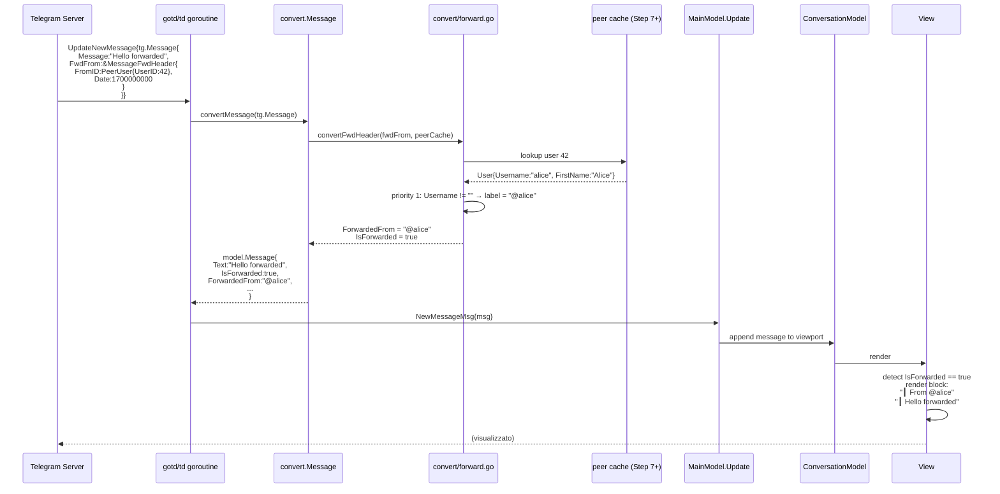
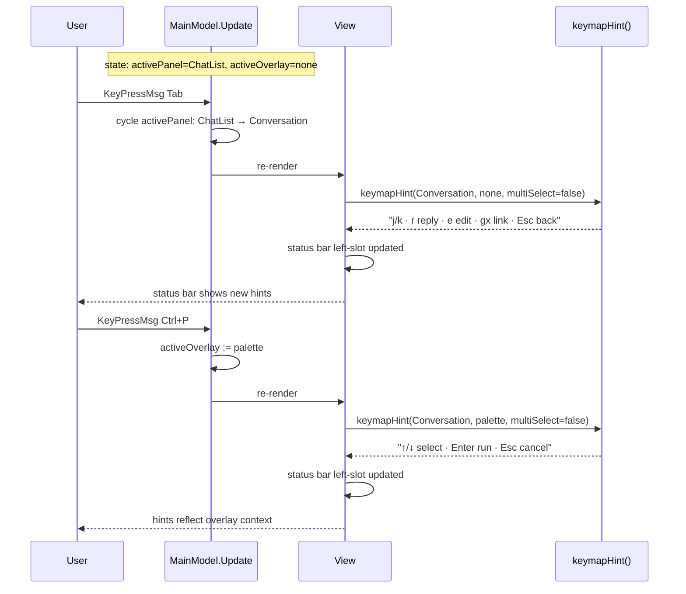

# Step 33 Polish — Sequence Diagrams

Flussi runtime delle 5 feature di polish dello Step 33. Complementare
allo statechart in
[`../phase-2-behavioral/step33-polish.md`](../phase-2-behavioral/step33-polish.md)
e all'ADR canonical
[ADR-021](../phase-6-decisions/ADR-021-step33-polish.md).

Otto scenari coprono i path interessanti:

1. **Chat open con pinned msg** — fetch + render bar.
2. **Chat open senza pinned msg** — no bar.
3. **Stale pinned drop** — utente apre Chat B mentre A stava ancora
   caricando (PINNED_STALE_DROP).
4. **`gx` su msg con 1+ link** — open via `exec.Command`.
5. **`gx` su msg con 0 link** — status hint, no spawn.
6. **Forward msg conversion path** — gotd/td → model.Message.
7. **Status bar focus change** — hint switch su `Tab` / overlay open.
8. **Group msg first vs subsequent** — sender name color shown only
   first.

## 1. Chat open con pinned msg



**Punto chiave**: `loadPinnedMessageCmd` è spawned **insieme** a
`loadChatCmd` come `tea.Batch`. Entrambi async, indipendenti. Result
arriva via single Update channel (no race).

## 2. Chat open senza pinned msg



**Punto chiave**: short-circuit. Nessuno spawn di RPC inutile.
`pinnedBarHeight = 0` → viewport recupera lo spazio.

## 3. Stale pinned drop (chat switch durante load)

```mermaid
sequenceDiagram
    participant U as User
    participant APP as MainModel.Update
    participant CV as ConversationModel
    participant TG as Telegram goroutine

    U->>APP: ChatSelectedMsg{chatID: 100}
    APP->>CV: openChat(A); pinnedMsg := nil; spawn loadPinnedMessageCmd(100, 12345)
    Note over CV: state: Loading (chat A)

    U->>APP: ChatSelectedMsg{chatID: 200} (rapid switch)
    APP->>CV: openChat(B); pinnedMsg := nil; chat200.PinnedMsgID == 0<br/>activeChatID := 200
    Note over CV: state: NoPin (chat B)

    TG-->>APP: PinnedMsgLoadedMsg{chatID:100, msg:{...}}<br/>(late arrival from chat A)
    APP->>CV: dispatch PinnedMsgLoadedMsg
    CV->>CV: chatID (100) != activeChatID (200)<br/>DROP no mutation
    Note over CV: PINNED_STALE_DROP enforced<br/>state: NoPin (preserved)
```

**Punto chiave**: pattern `STALE_COMPLETION_DROP` riusato da
ADR-017 §`folders_chatinfo.tla`. Identità garantita da `chatID`
match.

## 4. `gx` su msg con 1+ link

```mermaid
sequenceDiagram
    participant U as User
    participant CV as ConversationModel
    participant APP as MainModel.Update
    participant WK as whichkey registry
    participant CMD as openLinkCmd
    participant OS as exec.Command
    participant V as View

    Note over CV: msgCursor on msg{Links: [{URL:"https://example.com"}]}

    U->>APP: KeyPressMsg 'g'
    APP->>WK: lookup prefix 'g' in registry
    WK->>WK: state := PrefixPending<br/>spawn whichKeyTickCmd(300ms)
    WK-->>APP: WhichKeyPrefixMsg{prefix:'g', prefixID:42}

    U->>APP: KeyPressMsg 'x' (within 300ms)
    APP->>WK: continuation 'x' in continuations['g']
    WK->>WK: bump latestPrefixID, state := Idle
    WK-->>APP: WhichKeyChordMsg{'g', 'x'}<br/>handler: openFirstLinkInSelected
    APP->>CV: openFirstLinkInSelected()
    CV->>CV: msg.Links not empty<br/>links[0].URL = "https://example.com"<br/>scheme http(s) ✓
    CV-->>APP: emit OpenLinkMsg{URL:"https://example.com"}
    APP->>CMD: spawn openLinkCmd(URL)
    Note over CMD: runtime.GOOS switch
    CMD->>OS: exec.Command("open", "https://example.com").Run() (macOS)
    OS-->>CMD: (process spawned, fire-and-forget)
    CMD-->>APP: (no result msg; OpenLinkResultMsg NOT defined)
    APP->>V: re-render (no state change visible)
    V-->>U: browser opens example.com
```

**Punto chiave**: `gx` riusa whichkey infrastructure (ADR-015 §D5).
Nessuna nuova primitive. `openLinkCmd` è fire-and-forget (zero
result msg).

## 5. `gx` su msg con 0 link



**Punto chiave**: no-op silenzioso sarebbe confondente (l'utente ha
premuto due tasti, niente succede). Hint esplicito risolve.

## 6. Forward msg conversion path



**Punto chiave**: il rendering layer non vede mai `tg.MessageFwdHeader`.
La fallback chain DC3 vive solo nel convert layer.

## 7. Status bar focus change (Tab in Wide / overlay open)



**Punto chiave**: `keymapHint()` è chiamata in `View()` ad ogni
render. Pure function. Determinismo garantito.

## 8. Status bar errore right-slot

```mermaid
sequenceDiagram
    participant U as User
    participant APP as MainModel.Update
    participant TG as Telegram goroutine
    participant V as View

    U->>APP: input "Hello" + Enter
    APP->>APP: appendOptimistic("Hello"); spawn sendMessageCmd
    TG->>TG: api.MessagesSendMessage fails (network)
    TG-->>APP: SendResultMsg{err: "context deadline exceeded"}
    APP->>APP: status := {<br/>  Text: "context deadline exceeded",<br/>  IsError: true<br/>}
    APP->>V: re-render
    V->>V: status bar right-slot:<br/>  ✕ context deadline exceeded<br/>(red foreground, ColorError)
    V->>V: status bar left-slot:<br/>  keymapHint(Conversation, none, ms=false)<br/>  "j/k · r reply · ..."
    V->>V: width check: total > available → ellipsize left<br/>  "j/k · r reply..."
    V-->>U: errore visibile a destra<br/>shortcut hint troncato a sinistra
    Note over APP: STATUSBAR_ERROR_PRIORITY enforced
```

**Punto chiave**: errore right-aligned con prefix `✕` + ColorError.
Hint left ellipsized se overflow (priorità errore).

## 9. Group msg first vs subsequent (sender name color)

```mermaid
sequenceDiagram
    participant U as User
    participant CV as ConversationModel
    participant V as View
    participant SC as senderColor()
    participant PALETTE as styles.ColorSenderPalette()

    Note over CV: chat.Type = ChatGroup<br/>messages = [<br/>  {SenderID:42, SenderName:"Alice", Text:"Hi"},<br/>  {SenderID:42, SenderName:"Alice", Text:"How are you"},<br/>  {SenderID:73, SenderName:"Bob", Text:"Doing fine"}<br/>]

    CV->>V: renderMessages()
    V->>V: i=0, msg from Alice, isFirstOfGroup=true
    V->>SC: senderColor(42, palette)
    SC->>PALETTE: get []
    PALETTE-->>SC: [red,orange,yellow,green,cyan,blue,purple,pink]
    SC->>SC: idx = 42 % 8 = 2<br/>return yellow
    SC-->>V: yellow
    V->>V: render "Alice:" with Foreground(yellow).Bold()<br/>render "Hi"

    V->>V: i=1, msg from Alice, isFirstOfGroup=false<br/>(sameGroup(prev, curr) = true)
    V->>V: NO sender name rendered (group continues)<br/>render "How are you"

    V->>V: i=2, msg from Bob, isFirstOfGroup=true
    V->>SC: senderColor(73, palette)
    SC->>SC: idx = 73 % 8 = 1<br/>return orange
    SC-->>V: orange
    V->>V: render "Bob:" with Foreground(orange).Bold()<br/>render "Doing fine"
    V-->>U: Alice yellow, Bob orange<br/>(deterministic; same forever)
```

**Punto chiave**: SenderID hashing è deterministic. Step 13 grouping
logic decide *quando* renderizzare il nome (first of group). Step 33
estende solo *come* (color overlay).

## Cross-links

- [ADR-021](../phase-6-decisions/ADR-021-step33-polish.md) — decisioni canonical
- [`../phase-2-behavioral/step33-polish.md`](../phase-2-behavioral/step33-polish.md) — statechart + invarianti
- [`../phase-1-context/message-taxonomy.md`](../phase-1-context/message-taxonomy.md) — `OpenLinkMsg`, `PinnedMsgLoadedMsg`
- [`whichkey-timing-flow.md`](whichkey-timing-flow.md) — `gx` riusa whichkey debounce
- [`folder-and-info-flow.md`](folder-and-info-flow.md) — pattern stale completion drop
