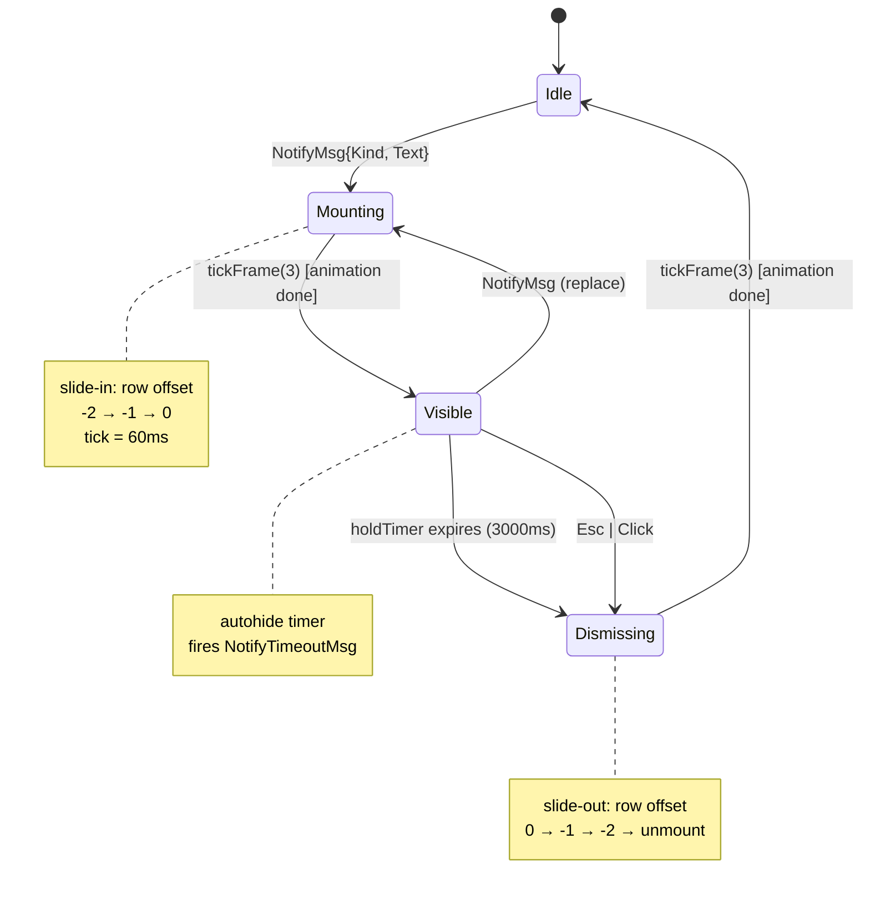
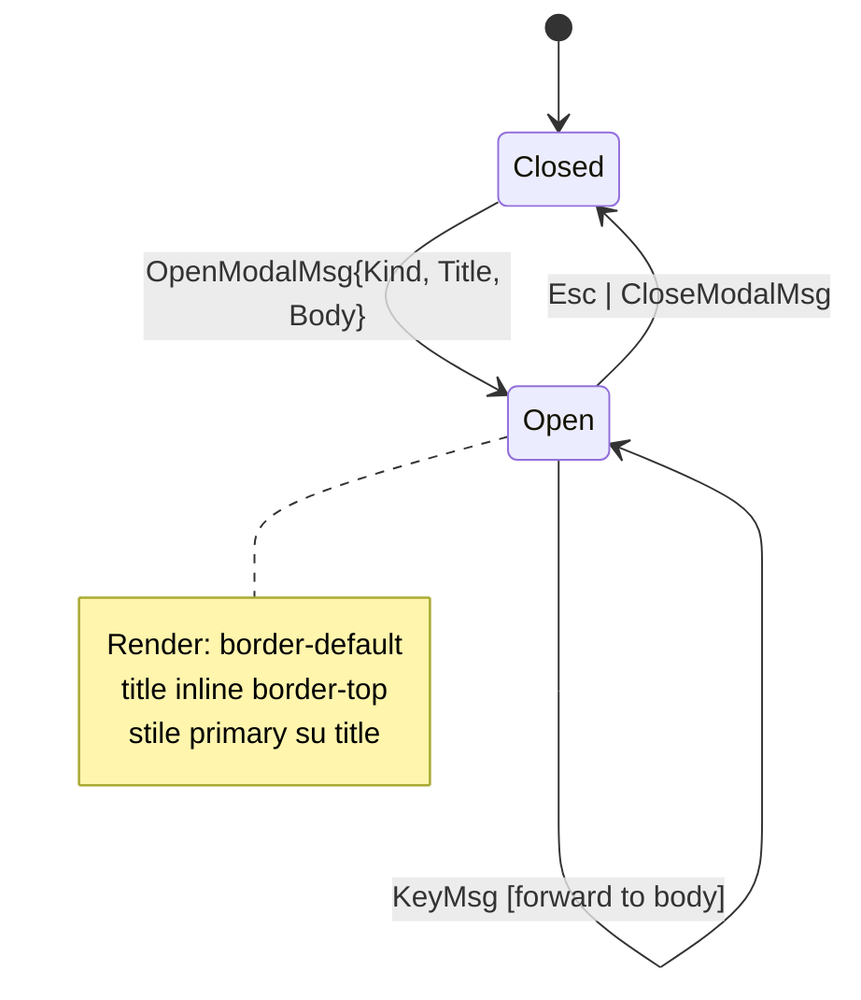
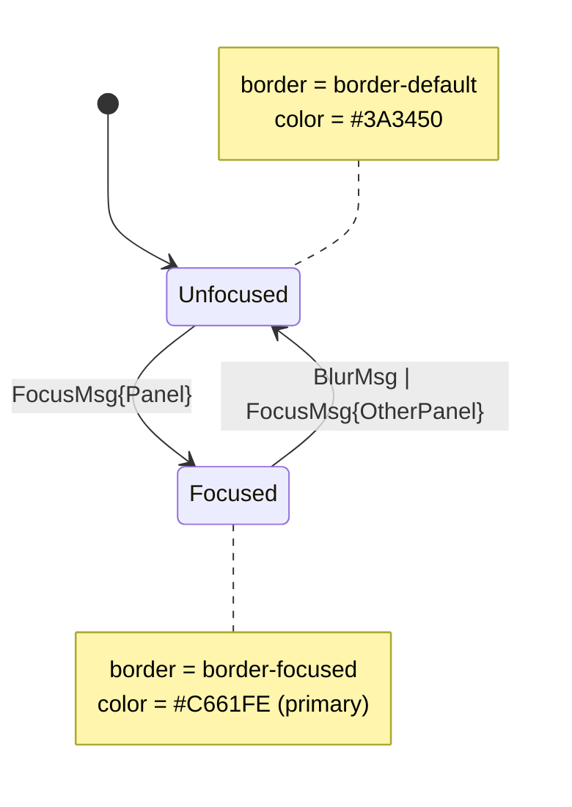
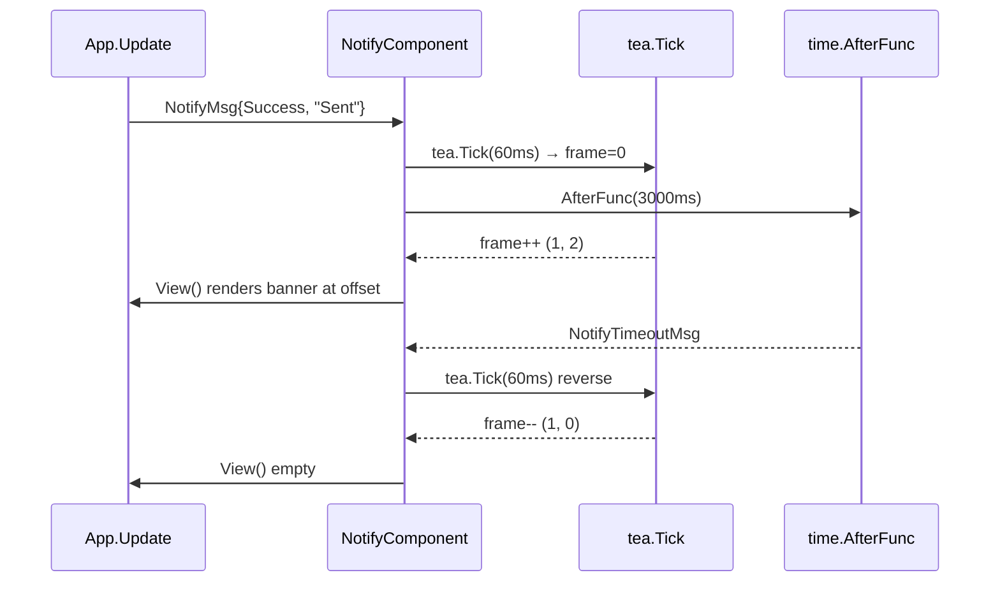

# Step 34 — Style Revamp Flow & Statecharts

**Companion** di `phase-2-behavioral/step34-style-revamp.md`.
**ADR**: ADR-022.

## 1. Notify Banner — statechart



### Invarianti notify

- **NOTIFY_NO_QUEUE**: `len(pending) ≤ 1` sempre. Una nuova `NotifyMsg` durante `Visible` o `Mounting` causa transizione immediata a `Mounting` con il nuovo payload (replace).
- **NOTIFY_TIMER_CANCEL**: ogni transizione fuori da `Visible` cancella il timer hold (no doppio fire).
- **NOTIFY_FRAME_BOUNDED**: frame counter è 0..2, mai oltre.

## 2. Modal Mount — statechart



### Invarianti modal

- **MODAL_SINGLE**: max 1 modal aperto. `OpenModalMsg` con uno già aperto sostituisce.
- **MODAL_TITLE_INLINE**: rendering via `RenderModal(title, body)` produce `╭─ Title ───╮` come prima riga.
- **MODAL_FOCUS_TRAP**: keys vanno solo al modal body finché Open.

## 3. Focus Border Swap — statechart



### Invarianti focus

- **FOCUS_SINGLE**: esattamente un panel ha `Focused = true`.
- **FOCUS_NO_TRANSITION**: cambio bordo è instant (no animation frames).

## 4. Concurrency — TLA+ skeleton

Animazioni e timer sono sequenziali nel ciclo bubbletea (single Update goroutine). L'unica concorrenza esterna:

- `tea.Tick` (frame ticker) emesso da `tea.Cmd`
- `time.AfterFunc` (hold timer) inviato come `NotifyTimeoutMsg`

Entrambi rientrano nel message loop e sono linearizzati. Non serve TLA+ separato: il modello statechart sopra è sufficiente. Se futuri animation layer concorrenti vengono aggiunti (es. multiple banner stacked), ri-aprire e modellare con TLA+.

## 5. Sequence — Notify lifecycle



## 6. Empty State — layout

```
┌───────────────────────────┬─────────────────────────────────────────┐
│ CHATS                     │                                         │
│ • Francois-Xavier Renna   │                                         │
│   Cris ☆                  │                  ╳ tuilegram             │
│   Homestead 🏠            │            terminal Telegram client     │
│   ...                     │                                         │
│                           │            Select a chat ←              │
│                           │                                         │
│                           │            Session: cris                │
│                           │            Connected to MTProto         │
│                           │            12 unread across 3 chats     │
│                           │                                         │
└───────────────────────────┴─────────────────────────────────────────┘
  esc cancel · tab focus · ctrl+p palette · ? help · / search · ctrl+q quit
```

## 7. Status Bar — layout

Mockup left+right split:

```
F folders · i info · ctrl+p palette · ? help · / search        last error: …
```

Render rule:
- Left = hint shortcuts contestuali, separator `·` con padding `1`
- Right = ultimo `errorMsg` truncated o `statusMsg` ephemeral
- Color: tutto `text_dim`, errors `error`
- Background: nessuno (no fill)

## 8. Modal — layout

```
                    ╭─ Commands ──────────────── System Λ User ─╮
                    │ > █                                       │
                    │                                           │
                    │ ▌ Scroll to top              [g g] Nav   │
                    │   Scroll to bottom           [G]   Nav   │
                    │   Center current message     [zz]  Nav   │
                    │   ...                                     │
                    │                                           │
                    │ ↑↓ navigate · enter confirm · esc cancel │
                    ╰───────────────────────────────────────────╯
```

Render rule:
- Title inline border-top sx, badge inline border-top dx
- Body padding `2 1`
- Selected item: bg fill `incoming` (violet), no border
- Hint footer dentro padding, separator `·`
