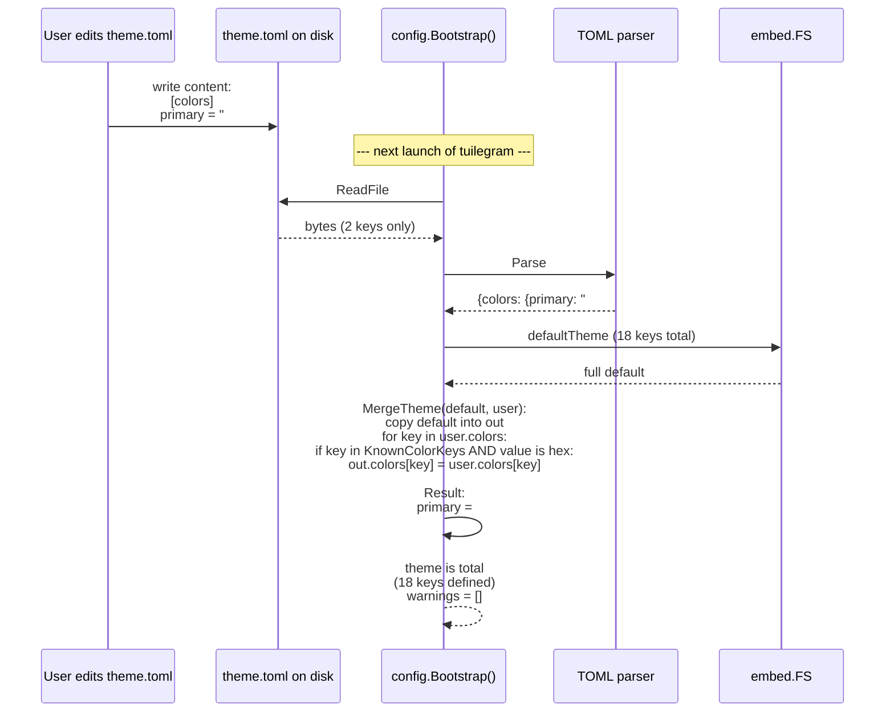

# Theming + Config — Sequence Diagrams (Step 31)

Flussi runtime del **bootstrap di config + theme** introdotto nello
Step 31. Complementare allo statechart in
[`../phase-2-behavioral/theming-and-config.md`](../phase-2-behavioral/theming-and-config.md).

I diagrammi 1-6 rappresentano **operazioni sincrone, single-thread,
boot-time** (prima di `tea.NewProgram(...).Run()`).

I diagrammi 7-9 (post-revisione 2026-05-09, ADR-019 D9 INVERTED)
rappresentano la **goroutine fsnotify watcher** che osserva
`theme.toml` runtime; sono modellati formalmente in
[`../phase-4-concurrency/theming.tla`](../phase-4-concurrency/theming.tla).

Nove scenari coprono i path interessanti:

1. **Boot success path** — file utente presenti, validi, full merge.
2. **Missing-file fallback** — nessun file utente, default embedded.
3. **Invalid TOML fallback** — TOML syntax error, default embedded
   per quel file (theme o config).
4. **Partial override merge** — theme parziale dell'utente, merge
   per chiave sopra default.
5. **Bad value warning** — chiave riconosciuta ma valore non parsabile.
6. **Env override priority** — `$TUILEGRAM_CONFIG_DIR` > `os.UserConfigDir()`.
7. **Hot-reload — valid edit** — fsnotify watcher → re-parse → atomic
   swap → ThemeChangedMsg → re-render.
8. **Hot-reload — invalid file** — parse fallisce, warning emesso,
   theme preservato.
9. **Watcher lifecycle** — start at config-loaded, stop at app
   shutdown.

## 1. Boot success path

```mermaid
sequenceDiagram
    participant OS as OS / Filesystem
    participant ENV as Environment
    participant MAIN as main()
    participant LOADER as config.Bootstrap()
    participant TOML as TOML parser
    participant EMBED as embed.FS<br/>(default.toml)
    participant STYLES as styles package
    participant TEA as bubbletea runtime

    Note over MAIN: Process start, PID assigned

    MAIN->>LOADER: Bootstrap()
    LOADER->>ENV: getenv TUILEGRAM_CONFIG_DIR
    ENV-->>LOADER: "" (unset)
    LOADER->>ENV: getenv XDG_CONFIG_HOME
    ENV-->>LOADER: "" (unset, falls back to $HOME/.config)
    LOADER->>ENV: getenv HOME
    ENV-->>LOADER: "/home/cris"
    LOADER->>LOADER: config_path := "/home/cris/.config/tuilegram/config.toml"

    LOADER->>OS: ReadFile(config_path)
    OS-->>LOADER: bytes (valid TOML, has compact_threshold = 80)

    LOADER->>TOML: Parse(bytes)
    TOML-->>LOADER: {[display] compact_threshold = 80}

    LOADER->>LOADER: MergeConfig(DefaultConfig, user)<br/>compact_threshold: 100 → 80<br/>warnings = []

    LOADER->>LOADER: theme_path := config.paths.theme = ""<br/>fallback to "/home/cris/.config/tuilegram/theme.toml"
    LOADER->>OS: ReadFile(theme_path)
    OS-->>LOADER: bytes (valid TOML, has [colors] primary = "#FF00FF")

    LOADER->>TOML: Parse(bytes)
    TOML-->>LOADER: {[colors] primary = "#FF00FF"}

    LOADER->>EMBED: read default.toml (already parsed at package init)
    EMBED-->>LOADER: full Theme (18 keys + gradient)

    LOADER->>LOADER: MergeTheme(EmbeddedDefault, user)<br/>primary: #7D56F4 → #FF00FF<br/>(other 17 keys + gradient unchanged)<br/>warnings = []

    LOADER-->>MAIN: (config, theme, warnings=[])

    Note over MAIN: warnings empty → no stderr output

    MAIN->>STYLES: SetActive(theme)
    STYLES->>STYLES: package var active := theme<br/>(single-thread, no lock)

    MAIN->>TEA: tea.NewProgram(NewApp(config)).Run()
    Note over TEA: TUI starts; all styles via styles.ColorPrimary() etc.<br/>render uses #FF00FF for primary
```

**Punto chiave**: il caso di successo non emette warning. La TUI
parte con il theme custom dell'utente, dove `primary` è `#FF00FF`
(magenta acceso) e tutto il resto è default.

## 2. Missing-file fallback

```mermaid
sequenceDiagram
    participant OS as OS / Filesystem
    participant MAIN as main()
    participant LOADER as config.Bootstrap()
    participant EMBED as embed.FS
    participant STYLES as styles package
    participant TEA as bubbletea runtime

    MAIN->>LOADER: Bootstrap()
    LOADER->>LOADER: ResolvePath("config")
    LOADER->>OS: stat("/home/cris/.config/tuilegram/config.toml")
    OS-->>LOADER: ENOENT
    LOADER->>OS: stat (lower-priority paths)
    OS-->>LOADER: ENOENT (all)
    LOADER->>LOADER: config := DefaultConfig()<br/>warnings += ["no config file"]<br/>(ADR-019 D4 silent default;<br/>warning logged only if TUILEGRAM_DEBUG=1)

    LOADER->>LOADER: ResolvePath("theme")
    LOADER->>OS: stat (all paths)
    OS-->>LOADER: ENOENT
    LOADER->>EMBED: parsed default theme
    EMBED-->>LOADER: full Theme
    LOADER->>LOADER: theme := EmbeddedDefault<br/>warnings += ["no theme file"]

    LOADER-->>MAIN: (config, theme, warnings=[2x "no file"])

    Note over MAIN: warnings logged only if TUILEGRAM_DEBUG=1<br/>Default behavior: silent (ADR-019 D4)

    MAIN->>STYLES: SetActive(EmbeddedDefault)
    MAIN->>TEA: tea.NewProgram(NewApp(DefaultConfig)).Run()
    Note over TEA: TUI starts with default colors and<br/>compact_threshold = 100 (default ADR-018 D1)
```

**Punto chiave**: prima volta che l'utente lancia `tuilegram` su un
sistema vergine. Nessun file su disco, nessun warning visibile,
default embedded carica tutto. Coerenza con btop / Helix.

## 3. Invalid TOML fallback (theme syntax error)

```mermaid
sequenceDiagram
    participant OS as OS
    participant MAIN as main()
    participant LOADER as config.Bootstrap()
    participant TOML as TOML parser
    participant EMBED as embed.FS
    participant STDERR as stderr
    participant TEA as bubbletea runtime

    MAIN->>LOADER: Bootstrap()
    Note over LOADER: config loads OK (skipped for brevity)<br/>theme path resolved to /home/cris/.config/tuilegram/theme.toml

    LOADER->>OS: ReadFile(theme_path)
    OS-->>LOADER: bytes ("[colors\nprimary = \"#FF\"")  malformed

    LOADER->>TOML: Parse(bytes)
    TOML-->>LOADER: error: "unclosed bracket at line 1"

    LOADER->>STDERR: log_error<br/>"tuilegram: theme.toml: parse error at line 1"
    LOADER->>EMBED: parsed default
    EMBED-->>LOADER: full Theme
    LOADER->>LOADER: theme := EmbeddedDefault<br/>warnings += ["theme.toml: parse error"]

    LOADER-->>MAIN: (config_OK, theme=EmbeddedDefault, warnings=[1])

    MAIN->>STDERR: print warning (if not yet printed)
    MAIN->>TEA: tea.NewProgram(...).Run()
    Note over TEA: TUI starts;<br/>user sees default theme;<br/>warning was visible on stderr BEFORE TUI cleared screen<br/>(visible only via 2>file redirect or scrollback)
```

**Punto chiave**: TOML invalido nel theme è caso "evento sporadico"
(utente ha rotto il file editandolo). Fail-soft: app non crash, ma
loga un errore visibile. ADR-019 §D5 + statechart §F.

**Variant**: stesso flow per `config.toml` syntax error → fallback
a `DefaultConfig()`.

## 4. Partial override merge



**Punto chiave**: la **forma del merge** è "pull from default unless
overridden". L'utente edita 2 chiavi; le altre 16 + gradient
vengono dal default embedded. Invariante 1 dello statechart
(Theme totalità) garantita strutturalmente.

## 5. Bad value warning (recognized key, malformed value)

```mermaid
sequenceDiagram
    participant USER as User edits theme.toml
    participant LOADER as config.Bootstrap()
    participant STDERR as stderr

    USER->>USER: writes:<br/>[colors]<br/>primary = "blue"  (invalid: not hex)<br/>incoming = "#38BDF8"  (valid)<br/>foo_unknown = "#000000"  (unknown key)

    Note over LOADER: --- next launch ---

    LOADER->>LOADER: parse OK
    LOADER->>LOADER: MergeTheme:<br/>iterate user.colors entries:

    LOADER->>LOADER: key "primary": is_hex("blue") = false<br/>warning += "theme.toml: bad hex 'primary' = blue"<br/>out.primary remains DEFAULT (#7D56F4)

    LOADER->>LOADER: key "incoming": is_hex("#38BDF8") = true<br/>out.incoming = #38BDF8 (no-op, same as default)

    LOADER->>LOADER: key "foo_unknown": NOT in KnownColorKeys<br/>warning += "theme.toml: unknown color 'foo_unknown'"<br/>out unchanged for this key

    LOADER->>STDERR: print 2 warnings
    LOADER-->>LOADER: theme total<br/>(primary = default fallback;<br/>incoming = user-confirmed;<br/>foo_unknown ignored)
```

**Punto chiave**: per-key fail-soft (ADR-019 §D5 + D10). L'utente
scopre il typo tramite warning ma l'app parte e funziona; le altre
chiavi del file vengono applicate normalmente.

## 6. Env override priority chain

```mermaid
sequenceDiagram
    participant ENV as Environment
    participant LOADER as config.Bootstrap()
    participant OS as Filesystem

    Note over ENV: User runs:<br/>TUILEGRAM_CONFIG_DIR=/tmp/over \<br/>XDG_CONFIG_HOME=/srv/cfg \<br/>tuilegram

    LOADER->>ENV: TUILEGRAM_CONFIG_DIR
    ENV-->>LOADER: "/tmp/over"
    LOADER->>OS: stat /tmp/over/tuilegram/config.toml
    OS-->>LOADER: present
    LOADER->>LOADER: config_path := /tmp/over/tuilegram/config.toml<br/>(env wins, ADR-019 §D2 priority 1)

    LOADER->>OS: ReadFile
    OS-->>LOADER: bytes (valid)
    Note over LOADER: parse + merge (skipped)

    Note over LOADER: theme_path resolution:
    LOADER->>LOADER: config.paths.theme = "" (not set)
    LOADER->>ENV: TUILEGRAM_CONFIG_DIR (priority 1)
    ENV-->>LOADER: "/tmp/over"
    LOADER->>OS: stat /tmp/over/tuilegram/theme.toml
    OS-->>LOADER: ENOENT (only config.toml here)

    LOADER->>ENV: XDG_CONFIG_HOME (priority 2)
    ENV-->>LOADER: "/srv/cfg"
    LOADER->>OS: stat /srv/cfg/tuilegram/theme.toml
    OS-->>LOADER: present
    LOADER->>LOADER: theme_path := /srv/cfg/tuilegram/theme.toml<br/>(XDG wins for theme;<br/>config and theme can come from different dirs!)

    LOADER->>OS: ReadFile theme
    Note over LOADER: parse + merge (skipped)
```

**Punto chiave**: la priority chain (`TUILEGRAM_CONFIG_DIR >
os.UserConfigDir()`) si applica **per file** (config separatamente
da theme), con la deroga che `config.paths.theme` esplicito (path
ASSOLUTO, ADR-019 §D2) vince per il theme. Questo permette setup
avanzati come "config in `/tmp/over`, theme condiviso in
`/srv/cfg/tuilegram/theme.toml`".

`os.UserConfigDir()` su Linux ritorna `$XDG_CONFIG_HOME` (con
fallback `$HOME/.config`); su macOS `$HOME/Library/Application Support`;
su Windows `%APPDATA%`. Il diagramma sopra mostra il caso Linux.

Caso più tipico: nessuna env, path standard via `os.UserConfigDir()`.

## 7. Hot-reload — valid edit (ADR-019 D9 INVERTED)

```mermaid
sequenceDiagram
    participant USER as User (vim)
    participant FILE as theme.toml on disk
    participant OS as Kernel<br/>(inotify / FSEvents / RDCW)
    participant FSN as fsnotify.Watcher<br/>(goroutine W)
    participant TOML as TOML parser
    participant EMBED as embed.FS
    participant TEA as bubbletea<br/>(program.Send channel)
    participant APP as App.Update<br/>(goroutine M)
    participant STYLES as styles package

    Note over USER,STYLES: --- App is running; theme already applied. ---

    USER->>FILE: write theme.toml<br/>[colors] primary = "#10B981"
    FILE->>OS: fs metadata change
    OS->>FSN: WriteEvent(name=theme.toml)

    FSN->>FILE: ReadFile
    FILE-->>FSN: bytes (valid TOML)

    FSN->>TOML: Unmarshal
    TOML-->>FSN: parsed: {colors: {primary: "#10B981"}}

    FSN->>EMBED: defaultTheme (cached at boot)
    EMBED-->>FSN: full default Theme

    FSN->>FSN: MergeTheme(default, user)<br/>candidate = full Theme<br/>primary: #7D56F4 → #10B981<br/>(state machine: Reading→Validating→Swapping)

    FSN->>TEA: program.Send(ThemeChangedMsg{candidate})

    TEA->>APP: Update(ThemeChangedMsg)
    APP->>STYLES: SetActive(theme)<br/>(atomic pointer write)<br/>state.AtomicSwap action
    Note over STYLES: theme := candidate<br/>NO_TORN_RELOAD: single-step
    APP-->>TEA: return tea.WindowSizeMsg{prevW, prevH}

    Note over TEA,APP: bubbletea re-renders all views<br/>via styles.ColorPrimary() etc.<br/>User sees primary = #10B981 within ~1 frame
```

**Punto chiave**: Step 31 implementa il flow. La pipeline è
single-inflight: durante `Reading`/`Validating`/`Swapping` un nuovo
`FileEvent` sovrascrive `pendingFile` (fsnotify coalesce a livello OS;
nessun debounce custom). Vedi `theming.tla` invariante
`SINGLE_RELOAD_INFLIGHT`.

## 8. Hot-reload — invalid file (warn + preserve)

```mermaid
sequenceDiagram
    participant USER as User (typo)
    participant FILE as theme.toml
    participant OS as Kernel
    participant FSN as fsnotify.Watcher<br/>(goroutine W)
    participant TOML as TOML parser
    participant TEA as bubbletea
    participant APP as App.Update
    participant STDERR as stderr / status bar

    Note over USER,STDERR: --- App is running; theme already applied. ---

    USER->>FILE: write malformed:<br/>[colors\nprimary = "#FF"
    FILE->>OS: fs change
    OS->>FSN: WriteEvent

    FSN->>FILE: ReadFile
    FILE-->>FSN: bytes (broken)

    FSN->>TOML: Unmarshal
    TOML-->>FSN: error: "unclosed bracket at line 1"

    FSN->>FSN: state: Reading → ParseErr<br/>theme UNCHANGED<br/>candidate := NIL

    FSN->>TEA: program.Send(ConfigWatcherErrMsg{err})
    TEA->>APP: Update(ConfigWatcherErrMsg)
    APP->>STDERR: log warning<br/>"theme.toml: parse error at line 1"
    Note over APP: theme NOT mutated.<br/>INVALID_PRESERVES_THEME invariant.<br/>UI continues with previous theme.
```

**Punto chiave**: edit rotto non rompe l'app. Il theme corrente
(quello applicato prima dell'edit broken) resta attivo; l'utente
vede il warning e fixa il file → prossimo save triggera scenario 7.

## 9. Watcher lifecycle (start at boot, stop at shutdown)

```mermaid
sequenceDiagram
    participant MAIN as main()
    participant LOADER as config.Bootstrap()
    participant FSN as fsnotify.NewWatcher()
    participant GO as watcher goroutine
    participant TEA as tea.Program
    participant DEFER as defer chain

    Note over MAIN: --- Process start ---

    MAIN->>LOADER: Bootstrap()
    LOADER-->>MAIN: (config, theme, warnings)
    Note over MAIN: theme applied via styles.SetActive

    MAIN->>FSN: fsnotify.NewWatcher()
    FSN-->>MAIN: watcher
    MAIN->>FSN: watcher.Add(themePath)
    Note over MAIN: from this point: WATCHER_BOUND_TO_LIFECYCLE<br/>watcherAlive := TRUE

    MAIN->>GO: go func() { ... watch loop ... }
    Note over GO: for ev := range watcher.Events:<br/>  if Write|Create -> reload pipeline<br/>case <-program.Done(): return

    MAIN->>TEA: tea.NewProgram(app).Run()
    Note over TEA: --- TUI active; user interacts; <br/>FileEvents may fire (scenarios 7/8) ---

    TEA-->>MAIN: Run() returns (user pressed Ctrl+C / quit)
    MAIN->>DEFER: program.Wait() / defer watcher.Close()
    DEFER->>FSN: watcher.Close()
    FSN->>GO: channel watcher.Events closed
    GO->>GO: range loop exits<br/>goroutine returns
    Note over GO: watcherAlive := FALSE<br/>no more FileEvents possible

    MAIN-->>MAIN: process exit
```

**Punto chiave**: il watcher ha lifetime **bound to main()**.
Avvio post-bootstrap (theme già applicato — non observa file events
prima di avere un baseline). Stop a shutdown via `defer watcher.Close()`,
che chiude `watcher.Events` channel e fa terminare il `range` loop
nella goroutine. Nessun fd leak, nessuna goroutine zombie.

## Riepilogo invarianti runtime

| Invariante | Esempio scenario |
|------------|------------------|
| Theme totalità (18 keys + 2 gradient sempre definiti) | Tutti scenari 1-6 |
| Config totalità (compact_threshold sempre nel range) | Scenari 1, 2, 5 |
| Default sempre raggiungibile (no panic, no exit) | Scenari 2, 3, 5 |
| Per-key fail-soft (typo non blocca) | Scenari 3, 5 |
| Path priority deterministica (env > XDG > $HOME) | Scenario 6 |
| Override-by-key merge (parziale OK) | Scenari 1, 4, 5 |
| Embedded default valido (CI-guarded) | Tutti |
| Boot-time + hot-reload mutation di styles.active | Scenari 1, 2, 4, 7 |
| No torn read durante merge (sincrono boot, atomic swap reload) | Tutti |
| `compact_threshold` parametrizza ADR-018 D1 | Scenario 1 (con valore 80) |
| `THEME_TOTAL` (formalizzato in `theming.tla`) | Scenari 7, 8 |
| `NO_TORN_RELOAD` (atomic swap) | Scenario 7 |
| `MERGE_ATOMIC_ON_UPDATE` | Scenario 7 |
| `INVALID_PRESERVES_THEME` | Scenario 8 |
| `WATCHER_BOUND_TO_LIFECYCLE` | Scenario 9 |
| `EVENTUALLY_APPLIED` (liveness) | Scenario 7 |

## Cross-links

- Statechart: [`../phase-2-behavioral/theming-and-config.md`](../phase-2-behavioral/theming-and-config.md)
- ADR formato + path + embed + merge + fail-soft + schema + refactor + no hot-reload: [ADR-019](../phase-6-decisions/ADR-019-theming-and-config-loading.md)
- ADR theming originale: [ADR-004](../phase-6-decisions/ADR-004-theming-system.md)
- Parametrizzato: [ADR-018 §D1](../phase-6-decisions/ADR-018-responsive-layout-threshold-and-tab.md)
- Pipeline step: [`../development-pipeline.md` §Step 31](../development-pipeline.md)
- Tui design canonical: [`../tui-design.md`](../tui-design.md) §"Color"
- Message taxonomy: [`../phase-1-context/message-taxonomy.md`](../phase-1-context/message-taxonomy.md)
  §"Internal UI Messages" — `ConfigLoadedMsg`, `ThemeAppliedMsg`,
  `ThemeChangedMsg`, `ConfigWatcherErrMsg`
- Concurrency model: [`../phase-4-concurrency/theming.tla`](../phase-4-concurrency/theming.tla)
