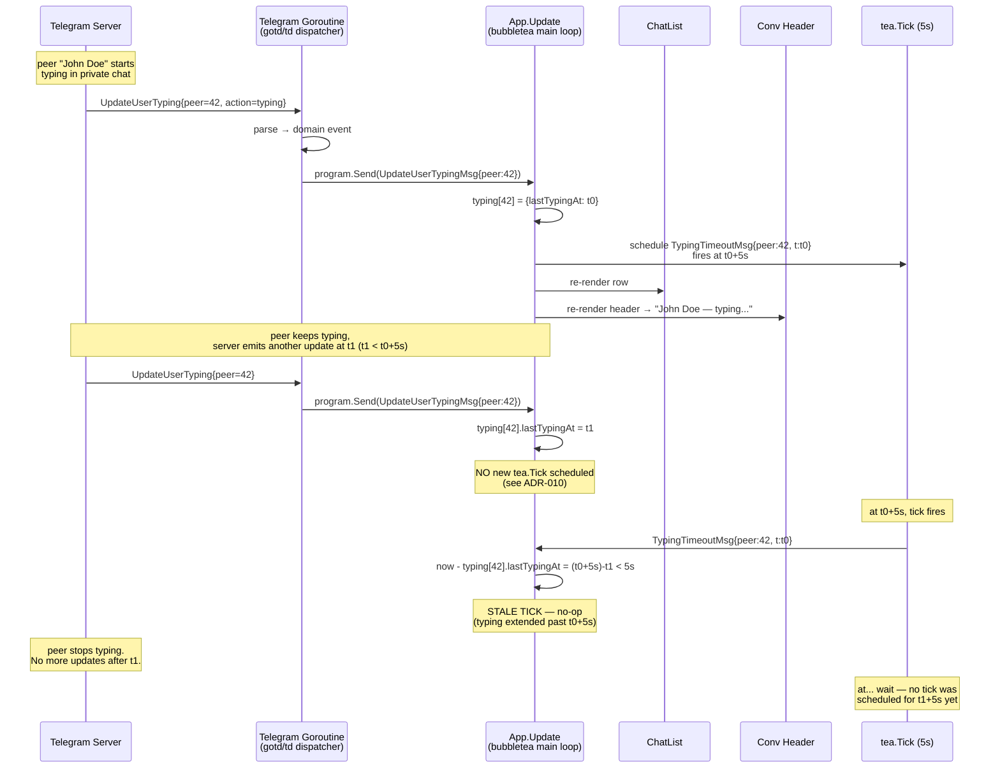
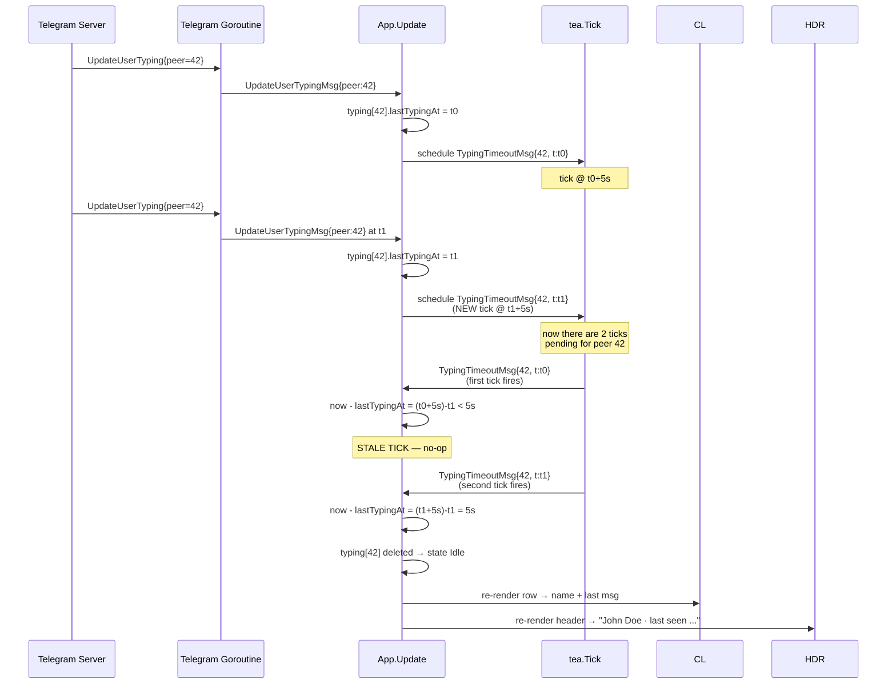
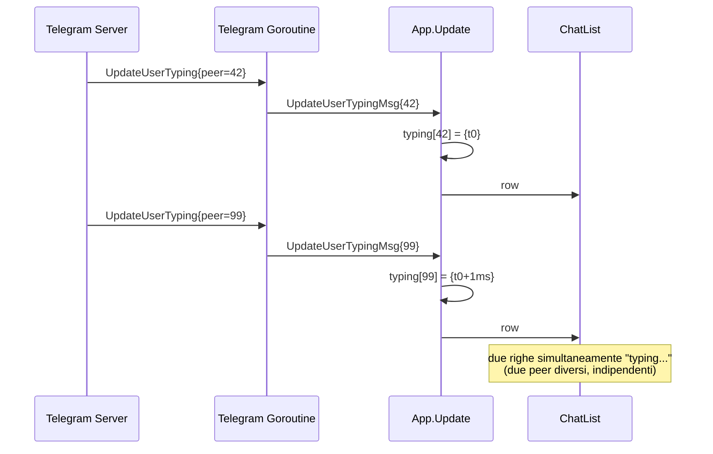
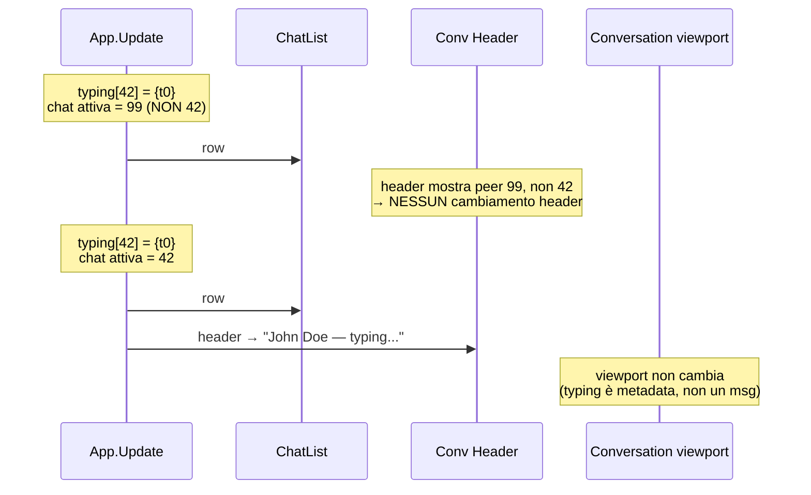
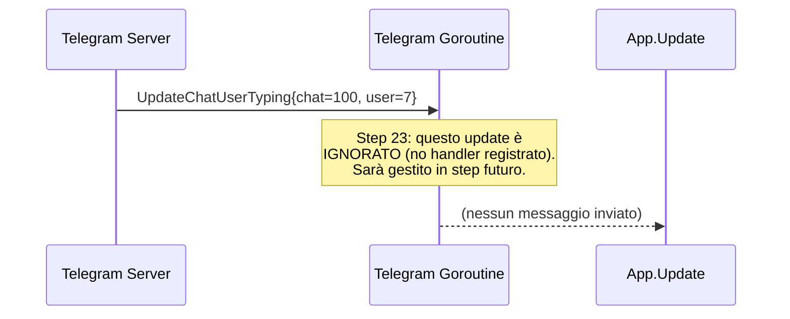
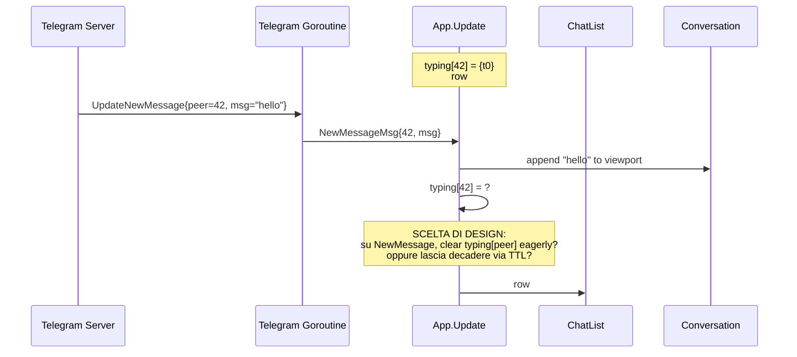

# Typing Flow — Sequence Diagrams (Step 23)

Flusso runtime del **typing indicator**. Complementare allo statechart in
[`../phase-2-behavioral/typing-indicator.md`](../phase-2-behavioral/typing-indicator.md).

## 1. Happy path — peer inizia a scrivere e si ferma

**Punto critico**: quando si rinfresca `lastTypingAt` non si schedula un nuovo
tick. Come si esce allora da `Typing.Active`? Vedi sezione "TTL refresh
strategy" più sotto e [ADR-010](../phase-6-decisions/ADR-010-typing-ttl-strategy.md).

## 2. TTL refresh strategy — variante con re-arm

Variante "re-arm" (raccomandata in [ADR-010](../phase-6-decisions/ADR-010-typing-ttl-strategy.md)):
ogni `UpdateUserTypingMsg` schedula **un nuovo tick** (non sovrascrive il
precedente — non c'è cancellation). I tick precedenti, quando scadranno,
saranno benigni grazie al check su `lastTypingAt` (vedi `STALE_TICK_BENIGN`
in `typing.tla`).

Numero di tick pendenti per peer ≤ N (numero di update ricevuti negli
ultimi 5s). In pratica Telegram emette al massimo ~1 update / 5s per
azione utente, quindi il numero atteso è 1-2 tick pendenti per peer.

## 3. Multi-chat typing concorrente

Ogni peer ha la sua entry in `typing[]`. Non c'è interazione tra peer.

## 4. Chat aperta vs chiusa — render scope

Il viewport (lista messaggi) **non** è coinvolto: il typing non si aggiunge
come bubble né come riga di sistema. È solo nell'header.

## 5. Out-of-scope: gruppi (UpdateChatUserTyping)

Lo Step 23 registra **solo** `OnTyping` per dialogs 1:1 (UpdateUserTyping).
`UpdateChatUserTyping` (typing in gruppi/canali) è gestito in step
successivi e richiede un modello UI diverso ("Alice and Bob are typing...").

## 6. Race con NewMessageMsg

**Scelta**: lasciamo decadere via TTL (più semplice, no edge case extra).
La row si aggiorna comunque alla preview "hello" perché la chat list row
prioritizza il LastMessage rispetto al typing — ma l'header conversazione
può continuare a mostrare "typing..." per qualche secondo se Telegram
emette `UpdateUserTyping` mentre la persona finisce di scrivere/inviare.

Comportamento accettabile: rispecchia esattamente quello dell'app
ufficiale Telegram.

## Mapping tea.Cmd

Aggiornamento alla tabella "Mapping tea.Cmd" in
[`../phase-1-context/message-taxonomy.md`](../phase-1-context/message-taxonomy.md):

| Azione / evento | Cmd | Result Msg |
|------------------|-----|------------|
| `UpdateUserTypingMsg` ricevuto | `scheduleTypingTimeoutCmd` (= `tea.Tick(5s, ...)`) | `TypingTimeoutMsg` |

Nessuna nuova RPC verso Telegram in Step 23 (siamo solo consumer).

## Cross-links

- Statechart: [`../phase-2-behavioral/typing-indicator.md`](../phase-2-behavioral/typing-indicator.md)
- Concurrency invariants: [`../phase-4-concurrency/typing.tla`](../phase-4-concurrency/typing.tla)
- Pipeline: [`../development-pipeline.md` §Step 23](../development-pipeline.md)
- Decisione TTL: [ADR-010](../phase-6-decisions/ADR-010-typing-ttl-strategy.md)
