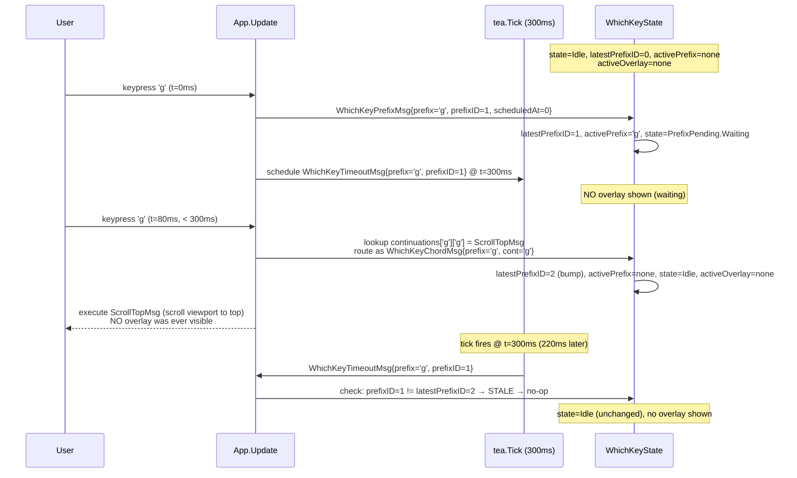
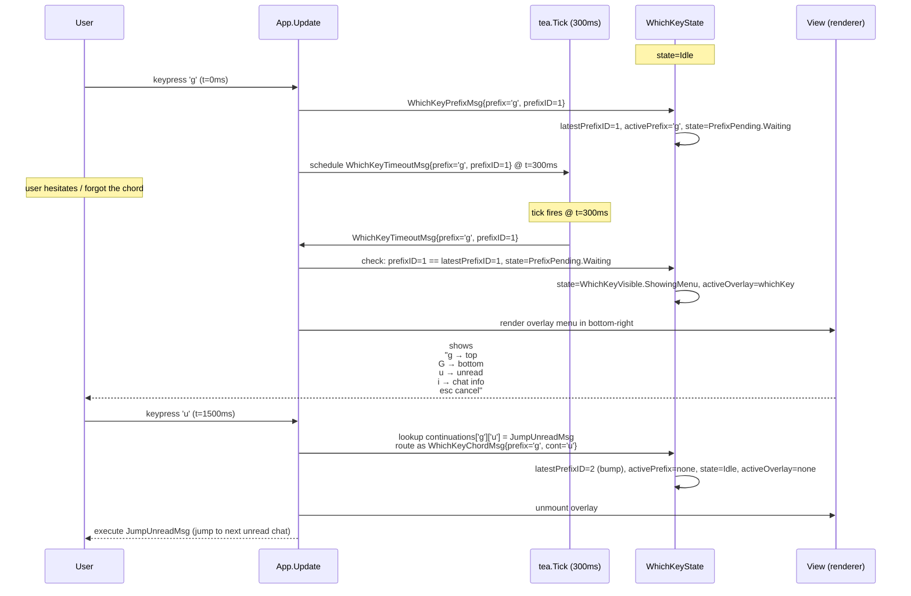
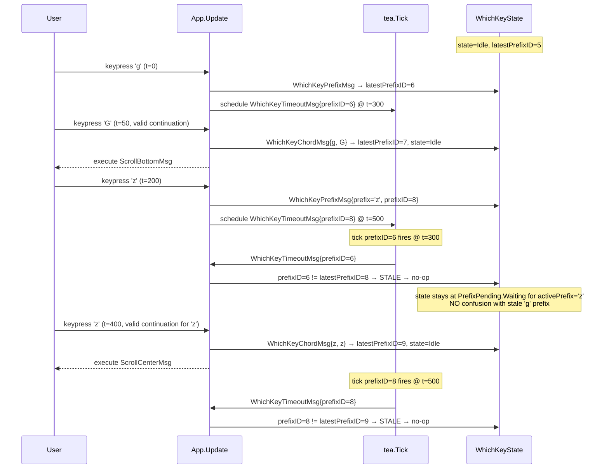

# Which-Key Timing Flow — Sequence Diagrams (Step 28)

Flusso runtime del **timer 300ms** dell'overlay **which-key**
(prefix-disambiguation) introdotto nello Step 28. Complementare allo
statechart in [`../phase-2-behavioral/command-palette-help-whichkey.md`](../phase-2-behavioral/command-palette-help-whichkey.md).

Sei scenari coprono i path di timing interessanti:

1. **Fast chord** — utente preme `gg` rapidamente (< 300ms), overlay
   NON si mostra mai.
2. **Slow chord (overlay reveal)** — utente preme `g`, aspetta, overlay
   appare, poi preme `g`.
3. **Cancel via Esc** — utente preme `g`, poi `Esc` prima del timer.
4. **Race: tick fire + chord arrival nello stesso frame** — chord
   risolve, tick stale viene droppato.
5. **Unknown key dopo prefix** — utente preme `g`, poi `x` (non in
   continuations) — cancel + best-effort re-dispatch.
6. **Stale tick dopo cancel/chord** — il tick scaduto NON apre overlay
   perché `prefixID` è bumped.

## 1. Fast chord — `gg` < 300ms (overlay invisible)



**Punto chiave**: l'overlay `WhichKey` NON viene mai mostrato nel
fast-path. Il `tea.Tick` schedulato è "bestemmiato" via `latestPrefixID`
quando il chord risolve, e il fire successivo del tick è benigno
(invariante TLA+ `STALE_TICK_BENIGN_WHICHKEY`).

## 2. Slow chord — overlay reveal dopo 300ms



## 3. Cancel via Esc (before timeout)

```mermaid
sequenceDiagram
    participant U as User
    participant APP as App.Update
    participant TICK as tea.Tick
    participant WK as WhichKeyState

    Note over WK: state=Idle

    U->>APP: keypress 'g' (t=0ms)
    APP->>WK: WhichKeyPrefixMsg{prefix='g', prefixID=1}
    WK->>WK: latestPrefixID=1, state=PrefixPending.Waiting
    APP->>TICK: schedule WhichKeyTimeoutMsg{prefixID=1} @ t=300ms

    U->>APP: keypress Esc (t=100ms)
    APP->>WK: WhichKeyCancelMsg{prefix='g'}
    WK->>WK: latestPrefixID=2 (bump), activePrefix=none, state=Idle
    Note over WK: NO overlay was visible; nothing to unmount

    Note over TICK: tick fires @ t=300ms
    TICK->>APP: WhichKeyTimeoutMsg{prefixID=1}
    APP->>WK: prefixID=1 != latestPrefixID=2 → STALE → no-op
```

## 4. Race — tick fire + chord arrival in nearly-same frame

```mermaid
sequenceDiagram
    participant U as User
    participant TEA as bubbletea channel
    participant APP as App.Update
    participant WK as WhichKeyState

    Note over WK: state=PrefixPending.Waiting<br/>activePrefix='g', latestPrefixID=1

    Note over TEA: bubbletea serializes msgs;<br/>arrival order is non-deterministic but linearizable

    par concurrent producers
        Note over TEA: tick fires (t≈300ms) → enqueue WhichKeyTimeoutMsg{prefixID=1}
    and
        U->>TEA: keypress 'g' (t≈300ms) → enqueue WhichKeyChordMsg{prefix='g', cont='g'}
    end

    alt tick processed first
        TEA->>APP: WhichKeyTimeoutMsg{prefixID=1}
        APP->>WK: prefixID=1 == latestPrefixID=1 → activeOverlay=whichKey, state=Visible
        TEA->>APP: WhichKeyChordMsg{prefix='g', cont='g'}
        APP->>WK: chord resolves → latestPrefixID=2, activeOverlay=none
        Note over WK: overlay was visible for ONE frame (~16ms);<br/>user may see a flash but action executes
    else chord processed first
        TEA->>APP: WhichKeyChordMsg{prefix='g', cont='g'}
        APP->>WK: chord resolves → latestPrefixID=2, state=Idle, activeOverlay=none
        TEA->>APP: WhichKeyTimeoutMsg{prefixID=1}
        APP->>WK: prefixID=1 != latestPrefixID=2 → STALE → no-op
        Note over WK: overlay NEVER visible; clean fast-path
    end
```

**Invariante**: in entrambi gli ordini il risultato finale è identico
(`activeOverlay=none`, action eseguita). Verificato in
[`../phase-4-concurrency/whichkey.tla`](../phase-4-concurrency/whichkey.tla)
invariante `RACE_CONVERGENCE`.

L'unico effetto user-visible nella variante "tick first" è un possibile
flash dell'overlay per un singolo frame. Mitigato in pratica dalla
serializzazione bubbletea che processa i `tea.Msg` uno alla volta nel
main loop — la latency tra `Update` e `View` è ≤ 16ms (60fps), quindi
il render tra "show overlay" e "hide overlay" può avvenire o non
avvenire dipende dal frame timing. Accettabile per Step 28 (decisione
documentata in [ADR-015 §D1](../phase-6-decisions/ADR-015-command-palette-whichkey-help.md)).

## 5. Unknown key after prefix — cancel + best-effort re-dispatch

```mermaid
sequenceDiagram
    participant U as User
    participant APP as App.Update
    participant WK as WhichKeyState
    participant ROOT as RootHandler

    Note over WK: state=PrefixPending.Waiting, activePrefix='g'

    U->>APP: keypress 'x' (t=100ms; 'x' not in continuations['g'])
    APP->>WK: 'x' not in continuations['g'] → WhichKeyCancelMsg{prefix='g'}
    WK->>WK: latestPrefixID++, activePrefix=none, state=Idle, activeOverlay=none
    Note over APP: best-effort: re-dispatch 'x' to root handler<br/>(see ADR-015 §D4 — documented as "advisory", not invariant)
    APP->>ROOT: re-route keypress 'x' as if pressed standalone
    ROOT-->>U: 'x' default action (or no-op if unbound)
```

**Decisione**: il re-dispatch è **best-effort, non garantito**. Il
contratto formale dice solo che il prefix viene cancelled; se la key
unknown ha un'azione globale standalone, il root la prende in carico,
altrimenti è un no-op silenzioso. Razionale in
[ADR-015 §D4](../phase-6-decisions/ADR-015-command-palette-whichkey-help.md).

## 6. Stale tick after cancel — `WhichKeyTimeoutMsg` dropped



**Invariante**: ogni `tea.Tick` schedulato per un prefixID specifico
viene **sempre droppato** se nel frattempo è stato bumped
`latestPrefixID`, indipendentemente dalla causa del bump (chord,
cancel, nuovo prefix). Verifica TLA+: `STALE_TICK_BENIGN_WHICHKEY`.

## Mapping tea.Cmd

Aggiornamento alla tabella "Mapping tea.Cmd" in
[`../phase-1-context/message-taxonomy.md`](../phase-1-context/message-taxonomy.md):

| Azione utente / evento | Cmd | API gotd/td | Result Msg |
|------------------------|-----|-------------|------------|
| `Ctrl+P` | (no Cmd, immediato) | — | `CmdPaletteOpenMsg` |
| char/backspace nella palette | (no Cmd, sync compute) | — | `CmdPaletteQueryChangedMsg` |
| `j`/`k` nella palette | (no Cmd) | — | `CmdPaletteCursorMsg` |
| `Enter` su comando palette | (no Cmd diretto; il comando può ritornare un suo `tea.Cmd`) | — | `CmdPaletteSubmitMsg` → handler-dependent |
| `Esc` nella palette | (no Cmd) | — | `CmdPaletteCloseMsg` |
| Prefix key (`g`, `z`, ...) | `whichKeyTickCmd` (= `tea.Tick(300ms)`) | — | `WhichKeyPrefixMsg` (sync) + `WhichKeyTimeoutMsg` (deferred 300ms) |
| Continuation key dopo prefix (in `Waiting` o `Visible`) | (no Cmd diretto; il chord-handler può ritornare un suo `tea.Cmd`) | — | `WhichKeyChordMsg` → handler-dependent |
| `Esc` durante prefix/visible | (no Cmd) | — | `WhichKeyCancelMsg` |
| `?` | (no Cmd, immediato) | — | `HelpOpenMsg` |
| `Esc` o `?` nell'help | (no Cmd) | — | `HelpCloseMsg` |

**Caratteristica chiave Step 28**: NESSUN `tea.Cmd` async colpisce
Telegram per i tre overlay. L'unico `tea.Cmd` è `tea.Tick(300ms)` per
il debounce which-key. Tutti gli altri effetti sono sincroni nel main
loop. Coerente con scope "UI only" della pipeline §Step 28.

## Cross-links

- Statechart: [`../phase-2-behavioral/command-palette-help-whichkey.md`](../phase-2-behavioral/command-palette-help-whichkey.md)
- Concurrency invariants: [`../phase-4-concurrency/whichkey.tla`](../phase-4-concurrency/whichkey.tla)
- Pipeline: [`../development-pipeline.md` §Step 28](../development-pipeline.md)
- Decisione 300ms / registry / mutua esclusione / fuzzy: [ADR-015](../phase-6-decisions/ADR-015-command-palette-whichkey-help.md)
- Pattern correlato (monotonic counter + drop-stale): [ADR-013](../phase-6-decisions/ADR-013-search-debounce-and-stale-results.md), [`search.tla`](../phase-4-concurrency/search.tla)
- Pattern correlato (timestamp + re-arm): [ADR-010](../phase-6-decisions/ADR-010-typing-ttl-strategy.md), [`typing.tla`](../phase-4-concurrency/typing.tla)
