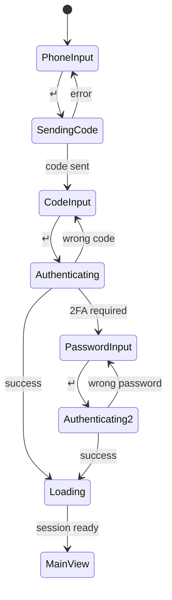
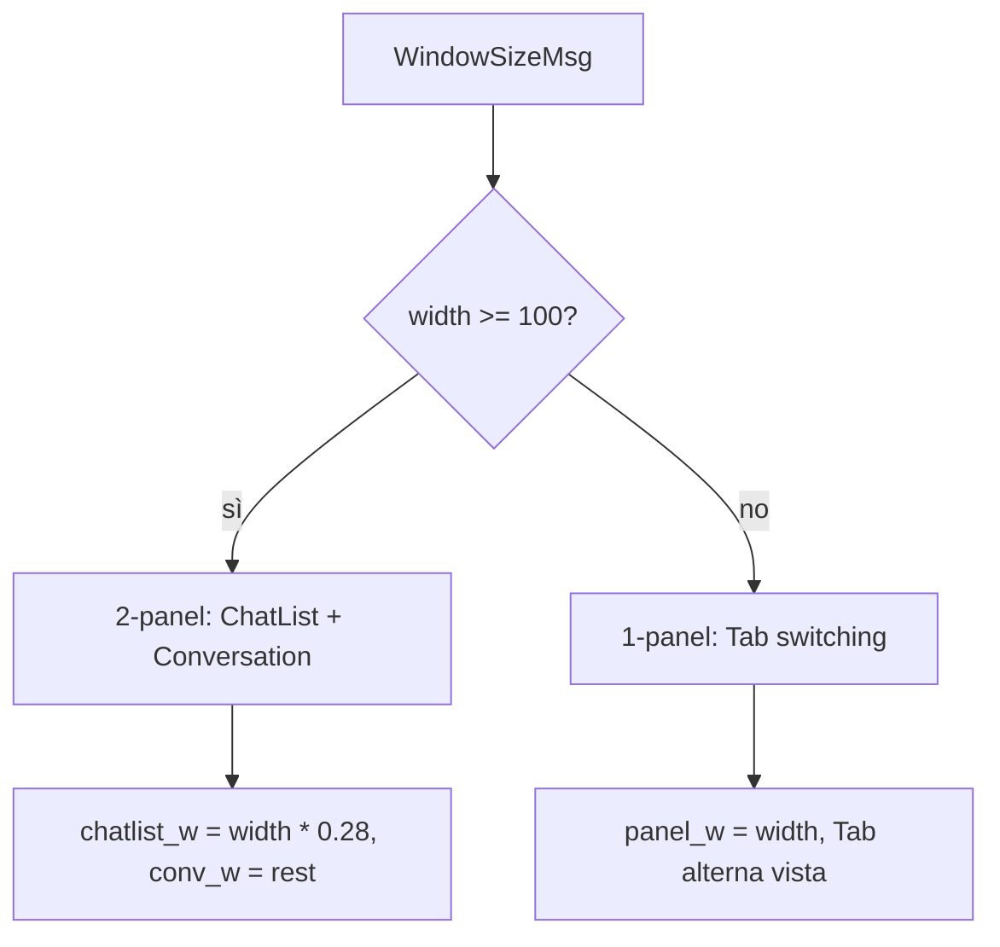
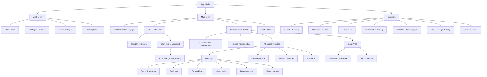

# tuilegram — TUI Design v0.3

Specifica completa dell'interfaccia, basata sui wireframe e sulle 30 decisioni di design del brainstorming.

---

## Filosofia di Design

| Principio | Applicazione |
|-----------|--------------|
| **Ultra-minimal** | Nessun elemento superfluo. Bordi solo dove comunicano stato |
| **Spazio arioso** | Whitespace generoso, specialmente nelle schermate auth |
| **Color-coded borders** | Il colore del bordo comunica tipo e stato della chat |
| **Messenger-style** | Incoming a sinistra, outgoing a destra — paradigma familiare |
| **Keyboard-first, mouse-friendly** | Navigazione vim + supporto mouse (scroll + click) |
| **2-panel focus** | Chat list + Conversation come layout base |

---

## 1. Auth Flow

Tutte le schermate auth condividono lo stesso layout: titolo ASCII art centrato in alto, label + input nella zona centro-sinistra, hint `↵` dopo l'input. Nessun box contenitore, nessun bottone.

### Login Title

```
                     _____     _ _
                    |_   _|   (_) |
                      | |_   _ _| | ___  __ _ _ __ __ _ _ __ ___
                      | | | | | | |/ _ \/ _` | '__/ _` | '_ ` _ \
                      | | |_| | | |  __/ (_| | | | (_| | | | | | |
                      \_/\__,_|_|_|\___|\__, |_|  \__,_|_| |_| |_|
                                         __/ |
                                        |___/
```

Titolo generato con figlet, centrato orizzontalmente nel terzo superiore dello schermo.

### Step 1 — Phone Number

```
┌────────────────────────────────────────────────────────────────────────┐
│                                                                        │
│                        [ASCII art Tuilegram]                           │
│                                                                        │
│                                                                        │
│    Enter your                                                          │
│    phone number:    ╭───────────────────────╮                           │
│                     │ +12 345 678 90        │  ↵                        │
│                     ╰───────────────────────╯                           │
│                                                                        │
│                                                                        │
└────────────────────────────────────────────────────────────────────────┘
```

- Input: `textinput` (bubbles) standard, single-line
- Placeholder con country code
- Enter conferma e invia il codice

### Step 2 — 2FA Code

```
┌────────────────────────────────────────────────────────────────────────┐
│                                                                        │
│                        [ASCII art Tuilegram]                           │
│                                                                        │
│                                                                        │
│    Enter your                                                          │
│    2FA code:        ╭─╮ ╭─╮ ╭─╮ ╭─╮ ╭─╮ ╭─╮                           │
│                     │1│ │2│ │3│ │7│ │9│ │8│  ↵                          │
│                     ╰─╯ ╰─╯ ╰─╯ ╰─╯ ╰─╯ ╰─╯                           │
│                                                                        │
│                                                                        │
└────────────────────────────────────────────────────────────────────────┘
```

- Input: **componente custom OTP** — celle individuali con bordo
- Auto-advance alla cella successiva dopo ogni digit
- Backspace torna alla cella precedente
- Enter conferma quando tutte le celle sono piene

### Step 3 — Password (opzionale, solo se 2FA password attiva)

```
┌────────────────────────────────────────────────────────────────────────┐
│                                                                        │
│                        [ASCII art Tuilegram]                           │
│                                                                        │
│                                                                        │
│    Enter your                                                          │
│    password:        ╭───────────────────────╮                           │
│                     │ * * * * * * * ...     │  ↵                        │
│                     ╰───────────────────────╯                           │
│                                                                        │
│                                                                        │
└────────────────────────────────────────────────────────────────────────┘
```

- Input: `textinput` (bubbles) con `EchoMode: EchoPassword`, masking `*`
- Campo a lunghezza variabile

### Auth Flow Statechart



### Componenti Auth

| Componente | Tipo | Note |
|------------|------|------|
| **PhoneInput** | `textinput` (bubbles) | Standard single-line, placeholder country code |
| **OTPInput** | **Custom component** | N celle individuali, auto-advance, backspace nav |
| **PasswordInput** | `textinput` (bubbles) | `EchoMode: EchoPassword` per masking `*` |

---

## 2. Main View

### Layout — 2 Pannelli

```
┌─ ● CHATS ──────────────┬─ John Doe ────────────── ● online ──┐
│                        │                                      │
│  ╭──────────────────╮  │                                      │
│  │ ●● John Doe      │  │         Hey!                         │
│  ╰──────────────────╯  │         How's the project going?     │
│  ╭──────────────────╮  │         12:34                        │
│  │ ●  user 2        │  │                                      │
│  ╰──────────────────╯  │  Going well, just finished           │
│  ╭──────────────────╮  │  the auth module                     │
│  │  ● user 3        │  │  12:35  ✓✓                           │
│  ╰──────────────────╯  │                                      │
│  ╭──────────────────╮  │         Nice! Can you push           │
│  │    user 4    🔇  │  │         it to develop?               │
│  ╰──────────────────╯  │         12:36                        │
│         ↓              │                                    █ │
│        ...             │                                    █ │
│                        │                                    ░ │
│                        │                                    ░ │
│                        ├──────────────────────────────────────┤
│                        │ Sure, doing it█       ╭────╮        │
│                        │                       │SEND│        │
│                        │                       ╰────╯        │
└────────────────────────┴──────────────────────────────────────┘
 j/k nav │ / search │ Ctrl+P cmd │ ? help                ✕ err
```

| Pannello | Larghezza | Contenuto |
|----------|-----------|-----------|
| **Chat List** | ~25-30% | Header `● CHATS` + lista scrollabile di chat items |
| **Conversation** | ~70-75% | Header (nome + status) + messaggi (viewport) + input + SEND |
| **Status Bar** | 100% (1 riga) | Shortcuts contestuali + area errori/notifiche |

### Responsive Behavior



### Initial State (nessuna chat aperta)

```
┌─ ● CHATS ──────────────┬──────────────────────────────────────┐
│                        │                                      │
│  ╭──────────────────╮  │                                      │
│  │ ●● John Doe      │  │                                      │
│  ╰──────────────────╯  │       T u i l e g r a m              │
│  ╭──────────────────╮  │                                      │
│  │ ●  Team Dev      │  │       Select a chat                  │
│  ╰──────────────────╯  │                                      │
│  ╭──────────────────╮  │                                      │
│  │    Alice         │  │                                      │
│  ╰──────────────────╯  │                                      │
│                        │                                      │
└────────────────────────┴──────────────────────────────────────┘
```

---

## 3. Chat List

### Header

Il titolo del pannello include l'indicatore di connessione:

| Stato | Header |
|-------|--------|
| Connesso | `● CHATS` (dot verde) |
| Connecting | `○ CHATS` (dot giallo) |
| Disconnesso | `✕ CHATS` (dot rosso) |

### Chat Item

Ogni chat è un box con bordo. Il contenuto è solo il nome. Lo stato è comunicato dai dot e dal colore del bordo.

```
  ╭──────────────────╮
  │ ●● John Doe      │      bordo viola — user, online+unread
  ╰──────────────────╯
  ╭──────────────────╮
  │ ●  Team Dev      │      bordo verde — group, online, no unread
  ╰──────────────────╯
  ╭──────────────────╮
  │  ● News Channel  │      bordo blu — channel, unread
  ╰──────────────────╯
  ╭──────────────────╮
  │    Alice     🔇  │      bordo viola dimmed — user, muted
  ╰──────────────────╯
  ╭──────────────────╮
  │    MyBot         │      bordo arancio — bot
  ╰──────────────────╯
```

### Colori bordo per tipo di chat

| Tipo | Colore | Hex |
|------|--------|-----|
| User | Viola | `#7D56F4` |
| Group | Verde | `#50FA7B` |
| Channel | Blu | `#38BDF8` |
| Bot | Arancio | `#FBBF24` |

### Bordo chat attiva

La chat attualmente selezionata/aperta ha un bordo **rosso** (`#FF5555`) indipendentemente dal tipo.

```
  ╭──────────────────╮
  │ ●● John Doe      │      bordo ROSSO — chat attiva
  ╰──────────────────╯
```

### Dot System (sinistra del nome)

Due posizioni per dot, entrambe a sinistra del nome:

| Posizione | Colore | Significato |
|-----------|--------|-------------|
| Primo dot (sx) | Verde `#50FA7B` | Online |
| Secondo dot (dx) | Blu `#38BDF8` | Unread |

**Combinazioni:**

| Stato | Visualizzazione |
|-------|-----------------|
| Online + Unread | `●● Nome` (verde + blu) |
| Online + Read | `●  Nome` (verde) |
| Offline + Unread | ` ● Nome` (blu, posizione 2) |
| Offline + Read | `   Nome` (nessun dot) |

### Chat Muted

- Box dimmed (colore attenuato su tutto l'elemento)
- Icona `🔇` dopo il nome
- Il dot unread blu **non viene mostrato** per chat muted

### Typing Indicator (nella lista)

Quando qualcuno sta scrivendo, il nome viene sostituito:

```
  ╭──────────────────╮
  │ ● typing...      │
  ╰──────────────────╯
```

### Sorting

Ordine di priorità:
1. **Pinned** — sempre in cima
2. **Unread** — sopra le chat lette
3. **Ultimo messaggio** — per recenza

### Scrolling

Lista scrollabile con viewport (bubbles). Mouse wheel supportato.

---

## 4. Conversation

### Header

Barra fissa in cima al pannello destro con nome e status:

```
┌─ John Doe ────────────────────── ● online ──┐     (private)
┌─ Team Dev ───────────────────── 12 members ──┐     (group)
┌─ News ──────────────────────── 5.2k subs ──┐     (channel)
```

### Pinned Message Bar

Se la chat ha un messaggio pinnato, appare una barra sotto l'header:

```
┌─ John Doe ────────────────────── ● online ──┐
│📌 Reminder: meeting at 3pm tomorrow          │
├──────────────────────────────────────────────┤
│ messages...                                  │
```

### Message Layout

Allineamento messenger classico:

- **Incoming** (altri → me): allineato a **sinistra**, colore **teal/cyan** (`#38BDF8`)
- **Outgoing** (me → altri): allineato a **destra**, colore **viola** (`#7D56F4`)

### Message Grouping

Messaggi consecutivi dello stesso utente sono raggruppati. Solo il primo mostra il timestamp:

```
         Hey!
         How's the project going?
         Any updates?
         12:34

  Going well, just finished
  the auth module yesterday
  12:35  ✓✓

         Nice! Can you push
         it to develop?
         12:36
```

### Timestamp

Sotto il messaggio (o sotto l'ultimo di un gruppo), dim/grigio.

### Read Receipts (solo outgoing)

Stile Telegram/WhatsApp:

| Stato | Simbolo |
|-------|---------|
| Sent | `✓` |
| Delivered | `✓✓` |
| Read | `✓✓` (colorato blu) |

Appaiono accanto al timestamp:

```
  My message here
  12:35  ✓✓
```

### Sender Name (gruppi)

Nei gruppi, il nome del mittente appare solo sul primo messaggio di un gruppo consecutivo. Ogni utente ha un colore unico:

```
  Jane:
         Hey everyone!
         Who's coming?
         12:34

  Bob:
         I'm in!
         12:35

                Count me in too!
                12:36
```

### Reply

Barra verticale colorata `┃` con preview del messaggio originale, inline:

```
         ┃ Jane: Hey everyone!
         Great, I'll be there!
         12:36
```

### Forward

Barra verticale `┃` con attribuzione della fonte:

```
         ┃ From @channel:
         ┃ The original message content
         ┃ here spanning multiple lines
         12:34
```

### Media

Icona + metadata inline:

| Media | Formato |
|-------|---------|
| Photo | `📷 photo.jpg (1.2 MB)` |
| Video | `🎬 video.mp4 (0:45, 12 MB)` |
| Audio | `🎵 song.mp3 (3:21)` |
| Voice | `🎤 ▁▂▃▅▇█▆▄▃▂▃▅▇▅▃▂  0:42` (waveform braille) |
| Document | `📎 report.pdf (2.4 MB)` |
| Sticker | `🌟 Sticker: Star Pack` |
| Location | `📍 Rome, Italy` |
| Contact | `👤 John Doe (+1 555-0123)` |
| Poll | `📊 What should we do?` |

### Reactions

Mostrate sotto il messaggio come riga di emoji con conteggio:

```
         Great news everyone!
         👍 3  ❤️ 2  😂 1
         12:34
```

### Links

Evidenziati (sottolineati, colore blu). Navigabili: Enter sul link selezionato apre il browser.

### System Messages

Centrati, dim, senza timestamp. Stile separatore:

```
      ── Alice joined the group ──
```

### Date Separator

Centrato con linee ai lati:

```
  ────── Apr 8, 2026 ──────
```

### Empty Conversation

Quando non ci sono messaggi:

```
│                                      │
│          John Doe                    │
│          @johndoe                    │
│                                      │
│       No messages yet.               │
│       Start a conversation.          │
│                                      │
```

### Message Cursor

Un cursore visibile evidenzia il messaggio selezionato. `j`/`k` sposta il cursore. Le azioni (`r` reply, `e` edit, `f` forward, `D` delete, `y` copy, `Space` toggle select) agiscono sul messaggio sotto il cursore.

```
           Hey!
           12:34

  ████████████████████████  ← selected (reverse/highlight)
  █ Going well!            █
  █ 12:35  ✓✓              █
  ████████████████████████

           Nice!
           12:36
```

### Multi-Select

`Space` togla la checkbox sul messaggio corrente. Più messaggi selezionati abilitano azioni batch:

```
  [✓] Going well!
      12:35

  [ ] Another message
      12:36

  [✓] Nice!
      12:37

  2 selected │ f forward │ D delete │ Esc cancel
```

### Scrollbar

Scrollbar verticale sottile sul lato destro del viewport:

```
  │ message          │ █
  │ message          │ █
  │ message          │ ░
  │ message          │ ░
```

### Typing Indicator

Nella conversazione, appare nell'header sotto il nome:

```
┌─ John Doe ───────────── typing... ──┐
```

---

## 5. Input Area

### Layout

```
├──────────────────────────────────────────────────┤
│ message text here█                 ╭────╮        │
│                                    │SEND│        │
│                                    ╰────╯        │
└──────────────────────────────────────────────────┘
```

| Elemento | Dettaglio |
|----------|-----------|
| Text area | Multiline espandibile, 1-5 righe, implementato con scrollview interna |
| SEND button | Testo "SEND" con bordo rounded, cliccabile con mouse |
| Separatore | Linea orizzontale sopra l'input |

### Keybindings Input

| Key | Action |
|-----|--------|
| `Enter` | Invia messaggio |
| `Shift+Enter` | Nuova riga |
| `Esc` | Esci da input mode |

### Reply Mode

Il messaggio citato appare inline come prima riga dell'input, con barra colorata:

```
├──────────────────────────────────────────────────┤
│ ┃ John: Hey how are you?                        │
│ my reply text█                     ╭────╮        │
│                                    │SEND│        │
│                                    ╰────╯        │
└──────────────────────────────────────────────────┘
```

- `Esc` cancella il reply mode
- Il messaggio citato è troncato a 1 riga

### Edit Mode

Overlay centrato dedicato (non nell'input area):

```
╭── Edit message ──────────────────────╮
│                                      │
│ original text here that I            │
│ can now modify█                      │
│                                      │
│       Enter save │ Esc cancel        │
╰──────────────────────────────────────╯
```

### Forward Mode

Overlay con lista chat filtrabili (fuzzy search):

```
╭── Forward to ────────────────────────╮
│ > search█                            │
│──────────────────────────────────────│
│ John Doe                             │
│ Team Dev                             │
│ Alice                                │
│ News Channel                         │
╰──────────────────────────────────────╯
```

---

## 6. Overlays

### Search Globale (`/`)

Floating centrato, cerca in tutte le chat:

```
░░░░░░░░░░░░░░░░░░░░░░░░░░░░░░░░░░░░░░░░░░░░░░░░
░░░░╭── Search ─────────────────────────────╮░░░░░
░░░░│ > query█                              │░░░░░
░░░░│───────────────────────────────────────│░░░░░
░░░░│ "query" in John Doe — 12:34           │░░░░░
░░░░│ "query" in Team Dev — Yesterday       │░░░░░
░░░░│ "query" in Alice — Apr 5              │░░░░░
░░░░╰───────────────────────────────────────╯░░░░░
░░░░░░░░░░░░░░░░░░░░░░░░░░░░░░░░░░░░░░░░░░░░░░░░
```

### Search in Conversazione (`Ctrl+F`)

Stessa UI ma filtrata sulla conversazione corrente. Le occorrenze sono evidenziate nel viewport.

### Command Palette (`Ctrl+P`)

Overlay floating centrato con fuzzy search su azioni disponibili:

```
╭── Commands ────────────────────────────────╮
│ > mark█                                    │
│────────────────────────────────────────────│
│ Mark as read                               │
│ Mark all as read                           │
│ New message                                │
│ Pin chat                                   │
│ Mute chat                                  │
│ Archive chat                               │
│ Settings                                   │
│ Logout                                     │
╰────────────────────────────────────────────╯
```

### Which-Key (`g`, `z`, ...)

Appare dopo 300ms quando si preme un prefix key. Stile yazi:

```
╭── g: Go to ──────────────╮
│ g  top of list            │
│ G  bottom of list         │
│ u  unread chats           │
│ p  pinned chats           │
│ m  mentions               │
╰───────────────────────────╯
```

### Confirmation Dialog

Overlay centrato per azioni distruttive:

```
╭────────────────────────────────╮
│ Delete this message?           │
│                                │
│    [Y]es          [N]o         │
╰────────────────────────────────╯
```

### Chat Info (`i`)

Overlay floating a destra, sovrapposto alla conversazione:

```
┌ CHATS ┐┌ Conversation ──╭── Info ──────────╮┐
│ user 1││ messages...    │ John Doe          ││
│ user 2││ ...            │ @johndoe          ││
│ user 3││ ...            │ ● Online          ││
│       ││               │                    ││
│       ││               │ Phone: +1 555-0123 ││
│       ││               │ Bio: Developer     ││
│       ││               │                    ││
│       ││               │ Shared Media  [24] ││
│       ││               │ Shared Files   [8] ││
│       ││               ╰────────────────────╯│
│       ││                                     │
└───────┘└─────────────────────────────────────┘
```

### Edit Message Overlay

Overlay centrato con textarea:

```
╭── Edit message ──────────────────────╮
│                                      │
│ original text here that I            │
│ can now modify█                      │
│                                      │
│       Enter save │ Esc cancel        │
╰──────────────────────────────────────╯
```

---

## 7. Folder Sidebar

Nascosta di default. Attivabile con toggle key (es. `F`).
Quando attiva, appare come terzo pannello a sinistra:

```
┌─ Folders ──┬─ ● CHATS ────────┬─ Conversation ──────────────┐
│            │                  │                              │
│ All Chats  │  ╭────────────╮  │  messages...                 │
│ Personal   │  │ ●● John    │  │                              │
│ Work       │  ╰────────────╯  │                              │
│ Channels   │  ╭────────────╮  │                              │
│ Groups     │  │ ●  Team    │  │                              │
│ Bots       │  ╰────────────╯  │                              │
│            │                  │                              │
└────────────┴──────────────────┴──────────────────────────────┘
```

---

## 8. Status Bar

Riga fissa in basso, sempre visibile. Divisa in due zone:

```
 j/k nav │ / search │ Ctrl+P cmd │ ? help                    ✕ Send failed (r)
 ╰─────── shortcuts contestuali ──────╯                       ╰── errori/info ──╯
```

| Zona | Posizione | Contenuto |
|------|-----------|-----------|
| Shortcuts | Sinistra | Keybindings contestuali al pannello attivo |
| Errori/Info | Destra | Ultimo errore, notifica, o stato operazione |

---

## 9. Loading States

Spinner centrato nel pannello che sta caricando:

```
┌─ ● CHATS ──────────────┐
│                        │
│                        │
│      ● Loading...      │
│                        │
│                        │
└────────────────────────┘
```

---

## 10. Navigazione e Keybindings

### Focus Navigation (Tab)

Smart Tab: va al pannello più logico in base al contesto.

```
ChatList ──Tab──> Messages viewport ──Tab──> Input area
    ↑                                            │
    └────────────────────Tab─────────────────────┘
```

`Esc` risale: Input → Messages → ChatList.

### Compact Mode (<100 cols)

Tab switching tra vista lista e vista conversazione.

### Keybindings Globali

| Key | Action |
|-----|--------|
| `Tab` | Focus forward (smart) |
| `Shift+Tab` | Focus backward |
| `Esc` | Focus up / cancel |
| `/` | Search globale |
| `Ctrl+F` | Search nella conversazione |
| `Ctrl+P` | Command palette |
| `?` | Help overlay (tutti i keybindings) |
| `Ctrl+Q` | Quit |
| `Ctrl+L` | Refresh/redraw |
| `F` | Toggle folder sidebar |
| `i` | Chat info panel |

### Chat List (focus)

| Key | Action |
|-----|--------|
| `j` / `k` / `↑` / `↓` | Naviga su/giù |
| `⏎` / `l` | Apri chat selezionata |
| `g,g` | Prima chat |
| `G` | Ultima chat |
| `d` | Segna come letta |
| `p` | Pin/unpin chat |
| `m` | Mute/unmute |
| `a` | Archivia |
| `n` | Nuova conversazione |
| `Ctrl+U` / `Ctrl+D` | Scroll mezza pagina |

### Conversation (focus su messages viewport)

| Key | Action |
|-----|--------|
| `j` / `k` | Sposta cursore messaggio su/giù |
| `h` / `Esc` | Torna alla chat list |
| `i` / `Tab` | Focus su input |
| `r` | Reply al messaggio sotto cursore |
| `e` | Edit messaggio (solo propri) |
| `f` | Forward messaggio |
| `D` | Delete messaggio (con confirm) |
| `y` | Copia testo messaggio |
| `Space` | Toggle select per multi-select |
| `g,g` | Primo messaggio (carica history) |
| `G` | Ultimo messaggio (scroll to bottom) |

### Input (focus)

| Key | Action |
|-----|--------|
| `Enter` | Invia messaggio |
| `Shift+Enter` | Nuova riga |
| `Esc` | Esci da input / cancel reply |
| `Ctrl+A` | Attach file |
| `↑` (input vuoto) | Edit ultimo messaggio |

### Mouse

| Azione | Effetto |
|--------|---------|
| Scroll wheel | Scroll viewport o chat list |
| Click su chat item | Seleziona e apri chat |
| Click su SEND | Invia messaggio |

---

## 11. Palette Colori

### Colori base

| Ruolo | Hex | Uso |
|-------|-----|-----|
| Primary (Viola) | `#7D56F4` | Outgoing messages, bordo user, accenti |
| Incoming (Teal) | `#38BDF8` | Incoming messages, dot unread |
| Success (Verde) | `#50FA7B` | Dot online, bordo group, connection ok |
| Warning (Ambra) | `#FBBF24` | Bordo bot |
| Error (Rosso) | `#FF5555` | Bordo chat attiva, errori, disconnected |
| Text primary | `#FAFAFA` | Testo principale |
| Text secondary | `#6B7280` | Timestamps, dim, placeholder |
| Surface | `#1E1E2E` | Background |
| Border | `#374151` | Bordi strutturali pannelli |

### Colori per tipo chat

| Tipo | Bordo | Hex |
|------|-------|-----|
| User | Viola | `#7D56F4` |
| Group | Verde | `#50FA7B` |
| Channel | Blu | `#38BDF8` |
| Bot | Arancio | `#FBBF24` |
| **Attivo** | **Rosso** | **`#FF5555`** |

### Theming

Sistema completo con file `.theme` in TOML:

**Percorso**: `~/.config/tuilegram/theme.toml`

```toml
[colors]
primary = "#7D56F4"
incoming = "#38BDF8"
outgoing = "#7D56F4"
success = "#50FA7B"
warning = "#FBBF24"
error = "#FF5555"
text = "#FAFAFA"
text_dim = "#6B7280"
surface = "#1E1E2E"
border = "#374151"

[borders]
user = "#7D56F4"
group = "#50FA7B"
channel = "#38BDF8"
bot = "#FBBF24"
active = "#FF5555"
```

---

## 12. Configurazione

**Percorso**: `~/.config/tuilegram/config.toml`

```toml
[general]
theme = "default"          # nome tema o path a .theme

[input]
send_key = "enter"         # "enter" o "ctrl+enter"

[display]
emoji = "passthrough"      # "passthrough" o "text"
```

---

## 13. Component Tree



---

## 14. Riepilogo Decisioni

| # | Decisione | Scelta |
|---|-----------|--------|
| 1 | Chat item content | Solo nome |
| 2 | Unread indicator | Dot blu a sinistra |
| 3 | Online indicator | Dot verde a sinistra |
| 4 | Dual dots | Entrambi a sinistra del nome, 2 posizioni |
| 5 | Chat sorting | Pinned > Unread > Last message |
| 6 | Message colors | Incoming=teal, Outgoing=viola |
| 7 | Timestamp | Sotto il messaggio, dim |
| 8 | Message grouping | Sì, consecutivi senza ripetere timestamp |
| 9 | Read receipts | ✓ / ✓✓ / ✓✓ colorato |
| 10 | Group sender name | Colorato, solo primo del gruppo |
| 11 | Reply style | Barra ┃ + preview inline |
| 12 | Forward style | Barra ┃ + attribuzione fonte |
| 13 | Media display | Icona + metadata inline |
| 14 | Voice messages | Waveform braille + durata |
| 15 | Typing indicator | Chat list + header conversazione |
| 16 | Date separator | Centrato con linee |
| 17 | Send key | Enter = invia, Shift+Enter = newline |
| 18 | Input area | Multiline espandibile (max 5), scrollview |
| 19 | Conv header | Nome + online status |
| 20 | Compact navigation | Tab switching |
| 21 | Message cursor | Sì, visibile |
| 22 | Connection status | Dot nell'header CHATS |
| 23 | Scroll indicator | Scrollbar verticale |
| 24 | Notifications | Status bar dedicata |
| 25 | Search | Overlay floating centrato |
| 26 | Command palette | Sì, Ctrl+P, fuzzy search |
| 27 | Which-key | Sì, stile yazi |
| 28 | Folders | Toggle key, pannello aggiuntivo |
| 29 | Confirmation | Overlay centrato Y/N |
| 30 | Loading | Spinner centrato |
| 31 | Multi-select | Checkbox con Space |
| 32 | Chat info | Overlay floating a destra |
| 33 | Theme file | TOML in ~/.config/tuilegram/ |
| 34 | Status bar | Sempre visibile, 1 riga |
| 35 | Chat type borders | Viola user, Verde group, Blu channel, Arancio bot |
| 36 | Empty conversation | Info chat + "No messages yet" |
| 37 | Pinned message | Barra fissa sotto header |
| 38 | Muted chats | Dimmed + 🔇 |
| 39 | Voice waveform | Braille unicode |
| 40 | Reactions | Sotto il messaggio |
| 41 | Links | Evidenziati, navigabili |
| 42 | System messages | Centrati, dim |
| 43 | Search scope | / globale, Ctrl+F in conversazione |
| 44 | SEND button | Testo + bordo, cliccabile |
| 45 | Mouse | Scroll + click su items |
| 46 | Emoji | Passthrough al terminale |
| 47 | Edit message | Overlay centrato dedicato |
| 48 | Sticker | Emoji + pack name |
| 49 | Forward UX | Overlay con lista filtrabili |
| 50 | Login title | ASCII art figlet |
| 51 | Initial state | Chat list + pannello vuoto con logo |
| 52 | Config path | ~/.config/tuilegram/config.toml |
| 53 | Tab navigation | Smart (logico per contesto) |
| 54 | Theme system | Completo, file .theme TOML |
